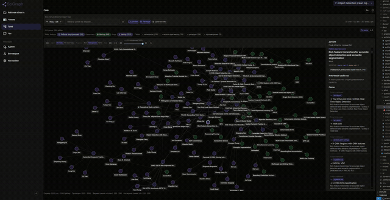

# SciGraph



SciGraph — scholarly GraphRAG-система для работы с научной литературой: ingest корпуса, библиографический граф, retrieval по чанкам, grounded Q&A с цитатами и traceability до источников.

Проект ориентирован на исследователя, который работает с собственной подборкой статей и хочет не просто хранить PDF, а получать навигацию по корпусу, обзор связей, evidence-backed ответы и основу для дальнейшего semantic/ontology слоя.

## Что доступно сейчас

- Ingestion pipeline для `pdf` / `md` / `txt` через CLI `science-graphrag`: одиночный документ, corpus-wide прогон с timeout, resume и progress JSONL (см. [docs/runbooks/ingest-corpus.md](docs/runbooks/ingest-corpus.md)).
- Локальный стек: `PostgreSQL`, `Neo4j`, `Qdrant`, `Redis`, `Phoenix`, фоновые задачи через Dramatiq worker.
- **Workspaces:** загрузка в workspace, фоновый ingest и опрос `GET /v1/ingest/jobs/{job_id}`, merge и dedup-кандидаты, **граф workspace** (`GET /v1/workspaces/{workspace_id}/graph`, expand, claims-режимы) рядом с графом одной работы.
- **Works / retrieval:** `GET /v1/works`, детали работы, чанки, `POST /v1/query`; **work graph** с контрактом авторства для reader UI (`view=reader` vs сырой граф) — [docs/architecture/work-graph-reader-authorship.md](docs/architecture/work-graph-reader-authorship.md), QA: [docs/runbooks/work-graph-authorship-qa.md](docs/runbooks/work-graph-authorship-qa.md).
- UI: workspace, reader, интерактивный graph (в т.ч. в контексте workspace), Ask/чат с evidence и трассировкой, Claims (через `VITE_CLAIMS_UI_ENABLED`), синхронизация Ask-сессий; при настроенном admin-доступе — UI для прогона бенчмарков на `/v1` benchmark routes.
- **Research chat:** streaming-агент на `/v1`, экспериментальный LangGraph spike на `/v2`; каталог тулов и контракты — [docs/architecture/agent-chat-tools.md](docs/architecture/agent-chat-tools.md).
- **Chunking:** переключение движка (`SCIENCE_GRAPHRAG_CHUNKING_ENGINE`, Chonkie vs legacy) — [docs/runbooks/chonkie-chunking.md](docs/runbooks/chonkie-chunking.md).
- VL-first PDF: при `SCIENCE_GRAPHRAG_VL_*` PDF сначала в Markdown, иначе fallback на `pypdf`.
- **Benchmark program:** семейства от layer1 / graph / relations / layer2 до retrieval (в т.ч. judge, multihop), claims, dedup, contradictions, concept-topic, references resolution, agent tools, сравнение прогонов (`science-graphrag-benchmark-compare`). Входная точка по семействам и метрикам: [docs/benchmarks/benchmark-program-overview.md](docs/benchmarks/benchmark-program-overview.md), статус волн: [docs/runbooks/benchmark-program-status.md](docs/runbooks/benchmark-program-status.md).

Продукт и план: [docs/roadmap.md](docs/roadmap.md), [docs/idea.md](docs/idea.md); волны Wave A–L и UX: [docs/runbooks/roadmap-next-waves.md](docs/runbooks/roadmap-next-waves.md).

## Быстрые ссылки

- [docs/README.md](docs/README.md) — индекс документации.
- [docs/runbooks/roadmap-next-waves.md](docs/runbooks/roadmap-next-waves.md) — волны работ (benchmark gate → pilot → CI / retrieval / UI / ontology).
- [docs/architecture/README.md](docs/architecture/README.md) — архитектурный обзор.
- [docs/architecture/agent-chat-tools.md](docs/architecture/agent-chat-tools.md) — каталог инструментов чат-агента.
- [docs/architecture/work-graph-reader-authorship.md](docs/architecture/work-graph-reader-authorship.md) — work graph: reader vs raw, авторство.
- [docs/runbooks/deploy.md](docs/runbooks/deploy.md) — запуск стека и operational notes.
- [docs/runbooks/ingest-corpus.md](docs/runbooks/ingest-corpus.md) — corpus ingest, timeout, resume, troubleshooting.
- [docs/benchmarks/benchmark-program-overview.md](docs/benchmarks/benchmark-program-overview.md) — карта семейств бенчмарков и метрик.
- [docs/roadmap.md](docs/roadmap.md) — roadmap и фазы.
- [docs/adr/README.md](docs/adr/README.md) — ADR.
- [docs/benchmarks/README.md](docs/benchmarks/README.md) — eval и бенчмарки.

## Быстрый старт

### Prerequisites

- Docker + Docker Compose
- Python 3.11+
- Локальный `.venv` в корне репозитория

### 1. Подготовьте окружение

```bash
cp .env.example .env
python -m venv .venv
.venv/bin/pip install -e ".[dev]"
```

Минимум перед первым запуском:

- проверьте `SCIENCE_GRAPHRAG_OPENALEX_MAILTO`;
- если у вас нестандартные локальные порты или внешние сервисы, поправьте `SCIENCE_GRAPHRAG_DATABASE_URL`, `SCIENCE_GRAPHRAG_NEO4J_URI`, `SCIENCE_GRAPHRAG_QDRANT_URL`, `SCIENCE_GRAPHRAG_REDIS_URL`;
- если хотите LLM/VL extraction, задайте `SCIENCE_GRAPHRAG_EXTRACTION_LLM_*` и/или `SCIENCE_GRAPHRAG_VL_*` (см. [.env.example](.env.example)).

Быстрая диагностика конфига:

```bash
.venv/bin/science-graphrag config-check --no-strict
```

Перед долгим ingest с LLM лучше использовать строгую проверку:

```bash
.venv/bin/science-graphrag config-check
```

Перед долгим прогоном с эмбеддингами через OpenRouter можно сделать один probe-запрос:

```bash
.venv/bin/science-graphrag config-check --embeddings-preflight
```

(Эквивалент для `ingest-corpus`: флаг `--embeddings-preflight` на самой команде — см. [docs/runbooks/ingest-corpus.md](docs/runbooks/ingest-corpus.md).)

### 2. Поднимите локальный стек

Есть два режима запуска.

#### Prod-like stack

Использует [`docker-compose.yml`](docker-compose.yml): backend и frontend идут из собранных образов, изменения в коде требуют пересборки.

```bash
make prod-up
```

Эквивалент без `make`:

```bash
docker compose -f docker-compose.yml up -d --build
```

Точки входа:

- UI: [http://localhost:8787/ui/](http://localhost:8787/ui/)
- API health: [http://localhost:8787/health](http://localhost:8787/health)
- API напрямую, минуя nginx: [http://localhost:18787/health](http://localhost:18787/health)
- Neo4j browser: [http://localhost:17474](http://localhost:17474)
- Qdrant: [http://localhost:16333](http://localhost:16333)
- Phoenix UI: [http://localhost:16006](http://localhost:16006)

#### Dev stack

Использует [`docker-compose.dev.yml`](docker-compose.dev.yml): backend работает через `uvicorn --reload`, UI — через Vite dev server с HMR, вход остаётся тем же через nginx.

```bash
make dev-up
```

**Чем prod-like отличается от dev:** в prod-like образы собираются из Dockerfile и UI отдаётся как статический build за nginx; в dev репозиторий смонтирован в контейнер API/worker, а UI проксируется с Vite (быстрее итерации, больше движущихся частей).

Полезные команды:

```bash
make help
make quality          # backend: isort/black check + pylint (как CI lint gate)
make prod-up
make prod-down
make prod-build
make prod-logs
make prod-ps
make prod-restart
make dev-up
make dev-down
make dev-build
make dev-logs
make dev-ps
make dev-restart
make dev-recreate-api
make dev-ui-restart
make dev-ui-modules-reset   # если node_modules в dev volume «сломались»
```

## Настройка окружения

Полный список и комментарии находятся в [.env.example](.env.example). Для быстрого старта удобнее думать о переменных по группам.

| Группа | Что обычно нужно сделать |
|--------|---------------------------|
| Обязательно проверить | `SCIENCE_GRAPHRAG_OPENALEX_MAILTO`, storage/connectivity переменные, путь к blobs/artifacts при нестандартном окружении |
| Часто нужно для реальной работы | `SCIENCE_GRAPHRAG_EXTRACTION_LLM_*`, `SCIENCE_GRAPHRAG_VL_*` |
| Опционально | **Embeddings:** `SCIENCE_GRAPHRAG_OPENROUTER_EMBEDDING_MODEL` / `_DIM` / `_CACHE_ROOT` (OpenRouter), либо локально `SCIENCE_GRAPHRAG_EMBEDDING_MODEL` (sentence-transformers; extras `pip install -e ".[embed]"`). Phoenix, agent runtime, claims — см. `.env.example`. |
| Chunking | `SCIENCE_GRAPHRAG_CHUNKING_ENGINE` и параметры Chonkie vs legacy — [docs/runbooks/chonkie-chunking.md](docs/runbooks/chonkie-chunking.md) |
| Агент / LangGraph (локальные эксперименты) | extras `pip install -e ".[agent]"` — см. `pyproject.toml` optional-dependencies |
| Только для UI | `ui/.env.local`, прежде всего `VITE_API_BASE_URL` если UI открыт не через тот же origin |

### Storage и connectivity

Эти переменные определяют, куда CLI и локальные процессы ходят за данными:

- `SCIENCE_GRAPHRAG_DATABASE_URL`
- `SCIENCE_GRAPHRAG_NEO4J_URI`
- `SCIENCE_GRAPHRAG_QDRANT_URL`
- `SCIENCE_GRAPHRAG_REDIS_URL`
- `SCIENCE_GRAPHRAG_BLOB_ROOT`
- `SCIENCE_GRAPHRAG_ARTIFACT_ROOT`

По умолчанию `.env.example` настроен под локальный compose-стек с host-портами `15432`, `17687`, `16333`, `16379`.

### LLM и VL

Используйте только префиксные переменные `SCIENCE_GRAPHRAG_EXTRACTION_LLM_*` (текстовый LLM для layer-1 и связанных стадий) и `SCIENCE_GRAPHRAG_VL_*` (PDF → Markdown при VL-first пайплайне), плюс `SCIENCE_GRAPHRAG_USE_VL_FOR_PDF`.

Ключевые сценарии:

- `SCIENCE_GRAPHRAG_VL_*` — vision-language конвертация PDF в Markdown;
- `SCIENCE_GRAPHRAG_EXTRACTION_LLM_*` — metadata/references/claims extraction.

**Docker / compose:** при `SCIENCE_GRAPHRAG_SKIP_HOST_DOTENV=1` (в т.ч. в `docker-compose.dev.yml`) корневой `.env` не перетирает URL сервисов из Compose; секреты LLM из `.env` подхватываются по префиксным именам. Подробнее — [docs/runbooks/ingest-corpus.md](docs/runbooks/ingest-corpus.md).

Диагностика: `science-graphrag config-check` печатает SET/UNSET для `extraction_llm_api_key` и `vl_api_key`.

### UI-конфиг

Для фронтенда используйте `ui/.env.local`, а не корневой `.env`.

Чаще всего нужны:

- `VITE_API_BASE_URL` - если UI обращается не к тому же origin, где доступен `/v1`;
- `VITE_CLAIMS_UI_ENABLED` - включает Claims panel;
- `VITE_SYNC_ASK_SESSIONS` - включает default-on sync для Ask sessions.

## Основные рабочие сценарии

### Ingest одного документа

```bash
.venv/bin/science-graphrag ingest path/to/paper.pdf
```

Поддерживаются `pdf`, `md`, `txt`.

### Ingest корпуса

Для долгого corpus-wide прогона используйте runbook: [docs/runbooks/ingest-corpus.md](docs/runbooks/ingest-corpus.md).

Базовый пример:

```bash
.venv/bin/science-graphrag ingest-corpus /path/to/corpus \
  --continue-on-error \
  --per-file-timeout-s 900 \
  --progress-file eval/results/ingest-progress.jsonl
```

Если ingest был прерван, можно продолжить с `--resume`. Для cutover эмбеддингов и recovery отдельных документов см. соответствующие материалы в [`docs/runbooks/`](docs/runbooks/) и команду `ingest-resume-embed`.

### Проверка API/UI после старта

После поднятия стека удобно проверить:

1. `GET /health`
2. `GET /v1/works`
3. UI по адресу `http://localhost:8787/ui/`

Дополнительно:

- `GET /docs` — Swagger UI
- `GET /v1/workspaces` — список workspace (пустой список допустим после чистого старта)
- `GET /v1/works/{work_id}`
- `GET /v1/works/{work_id}/graph?view=reader` — граф схлопнутого авторства для UI
- `GET /v1/works/{work_id}/chunks`
- `POST /v1/query`
- `GET /metrics` — Prometheus, только если `SCIENCE_GRAPHRAG_METRICS_ENABLED=true`

### Benchmarks и eval

CLI-раннеры регистрируются в `[project.scripts]` в `pyproject.toml`. Помимо базовых:

- `science-graphrag-layer1-benchmark`, `science-graphrag-graph-benchmark`, `science-graphrag-relations-benchmark`, `science-graphrag-layer2-benchmark`
- `science-graphrag-retrieval-benchmark`, `science-graphrag-retrieval-judge-benchmark`, `science-graphrag-retrieval-multihop-benchmark`, `science-graphrag-retrieval-hybrid-ablation`
- `science-graphrag-claims-benchmark`, `science-graphrag-claims-paraphrase-benchmark`, `science-graphrag-concept-topic-benchmark`
- `science-graphrag-entity-dedup-benchmark`, `science-graphrag-dedup-v1-benchmark`, `science-graphrag-contradictions-benchmark`
- `science-graphrag-references-resolution-benchmark`
- `science-graphrag-agent-benchmark`, `science-graphrag-agent-judge-benchmark`, `science-graphrag-chat-agent-roadmap`
- `science-graphrag-benchmark-compare` — сравнение двух JSON-отчётов

Полный перечень и семейства: [docs/benchmarks/benchmark-program-overview.md](docs/benchmarks/benchmark-program-overview.md). Практика запуска: [eval/README.md](eval/README.md), [docs/benchmarks/README.md](docs/benchmarks/README.md), агрегат метрик: `scripts/aggregate_benchmark_metrics.py` / `scripts/refresh_benchmark_metrics.sh` (см. eval README).

## Обзор репозитория

| Путь | Назначение |
|------|------------|
| `science_graphrag/` | Python-пакет: ingestion, storage, API, worker, agent runtime (в т.ч. LangGraph), CLI |
| `ui/` | Vite + React: workspace, reader, graph (work + workspace), Ask/chat, admin/benchmark surfaces |
| `docs/` | Индекс документации, операционные заметки в `docs/runbooks/`, архитектура, ADR, specs, benchmarks |
| `eval/` | Benchmark runners, metrics, reports |
| `tests/` | Pytest и fixture-based regression coverage |
| `scripts/` | Вспомогательные операционные и аналитические скрипты |
| `data/` | Локальные blobs, artifacts, compose volumes и runtime outputs |

## Навигация по документации

### Обзор системы

- [docs/README.md](docs/README.md)
- [docs/roadmap.md](docs/roadmap.md)
- [docs/idea.md](docs/idea.md)

### Архитектура

- [docs/architecture/README.md](docs/architecture/README.md)
- [docs/architecture/phase-1-backbone.md](docs/architecture/phase-1-backbone.md)
- [docs/architecture/chunking-strategy.md](docs/architecture/chunking-strategy.md)
- [docs/architecture/agent-chat-tools.md](docs/architecture/agent-chat-tools.md)
- [docs/architecture/agent-tools-best-practices.md](docs/architecture/agent-tools-best-practices.md)
- [docs/architecture/work-graph-reader-authorship.md](docs/architecture/work-graph-reader-authorship.md)
- [docs/specs/frontend-ui-api-contracts-v1.md](docs/specs/frontend-ui-api-contracts-v1.md)
- [docs/adr/README.md](docs/adr/README.md)
- [docs/adr/001-phase1-stack.md](docs/adr/001-phase1-stack.md)

### Запуск и эксплуатация

- [docs/runbooks/deploy.md](docs/runbooks/deploy.md)
- [docs/runbooks/ingest-corpus.md](docs/runbooks/ingest-corpus.md)
- [docs/runbooks/chonkie-chunking.md](docs/runbooks/chonkie-chunking.md)
- [docs/runbooks/user-journeys-retrieval-v1.md](docs/runbooks/user-journeys-retrieval-v1.md)
- [docs/runbooks/phase0-bge-m3-qdrant-cutover.md](docs/runbooks/phase0-bge-m3-qdrant-cutover.md)

### Eval и benchmarks

- [eval/README.md](eval/README.md)
- [docs/benchmarks/README.md](docs/benchmarks/README.md)
- [docs/benchmarks/benchmark-program-overview.md](docs/benchmarks/benchmark-program-overview.md)
- [docs/runbooks/benchmark-program-status.md](docs/runbooks/benchmark-program-status.md)
- [docs/runbooks/benchmark-driven-dev-loop.md](docs/runbooks/benchmark-driven-dev-loop.md)
- [docs/runbooks/benchmark-decision-gate.md](docs/runbooks/benchmark-decision-gate.md)

## Стратегия разработки

Проект следует стратегии greenfield + selective reuse: паттерны docs, ADR, eval discipline и часть операционных подходов переиспользуются из референсных проектов, но доменная модель и архитектурные решения фиксируются отдельно внутри SciGraph.

Подробности: [docs/adr/000-greenfield-strategy.md](docs/adr/000-greenfield-strategy.md).

## Как проверить, что quickstart достаточен

Если по одному только этому файлу можно ответить на вопросы ниже, README выполняет роль входной страницы.

1. Как поднять локальный стек? — раздел **Быстрый старт**, `make prod-up` / `make dev-up`.
2. Какие переменные править в первую очередь? — раздел **Настройка окружения** и ссылка на [.env.example](.env.example).
3. Чем prod-like отличается от dev? — подсказка под **Dev stack**.
4. Где UI, где API, где runbook по ingest? — **Точки входа** после старта, [docs/runbooks/ingest-corpus.md](docs/runbooks/ingest-corpus.md).
5. Где архитектурный обзор и roadmap? — **Навигация по документации** и [docs/roadmap.md](docs/roadmap.md).
6. Где карта бенчмарков и статус программы? — [docs/benchmarks/benchmark-program-overview.md](docs/benchmarks/benchmark-program-overview.md), [docs/runbooks/benchmark-program-status.md](docs/runbooks/benchmark-program-status.md).

Проверка ссылок в этом файле (локальные пути из markdown) выполняется скриптом из корня репозитория:

```bash
.venv/bin/python - <<'PY'
from pathlib import Path
import re
root = Path(".")
text = (root / "README.md").read_text(encoding="utf-8")
links = re.findall(r"\[[^\]]+\]\(([^)]+)\)", text)
missing = [
    t
    for t in links
    if not (t.startswith("http://") or t.startswith("https://") or t.startswith("#"))
    and not (root / t).exists()
]
print("missing", missing)
PY
```

Ожидаемый результат: `missing []`.

## Лицензия

См. [LICENSE](LICENSE).
