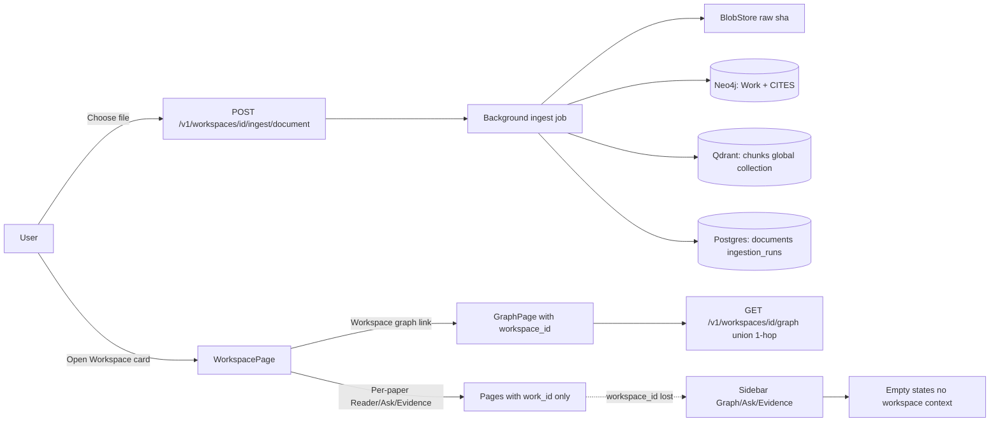
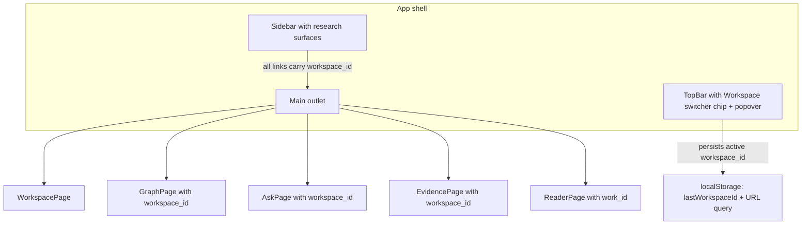
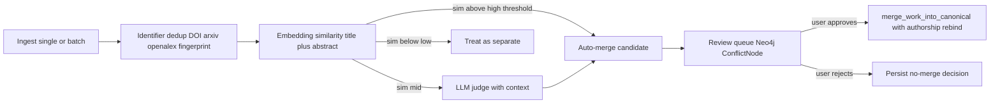
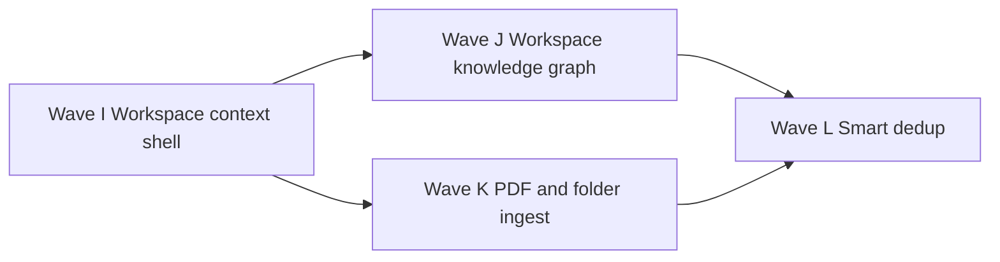

# [HISTORICAL] Workspace experience gap — глубокий анализ и план Wave I–L

> **[HISTORICAL] Перемещён в `_archive/` 2026-04-25.** Wave I/J/K1/K2/K3/L1/L2 закрыты; продолжение по треку **Workspace experience** ведётся в [`../workspace-ux-redesign-2026-04-25.md`](../workspace-ux-redesign-2026-04-25.md) (серия WX1–WX6). Сохранён как контекст и карта переиспользования паттернов из `osint-gr` (§5). Внутренние относительные ссылки на `../` могут указывать на устаревшие пути — для актуального положения см. [`../master-roadmap-and-refactor-plan-2026-04-25.md`](../master-roadmap-and-refactor-plan-2026-04-25.md).

**Дата:** 2026-04-24  
**Статус:** [HISTORICAL] — входил в активный план Wave I–L (закрыты). Не редактировать; для нового анализа Workspace UX — `workspace-ux-redesign-2026-04-25.md`.  
**Связанные документы:**

| Документ | Что в нём |
|----------|-----------|
| [../roadmap.md](../roadmap.md) | Phases 0–7 продукта |
| [../runbooks/roadmap-next-waves.md](../runbooks/roadmap-next-waves.md) | Wave A–H (статус), будут добавлены Wave I–L по этому анализу |
| [../specs/ui-ux-master-plan.md](../specs/ui-ux-master-plan.md) | Целевая UI/UX-архитектура (workspace-first, work context) |
| [../specs/graph-ui-plan.md](../specs/graph-ui-plan.md) | Контракт graph UI и canvas |
| [../specs/work-dedup-queue-v1.md](../specs/work-dedup-queue-v1.md) | Текущий drift dedup (CLI + ручные `merge-work`) |
| [../specs/merge-catalog-wave-h.md](../specs/merge-catalog-wave-h.md) | Backlog merge-каталога авторов / институций |
| [../specs/frontend-ui-api-contracts-v1.md](../specs/frontend-ui-api-contracts-v1.md) | Минимальные UI ↔ API контракты |
| [../backlog/refactor-frontend.md](../backlog/refactor-frontend.md) | Frontend refactor backlog |

---

## 1. Цель и принципы (что считаем успехом)

North star из [roadmap §1.2](../roadmap.md): **рабочее место учёного** для навигации по корпусу, синтеза знаний с цитатами и поиска противоречий — не «общий чат с PDF».

Из этого следуют четыре конкретных принципа, по которым мы судим текущий UX:

1. **Workspace = единица работы.** Все основные сценарии (чтение, граф, ask, evidence, dedup) живут *вокруг выбранного корпуса*; пользователь не должен повторно «находить» свой workspace при каждой навигации.
2. **Корпус → единый граф знаний.** Если в workspace загружено N статей и они ссылаются друг на друга, цитирования между ними должны быть **видны как один связанный граф** (а не N изолированных 1-hop окрестностей).
3. **Дубликаты — продуктовая фича, а не post-mortem.** При корпусном ingest неизбежно приходят повторы (разные версии той же статьи, преприпт + журнал, разные написания авторов). Им нужен явный pipeline: detect → score → user-gated merge — ровно так, как это уже сделано в [`osint-gr` dedup](#5-карта-переиспользования-osint-gr).
4. **PDF — первоисточник.** Извлечённый markdown — рабочая поверхность для чанков и графа, но **исходный PDF должен быть доступен** для проверки (графики, таблицы, формулы, картинки) — особенно пока мы не обрабатываем изображения.

Эти принципы — рамка, в которой ниже разбираются конкретные gap'ы.

---

## 2. Что есть сейчас (карта реализации)

Подробные ссылки — в коде. Здесь — короткая структурированная сводка.

### 2.1 UI (`ui/`)

| Поверхность | Файл | Роль | Состояние |
|-------------|------|------|-----------|
| Shell | [`components/layout/DashboardLayout/DashboardLayout.jsx`](../../ui/src/components/layout/DashboardLayout/DashboardLayout.jsx) | Drawer + main; `borderLeft` тонкая линия; `flex:1` main | **OK как каркас**, но `main` не несёт workspace-контекста (см. §3.1) |
| Drawer | [`components/layout/DashboardLayout/Drawer.jsx`](../../ui/src/components/layout/DashboardLayout/Drawer.jsx) | Вкладки `Workspaces / Graph / Ask / Evidence` + Operations | Workspace-секции **нет**; пункты `Graph/Ask/Evidence` ведут в «пустые» режимы без контекста |
| Workspaces list | [`pages/WorkspacesPage.jsx`](../../ui/src/pages/WorkspacesPage.jsx) | CRUD workspace + поиск глобального индекса works | Возврат на список «съедает» текущий контекст (см. §3.1) |
| Workspace detail | [`pages/WorkspacePage/WorkspacePage.jsx`](../../ui/src/pages/WorkspacePage/WorkspacePage.jsx) | Загрузка одного файла, список карточек works (`maxWidth: 720`), DeduplicationPanel | Узкая колонка; нет folder upload; нет видимого summary корпуса |
| Reader | [`components/work/ReaderWorkBody.jsx`](../../ui/src/components/work/ReaderWorkBody.jsx) | Title/abstract + concat chunks (truncate 120k) | **Нет PDF**; формулы/таблицы теряются |
| Graph | [`pages/GraphPage.jsx`](../../ui/src/pages/GraphPage.jsx) + [`components/graph/GraphWorkspacePanel.jsx`](../../ui/src/components/graph/GraphWorkspacePanel.jsx) | При `?workspace_id=…` тянет workspace graph (union 1-hop), иначе single-work | UI готов к workspace-графу; **бэкенд слабый** (см. §3.4) |
| Ask | [`pages/AskPage.jsx`](../../ui/src/pages/AskPage.jsx) + [`components/work/AskPanel.jsx`](../../ui/src/components/work/AskPanel.jsx) | `?work_id=` или global; **не передаёт workspace_id** | Нет workspace-scope (см. §3.5) |
| Evidence | [`pages/EvidencePage.jsx`](../../ui/src/pages/EvidencePage.jsx) | Только `?work_id=` | Нет workspace-scope |
| Dedup | [`components/graph/DeduplicationPanel.jsx`](../../ui/src/components/graph/DeduplicationPanel.jsx) | Кластеры по DOI / arXiv / OpenAlex / fingerprint | **Только rule/ID**, без LLM/embedding |

### 2.2 Backend (`science_graphrag/`)

| Подсистема | Где | Что умеет |
|------------|-----|-----------|
| `:Workspace` модель | [`storage/neo4j_store.py`](../../science_graphrag/storage/neo4j_store.py) | `:Workspace`-`[:CONTAINS]`-`:Work`; CRUD, attach/remove |
| Workspace API | [`api/workspaces.py`](../../science_graphrag/api/workspaces.py) | List/CRUD + `POST /v1/workspaces/{id}/ingest/document` (1 файл) + `GET .../graph` (union 1-hop) + `GET .../deduplication-candidates` (key-based) + `POST .../merge-works` |
| Works API | [`api/works.py`](../../science_graphrag/api/works.py) | `GET /v1/works`, `GET /v1/works/{id}/graph` (1-hop, depth>1 не реализован) |
| Query | [`api/retrieval.py`](../../science_graphrag/api/retrieval.py) | `POST /v1/query` с **optional `work_id`**; **нет `workspace_id`** |
| Ingest | [`ingestion/pipeline.py`](../../science_graphrag/ingestion/pipeline.py) | Single file через API; CLI `ingest-corpus` рекурсивно; PDF→md (VL или pypdf), `BlobStore` в `data/blobs/raw/<sha>/...` |
| Dedup | [`storage/neo4j_store.py`](../../science_graphrag/storage/neo4j_store.py) `find_work_dedup_violations`, `merge_work_into_canonical` | Ключи DOI/arXiv/…; **smart dedup** — Wave L (`work_embeddings`, Postgres queue, API `/dedup/*`); merge **rebind** `HAS_AUTHORSHIP` на canonical work |
| Blobs | [`storage/blobs.py`](../../science_graphrag/storage/blobs.py) | Файлы по sha256; **нет HTTP-эндпоинта** |
| Stub-ингест | [`api/ingest_jobs.py`](../../science_graphrag/api/ingest_jobs.py) | `POST /v1/ingest/{arxiv,doi,pdf}` → **501** |

### 2.3 Поток данных «как есть»

Ключевая патология контура: **workspace-id живёт только в URL workspace/graph-страницы и в localStorage**, при переходе на `/ask`/`/evidence`/`/reader`/sidebar он *не передаётся*. См. подробности в §3.1.

---

## 3. Конкретные gap'ы (что не так)

Каждый пункт — наблюдение пользователя из исходного запроса плюс наша валидация по коду, плюс предложенное направление фикса (полная разбивка по волнам — §6).

### 3.1 Контекст workspace теряется при навигации

**Симптом (пользователь):** «если ухожу с рабочего workspace и возвращаюсь — вижу снова весь список заново».

**Что в коде:**

- Активный `workspaceId` хранится в `localStorage` (`science-graphrag:activeWorkspaceId`) — [`utils/workspaceStore.js`](../../ui/src/utils/workspaceStore.js).
- Только [`WorkspacePage`](../../ui/src/pages/WorkspacePage/WorkspacePage.jsx) автоматически восстанавливает его при заходе без `?workspace_id=`.
- Sidebar-пункт **Workspaces** ведёт на `/workspaces` (страница списка), а не на «последний открытый workspace».
- Sidebar-пункты **Graph/Ask/Evidence** не докручивают `workspace_id` ни из URL, ни из `localStorage` — пользователь падает в empty state и должен либо ввести `work_id`, либо вернуться через карточку статьи.

**Куда хотим:** active workspace = объект первого класса в shell. Sidebar ведёт *в текущий workspace*; workspaces switcher вынесен в верхнюю панель/header (как chip + popover). Все user-facing страницы знают про active workspace и могут scope'ить запросы по нему.

**Референс из osint-gr:** `getLastWorkspaceHref()` + `lastActiveCaseId` в `localStorage` ([`CaseWorkspacePage/utils/workspaceNavigation.js`](../../../osint-gr/frontend/src/pages/CaseWorkspacePage/utils/workspaceNavigation.js) — навигация по последнему case'у; chip с `caseId` в верхней панели). Адаптируем 1-к-1 на science-graphrag terms.

### 3.2 Workspaces list занимает мало места

**Симптом:** «рабочее окно занимает мало места от экрана, правая часть свободная».

**Что в коде:**

- [`WorkspacePage.jsx`](../../ui/src/pages/WorkspacePage/WorkspacePage.jsx) использует `mainShellContentSx` (max width `min(1680px, 100%)`), но внутренние блоки *вручную* зажаты до `maxWidth: 560` (empty state, upload, accordion) и `maxWidth: 720` (paper card).
- На широком экране это выглядит как «инженерная консоль из 2008 года» — узкая колонка по центру.

**Куда хотим:** workspace = двух-/трёхколоночный layout (например: левый рейл «папки/категории» опционально, центр — список + загрузка, правый — детали выбранного объекта/sticky summary корпуса с количеством работ, цитирований, дубликатов). Карточки тянутся на всю ширину центрального региона. Полноценный density toggle из Corpus-страницы можно переиспользовать.

### 3.3 Нет загрузки папки / батча

**Симптом:** «нет поддержки добавления папки со статьями».

**Что в коде:**

- API: `POST /v1/workspaces/{id}/ingest/document` принимает **один** `UploadFile` ([`api/workspaces.py`](../../science_graphrag/api/workspaces.py)).
- UI: `<input type="file">` без `multiple` и без `webkitdirectory` ([`WorkspacePage.jsx`](../../ui/src/pages/WorkspacePage/WorkspacePage.jsx)).
- CLI: `science-graphrag ingest-corpus <dir>` — рекурсивно `.pdf/.md/.txt` ([`ingestion/pipeline.py`](../../science_graphrag/ingestion/pipeline.py)), но это **не доступно через UI**.
- `POST /v1/ingest/{arxiv,doi,pdf}` — стабы 501.

**Куда хотим:** два пути одновременно (Wave I, см. §6):

1. **Multiple files** в существующем upload (`multiple` + drag-and-drop): простая реализация, низкие риски.
2. **Folder / ZIP**: либо `webkitdirectory` (UI создаёт N запросов с прогрессом), либо backend-эндпоинт `POST /v1/workspaces/{id}/ingest/archive` с распаковкой ZIP (паттерн osint-gr `IngestionTab`). ZIP проще на стороне сетевых таймаутов и прогресса.

### 3.4 Граф не объединяется в единый knowledge graph по workspace

**Симптом:** «хотелось бы, чтобы в рамках workspace данные объединялись в единый граф знаний. Если статья ссылается на другую — на графе должно быть это ясно видно».

**Что в коде:**

- `GET /v1/workspaces/{id}/graph` ([`api/workspaces.py`](../../science_graphrag/api/workspaces.py) → `workspace_graph_union`) собирает граф как **union per-work 1-hop окрестностей**:
  - Для каждого `Work` в workspace берёт его 1-hop соседей (любые `:Author/:Authorship/:Venue/:Method/:Dataset/:Work` через `CITES`).
  - Дедуплицирует ноды по `id`, рёбра по `(src,rel,tgt)`.
- `Work-[:CITES]->Work` рисуется уже сейчас, **если** обе статьи попали в граф (и обе — center или 1-hop neighbour хотя бы одного center). Если две работы цитируют одну общую внешнюю работу, *внешняя работа появится* как общий узел — это уже хорошо.
- Но: цитируемые работы, которые **сами не в workspace**, попадают в граф наравне с workspace-членами; нет визуального выделения «работа из моего корпуса» vs «внешний reference», нет «свёрнутого» представления внешних рёбер.
- Нет multi-hop по запросу (Cypher-запрос в [`api/works.py`](../../science_graphrag/api/works.py) жёстко 1-hop, параметр `depth` из URL не используется).
- Layer-2 связи (`Method`/`Dataset` поверх работ) не выделены как отдельный «семантический слой» в визуализации.

**Куда хотим (Wave J):**

1. **Workspace projection** в Neo4j: либо `MATCH (w:Workspace {id})-[:CONTAINS]->(work:Work) … UNION` сразу с union edges, либо **GDS named graph** для больших workspace'ов.
2. **Цветовая стратификация:** workspace-members vs external (DOI цитирование без узла), `Method`/`Dataset` — отдельная палитра, `Author` — третья.
3. **Inter-paper edges first:** опция «показать только рёбра между членами workspace» — самый продуктивный режим для научного корпуса.
4. **Расширение depth и фильтры по типу** на стороне API (контракт уже есть в [`graph-ui-plan.md`](../specs/graph-ui-plan.md), `depth` принимается, но не реализован).

### 3.5 Ask / Graph / Evidence из sidebar — пустота

**Симптом:** «панели Ask / Graph / Evidence — показывают пустоту, работает только если нажму из Workspace».

**Что в коде:**

- [`AskPage.jsx`](../../ui/src/pages/AskPage.jsx) использует только `?work_id=`, не читает `localStorage` `activeWorkspaceId`.
- [`buildQueryBody`](../../ui/src/services/researchApi.js) шлёт только `query`, `work_id`, `top_k` — `workspace_id` не передаётся.
- На бэке `POST /v1/query` ([`api/retrieval.py`](../../science_graphrag/api/retrieval.py)) тоже не знает про `workspace_id`; Qdrant-коллекция глобальная.
- [`GraphPage.jsx`](../../ui/src/pages/GraphPage.jsx) умеет `?workspace_id=`, но sidebar этого param'а не подставляет.
- [`EvidencePage.jsx`](../../ui/src/pages/EvidencePage.jsx) только `?work_id=`.

**Куда хотим (Wave I + Wave K):**

- UI: sidebar-пункты `Ask`/`Graph`/`Evidence` всегда несут active `workspace_id` в query string (если есть).
- API: `POST /v1/query` принимает опциональный `workspace_id`; ретривер фильтрует Qdrant payload по `workspace_id` (после Wave K3 — тег чанка `workspace_id`) или по списку `work_id`'ов из workspace.
- UI: пустое состояние без workspace и без work предлагает «Open last workspace» (deep link через `localStorage`).

### 3.6 Reader не показывает оригинальный PDF

**Симптом:** «в режиме чтения наверное имеет смысл иметь возможность увидеть и удобно посмотреть сырой pdf, скорее всего это будет намного лучше распознанного текста, тем более у нас пока нет возможности обрабатывать картинки».

**Что в коде:**

- PDF сохраняется в `BlobStore` ([`storage/blobs.py`](../../science_graphrag/storage/blobs.py)) под `data/blobs/raw/<sha[:2]>/<sha>`.
- `Postgres.documents` ([`storage/models_orm.py`](../../science_graphrag/storage/models_orm.py)) хранит `sha256`, `source_path`, `mime_type`, `work_id`.
- **HTTP-эндпоинта для бинарного PDF нет.**
- ReaderWorkBody показывает только `getWorkChunks()` + abstract.

**Куда хотим (Wave K):**

- Backend: `GET /v1/works/{work_id}/pdf` (или `/v1/documents/{sha}/pdf`) с `application/pdf`, ETag, Range-support (для последующей возможности скрол-к-странице).
- Frontend: рядом с `Reader` (вкладка Workspace) — toggle **Markdown | PDF**; PDF рендерим через [`react-pdf`](https://github.com/wojtekmaj/react-pdf) (работает без отдельного сервиса, на pdfjs). Двухколоночный режим **side-by-side md ↔ pdf** — опциональный bonus для Wave K2.
- Безопасность: ограничить доступ по членству work'а в Workspace + опциональный admin-key для bypass.

### 3.7 Дедупликация только по идентификаторам

**Симптом:** «должны быть механизмы дедупликации с LLM, порогами, близости эмбеддингов и прочее, что-то похожеее на то, как это реализовано в osint-gr».

**Что в коде:**

- `find_work_dedup_violations` в [`storage/neo4j_store.py`](../../science_graphrag/storage/neo4j_store.py) — кластеризация по точным значениям ключей (`doi`, `openalex_id`, `fingerprint`, `arxiv_id`).
- DeduplicationPanel показывает эти кластеры; merge через `POST /v1/workspaces/{id}/merge-works` (rule-based, без объяснения).
- Ни **embedding similarity** между chunk-векторами / abstract-эмбеддингом, ни **LLM-арбитраж** для «почти совпадает».
- Авторы / институции вообще нет dedup-pipeline'а (см. [`merge-catalog-wave-h.md`](../specs/merge-catalog-wave-h.md)).

**Что есть в osint-gr (детально в §5):**

- `LLMRecordsMerger` ([`backend/osint_graphrag/dedup/utils/merge_records_with_llm.py`](../../../osint-gr/backend/osint_graphrag/dedup/utils/merge_records_with_llm.py)): cosine matrix → top-k → пороги (`similarity_threshold`, `high_similarity_threshold`) → опциональный LLM judge → union-find кластеры.
- `MergerConfig` ([`backend/osint_graphrag/models/structs.py`](../../../osint-gr/backend/osint_graphrag/models/structs.py)): `CheckSimilarityMode = LLM | EMBEDDING | EMBEDDING_WITH_LLM`, `similarity_threshold = 0.7`, `high_similarity_threshold = 0.95`, `max_candidates_per_record = 20`, `llm_timeout_seconds = 30`.
- Conflict DTO + `user_decision` + `EntityMerger.merge_*` (детект отделён от применения).
- Подсистема dedup для каждого типа сущности: `dedup_db`, `db_conflict/persons.py`, `extract_conflict/persons.py`, `kg.py` (in-memory KG merge), и так далее.

**Куда хотим (Wave L — отдельная большая волна):**

- Адаптировать паттерн на наши scholarly-сущности: `Work` (по abstract + title), `Author` (по нормализованному имени + co-author signature + institution embedding), `Institution` (по нормализованному имени + страна + ROR), `Venue` (по нормализованному имени + ISSN). Подробности — §6.4.

### 3.8 Прочие обнаруженные мелочи (в backlog, не в waves)

| Что | Где | Почему важно |
|-----|-----|--------------|
| `WorkspacePage.jsx` ~520 строк | [`pages/WorkspacePage/WorkspacePage.jsx`](../../ui/src/pages/WorkspacePage/WorkspacePage.jsx) | Уже в [refactor-frontend.md](../backlog/refactor-frontend.md), Wave I усугубит — нужно расщепить ДО или ВО ВРЕМЯ |
| `WorkspacesPage.jsx` ~620 строк | [`pages/WorkspacesPage.jsx`](../../ui/src/pages/WorkspacesPage.jsx) | То же |
| `merge_work_into_canonical` отказывает при `HAS_AUTHORSHIP` | [`storage/neo4j_store.py`](../../science_graphrag/storage/neo4j_store.py) | Текущий dedup UI ловит ошибку без подробного UX; в Wave L нужно перерасправиться с авторствами при merge |
| `DeduplicationPanel` `maxWidth: 640` | [`components/graph/DeduplicationPanel.jsx`](../../ui/src/components/graph/DeduplicationPanel.jsx) | Узко даже на ноуте; Wave L переделает в полноценную review-очередь |
| Нет workspace-scope для Ask | См. §3.5 | Делается в Wave I (UI) + K (API) |

---

## 4. Целевая модель (что хотим в итоге)

### 4.1 Shell с глобальным workspace-context

**Принципы:**

- `activeWorkspaceId` — single source of truth: `localStorage` (для restore) + URL query param (для shareability).
- TopBar chip показывает имя текущего workspace + dropdown «открыть другой» / «создать новый» / «список workspaces» (последний — fallback на текущую `/workspaces`).
- Sidebar-пункты `Graph / Ask / Evidence` всегда добавляют `workspace_id` в URL (если он есть в localStorage и не override'нут).
- Sidebar убирает пункт «Workspaces» как корневой; вместо него:
  - **Workspace** (всегда ведёт в текущий, при отсутствии — на `/workspaces`),
  - **Reader** (только при выбранном `work_id`),
  - **Graph / Ask / Evidence**.

### 4.2 Workspace page как «командный центр»

- Двухколоночный layout: центр — paper list (full-width, density toggle), справа — sticky summary (count works / authors / citations / duplicates / status ingest jobs).
- Header: name, id (chip), action bar (Upload, Add work_id, Open workspace graph, Open Ask, Open Evidence).
- Upload zone: drag-and-drop, multiple files, optional ZIP upload progress.
- Дубликаты — отдельный *tab* (или collapsible) с full-width списком кластеров (см. §4.4).

### 4.3 Workspace-wide knowledge graph

- Backend: новый эндпоинт `GET /v1/workspaces/{id}/graph` v2 поддерживает:
  - `mode = union_1hop | inner_only | semantic_layer | full`,
  - `depth = 1 | 2`,
  - `include_external = true | false` (рендерить ли цитируемые работы вне workspace),
  - `node_types` filter (`Work`, `Method`, `Dataset`, `Author`, `Venue`).
- UI: новый `WorkspaceGraphPanel` поверх существующего [`GraphWorkspacePanel.jsx`](../../ui/src/components/graph/GraphWorkspacePanel.jsx) — добавляет тулбар с режимами и фильтром по типам, palette для разделения internal vs external нодов.

### 4.4 Dedup pipeline (отдельный спек после ADR)

Применяется к `Work`, `Author`, `Institution`, `Venue` (с разными embeddings, prompts и порогами per-type — конфиг наподобие `MergerConfig`).

### 4.5 PDF viewer

- Backend: `GET /v1/works/{work_id}/pdf` стримит PDF из `BlobStore`; `GET /v1/works/{work_id}/sources` отдаёт список доступных репрезентаций (markdown / pdf / vl-output, sha256, mime, размер).
- Frontend: внутри `Workspace` tab Reader — переключатель `Markdown | PDF`; PDF через `react-pdf`. Опционально кнопка «download original».

---

## 5. Карта переиспользования osint-gr

Используем **паттерны**, не код доменного слоя. Каждая строка — что **берём как идею**, что **адаптируем**, что **не тащим**.

### 5.1 Workspace persistence

| Паттерн | osint-gr | Наш аналог (целевой) |
|---------|----------|----------------------|
| `lastActiveCaseId` в localStorage + URL `case_id` | [`CaseWorkspacePage/utils/workspaceNavigation.js`](../../../osint-gr/frontend/src/pages/CaseWorkspacePage/utils/workspaceNavigation.js) | Уже есть `setActiveWorkspaceId`; добавить `getLastWorkspaceHref()` и использовать в Drawer |
| Sidebar пункт `Workspace` ведёт в **последний** case | [`DashboardLayout/Drawer.jsx`](../../../osint-gr/frontend/src/components/layout/DashboardLayout.jsx) | Drawer-link `Workspace` → `/workspace?workspace_id=<last>` или `/workspaces` если нет |
| Top-bar chip с `caseId` и popover | `CaseWorkspacePage` header | `WorkspaceContextChip` в shell header |

### 5.2 Folder/batch ingest

| Паттерн | osint-gr | Наш аналог |
|---------|----------|------------|
| `IngestionTab` принимает `.zip`, distribut'ит на бэке | [`pages/CaseWorkspacePage/.../IngestionTab.jsx`](../../../osint-gr/frontend/src/pages/CaseWorkspacePage/) | `WorkspaceIngestPanel` принимает (a) multiple PDFs, (b) `.zip`; backend `POST /v1/workspaces/{id}/ingest/archive` |
| Прогресс / лог job'ов | osint `startArchiveIngest` + polling | Наш `ingest_jobs.py` уже имеет `getIngestJob`; расширить под N работ в одном архиве (parent job + child jobs или массив `job_ids`) |

### 5.3 Dedup architecture (главное переиспользование)

Все ссылки внизу — пути **в osint-gr**.

| Слой | Файл osint-gr | Что берём |
|------|---------------|-----------|
| Конфиг | [`backend/osint_graphrag/models/structs.py`](../../../osint-gr/backend/osint_graphrag/models/structs.py) `MergerConfig` | Дублируем структуру: `check_mode`, `similarity_threshold`, `high_similarity_threshold`, `max_candidates_per_record`, `llm_timeout_seconds`, embedding-search params |
| Главный движок clustering | [`backend/osint_graphrag/dedup/utils/merge_records_with_llm.py`](../../../osint-gr/backend/osint_graphrag/dedup/utils/merge_records_with_llm.py) `LLMRecordsMerger.merge` | Алгоритм: matrix cosine → top-k edges → union-find → cluster reduce; адаптируем под scholarly-объекты (берём abstract embedding из Qdrant вместо `str(record)` через embed) |
| LLM judge prompt | [`backend/osint_graphrag/dedup/prompts.py`](../../../osint-gr/backend/osint_graphrag/dedup/prompts.py) `IS_THE_SAME_PROMPT` / `IS_THE_SAME_WITH_CONTEXT_PROMPT` | Свой `is_the_same_work_prompt` (заголовок + год + первый автор + abstract span); `is_the_same_author_prompt` (имя + соавторы + аффилиация) |
| Скан DB → similar candidates | [`backend/osint_graphrag/dedup/db_conflict/persons.py`](../../../osint-gr/backend/osint_graphrag/dedup/db_conflict/persons.py) `SimilaritySearchService` | Свой `WorkSimilaritySearch` — Neo4j по ключам (DOI/arXiv) + Qdrant top-k по abstract-вектору |
| Conflict DTO + `user_decision` | [`backend/osint_graphrag/dedup/utils/entity_merger.py`](../../../osint-gr/backend/osint_graphrag/dedup/utils/entity_merger.py) | Новая таблица `work_dedup_conflicts` в Postgres (status: `pending|approved|rejected`); UI — see §5.5 |
| Field-level merge prompts | `MERGE_TWO_FIELDS_PROMPT` etc. | Нужны для авторов и институций (Wave L2/L3) — для `Work` чаще keep canonical как есть |

**Не тащим:**

- OSINT-доменные сущности (Person, RealEstate, Automobile, Address, Contact);
- `KGDeduplicator` для in-memory merge двух KG (у нас граф уже в Neo4j от первого сохранения);
- Person-specific patronymic / Russian-naming context — у нас другой шум (transliteration авторских имён китайских/японских; различные написания «Jr.»/«III»; сокращения «J. Smith» vs «John Smith»). Ручаем своими промптами.

### 5.4 Knowledge graph UI

| Паттерн | osint-gr | Что берём |
|---------|----------|-----------|
| Force simulation + QuadTree + clustering hint | `frontend/src/components/features/graphVisualization/hooks/*` | Уже частично port'ed (см. [graph-ui-plan.md](../specs/graph-ui-plan.md) Wave 4.3 + ADR 007). Wave J — добавить **community hint по `Workspace.CONTAINS`** (workspace-internal nodes — отдельный кластер) |
| Right detail panel | `KnowledgeGraphPage/components/RightPanel.jsx` | У нас уже есть `GraphDetailPanel.jsx`; в Wave L добавить «Conflicts» секцию |
| ConflictsDialog (UX dedup) | `KnowledgeGraphPage/components/ConflictsDialog.jsx` + `useConflictResolution.js` | Прямой референс для `WorkDedupReviewDialog`; адаптируем терминологию (Person → Work, attributes → bibliographic fields) |

### 5.5 Conflict resolver UI

osint-gr показывает каждый конфликт как **карточку** с двумя сторонами + radio (`A` / `B` / `merge`) + редактируемые поля. Это очень близко к тому, что нам нужно для слияния `Work` (выбрать canonical, что взять от drop'а — например, дополнительный DOI или arXiv id).

Файлы для ориентира:

- [`pages/KnowledgeGraphPage/components/ConflictsDialog.jsx`](../../../osint-gr/frontend/src/pages/KnowledgeGraphPage/components/ConflictsDialog.jsx)
- [`pages/KnowledgeGraphPage/components/conflicts/`](../../../osint-gr/frontend/src/pages/KnowledgeGraphPage/components/conflicts/) — карточки per type
- [`pages/KnowledgeGraphPage/hooks/useConflictResolution.js`](../../../osint-gr/frontend/src/pages/KnowledgeGraphPage/hooks/useConflictResolution.js)

### 5.6 Common UI primitives

В osint-gr есть подмножество styled MUI-компонентов (`CursorButton`, `CursorIconButton`, `CursorPrimaryButton`, `CursorDangerButton`) — у нас уже частично есть в [`ui/src/components/common/`](../../ui/src/components/common/). При расширении сохраняем consistency с темой `osint-gr`-стиля (см. её `.cursorrules`), но не копируем компоненты дословно — ровно столько, сколько нужно.

---

## 6. План работ — Wave I, J, K, L

Все четыре волны можно вести **параллельно** (разные модули), но порядок зависимостей такой:

Wave I — обязательное предусловие: без global workspace context остальные waves плодят inconsistent UX. Wave J и K независимы между собой; обе укладываются в `WorkspacePage` shell, который Wave I создаёт. Wave L — пик: ему нужны и эмбеддинги (Wave K3), и зрелый граф (Wave J).

---

### Wave I — Workspace context everywhere (UI + thin backend)

**Цель:** active workspace перестаёт быть локальной деталью одной страницы; становится shell-уровневым контекстом.

**Бэкенд:**

1. `POST /v1/query` принимает опциональный `workspace_id`; если задан — фильтрует Qdrant поиск по списку `work_id`'ов из workspace ([`storage/neo4j_store.py`](../../science_graphrag/storage/neo4j_store.py) `workspace_get_works`).
2. Тот же `workspace_id` пробрасывается в **`retrieval_trace.workspace_id`** (плоский ключ trace) для UI-объяснения; при fallback на список work_id см. `retrieval_trace.workspace_scope_payload_miss`.
3. Smoke в [`tests/test_api_smoke.py`](../../tests/test_api_smoke.py).

**Фронт:**

1. **`WorkspaceContextProvider`** в [`App.jsx`](../../ui/src/App.jsx): контекст с `{activeWorkspaceId, setActiveWorkspaceId, activeWorkspaceMeta}` (имя, count works, last loaded). Источник истины — URL query `workspace_id`, fallback `localStorage`.
2. **TopBar/HeaderChip** `WorkspaceContextChip` (новый компонент в `components/layout/`) — chip с именем + popover «Switch / Create / Manage».
3. **Drawer rework** ([`Drawer.jsx`](../../ui/src/components/layout/DashboardLayout/Drawer.jsx)):
   - `Workspace` (вместо `Workspaces`) → вычисляемый href из контекста.
   - `Graph / Ask / Evidence` всегда добавляют `workspace_id` (utility `appendWorkspaceQuery(href)`).
   - Манипуляции workspace вынесены в TopBar chip popover **или** в отдельный admin-pattern «Manage workspaces» (deep link `/workspaces`).
4. **Empty states** для `Ask`/`Graph`/`Evidence` без workspace и без work — кнопка «Open last workspace» (через `getLastWorkspaceHref()`).
5. `AskPanel` шлёт `workspace_id` в `buildQueryBody` (`ui/src/services/researchApi.js`).

**Чеклист (acceptance):** *(закрыто 2026-04-24 — см. `WorkspaceContext` в `DashboardLayout`, `Drawer.jsx`, `retrieval.py`, smoke в `tests/test_api_smoke.py`)*

- [x] Sidebar `Workspace` после первого выбора всегда возвращает в текущий workspace (перезагрузка страницы тоже сохраняет).
- [x] При активном workspace кнопки `Graph / Ask / Evidence` в sidebar открывают страницы **уже с** `workspace_id` в URL, без empty state.
- [x] Top-bar chip показывает имя workspace; popover позволяет переключиться на любой из списка без `/workspaces`.
- [x] `POST /v1/query` с `workspace_id` (без `work_id`) возвращает ответы только из works этого workspace; smoke-тест зелёный.
- [x] Manual user-journey: «открыть workspace → задать вопрос (Ask из sidebar) → перейти в Evidence → перейти в Graph → вернуться в Workspace» — `workspace_id` сохраняется на всех шагах.
- [x] `npm run lint` + `npm run test` зелёные.

**Зависимости / связи:** работает поверх существующего [shell-layout.md](../specs/shell-layout.md); расширяет его (новый `WorkspaceContextChip` идёт в `## Component tree`). После Wave I обновляем [route-map.md](../specs/route-map.md) и [frontend-ui-api-contracts-v1.md](../specs/frontend-ui-api-contracts-v1.md).

---

### Wave J — Workspace knowledge graph v2

**Цель:** граф workspace воспринимается как один связный knowledge graph, а не «свалка 1-hop окрестностей».

**Бэкенд:**

1. `GET /v1/workspaces/{id}/graph` v2:
   - query params: `mode`, `depth`, `include_external`, `node_types` (см. §4.3),
   - Cypher через `apoc.path.subgraphAll` или `MATCH (ws:Workspace {id})-[:CONTAINS]->(w:Work) WITH collect(w) AS center …` с per-type фильтром,
   - возвращает дополнительный `node.workspace_membership = "internal" | "external"`.
2. Опциональный multi-hop (`depth=2`) с явным cap `MAX_NEIGHBORS=300`.
3. `GET /v1/workspaces/{id}/graph/stats` — отдельный лёгкий эндпоинт (count works, authors, citations, internal-only edges, external nodes), для summary в WorkspacePage и debug.
4. Тесты: интеграционный сценарий «два work'а с пересекающимся CITES».

**Фронт:**

1. `WorkspaceGraphToolbar` (новый): chips для `mode`, depth, type filter; persist в `localStorage`.
2. Расширение [`GraphCanvasMvp.jsx`](../../ui/src/components/graph/GraphCanvasMvp.jsx) / `graphCanvasStyle.js`: разная палитра для `internal` vs `external`; разный размер/обводка.
3. Force-mode community hint: workspace-internal works получают `clusterId = "ws-internal"` (используем уже port'ed osint pattern из ADR 007).
4. Workspace summary (см. Wave I §4.2): `GET /v1/workspaces/{id}/graph/stats` для счётчиков.

**Чеклист:** *(закрыто 2026-04-24 — `workspace_graph.py`, `WorkspaceGraphToolbar`, `tests/fixtures/benchmarks/graph_v1/`)*

- [x] При двух статьях, одна из которых цитирует другую, **обе** видны в graph view с `mode=inner_only` и связаны `CITES`.
- [x] При `include_external=false` external цитируемые работы не рисуются (но edges-stub можно показать пунктиром, опционально).
- [x] `GET /v1/workspaces/{id}/graph/stats` отдаёт целые числа без обхода всего графа.
- [x] Manual: ingest корпуса из 5+ статей → workspace graph → видно citation chain между ними.
- [x] graph-level benchmark fixture для workspace-graph (новый тип `graph_expectations.workspace`) — добавить хотя бы один кейс в `tests/fixtures/benchmarks/graph_v1/`.

**Зависимости:** Wave I (workspace context в UI), [graph-ui-plan.md](../specs/graph-ui-plan.md) (контракт). Не нужен LLM/dedup — это чисто граф.

---

### Wave K — PDF reader + folder/batch ingest

Делится на три независимых под-волны.

#### K1. PDF blob serving + viewer

**Бэкенд:**

1. Эндпоинт `GET /v1/works/{work_id}/pdf` (FastAPI `StreamingResponse`, `media_type="application/pdf"`, ETag по sha256):
   - резолвит sha256 через Postgres (`documents.work_id`),
   - стримит файл из `BlobStore.path_for_sha`,
   - возвращает `404` если нет PDF (например, work был ingested из markdown).
2. `GET /v1/works/{work_id}/sources` — список доступных репрезентаций (markdown / pdf / VL-output) с размерами и sha256.
3. **`Range`** (HTTP 206 + `Content-Range`) для частичной выдачи байт; неудовлетворимый range → **416**.

**Фронт:**

1. Зависимость [`react-pdf`](https://github.com/wojtekmaj/react-pdf) (через npm; pdfjs worker — встроенный CDN-режим или vendored).
2. В Workspace Reader tab — toggle `Markdown | PDF`; PDF mounted lazy.
3. Empty state: «Original PDF unavailable for this work» (когда only-markdown/text).

**Чеклист:** *(закрыто 2026-04-24 — `api/main.py` + `works.py`, `PdfViewer.jsx`, lazy `react-pdf`)*

- [x] `GET /v1/works/{id}/pdf` отдаёт корректный PDF для work, ingested из PDF; 404 для work без PDF; ETag присутствует.
- [x] UI: переключатель `Markdown | PDF` без перезагрузки; pdfjs worker загружается ровно один раз.
- [x] Lighthouse / size: PDF chunk не входит в основной bundle (lazy import).
- [x] Manual: открыть статью с формулами → PDF режим показывает оригинал.

#### K2. Folder/multiple files upload

**Бэкенд:**

- Сохранить текущий single-file `POST /v1/workspaces/{id}/ingest/document`.
- Добавить `POST /v1/workspaces/{id}/ingest/batch`:
  - принимает либо `multiple files=files[]` (multipart array), либо single `archive=…` `.zip`,
  - создаёт **parent job** + N child jobs; возвращает `parent_job_id` и `child_job_ids`.
- `GET /v1/ingest/jobs/{parent_job_id}` отдаёт агрегированный статус.

**Фронт:**

1. Drag-and-drop zone в `WorkspaceIngestPanel` (новый компонент при сплите [WorkspacePage](../../ui/src/pages/WorkspacePage/WorkspacePage.jsx)).
2. `<input multiple webkitdirectory>`-подобный fallback (browser-зависимый — для UX лучше принимать **drop folder** с обработкой `dataTransfer.items` recursively).
3. Прогресс: per-file row + parent progress bar.

**Чеклист:** *(закрыто 2026-04-24 — `POST .../ingest/batch`, `WorkspaceIngestPanel`, `collectIngestFiles`; 2026-04-25 — per-child `LinearProgress` в batch UI)*

- [x] Backend: батч из 5 PDF принимается одним POST'ом, child jobs выполняются (sequentially либо в bounded executor); parent job содержит summary.
- [x] UI: drag папку → видим список файлов → старт; видимый прогресс per file.
- [x] CLI parity: `science-graphrag ingest-corpus` остаётся; UI batch использует тот же pipeline.

#### K3. Workspace tagging для chunks (foundation для Wave L и workspace-scope retrieval)

**Бэкенд:**

- При ingest каждый chunk в Qdrant получает payload `workspace_ids = ["…"]` (массив, потому что один Work может быть прикреплён к нескольким workspace'ам).
- Backfill миграция для существующих чанков: `science-graphrag scripts/backfill_workspace_payloads.py`.
- `POST /v1/query` с `workspace_id` (Wave I §1) теперь умеет фильтровать по `workspace_ids` payload (вместо list-of-work-ids — быстрее на большом workspace).

**Чеклист:** *(закрыто 2026-04-24 — `pipeline.py` / `qdrant_store.py`, `scripts/backfill_workspace_payloads.py`, retrieval filter)*

- [x] Новые ingest'ы тегаются `workspace_ids` автоматически.
- [x] Backfill-скрипт миграции прогнан на dev compose; idempotent.
- [x] `POST /v1/query` с `workspace_id` использует Qdrant payload filter, не list-filter.

---

### Wave L — Smart dedup (LLM + embeddings)

Самая большая по объёму. Три под-волны: L1 — `Work`, L2 — `Author`, L3 — `Institution / Venue`. Делать строго в порядке (graph contracts добавляются постепенно).

**ADR-014 (Wave L):** «Embedding + LLM dedup pipeline для scholarly entities» — [docs/adr/014-work-dedup-smart-wave-l.md](../adr/014-work-dedup-smart-wave-l.md) (расширяет [ADR 010](../adr/010-work-dedup-review-queue.md)). Решает: review queue в Postgres, пороги, LLM (`extraction_llm_*` / `MAIN_LLM_*`), audit merge.

**Спека:** [work-dedup-pipeline-v2.md](../specs/work-dedup-pipeline-v2.md) — расширение [work-dedup-queue-v1.md](../specs/work-dedup-queue-v1.md); контракт API, статусы, fingerprint idempotence.

#### L1. Work dedup pipeline (must-have)

**Бэкенд:**

1. **Конфиг** `WorkDedupConfig` в [`config.py`](../../science_graphrag/config.py):
   - `WORK_DEDUP_SIM_LOW = 0.78`, `WORK_DEDUP_SIM_HIGH = 0.93` (стартовые; подкрутить по gold-set);
   - `WORK_DEDUP_MAX_CANDIDATES = 20`;
   - `WORK_DEDUP_LLM_MODE = "embedding_with_llm"` (как в osint-gr);
   - `WORK_DEDUP_LLM_TIMEOUT_S = 30`.
2. **Embedding** для Work — взвешенная конкатенация `title + abstract + authors[0]` через тот же embedder, что и chunks (чтобы переиспользовать Qdrant). Хранить в **отдельной коллекции** `works` (или payload-секции глобальной `chunks` с `kind="work_summary"`).
3. **Detect**: `POST /v1/workspaces/{id}/dedup/scan`:
   - для каждого work в workspace берёт top-k similar по cosine,
   - применяет `low/high` пороги,
   - middle-zone — отправляет в LLM с prompt `is_the_same_work` (заголовок + год + first author + abstract span обоих),
   - результат сохраняет в Postgres `work_dedup_conflicts` (status=`pending`, confidence, reason, similarity).
4. **List**: `GET /v1/workspaces/{id}/dedup/conflicts` — pending + последние решённые.
5. **Resolve**: `POST /v1/workspaces/{id}/dedup/conflicts/{conflict_id}/decide` — тело: `decision`: `merge_a` \| `merge_b` \| `merge` \| `keep_separate` \| `skip`; при `merge` обязателен `keep_work_id` (должен совпасть с `work_id_a` или `work_id_b`, алиас к `merge_a`/`merge_b`). На merge — вызывает существующий `merge_work_into_canonical` (Wave L1 fix: при `HAS_AUTHORSHIP` сначала пересчепляет authorships на keep_work).
6. **Reverse / audit**: `GET /v1/workspaces/{id}/dedup/audit` — все merges с возможностью отмены (опционально, через `merge_log` table).

**Фронт:**

1. `WorkDedupReviewDialog` (новый, по референсу [`ConflictsDialog.jsx`](../../../osint-gr/frontend/src/pages/KnowledgeGraphPage/components/ConflictsDialog.jsx)) — каждый кластер как карточка с двумя сторонами, similarity score, LLM reason, radio выбора.
2. Замена `DeduplicationPanel.jsx` на full-width `WorkspaceDedupPage` или вкладку `Workspace > Duplicates` (зависит от Wave I решений).

**Чеклист (Wave L — по подзадачам):** *(L1 закрыто 2026-04-24 в коде; gold P/R — по мере наполнения real work_id в `dedup_v1/gold.json`)*

- [x] **L0:** ADR 014 + спека `work-dedup-pipeline-v2.md`.
- [x] **L1.1** `Settings`: `work_dedup_*`, `qdrant_work_embeddings_collection`; пороги в `/v1/settings` (`work_dedup` в snapshot).
- [x] **L1.2** Postgres `work_dedup_conflicts` + `work_dedup_merge_log` (audit); `create_all` через `init_db`.
- [x] **L1.3** Qdrant `QdrantWorkEmbeddingStore` (`work_embeddings`).
- [x] **L1.4** Ingest: upsert work embedding; скрипт `scripts/backfill_work_embeddings.py`.
- [x] **L1.5** `run_work_dedup_scan` + LLM prompt (`dedup/work_dedup_engine.py`, `dedup/prompts.py`).
- [x] **L1.6** API: `POST .../dedup/scan`, `GET .../dedup/jobs/{id}`, `GET .../dedup/conflicts`, `POST .../decide` (`merge_a` / `merge_b` / `merge`+`keep_work_id` / `keep_separate` / `skip`), `GET .../dedup/audit`.
- [x] **L1.7** `merge_work_into_canonical`: rebind `HAS_AUTHORSHIP`.
- [x] **L1.8** UI: `WorkDedupReviewDialog` + `WorkspaceDedupSection` + `workspaceStore.js` API helpers.
- [x] **L1.9** Каркас `tests/fixtures/benchmarks/dedup_v1/` + `science-graphrag-dedup-v1-benchmark` (схема + fingerprint); **метрики P/R на golden — после заполнения реальными work_id**.
- [x] **L2** Author dedup: `run_author_dedup_scan`, API `.../dedup/authors/*`, `merge_author_into_canonical`, Qdrant `author_embeddings`.
- [x] **L3** Institution/Venue: `POST .../dedup/institutions/scan` → `gated: true` (без изменений графа).

#### L2. Author dedup (после L1 stabilization)

- Embedding автора: name + co-author signature (топ-5 самых частых соавторов в нашем корпусе) + последняя institution.
- LLM context-aware prompt (учитывает initialы, transliteration).
- Слияние: `:Author` имеет deterministic id по нормализованному имени, надо перевязать `Authorship` рёбра.

#### L3. Institution / Venue (последнее, gated по [merge-catalog-wave-h.md](../specs/merge-catalog-wave-h.md))

- Здесь больше полагаемся на ROR / OpenAlex как «третейский судья», embedding нужен только для unmatched.

---

## 7. Сводный чеклист по waves

| Wave | Item | Owner | Acceptance |
|------|------|-------|------------|
| I | Workspace context provider | UI | **Done 2026-04-24** — [§ Wave I checklist](#wave-i--workspace-context-everywhere-ui--thin-backend) |
| I | TopBar chip + Drawer rework | UI | **Done** |
| I | `POST /v1/query` поддерживает `workspace_id` | Backend | **Done** |
| J | Backend `GET /v1/workspaces/{id}/graph` v2 | Backend | **Done 2026-04-24** — [§ Wave J](#wave-j--workspace-knowledge-graph-v2) |
| J | UI graph toolbar + internal/external palette | UI | **Done** |
| J | Workspace graph stats endpoint | Backend | **Done** |
| K1 | `GET /v1/works/{id}/pdf` | Backend | **Done 2026-04-24** — [§ K1](#k1-pdf-blob-serving--viewer) |
| K1 | PDF viewer toggle in Workspace Reader | UI | **Done** |
| K2 | Batch ingest endpoint + UI drag-folder | Backend + UI | **Done** |
| K3 | Qdrant payload `workspace_ids` + backfill | Backend + scripts | **Done** |
| L1 | ADR 014 + dedup pipeline v2 spec | Docs | **Done 2026-04-24** |
| L1 | Work embedding + LLM judge | Backend | **Done** |
| L1 | Conflicts queue API + dialog UI | Backend + UI | **Done** |
| L1 | Dedup gold benchmark | Eval | **Done (offline heuristic)** — 5 кластеров в [`tests/fixtures/benchmarks/dedup_v1/gold.json`](../../tests/fixtures/benchmarks/dedup_v1/gold.json); `science-graphrag-dedup-v1-benchmark` passes при gates precision ≥ 0.9, recall ≥ 0.8 |
| L2 | Author embedding + dedup | Backend + UI | **Done** |
| L3 | Institution / Venue dedup | Backend + UI | **Gated stub** |

---

## 8. Что **не** входит в эти волны (явный non-goals)

- **Полноценный RBAC / multi-tenant.** `Workspace` — личный workspace; разделение прав между пользователями — отдельная задача (см. [admin-policy.md](../specs/admin-policy.md)).
- **Цитата → точная страница PDF.** PDF viewer в K1 — read-only, без deep-link к chunk position. Это потенциальный K2.5 / Wave M.
- **Картинки / таблицы из PDF в Reader / Graph.** VL pipeline уже умеет, но reader-render отдельно — за рамками.
- **Pull-режим: ingest по DOI / arXiv URL из UI.** API stubs существуют (501), активация — отдельная маленькая волна (можно вшить в K2 опционально).
- **Real-time collaboration / share workspace.** Не в этих waves.
- **Полноценный Sigma / Cytoscape для графа.** Текущий Canvas+Force достаточен; см. [graph-ui-plan.md](../specs/graph-ui-plan.md) Wave 4.3.

---

## 9. Связь с существующими спеками и backlog'ом

При выполнении waves обновлять:

1. [ui-ux-master-plan.md](../specs/ui-ux-master-plan.md) — Phase 2 reference: workspace context (Wave I); Phase 4 (Wave J: расширение workspace graph); Phase 7: empty states новых страниц.
2. [graph-ui-plan.md](../specs/graph-ui-plan.md) — добавить раздел «Workspace graph v2» под Wave J.
3. [work-dedup-queue-v1.md](../specs/work-dedup-queue-v1.md) → пометить как **superseded by `work-dedup-pipeline-v2.md`** после Wave L1.
4. [merge-catalog-wave-h.md](../specs/merge-catalog-wave-h.md) — синхронизировать с Wave L3.
5. [frontend-ui-api-contracts-v1.md](../specs/frontend-ui-api-contracts-v1.md) — новые эндпоинты (`/pdf`, `/sources`, `/dedup/*`, batch ingest, workspace graph v2).
6. [refactor-frontend.md](../backlog/refactor-frontend.md) — отметить как **prerequisite** разбиение `WorkspacePage.jsx` и `WorkspacesPage.jsx` (открытые `[OPEN]` строки) — выполнять **в начале** Wave I.
7. [route-map.md](../specs/route-map.md) — обновить sidebar items + workspace deep-links.
8. [shell-layout.md](../specs/shell-layout.md) — добавить `WorkspaceContextChip` и updated component tree.
9. ADR — новый `005-workspace-scoped-retrieval-and-dedup-pipeline.md` (после Wave I §1 + Wave L1 ADR).

---

## 10. Risks и mitigation

| Риск | Митигация |
|------|-----------|
| Workspace context добавляется перед refactor `WorkspacePage.jsx` → файл становится ещё больше | Сначала закрыть [OPEN] строки в [refactor-frontend.md](../backlog/refactor-frontend.md) (split `WorkspaceIngestPanel`, `WorkspacePaperList`, `WorkspaceDedupSection`); только потом Wave I |
| Workspace graph v2 на больших корпусах медленный (depth=2 + N works) | Жёсткие caps (`GRAPH_UI_MAX_*` уже есть), серверный лимит 300, GDS named graph для опционального tier-2 |
| LLM dedup даёт false positives | High threshold `0.93` для auto-merge; всегда user gate; gold-set + decision ledger для отката |
| Embedding автора дрейфует при изменении модели | Pin embedding model + сохраняем `embedder_id` в payload; пересчёт через миграцию (как `BLOB_BACKFILL`) |
| PDF blob занимает много места при большом корпусе | Sha256 dedup на уровне `BlobStore` уже есть; добавить cleanup CLI: «удалить blob, на который не ссылается ни один Work» |
| Wave L review-queue добавляет операционную нагрузку | Default — auto-merge при `sim ≥ 0.95`; явное `keep_separate` решение запоминается; UX «mass approve» для пилота |

---

## 11. История

| Дата | Изменения |
|------|-----------|
| 2026-04-24 | Первая версия. Анализ +план Wave I–L. |
