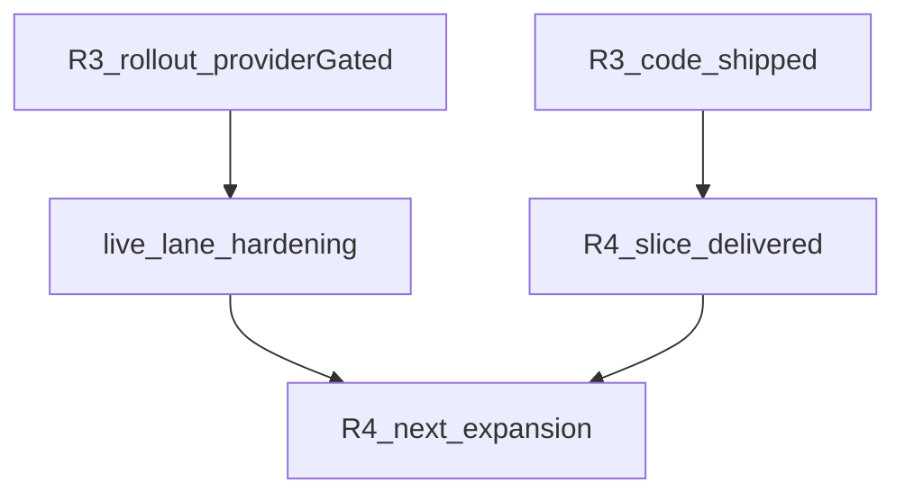

# Agent engine next horizon — architecture, chat, ingestion, refactor (2026-05-13)

**Doc status:** `active`

**Read hint:** active strategy roadmap (primary live planning doc). Start from [`ACTIVE.md`](./ACTIVE.md), then this file.

**Status:** current planning entry; replaces the former detailed wave log
[`agent-engine-and-benchmarks-next-waves-2026-05-09.md`](./agent-engine-and-benchmarks-next-waves-2026-05-09.md) (now archived stub)
is effectively complete. **Update 2026-05-13:** **R2** chat contract wave is **closed** (see [`r2-chat-contract-closeout-2026-05-13.md`](./r2-chat-contract-closeout-2026-05-13.md)); **R3** code/docs increment ships `compaction_audit.l4_eligibility` + offline `memory_influence_audit_v1`, and **operator live evidence is recorded** in [`r3-long-thread-live-baseline-2026-05-13.md`](./r3-long-thread-live-baseline-2026-05-13.md) — current **rollout stance is `provider-gated`**: formal acceptance/compare lanes are stable, but representative long-thread cache / L4 activation signals are still insufficient for unconditional promotion (forced diagnostic probes add partial signal only). That plan closed most of Waves D/E/F/G/H in code or evidence,
with important operator exceptions: Wave D promotion is still deferred; **E1/E2 ship
`True` defaults in `Settings` but remain under an operator rollout gate** (paired live
latency / cache-ratio evidence — see
[`agent-engine-feature-status-2026-05-13.md`](./agent-engine-feature-status-2026-05-13.md));
Wave H L4 is default-on with **recommended** long-thread re-compare on provider changes.

**Purpose:** decide the next direction instead of adding another undifferentiated
feature list, then turn that decision into a wave roadmap. This document answers:

- whether the agent/chat architecture is going in the right direction;
- which openclaude practices are worth copying and which are not;
- what we forgot around ingestion;
- what refactor pass should happen before the next feature wave;
- which benchmarks are allowed to become gates;
- which waves should run first, what they produce, and when to stop.

**Short answer:** we did not go in the wrong direction, but we are close to the point
where adding more agent machinery has worse expected value than tightening interfaces,
operator gates, chat UX, and ingestion quality. The next horizon should be a
stabilization and depth pass, not a "more agents" pass.

**Roadmap summary:**

| Wave | Theme | Outcome | Start condition |
|------|-------|---------|-----------------|
| **R0** | Roadmap reconciliation | One source of truth for open gates / flags / artifacts. | **Done** (2026-05-13); matrix in companion doc. |
| **R1** | Observability refactor | Trace-review and compare gates become maintainable modules. | **Done** (2026-05-13); keep future gates modular. |
| **R2** | Chat contract (closed 2026-05-13) | SSE/product layers + `degraded_mode` + `product_step` policy frozen in spec; follow-ups: `agent_note` pilot (optional), tool-map maintenance. | **Done** — [`r2-chat-contract-closeout-2026-05-13.md`](./r2-chat-contract-closeout-2026-05-13.md); normative: [`../specs/agent-chat-v1.md`](../specs/agent-chat-v1.md) §R2. |
| **R3** | Context memory | Long-thread compaction and `thread_insights` split into cost vs memory layers; **rollout `provider-gated`** until long-thread metrics clear (see baseline checklist). | R1 metrics available. |
| **R4** | Real subagent runtime | **Slice delivered:** sync spawned `corpus_explore` child (fanout 1), SSE lifecycle + merge provenance in metadata. **R4-next:** hardening (cancellation/timeouts, paired latency compare) — no fanout>1 / no async child runtime until live evidence lanes are reliable. | R2 contract frozen (spec §R2); R4-next also needs repeatable live/trace lanes (R3 experience). |
| **R5** | Benchmark promotion discipline | **Wave executed 2026-05-13:** judge stays **advisory** (strict calibration red); closeout [`r5-benchmark-promotion-discipline-closeout-2026-05-13.md`](./r5-benchmark-promotion-discipline-closeout-2026-05-13.md); manifest [`eval/results/r5-wave-2026-05-13-manifest.json`](../../eval/results/r5-wave-2026-05-13-manifest.json) includes **2026-05-14 residual** `follow_up_2026_05_14` (judge_mini mock contract smoke — advisory unchanged). | Can run in parallel after R1; do not reopen as a broad feature wave. |
| **R6** | Ingestion quality baseline | Corpus quality / claims / retrieval / dedup measured before headline updates. | Before publication metric refresh. |
| **R7** | Ingestion architecture | Structured executor, year/venue writeback, dedup parity slices. | R6 baseline exists. |
| **R8** | Artifact hygiene | Canonical vs diagnostics storage split, no noisy committed live dumps. | Before benchmark expansion scale-up. |
| **R9** | Product integration | Graph/retrieval/chat evidence reads as one user-facing workflow. | After R2 close + R6. |

---

## 1. Current read of the system

### 1.1 What is solid now

| Area | Current state | Evidence |
|------|---------------|----------|
| Supervisor baseline | `langgraph_supervisor_v3` is the canonical dev runtime; `langgraph_research_v1` remains explicit fallback / comparison lane. | Orchestration closeout + trace-review acceptance. |
| Deterministic routing | `RoutePlan` + `QuestionFeatures` replaced scattered route latches and the separate LLM router layer. | `metadata.turn_policy.route_plan` is the single channel. |
| Runtime safety | `final_answer_missing_count=0`, `missing_span_count=0`, `tool_loop_repeat_max <= 3`, partial-state salvage exists. | Trace-review-v1 gates. |
| Writer | `writer_agent` is narrowed to terminal synthesis; `writer_oscillation_count_max=0` on recent acceptance artifacts. | Wave E3 / G3 closure. |
| Context compaction | L4 history compact runs through `run_side_llm_chat`; offline 50-turn harness shows `side_llm_cache_read_ratio_avg=0.844`. | `wave-h-rollout-decision-2026-05-12.md`. |
| Judge benchmark infrastructure | Pairwise judge runner, multiseed baseline, cost axis, cross-family research artifacts exist. | Wave D/F artifacts. |
| Trace-review discipline | Machine-readable warn allowlist, latency policies, writer oscillation policy, heartbeat diagnostics exist. | Wave G/H. |

### 1.2 What is not solid, and should not be hidden

| Area | Status | Meaning |
|------|--------|---------|
| Wave D promotion | Live calibration window failed strict thresholds: `agreement_winner_rate_min=0.3`, threshold `0.7`; variance spread `0.835`, threshold `0.15`. | `agent_v3_quality_judge_v1` stays advisory. Do not promote to `decision_gate`. |
| Cross-family judge | `inter_judge_agreement_rate=0.0769` on 13 pilot cases. | The judge lane is useful for visibility, not authority. |
| E1 subagents | Paired live showed p95 `43865 -> 69112 ms`. | **Operator rollout gate:** treat as risky for production until new compare; **Settings defaults** for fork legs are still `True` — override via env if needed (R0 matrix). |
| E2 `tool_use_summary` | Heavy live ratio `side_llm_cache_read_ratio_avg=0.1 < 0.4`. | **Operator rollout gate:** do not trust cost/cache story until ratio ≥ 0.4 or explicit policy; **`agent_tool_use_summary_enabled` default is `True`** in code — turn off via env for conservative stacks. |
| Ingestion | Robustness improved, but claims/gold realism, author/entity dedup, year/venue writeback, and full BT revalidation remain open. | Backlog OPEN/PARTIAL items. |
| Structural debt | Trace-review and benchmark runners became the new god-files. | Refactor pass needed before next benchmark expansion. |

### 1.3 What the first draft missed

The first version of this horizon doc was directionally right, but too coarse for
execution. It missed or under-specified:

- **artifact hygiene:** `eval/results/` now mixes canonical report artifacts and heavy
  diagnostics; this will get worse if R1/R5/R6 produce more live traces;
- **tool-search parity:** Epic C (`hybrid discovery-aware tool search`) is still open
  and should be treated as a later evidence-gated wave, not folded into subagents;
- **agent-note / progress UX:** `agent_note` remains default-off without the promised
  50-turn cost study; chat progress should not wait for real subagents;
- **settings / flags cleanup:** experiments under an **operator rollout gate** need an
  explicit policy: retire, keep off with runbook, or promote only after evidence;
- **API / UI integration:** chat, graph, reader, and benchmark panels are still separate
  product surfaces even when they explain one workflow;
- **security / artifact privacy:** more traces and summaries increase the chance of
  committing sensitive local paths, workspace ids, prompts, or corpus excerpts.

These are included in the wave roadmap below rather than left as loose follow-ups.

---

## 1.4 Execution stance for the next cycle

Before going wave by wave, keep four labels separate:

- **done:** no new roadmap work beyond ordinary maintenance;
- **residual follow-up:** wave is closed, but a narrow policy or refactor tail remains;
- **blocked by evidence:** shipped code path exists, but rollout or expansion depends on live
  signals;
- **depends on baseline:** do not widen refactor or product scope until a measurement pass
  identifies the bottleneck.

Applied to the current roadmap:

- **R1** is **done**; the remaining duty is to keep new gates modular.
- **R5** is a **closed wave with residual follow-ups**, not a new broad execution track.
- **R3** and **R4-next** are **blocked by evidence** rather than by missing implementation.
- **R7** and **R9** both **depend on baseline** from **R6**.

This distinction is intentional: it prevents us from mixing "code shipped", "operator trust",
"promotion gate", and "product polish" into one vague next-step list.

---

## 2. Did we go somewhere wrong?

### 2.1 Not wrong: killing the separate LLM router

The move away from "LLM router above specialists" was correct. It reduced a shallow
decision layer whose interface was almost as complex as its implementation. The current
`RoutePlan` / `QuestionFeatures` module is deeper: callers see typed route intent,
while the implementation hides substring/regex heuristics, completion rules, and
post-retrieval handoff policy.

**Decision:** do not reopen the separate LLM-router architecture unless a concrete
benchmark shows deterministic routing cannot handle a new class of questions.

### 2.2 At risk: treating subagents as automatic improvement

The E1 result is the warning sign: read-only subagents are architecturally cleaner,
but the paired live run shows a large p95 regression. The risk is not "subagents are
bad"; the risk is letting a nice diagram override latency and operator evidence.

**Decision:** keep E1 under **operator rollout gate** (not “code off”): a **first
spawned-child vertical slice** (sync `corpus_explore`, fanout 1, lifecycle + provenance
in SSE/`run_metadata`) is **delivered** — see §R4. **R4-next** should harden cancellation
/ timeouts and prove paired latency vs baseline **before** fanout>1 or new child types.
Stacks sensitive to latency should still disable E1 legs via env until new paired
evidence (see R0 companion matrix).

### 2.3 At risk: over-trusting LLM-as-judge

The pairwise judge is now a good measurement instrument, but not a decision gate.
The multiseed range is useful; the cross-family agreement result is sobering.

**Decision:** keep `agent_v3_quality_judge_v1` advisory until both are true:

- strict calibration passes for at least two consecutive windows;
- cross-family agreement or a replacement adjudication method becomes acceptable
  for promotion decisions.

### 2.4 Missing perspective: chat UX as part of architecture

The engine now has traces, gates, and summaries. But chat quality is not only final
answer quality. It also includes:

- visible progress that matches actual work;
- fast partial feedback before long graph/retrieval phases finish;
- understandable "why this answer" provenance;
- cancellation and recovery that feel deliberate, not broken;
- thread memory that improves long sessions without surprising the user.

**Decision:** next agent architecture work must include chat contract / SSE evidence
as first-class acceptance, not only backend trace metrics.

---

## 3. Openclaude best practices: what to copy

This is based on local inspection of `/home/roman/pyprojects/ML/openclaude`, especially:

- `src/services/compact/autoCompact.ts`
- `src/services/toolUseSummary/toolUseSummaryGenerator.ts`
- `src/services/SessionMemory/sessionMemory.ts`
- `src/Task.ts`
- `src/coordinator/workerAgent.ts`

### 3.1 Copy: explicit context-window budgets and circuit breakers

Openclaude's auto-compact code reserves output tokens, computes an effective context
window, and has a consecutive failure circuit breaker. The useful lesson is not the
exact constants; it is that compaction is a policy module with headroom, warnings,
blocking thresholds, and failure backoff.

**Apply here:**

- promote our long-thread compaction policy into one explicit module with:
  - context window budget;
  - summary output reservation;
  - warning threshold;
  - blocking threshold;
  - consecutive failure circuit breaker;
  - telemetry for "why compact fired".
- add trace-review metrics for compact trigger reason, compact failure streak, and
  post-compact token estimate.

### 3.2 Copy carefully: session memory extraction at natural breaks

Openclaude session memory waits for token and tool-call thresholds, and prefers natural
breaks where the last assistant turn has no tool calls. That maps well to our
`thread_insights` backlog.

**Apply here:**

- finish `thread_insights` A2/A3 as a freshness-gated memory layer;
- inject it with deterministic precedence, not as another ad-hoc prompt chunk;
- require long-thread eval for recall / consistency, not just token reduction;
- do not update memory in the middle of tool-call bursts unless deadline salvage
  requires it.

### 3.3 Copy: tool summaries as UI labels, not reasoning substrate

Openclaude's `toolUseSummaryGenerator` creates a short progress label, around
30 characters. It does not try to become the agent's internal memory.

Our E2 `tool_use_summary` is heavier: it summarizes long `ToolMessage` batches for
runtime context. That can be useful, but the current cache ratio is not good enough.

**Apply here:**

- split two concepts:
  - `progress_tool_summary`: short UI label, cheap / non-critical / no gate;
  - `runtime_tool_summary`: context compression for the model, gated by cache ratio.
- keep `runtime_tool_summary` off until `side_llm_cache_read_ratio_avg >= 0.4` on
  heavy live or a documented provider policy says the cost is acceptable.

### 3.4 Copy: task lifecycle as a real interface

Openclaude `Task.ts` has explicit task types, statuses, terminal-state checks, output
files, offsets, notification state, and kill semantics. This is closer to a real
subagent runtime than our current specialist handoff telemetry.

**Apply here:**

- design `AgentTask` / `SubagentRun` as a first-class module:
  - `pending | running | completed | failed | killed`;
  - `parent_turn_id`, `child_turn_id`, `task_type`, `description`;
  - output artifact pointer and offset;
  - cancellation / timeout semantics;
  - terminal-state invariant;
  - merge provenance.
- SSE should expose lifecycle without leaking internal tool logs.
- Trace-review should gate missing lifecycle events before we trust fanout.

### 3.5 Do not copy blindly

| Openclaude pattern | Why not direct copy |
|--------------------|---------------------|
| UI/client-heavy task model | SciGraph agent runs in backend API + SSE, not only local CLI UI. Need persistence and API contracts. |
| Haiku-specific summaries | We run through OpenRouter and model mix; provider cache behavior differs. |
| General-purpose worker agents | SciGraph needs domain-aware evidence/provenance, not generic autonomous workers by default. |
| GrowthBook-style flags | We already have `Settings` + persisted settings; avoid introducing a second flag system. |

---

## 4. Architecture decisions for the next horizon

### 4.1 Keep supervisor v3, but stop deepening it by default

**Decision:** `langgraph_supervisor_v3` remains the canonical backbone.

**Do next:**

- reduce latency and improve observability before adding new roles;
- keep `langgraph_research_v1` as comparison / fallback, not product default;
- remove or quarantine flags that are "experiment complete" but still need an explicit
  **operator rollout** policy (`keep off`, `rerun evidence`, or `promote`).

**Do not do next:**

- add another LLM-based coordinator above supervisor;
- enable E1 subagents for production **without** latency evidence and env escape hatches;
- make pairwise judge a merge blocker.

### 4.2 Real subagent runtime — slice delivered; expansion is **R4-next**

The subagent language remains overloaded (fixed specialists vs spawned children vs
sidechains). That is why the first step was intentionally narrow.

**Decision (executed):** a thin **vertical slice** shipped: read-only spawned
`corpus_explore`, fanout cap 1, sync in-process execution, merge provenance, SSE
lifecycle aligned with frozen [`agent-chat-v1.md`](../specs/agent-chat-v1.md) §R2 — see
§R4 **Delivered (slice)** and ADR [`028-agent-runtime-v3-subagents.md`](../adr/028-agent-runtime-v3-subagents.md).

**R4-next (not yet a product default expansion):** cancellation / timeout propagation
hardening, paired live latency compare for the slice, and trace-review evidence for
child timeouts — **without** fanout>1, background/coordinator child runtime, or a zoo
of new child types until measurement lanes are repeatable (see R3 live baseline lessons:
formal acceptance can pass while long-thread cache/L4 signals stay absent; forced probes
are supplementary, not a substitute for representative acceptance policy).

**Acceptance for R4-next** builds on the slice acceptance in §R4 (including: child
`killed` must not surface as fake success; p95 regression budget ≤25% unless waived).

### 4.3 Split chat contract from engine internals

The chat API should not mirror every graph implementation detail. It should expose a
stable product contract:

- intent / plan headline;
- progress step labels;
- evidence gathered;
- partial answer readiness;
- final answer with citations;
- explicit degraded-mode reason when salvage was used.

**Status (2026-05-13):** product contract is frozen in [`docs/specs/agent-chat-v1.md`](../specs/agent-chat-v1.md) §**R2 product contract** (see closeout [`r2-chat-contract-closeout-2026-05-13.md`](./r2-chat-contract-closeout-2026-05-13.md)). Further SSE payload changes require a **spec bump** and **R4-next alignment** (spawned lifecycle / provenance), not a reopening of R2 as an open wave.

### 4.4 Treat context as a product feature

Context compaction is not just a token-saving optimization. It changes what the user
expects the agent to remember.

**Next:**

- finish `thread_insights` as a product-visible memory layer;
- separate compact-for-cost from memory-for-quality;
- add long-thread eval cases where the correct answer depends on earlier turns;
- show in trace artifacts which memory layer influenced the answer.

---

## 5. Ingestion phase: what we forgot

The article currently tells the CLOSE-WAIT story and mentions async ingest. That is
true, but incomplete. The next product bottleneck is likely not runtime routing; it
is corpus quality and ingestion drift.

### 5.1 Open ingestion issues that matter for answer quality

| Backlog item | Why it matters |
|--------------|----------------|
| `paper_profile year/venue — OD null-rate closure` | Agent answers and UI cards lose bibliographic trust when year/venue are missing. Read-path overlay is not enough; writeback should happen at ingest/merge time. |
| `Ingest dedup — parity with osint-gr` | Work dedup exists; author/entity conflicts during ingest are still weaker than scan dedup and weaker than osint-gr's conflict resolution model. |
| `BT6 gold realism + optional embedding-soft quote fallback` | Claims F1 is the headline weakness; gold semantics and quote fallback are still the critical path. |
| `Standardize ingestion LLM seams around structured executor` | Different LLM call patterns across stages mean different retry/error/diagnostic contracts. |
| `Switch Qdrant production embeddings to bge-m3` | Phase 0 was done, but full BT2/BT4/BT5 revalidation remains open for acceptance. |
| `reuse_cached_markdown cache-collision` | Cache ambiguity can silently affect reproducibility. |

### 5.2 Next ingestion wave should be quality-first, not pipeline-first

**Wave I1 — corpus quality baseline**

- Pick one stable CV workspace and one non-CV pilot workspace.
- Run:
  - claims paraphrase BT6 pilot/holdout;
  - citation edge benchmark;
  - retrieval BT2/BT4/BT5;
  - paper_profile null-rate snapshot;
  - work/author/entity dedup report.
- Publish one markdown note: "corpus quality baseline after agent stabilization".

**Acceptance:**

- no headline metric update without a manifest;
- pilot and holdout remain separate;
- CV vs non-CV are not averaged;
- `trust_signal.runtime_mode == live` for headline artifacts.

**Wave I2 — ingestion structured executor standardization**

- Move claims onto the same structured executor/factory contract as metadata /
  semantic stages, where reasonable.
- Keep VL as non-Instructor transport, but use the shared low-level transport /
  diagnostics vocabulary.
- Align retry, timeout, span, and diagnostics keys across ingest stages.

**Acceptance:**

- one documented `stage -> seam` matrix;
- no bespoke direct-call protocol in claims for production path;
- diagnostics keys are stable enough for report aggregation.

**Wave I3 — dedup and bibliography trust**

- Add ingest-time year/venue writeback where OpenAlex/PDF front matter is reliable.
- Extend ingest conflict queue for authors/entities or explicitly decide post-hoc only.
- Add domain-specific dedup policy for author/entity matching.

**Acceptance:**

- OD/null-rate snapshot improves or has documented "thin corpus" rationale;
- author/entity conflict count is visible after ingest;
- no hidden merge without operator decision if gated path is enabled.

---

## 6. Refactoring: first pass should be observability infrastructure

The next refactor pass should not start with agent graph code. That code has just been
stabilized and has strong tests. The immediate risk is the tooling that tells us
whether agent changes are safe.

### 6.1 Priority 1: split trace-review monoliths

**Source backlog:** `[DONE] Split trace-review CLI monoliths` (2026-05-13) — see [`docs/backlog/refactor-backend.md`](../backlog/refactor-backend.md).

**Why first:** every future agent/context/subagent decision depends on trace-review.
If `trace_review_schema.py` and `trace_regression_compare.py` keep accumulating gates,
the gate itself becomes unreviewable.

**Delivered module shape (R1 closeout):**

- `scripts/live_check/trace_review_schema.py` — thin facade re-exporting public API
- `scripts/live_check/trace_review/` — `types`, `serde`, `serde_helpers`, `aggregation`, `timeline_helpers`, `timeline_case`, `gates/*`, `CONTRACT.md`
- `scripts/live_check/trace_compare/` — `parser`, `delta`, `policies`, `rendering`, `runner`
- `scripts/live_check/trace_regression_compare.py` — CLI entry

**Optional deeper split (not required for R1 acceptance):** further per-concern gate files
(e.g. dedicated `gates/latency.py`), `trace_compare/policies/` package split, and/or
orchestrator `agent_trace_review.py` decomposition if the **~600 LoC per file** rule should
explicitly include the live-check orchestrator — track as separate hygiene if needed.

**Acceptance:**

- no file in the trace-review **merge/compare** packages exceeds ~600 LoC for this subsystem **or** scope is explicitly documented (facade + `trace_review/` + `trace_compare/` + CLI);
- each gate has unit tests independent of full JSON fixture;
- CLI output and JSON schema remain backward compatible;
- existing `tests/scripts/live_check/*` pass.

### 6.2 Priority 2: split `agent_v3_quality/runner.py`

The runner now owns transport execution, heartbeat, row assembly, summary merge, and
rendering. Since pairwise judge remains advisory, this is not as urgent as trace-review,
but it is the next benchmark-maintenance bottleneck.

**Acceptance:**

- branch execution adapter separate from reporting;
- JSON/markdown rendering separate from suite control;
- golden tests for summary keys and compare output.

### 6.3 Priority 3: API chat seams

`api/agent_v2.py` is still around ~1000 LoC even after partial module extraction.
Do not refactor it while changing SSE semantics. First freeze chat contract, then split.

**Acceptance:**

- router / streaming / payload / orchestration are separate modules;
- SSE protocol changes happen in one module;
- smoke and trace-audit tests cover compatibility.

### 6.4 Priority 4: ingestion pipeline seams

`ingestion/_pipeline_impl.py` and ingestion LLM seams remain partial. Do this after
the corpus quality baseline, so refactor decisions follow observed quality gaps.

---

## 7. Benchmark and promotion policy

### 7.1 What can be a gate now

- `final_answer_missing_count == 0`
- `missing_span_count == 0`
- `tool_loop_repeat_max <= 3`
- `writer_oscillation_count_max <= 1`
- unacceptable warn reasons outside allowlist == 0
- latency hard drift policy from trace-review compare
- paper-source restore after compact: treat as a **strict promotion gate** when
  representative long-thread acceptance shows stable restore signal under the same
  compare policy; while R3 rollout is **provider-gated**, keep this gate **red** for
  unconditional promote (supplementary forced probes may inform diagnostics only — see
  [`r3-long-thread-live-baseline-2026-05-13.md`](./r3-long-thread-live-baseline-2026-05-13.md))

### 7.2 What must stay advisory

- `agent_v3_quality_judge_v1` pairwise winner;
- cross-family judge agreement;
- `mean_delta` without multiseed range;
- token cost ratio when provider does not emit token totals;
- E1 subagent improvement claims without paired latency evidence;
- E2 runtime summary improvement claims while cache ratio is below 0.4.

### 7.3 Next promotion review condition

Open a promotion review only when:

- Wave D strict calibration passes in two consecutive windows;
- `judge_prompt_fingerprint` is stable for at least two weeks;
- multiseed spread stays <= 0.15 on the frozen pilot;
- cross-family agreement improves materially or an alternative adjudication policy is documented;
- promotion PR includes rollback criteria.

---

## 8. Detailed roadmap waves

### R0 — roadmap reconciliation and flag policy

**Status:** reconciled **2026-05-13**. Full matrix and terminology live in
[`agent-engine-feature-status-2026-05-13.md`](./agent-engine-feature-status-2026-05-13.md)
(companion — keeps this file as the entrypoint without inventory bloat).

**Goal:** before coding, make the current state unambiguous. The old D/E/F/G/H plan
contains a mix of done, default-on, gated, and "operator recommended" statements.
This wave prevents the next plan from inheriting contradictory status.

**Canonical precedence:** (1) `science_graphrag/config.py` field defaults;
(2) `agent-engine-feature-status-2026-05-13.md` matrix + artifact pointers;
(3) wave closeouts below; (4) [`../backlog/refactor-backend.md`](../backlog/refactor-backend.md)
for structural follow-ups. When narrative and defaults disagree, split **Settings
default** vs **operator rollout gate** (never both in one vague sentence).

**Inputs:**

- `agent-engine-and-benchmarks-next-waves-2026-05-09.md` (historical stub / prior detailed log)
- `wave-h-rollout-decision-2026-05-12.md`
- `wave-d-promotion-operator-closeout-2026-05-12.md`
- `pre-f-closure-readiness-2026-05-12.md`
- current `config.py` defaults and `.env.example`
- `docs/backlog/refactor-backend.md`

**Completed outputs (was work items):**

1. **Status table** — one matrix lists E1, E2, Wave H L4 compact, microcompact,
   `agent_note`, `thread_insights`, and `agent_v3_quality_judge_v1` with columns
   `feature / Settings default / operator gate / evidence / decision / next action`
   in the companion doc.
2. **Gated-experiment classification** — `retire` | `keep off` | `rerun evidence` |
   `promote` applied per feature in companion §3.
3. **E1/E2 language** — resolved: defaults in code are `True`; rollout policy stays
   conservative until new live evidence; operators use env overrides (see
   `.env.example` block `--- Agent rollout knobs (R0 reconciliation, 2026-05-13) ---`.
4. **Backlog** — product follow-up for optional **defaults flip** (A vs B) tracked in
   [`../backlog/refactor-backend.md`](../backlog/refactor-backend.md) `[OPEN] E1/E2
   Settings defaults vs operator rollout gate (product choice)`.

**Acceptance:**

- One table lists E1, E2, Wave H L4 compact, microcompact, `agent_note`,
  `thread_insights`, and `agent_v3_quality_judge_v1` — **in companion** (linked above).
- No roadmap sentence says "default-on" and "keep gated" for the same feature without
  an explicit environment / operator distinction (use **Settings default** vs
  **operator rollout gate** vocabulary).
- [`docs/analysis/README.md`](./README.md) continues to point to this doc as the
  next-horizon entrypoint (and lists the R0 companion).

**Stop condition:** if defaults and evidence disagree and we cannot verify current code
quickly, freeze the feature as "operator-gated" until a live compare is run.

**Artifacts:**

- Updated `agent-engine-next-horizon-2026-05-13.md` (this file).
- [`agent-engine-feature-status-2026-05-13.md`](./agent-engine-feature-status-2026-05-13.md) — reconciliation matrix + E1/E2 resolution.
- `.env.example` — commented `SCIENCE_GRAPHRAG_AGENT_*` pointers under `--- Agent rollout knobs (R0 reconciliation, 2026-05-13) ---`.

### R1 — trace-review and compare refactor

**Goal:** make the safety gate maintainable before it absorbs **additional** subagent
lifecycle / merge evidence gates (R4-next) and further ingestion-quality signals.

**Why first:** every later wave depends on trace-review. A gate that is hard to change
will either block good work or silently accept bad work.

**Scope:**

- `scripts/live_check/trace_review_schema.py` (facade) and `scripts/live_check/trace_review/`
  (`types`, `serde`, `aggregation`, `gates`, `timeline_*`, `CONTRACT.md`)
- `scripts/live_check/trace_regression_compare.py` (CLI entry) and `scripts/live_check/trace_compare/`
- existing tests under `tests/scripts/live_check/`

**Work items:**

1. Split schema/serde from metric aggregation.
2. Split acceptance gates by concern:
   - final answer / missing spans;
   - tool loops;
   - writer oscillation;
   - latency drift;
   - cache telemetry;
   - compaction restore;
   - future lifecycle gates.
3. Split compare CLI into parser, delta computation, policies, and rendering.
4. Preserve existing CLI flags and JSON output shape.
5. Add table-driven tests per gate with minimal fixtures.

**Acceptance:**

- No file in the trace-review subsystem exceeds ~600 LoC.
- No single function trips `R0915` without an explicit suppression note.
- Existing trace-review tests pass.
- Existing acceptance artifacts still parse.
- A new gate can be added by adding a gate module + test, not editing a giant function.

**Quality gates:**

- `.venv/bin/pytest tests/scripts/live_check/test_trace_review_schema.py tests/scripts/live_check/test_trace_regression_compare.py`
- `black --check` / `isort --check-only` on touched Python files.
- `ReadLints` on touched files.

**Stop condition:** if behavior changes are needed to make the split possible, stop and
write a smaller "behavior-preserving split" checklist first.

**Artifacts:**

- Refactor PR / commit.
- Short closeout note appended here or to `docs/backlog/refactor-backend.md`.

### R2 — chat contract and progress UX

**Status:** **closed 2026-05-13** — deliverables and checklist: [`r2-chat-contract-closeout-2026-05-13.md`](./r2-chat-contract-closeout-2026-05-13.md). Normative contract: [`docs/specs/agent-chat-v1.md`](../specs/agent-chat-v1.md) §**R2 product contract**.

**Delivered (summary):** event layers vs wire types; `degraded_mode` SSE; `product_step` / intentional-generic `using_tool` for MCP tools; `agent_note` explicitly **postponed** (default-off; not part of minimal canonical contract).

**Explicit follow-ups (not R2 reopen):**

- Live 50-turn `agent_note` cost pilot when product requests evidence — backlog [`refactor-backend.md`](../backlog/refactor-backend.md) `[PARTIAL] Evaluate agent_note…`.
- Ongoing manifest hygiene: new `TOOL_MANIFEST` tools must map to `product_step` or `GENERIC_PRODUCT_STEP_TOOLS` — backlog `[OPEN] Extend _product_step_code_for_tool coverage` (maintenance DoD for tool PRs).

**Artifacts:** same as closeout (spec + `stream_lifecycle.py` + doc sync).

### R3 — context memory and compaction productization

**Goal:** separate context cost control from user-visible memory quality.

**Status (2026-05-13):**

- **Shipped in code/docs:** `compaction_audit.l4_eligibility` on SSE + sync JSON; offline
  `memory_influence_audit_v1` merged under `long_thread_eval`; prompt-memory precedence /
  freshness policy already lives in `prompt_memory_policy.py` + spec §Summarization modes.
- **Operator evidence executed; rollout `provider-gated`:** live baseline + compare
  artifacts are in [`r3-long-thread-live-baseline-2026-05-13.md`](./r3-long-thread-live-baseline-2026-05-13.md)
  and the R0 companion matrix ([`agent-engine-feature-status-2026-05-13.md`](./agent-engine-feature-status-2026-05-13.md) §R3).
  Formal acceptance lanes can **pass compare** while long-thread cache / L4 activation
  signals remain weak; forced diagnostic probes can surface partial metrics (e.g. paper
  restore) but do not yet satisfy representative promotion criteria.
- **Do not reopen R2 here:** any chat/SSE wording changes still go through spec alignment,
  not through the R3 lane.

**Execution stance:** treat R3 as an **operator/evidence track**. The code path is already
shipped; the remaining work is to make representative long-thread signals trustworthy enough
to decide between `provider-gated`, `promote`, and `operator-off`, not to start another broad
memory rewrite.

**Scope:**

- L4 `llm_history_compact`
- microcompact triggers
- `thread_insights`
- long-thread eval
- cache telemetry

**Work items:**

1. Re-run live long-thread Wave H acceptance when provider, model, or compaction policy
   changes materially; keep `--min-side-llm-cache-read-ratio 0.4` and paper-source restore
   gate for **promotion** decisions while rollout remains **provider-gated**.
2. Promote compaction policy into an explicit module:
   - context budget;
   - summary output reservation;
   - warning threshold;
   - blocking threshold;
   - consecutive failure circuit breaker;
   - trigger reason telemetry.
3. **Thread insights (Epic A):** treat A2 as shipped in code + roadmap Train T2; R3 work is **hardening + operator evidence** — freshness/precedence/audit already in [`prompt_memory_policy.py`](../../science_graphrag/agent/context/prompt_memory_policy.py) + spec §Summarization modes; extend **memory influence audit** in trace artifacts (see `memory_influence_audit_v1` in offline long-thread eval).
4. Expand **A3** eval / gates beyond synthetic harness where live budget allows:
   - long-thread recall / consistency;
   - compaction churn;
   - latency/cost;
   - memory influence audit.
5. Keep `runtime_tool_summary` separate from `progress_tool_summary`.
6. Stabilize the focused long-thread lane before using it as an authority for rollout
   decisions: close or materially advance `[OPEN] Stabilize focused long-thread live probe
   (R3) against hung /v2/agent/query` in [`refactor-backend.md`](../backlog/refactor-backend.md),
   so operator evidence either completes with per-turn telemetry or fails fast with a
   deterministic reason.

**Already delivered inside this wave:**

- explicit L4 eligibility / skip-reason policy module;
- offline `memory_influence_audit_v1`;
- hardening narrative: `thread_insights` A2 is treated as shipped-in-code, with R3 focused
  on evidence and targeted eval expansion rather than a new memory subsystem rewrite.

**Acceptance:**

- Live long-thread acceptance passes or feature remains provider-gated.
- Trace-review includes compact trigger reason; `compaction_audit.l4_eligibility` records
  L4 preflight (skip reason vs eligible); session `l4_llm_compacts` tail supports compaction
  history review; lock contention / LLM failure remain log-level unless promoted to metrics later.
- `thread_insight` appears only when freshness policy says it should.
- Long-thread eval shows no regression in trust/verdict and a measurable gain in
  recall/consistency on memory-dependent cases.

**Quality gates:**

- `tests/agent/test_llm_history_compact.py`
- `tests/agent/test_message_sanitizers.py`
- `tests/agent/test_paper_sources_restore_regression.py`
- `tests/scripts/live_check/test_long_thread_compaction_eval.py`
- trace-review compare with cache and paper-source gates.

**Stop condition:** if live cache ratio falls below 0.4 on current provider and
latency/cost rises, treat L4 full-history compact as **operator-off** (disable via
`SCIENCE_GRAPHRAG_AGENT_LLM_FULL_HISTORY_COMPACT_ENABLED`) and focus on deterministic
microcompact only.

**Artifacts:**

- Live long-thread trace-review artifacts.
- Updated Wave H decision section or companion closeout.
- Operator checklist template: [`r3-long-thread-live-baseline-2026-05-13.md`](./r3-long-thread-live-baseline-2026-05-13.md).

### R4 — real subagent runtime vertical slice

**Goal:** test whether spawned child runtimes buy lifecycle depth and better UX, not
just a more complicated graph.

#### Delivered (R4 slice — 2026-05-13)

- **Foundation:** v3 observability lane, `subagent_runs`, `subagent_task_notifications`,
  sidechain rows, typed `specialist_results_v3` merge.
- **Spawned-child contract:** explicit rows with `AgentTask` / `MergeProvenance` fields
  where applicable; `corpus_explore` as **one** read-only child task.
- **Execution model:** **sync-only**, in-process, **fanout cap = 1**; no coordinator /
  background child runtime in this slice.
- **Surfaces:** lifecycle / terminal / provenance in `run_metadata.subagent_runs` and live
  SSE (`kind="spawned"` with `task_type`, `task_id`, `merge_provenance`, `output_pointer`
  when available); UI + trace-review alignment for this slice.
- **Normative record:** ADR [`028-agent-runtime-v3-subagents.md`](../adr/028-agent-runtime-v3-subagents.md).

**Slice acceptance (met for shipped slice):**

- Live trace shows parent → child → merge with **terminal** child status for the
  `corpus_explore` path under the frozen [`agent-chat-v1.md`](../specs/agent-chat-v1.md) §R2 contract.
- Merge provenance is visible in final run metadata for that path.
- **Scope discipline:** do not raise fanout above 1 or add async/distributed children in
  the same “slice” label — that belongs to **R4-next**.

**Slice quality gates (already in CI / live discipline):**

- Unit tests for terminal state transitions where applicable.
- SSE contract tests (including spawned lifecycle shape).
- Trace-review acceptance + compare for regression safety on touched surfaces.
- Pairwise judge remains **advisory only**; not used to “promote” R4.

**Slice artifacts:**

- ADR: [`028-agent-runtime-v3-subagents.md`](../adr/028-agent-runtime-v3-subagents.md).
- Optional pinned trace-review runs: `eval/results/trace-review-subagent-runtime-r4-*.{json,md}`
  (generate when running an explicit R4 regression lane; not required for daily dev).

#### R4-next — hardening and measured expansion (not started as a default product ramp)

**Principle:** **R3 rollout being `provider-gated` does not invalidate the shipped R4
slice**, but it **does** block irresponsible expansion: without repeatable long-thread /
cache / compaction observability, adding fanout, async children, or many new task types
would increase complexity faster than evidence.

**Execution stance:** treat R4-next as **hardening-only maintenance** of the shipped slice
until evidence says otherwise. The slice itself is already real enough to maintain; what is
not allowed is to quietly convert that maintenance track into fanout growth or a new async
runtime program.

**Preconditions (from R3 operator experience):**

1. **Stable live contour** and predictable operator recovery (see long-running ops /
   agent-runtime live map rules — e.g. healthy `api`/`web` before long probes).
2. **Repeatable measurement lanes:** separate **formal acceptance** (bounded
   `agent_trace_review` profile) from **forced / diagnostic** long-thread probes
   documented in [`r3-long-thread-live-baseline-2026-05-13.md`](./r3-long-thread-live-baseline-2026-05-13.md).
3. **Hung / slow `/v2/agent/query` mitigation** for focused probes — see `[OPEN]`
  “Stabilize focused long-thread live probe (R3)…” in [`refactor-backend.md`](../backlog/refactor-backend.md)
  (close or explicitly bypass with hard timeouts before treating R4-next live gates as authoritative).

**Dependency sketch (trust vs expansion):**



**Implementation progress (2026-05-13, code inspection + paired lane prep):**

- **Spawn cancel on parent failure:** `stream_phase_routing_leg_abort.py` + `ActiveRoutingLegAbortSpec` in `stream_lifecycle.py` cancel in-flight spawns when the parent hits **deadline** or **recursion limit** (terminal `timed_out` / `killed` semantics).
- **Telemetry honesty:** SSE + sync JSON still record `agent_response_deadline_enforces_upstream_cancel: False` at the graph step level — meaning **HTTP client disconnect** is not yet wired as an automatic graph cancel (separate R4-next track if product requires it).
- **Measurement lane:** operator paired compare remains [`docs/runbooks/r4-r3-paired-compare.md`](../runbooks/r4-r3-paired-compare.md); export `latency_p95_ms` when the lane script merges summaries.

**R4-next work items (evidence-first; still no fanout>1 / no async child runtime until explicitly approved):**

1. Harden **cancellation / timeout propagation** for the spawned path; ensure `killed`
   never surfaces as fake success (close any gap vs §4.2 acceptance).
2. **Paired live latency** compare: baseline vs candidate with the slice exercised,
   p95 regression budget ≤25% unless explicitly waived (same bar as before).
3. Extend trace-review **metrics / gates** only as needed for child timeouts and merge
   provenance holes discovered in production-like traces.
4. **Optional** second read-only child task type — only after (1)–(3) stay green; still
   **fanout 1** global policy until a later wave explicitly revisits fanout.

**Explicitly out of scope for R4-next:** fanout > 1, async/background child runtime,
coordinator children, or a broader zoo of task types. Any of those requires a dedicated ADR
revision plus a separate evidence lane.

**R4-next stop condition:** halt expansion and keep the shipped slice if lifecycle remains
incomplete, paired latency regresses >25% without a clear fix, or live lanes remain too
noisy to trust regression numbers. **Do not** add fanout>1 or async/background child
runtime in R4-next without a dedicated ADR revision + evidence lane.

**R4-next artifacts:**

- Updated ADR note or addendum when behavior contract changes.
- `eval/results/trace-review-subagent-runtime-r4-*.{json,md}` (paired compare artifacts).
- Short closeout paragraph in this doc or a dedicated analysis note when R4-next closes.

**Live evidence update (2026-05-13, v1 paired run):**

| Field | Value |
|-------|-------|
| Baseline JSON/MD | `eval/results/trace-review-r4next-lifecycle-baseline-2026-05-13-v1.json` / `eval/results/trace-review-r4next-lifecycle-baseline-2026-05-13-v1.md` |
| Candidate JSON/MD | `eval/results/trace-review-r4next-lifecycle-candidate-2026-05-13-v1.json` / `eval/results/trace-review-r4next-lifecycle-candidate-2026-05-13-v1.md` |
| Compare JSON/MD | `eval/results/trace-regression-r4next-lifecycle-2026-05-13-v1.json` / `eval/results/trace-regression-r4next-lifecycle-2026-05-13-v1.md` |
| Compare status | `pass` |
| Lifecycle deltas | `subagent_lifecycle_missing_count=0.0`, `subagent_terminal_state_missing_count=0.0`, `subagent_merge_provenance_missing_count=0.0`, `subagent_timeout_count=0.0` |
| Trace-review per-run verdict | `warn` (non-R4 signals: no claim-verification rows, no compaction events in this acceptance profile) |

Interpretation:

- **Closed in this lane:** R4-next lifecycle consistency for spawned rows stays stable in live baseline/candidate compare.
- **Still open for strict latency acceptance:** this profile did not emit usable `latency_p95_ms`; keep the explicit p95 regression budget check as an open operator item for a lane/profile where latency is exported.

**Latency evidence update (2026-05-13, v1 paired lane with Phoenix + DB audit):**

| Field | Value |
|-------|-------|
| Baseline JSON/MD | `eval/results/trace-review-r4next-latency-baseline-2026-05-13-v1.json` / `eval/results/trace-review-r4next-latency-baseline-2026-05-13-v1.md` |
| Candidate JSON/MD | `eval/results/trace-review-r4next-latency-candidate-2026-05-13-v1.json` / `eval/results/trace-review-r4next-latency-candidate-2026-05-13-v1.md` |
| Compare JSON/MD | `eval/results/trace-regression-r4next-latency-2026-05-13-v1.json` / `eval/results/trace-regression-r4next-latency-2026-05-13-v1.md` |
| Compare status | `pass` |
| `latency_p95_ms` (baseline / candidate) | `50681 / 48748` |
| p95 delta / ratio | `-1933 ms`, `0.962x` (within `<=1.25x` budget) |
| Lifecycle deltas | `subagent_lifecycle_missing_count=0.0`, `subagent_terminal_state_missing_count=0.0`, `subagent_merge_provenance_missing_count=0.0`, `subagent_timeout_count=0.0` |

Interpretation:

- **Closed in latency lane:** R4-next p95 regression budget check is satisfied for this paired run.
- **Residual non-blocking warns:** acceptance still reports non-R4 warnings (`claim_verification_verdict_parse_rate` absent in sample; compaction gates skipped without compaction events).

### R5 — benchmark promotion discipline

**Goal:** keep LLM-as-judge useful without letting it become a false authority.

**Execution stance:** **R5 is closed as a wave.** What remains is a narrow residual tail for
policy and maintainability; this section should not be treated as a standing invitation to
open another broad benchmark program while strict calibration remains red.

**Scope:**

- `agent_v3_quality_judge_v1`;
- calibration window;
- multiseed baseline;
- cross-family research;
- runner/report split.

**Residual follow-ups only:**

1. Keep current pilot/holdout frozen until a judge-prompt revision is explicitly
   started.
2. If revising judge prompt, reset stabilization window and update fingerprint guard.
3. Add failure analysis for low cross-family agreement:
   - near-tie cases;
   - rubric ambiguity;
   - verbosity bias;
   - evidence-grounding disagreements.
4. Decide whether promotion requires cross-family agreement, a tie-aware policy, or a
   third "manual adjudication" lane.
5. Split `eval/agent_v3_quality/runner.py` after R1 or in parallel if conflicts are low.
6. Keep cost axis (`cost_delta`) next to quality axis in all summaries.

**What is not left here:** reopening Wave D promotion, broadening the judge lane into a new
gate family, or spending repeated live runtime on promotion experiments before a single
coordinated remediation iteration is chosen.

**Acceptance:**

- No promotion review while strict calibration is red.
- Prompt changes reset the stabilization window.
- Multiseed range is always shown with headline `mean_delta`.
- Runner/report split preserves artifact schema.

**Quality gates:**

- judge prompt fingerprint tests;
- agent-v3-quality runner tests;
- compare tests;
- mock-agent CI remains separate from live promotion evidence.

**Stop condition:** if cross-family agreement remains below a useful threshold after
one prompt/rubric revision, keep the lane advisory and stop spending runtime cycles
on promotion. Use it as regression smell, not release gate.

**Artifacts:**

- Updated calibration note.
- Optional `agent-v3-quality-judge-rubric-revision-2026-05.md`.
- Runner split closeout.

**R5 wave execution (2026-05-13):**

- Closeout + decision packet: [`r5-benchmark-promotion-discipline-closeout-2026-05-13.md`](./r5-benchmark-promotion-discipline-closeout-2026-05-13.md)
- Machine-readable manifest (artifact paths, commands, verdict): `eval/results/r5-wave-2026-05-13-manifest.json`
- **Verdict:** `agent_v3_quality_judge_v1` stays **advisory** — Wave D strict calibration window remains **red** (`agent-v3-quality-judge-calibration-window-2026-05-13.*`); release-train compare vs embedded pilot baseline **passes** (`r5-phase-e-release-train-compare-2026-05-13.*`); Phase C includes both `judge_mini` multiseed smoke and **per-case** multiseed on the frozen calibration ids + merged combined JSON (see closeout §Phase C).

### R6 — corpus and ingestion quality baseline

**Goal:** measure whether the corpus can support better answers before spending more
cycles on runtime architecture.

**Execution stance:** this is the baseline gate for the next non-runtime work. Do not widen
R7 into a broad repair/refactor program, and do not reopen publication headline updates,
until R6 tells us whether the larger bottleneck is runtime quality or corpus/ingest quality.

**Scope:**

- one stable CV workspace;
- one non-CV pilot workspace if available;
- claims / citations / retrieval / dedup / paper_profile null-rate.

**Work items:**

1. Run `config-check` and infra preflight before any long benchmark.
2. For each workspace, run:
   - claims paraphrase BT6 pilot/holdout;
   - citation edge benchmark;
   - retrieval BT2/BT4/BT5;
   - paper_profile null-rate snapshot;
   - work dedup report;
   - author/entity dedup report if available.
3. Create a manifest that separates:
   - CV vs non-CV;
   - pilot vs holdout;
   - live vs mock/synthetic;
   - pre/post dedup or gold changes.
4. Decide whether Habr/public headline metrics should remain pinned or receive a new
   update window.

**Acceptance:**

- All headline-eligible artifacts have `trust_signal.runtime_mode == live`.
- Pilot and holdout are not averaged.
- CV and non-CV are not averaged.
- Any metric update names exactly one changed axis.
- Baseline note identifies whether ingestion quality or runtime quality is the larger
  bottleneck.

**Quality gates:**

- Long-running ops checklist.
- Benchmark trust aggregate.
- `decision_gate` review.

**Stop condition:** if non-CV quality collapses, stop agent architecture expansion and
prioritize ingestion/gold realism for domain transfer.

**Artifacts:**

- `docs/analysis/corpus-quality-baseline-after-agent-stabilization-2026-05.md`
- pinned `eval/results/habr-window-*` if publication metrics change.

### R7 — ingestion architecture and quality repairs

**Goal:** address the ingestion issues that directly affect answer quality and
benchmark trust.

**Depends on:** R6 baseline.

**Execution stance:** R7 is intentionally downstream of R6. Treat it as a targeted repair
track that consumes baseline findings, not as a parallel modernization wave that starts
speculatively while the main quality bottleneck is still unknown.

**Work items:**

1. Claims structured executor standardization:
   - shared schema modules;
   - shared factory/preset;
   - aligned retry/timeout/span/diagnostics.
2. Year/venue writeback:
   - use OpenAlex/PDF front matter where reliable;
   - persist to graph, not only read-path overlay;
   - re-run null-rate snapshot.
3. Dedup parity:
   - matrix `work / author / entity × scan / ingest`;
   - decide post-hoc vs gated ingest pause;
   - add visible conflict counts.
4. Cache cleanup:
   - migrate old markdown artifacts to document-scoped keys;
   - reduce ambiguous fallback roots.
5. BGE-M3 acceptance closure:
   - re-run live BT2/BT4/BT5 after corpus/model changes;
   - close ADR-021 only when retrieval gates are stable.

**Acceptance:**

- `stage -> seam` matrix documented.
- Claims production path no longer uses bespoke direct-call protocol where structured
  executor is appropriate.
- Year/venue null-rate improves or has documented corpus rationale.
- Dedup conflicts are visible after ingest.
- Retrieval gates are stable after BGE-M3 cutover acceptance.

**Stop condition:** if claims gold realism remains the limiting factor, do not tune
extractor prompts further until gold tiers are clarified (`production_realistic` vs
`aspirational_v2`).

**Artifacts:**

- Updates to ingestion standardization doc.
- Dedup parity matrix update.
- Null-rate and retrieval benchmark artifacts.

### R8 — artifact hygiene and storage seam

**Goal:** keep benchmark artifacts reviewable and prevent diagnostics from polluting
canonical results.

**Execution stance:** finish at least the policy/guardrail layer before the next benchmark
or live-trace scale-up. If the full storage migration is too large for one pass, land the
sanitizer/linter first and use that as the boundary preventing further hygiene drift.

**Scope:**

- `eval/results/`;
- live trace outputs;
- local repair progress JSONL;
- benchmark aggregator inputs;
- future MinIO/S3 seam, if needed.

**Work items:**

1. Define artifact classes:
   - canonical committed summary;
   - publication window manifest;
   - live diagnostic trace;
   - local repair/progress;
   - CI transient artifact.
2. Add default output roots per artifact class.
3. Update runners to make `--out` class explicit.
4. Add sanitizer/check for local paths, workspace ids, secrets, and large prompt dumps
   in committed canonical artifacts.
5. Update aggregator to read canonical inputs through a registry/manifest seam.

**Acceptance:**

- `eval/results/` contains small canonical/report-facing artifacts by default.
- Heavy live diagnostics default to ignored storage.
- Publication manifests point to checksummed canonical artifacts.
- No new absolute local paths in committed canonical JSON.

**Stop condition:** if storage migration is too large, first add a linter/check that
prevents new diagnostic dumps in `eval/results/`.

**Artifacts:**

- Artifact-class policy doc.
- Runner default output changes.
- Optional backlog item for MinIO/S3 if multi-host storage becomes real.

### R9 — product integration: answer as report

**Goal:** connect chat, graph, reader, and retrieval evidence into one workflow that
users can understand.

**Why this is last:** R9 should consume stable chat contract (R2), quality baseline
(R6), and graph/retrieval evidence. Doing it earlier risks polishing the wrong
runtime behavior.

**Execution stance:** this is a consumer/product wave, not the current polish target. Do not
treat R9 as the next default implementation step unless R6 already says the evidence path is
stable enough to polish, or a prototype-only demo is explicitly requested.

**Work items:**

1. Define an "answer report" structure:
   - final answer;
   - cited snippets;
   - graph paths / relations used;
   - works inspected;
   - confidence / degraded-mode note;
   - follow-up questions.
2. Map agent evidence payloads to graph/reader UI affordances.
3. Decide which graph readability backlog items are required for report UX:
   - reader view virtual `AUTHORED` edges;
   - cap-aware aggregation;
   - display keys for i18n;
   - denormalized Work counters.
4. Add product eval cases that judge not only final text but evidence usability.

**Acceptance:**

- A user can move from answer -> citation -> paper context -> graph relation without
  switching mental models.
- Product eval includes evidence usability checks.
- Graph payload changes are backward compatible.

**Stop condition:** if graph readability backlog is still too open, do a graph UX
wave before answer-report integration.

**Artifacts:**

- `docs/analysis/agent-answer-report-roadmap-2026-05.md` or update to existing UI plans.
- Product eval fixtures.

---

## 9. Execution cadence and dependency graph

```text
R0 status reconciliation
  ├─ R1 trace-review split
  │   ├─ R3 context memory productization (operator stance may be provider-gated)
  │   ├─ R5 benchmark promotion discipline
  │   └─ R4 slice (shipped under frozen R2) + R4-next (hardening / measured expansion)
  ├─ R2 chat contract (done 2026-05-13)
  │   └─ R4 slice + future SSE bumps (spec bump + R4-next alignment, not R2 reopen)
  ├─ R6 corpus / ingestion baseline
  │   ├─ R7 ingestion repairs
  │   └─ R9 answer-as-report
  └─ R8 artifact hygiene (can start after R0; should finish before scale-up)
```

Recommended order for the **next** cycle:

1. **R5 residual policy:** keep the judge lane advisory, choose at most one remediation
   iteration, and do not reopen promotion work while strict calibration is red.
2. **R3 evidence hardening:** maintain formal acceptance + forced diagnostic lanes, and
   stabilize the focused long-thread probe so operator evidence becomes trustworthy.
3. **R4-next hardening:** cancellation/timeouts, paired latency compare, and targeted
   lifecycle gates for the shipped slice; keep it maintenance-first.
4. **Benchmark/observability structural debt:** `eval/agent_v3_quality/runner.py` split is
   **done** (`runner_branches.py` / `runner_report.py`); next structural targets remain trace-review
   compare modules and `agent_trace_review.py` if gates grow further.
5. **R6** baseline: **closed** (CV contour executed with BT2/BT4/BT5 + claims/citation/dedup artifacts; non-CV residual explicitly closed by feasibility waiver; claims holdout suite has heartbeat+timeout guard to avoid silent hangs). Baseline verdict keeps bottleneck at runtime/retrieval.
6. **R7** targeted repairs: keep ingestion architecture in hold mode until runtime/retrieval stabilization changes bottleneck.
7. **R8** artifact hygiene before the next expansion of benchmark/live artifact storage.
8. **R9** answer-as-report remains design-only until runtime/retrieval evidence path is stable enough to polish.

**2026-05-14 closeout note:** items (1), (2), (6), and (8) above now have cycle-end artifacts/decisions captured in §12; this ordered list remains as forward-looking operating guidance for the subsequent cycle.

---

## 10. Cross-wave decision matrix

| Question | Default decision | Reopen only if |
|----------|------------------|----------------|
| Return separate LLM router? | No. Keep deterministic `RoutePlan`. | Deterministic routing fails a new frozen suite and a non-LLM rule cannot cover it. |
| Default-on E1 fixed subagents? | No for **operator rollout** until new evidence; **Settings** defaults are `True` (override via env). | Paired live shows no >25% p95 regression and clearer progress. |
| Promote pairwise judge to gate? | No. Advisory. | Two strict calibration windows pass and promotion review is explicit. |
| Use `tool_use_summary` as runtime memory? | No for **operator trust** until ratio gate; **Settings** default is `True` (set `SCIENCE_GRAPHRAG_AGENT_TOOL_USE_SUMMARY_ENABLED=false` if needed). | Heavy live `side_llm_cache_read_ratio_avg >= 0.4` or accepted provider policy. |
| Use tool summaries as UI progress labels? | Yes, but cheap and non-critical. | Cost study shows visible latency/cost regression. |
| Update Habr/public headline metrics? | Only via pinned window manifest. | One changed axis is isolated and `trust_signal.runtime_mode == live`. |
| Start graph/chat product integration? | After R2 close + R6. | A user-facing demo is needed earlier; then keep it prototype-only. |
| Add more benchmark cases? | Only after artifact hygiene and baseline discipline. | Case fixes a known blind spot and does not change promotion thresholds. |

## 11. Stop conditions

Stop adding agent complexity if any of these happens:

- the **shipped R4 slice** or **R4-next** expansion regresses paired live latency by >25%
  without a clear fix;
- trace-review subsystem regresses into monoliths again and new gates require touching giant functions;
- pairwise judge calibration remains red after one prompt/rubric revision;
- ingestion quality baseline shows claims/retrieval regressions larger than runtime gains;
- chat UX cannot explain progress/degraded-mode clearly to a user.

In that case, the next best work is not another agent architecture wave. It is:

1. corpus quality and ingestion repair;
2. trace-review/benchmark maintainability;
3. chat UX contract;
4. only then further runtime machinery (**R4-next** or beyond), after measurement lanes are trustworthy.

---

### R1 closeout — trace-review package split (2026-05-13)

- **Code layout:** `scripts/live_check/trace_review/` (`types`, `serde`, `serde_helpers`, `aggregation`, `timeline_helpers`, `timeline_case`, `gates/*`); `scripts/live_check/trace_compare/` (`parser`, `delta`, `policies`, `rendering`, `runner`); `trace_review_schema.py` and `trace_regression_compare.py` remain **import-stable facades**.
- **Contract:** [`scripts/live_check/trace_review/CONTRACT.md`](../../scripts/live_check/trace_review/CONTRACT.md) documents behavior-preserving JSON/CLI invariants.
- **Tests:** `tests/scripts/live_check/test_trace_review_schema.py`, `test_trace_regression_compare.py` (includes table-driven `verdict_from_signals` + delta symmetry checks).

---

## 12. Closed in this cycle / Remaining by design (2026-05-14)

Horizon plan closeout: each row has **decision**, **artifact**, **what stays open**.

| Track | Closed / recorded this cycle | Artifact(s) | Remaining by design |
|-------|------------------------------|-------------|---------------------|
| **R3** | Stabilization pass (acceptance + `focused_long_thread` compaction); operator stance unchanged | [`r3-long-thread-live-baseline-2026-05-13.md`](./r3-long-thread-live-baseline-2026-05-13.md) §Stabilization pass; `eval/results/diagnostics/trace-review-r3-stabilization-2026-05-14-{baseline,candidate}.json`; `eval/results/diagnostics/trace-regression-r3-stabilization-2026-05-14.{json,md}` | **`provider-gated`** until representative cache / L4 / paper-restore metrics clear in acceptance (suite `verdict` may still be `fail` for unrelated gates — use compare + compaction fields). |
| **R5** | One residual **mock** contract smoke after runner split; no second calibration prompt/model iteration | [`agent-v3-quality-judge-cross-family-policy-2026-05-13.md`](./agent-v3-quality-judge-cross-family-policy-2026-05-13.md) §5; `eval/results/r5-residual-contract-smoke-2026-05-14.{json,md}`; manifest `follow_up_2026_05_14` | Judge lane **advisory**; strict calibration window **still red** until two green windows per prior policy — no promotion reopen. |
| **R7** | Runtime-first prep table + explicit **hold exit** triggers while `bottleneck_hypothesis=runtime` | [`r7-ingestion-repairs-from-baseline-2026-05.md`](./r7-ingestion-repairs-from-baseline-2026-05.md) | **Hold mode:** no broad ingestion refactor; ingestion thaw only on manifest hypothesis flip or scoped operator waiver (documented). |
| **R9** | **M1 implementation-ready packet** (schema/API/UI/eval prechecks) without shipping runtime | [`agent-answer-report-roadmap-2026-05.md`](./agent-answer-report-roadmap-2026-05.md) §M1 | **Design-only** until runtime/retrieval stabilization gate; no `answer_report` in prod SSE until then. |

**Nuance:** R6 manifest [`eval/results/corpus-quality-baseline-2026-05-13-manifest.json`](../../eval/results/corpus-quality-baseline-2026-05-13-manifest.json) remains authoritative for `bottleneck_hypothesis=runtime`; R7/R9 rows above are consistent with that lock.

---

## 13. Reference links

| Topic | Doc / artifact |
|-------|----------------|
| Prior plan | [`agent-engine-and-benchmarks-next-waves-2026-05-09.md`](./agent-engine-and-benchmarks-next-waves-2026-05-09.md) |
| Agent master plan | [`agent-unified-plan-doing-and-benchmarks-2026-05-08.md`](./agent-unified-plan-doing-and-benchmarks-2026-05-08.md) |
| Runtime/tools/context roadmap | [`agent-runtime-tools-context-roadmap-2026-05-04.md`](./agent-runtime-tools-context-roadmap-2026-05-04.md) |
| Wave H decision + R0 feature matrix | [`wave-h-rollout-decision-2026-05-12.md`](./wave-h-rollout-decision-2026-05-12.md); [`agent-engine-feature-status-2026-05-13.md`](./agent-engine-feature-status-2026-05-13.md) |
| Wave F slice1 closure | [`wave-f-f3-slice1-closure-2026-05-12.md`](./wave-f-f3-slice1-closure-2026-05-12.md) |
| Wave F slice2 expansion | [`wave-f-f3-slice2-expansion-2026-05-12.md`](./wave-f-f3-slice2-expansion-2026-05-12.md) |
| Wave D operator closeout | [`wave-d-promotion-operator-closeout-2026-05-12.md`](./wave-d-promotion-operator-closeout-2026-05-12.md) |
| Trace-review SOP | [`../runbooks/agent-trace-review-sop.md`](../runbooks/agent-trace-review-sop.md) |
| Promotion review | [`../runbooks/benchmark-family-promotion-review.md`](../runbooks/benchmark-family-promotion-review.md) |
| Structural backlog | [`../backlog/refactor-backend.md`](../backlog/refactor-backend.md) |
| R3 long-thread live baseline (operator) | [`r3-long-thread-live-baseline-2026-05-13.md`](./r3-long-thread-live-baseline-2026-05-13.md) |
| R4 subagent foundation (ADR-028) | [`028-agent-runtime-v3-subagents.md`](../adr/028-agent-runtime-v3-subagents.md) |
| R2 chat contract closeout (SSE product layers) | [`r2-chat-contract-closeout-2026-05-13.md`](./r2-chat-contract-closeout-2026-05-13.md) |
| R5 cross-family / promotion policy (residual) | [`agent-v3-quality-judge-cross-family-policy-2026-05-13.md`](./agent-v3-quality-judge-cross-family-policy-2026-05-13.md) |
| R6 corpus baseline checklist + manifest scaffold | [`corpus-quality-baseline-after-agent-stabilization-2026-05.md`](./corpus-quality-baseline-after-agent-stabilization-2026-05.md); [`eval/results/corpus-quality-baseline-2026-05-13-manifest.json`](../../eval/results/corpus-quality-baseline-2026-05-13-manifest.json) |
| R7 ingestion repairs (post-baseline gate) | [`r7-ingestion-repairs-from-baseline-2026-05.md`](./r7-ingestion-repairs-from-baseline-2026-05.md) |
| R8 artifact hygiene policy + guard | [`benchmark-artifact-hygiene-policy-2026-05-13.md`](./benchmark-artifact-hygiene-policy-2026-05-13.md); [`scripts/check_canonical_eval_results.py`](../../scripts/check_canonical_eval_results.py) |
| R9 answer-as-report roadmap | [`agent-answer-report-roadmap-2026-05.md`](./agent-answer-report-roadmap-2026-05.md) |
| Ingestion LLM standardization | [`ingestion-llm-architecture-and-instructor-standardization-2026-04-27.md`](./ingestion-llm-architecture-and-instructor-standardization-2026-04-27.md) |
| Ingest dedup complexity | [`ingest-entity-extraction-and-dedup-complexity-analysis-2026-04-27.md`](./ingest-entity-extraction-and-dedup-complexity-analysis-2026-04-27.md) |
