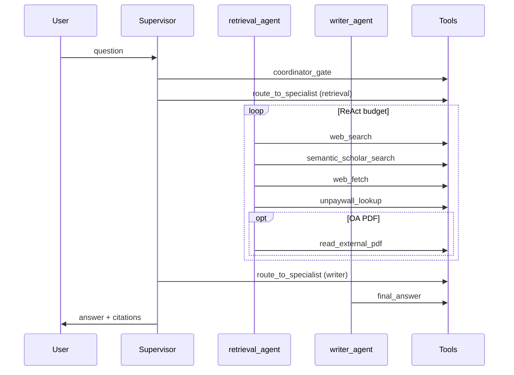

# Анализ agent runtime по CV hot-topics (controlled re-baseline, 2026-05-17)

**Doc status:** `active`  
**Date:** 2026-05-18  
**Checked on:** 2026-05-18  
**Owner:** agent runtime / external research  
**Scope:** смысловой разбор прогонов `external_web_hot_topics_cv_audit.py` после Phase 4–6; не заменяет implementation review по инструментам.  
**Read hint:** читать после [smolagents-prompt-patterns-for-agent-runtime-2026-05-17.md](./smolagents-prompt-patterns-for-agent-runtime-2026-05-17.md); артефакты — в `eval/results/external-web-hot-topics-cv-rebaseline-*.md`.

## Executive Summary

Controlled re-baseline (`--timeout 600`, workspace `ws-pilot-od`, stable live-check API) показал:

| Lane | Passed (verdict) | Gates | Главный сигнал |
|---|---:|---|---|
| Conservative (`ExternalResearchProtocol`) | 6/10 | `all_ok=true` | 4× Phoenix mismatch; 7/10 `budget_exhausted_with_partial` |
| Toolcalling experiment | **8/10** | `all_ok=true` | 2× Phoenix mismatch; меньше `read_external_pdf` (6 vs 8) |

**По существу:** runtime уже **умеет** проходить внешний research-контур (web + scholar + final_answer на 10/10), но трассировка **не оптимальна**: много повторных fetch/unpaywall, уход в corpus-tools на web-запросах, давление бюджета до writer. Multi-agent supervisor **оправдан** для terminal discipline и merge, но для «чистого веб-обзора» добавляет лишние hop'ы. Простой single-agent ReAct **не хуже по качеству ответа**, если в нём тот же toolcalling-протокол и жёсткий shortlist — это отдельная гипотеза, которую стоит A/B-нуть на том же matrix.

Рекомендация на ближайший квартал: **не** делать default-on experiment без повторного чистого baseline; **да** — сократить дубли в retrieval-loop, починить Phoenix span, расширить матрицу тестов за пределы «только web».

---

## 1. Методология и артефакты

### 1.1. Что сравнивали

- **Матрица:** 10 hot-topics CV-вопросов (русский текст, явный web + Semantic Scholar + PDF).
- **Контур:** `http://127.0.0.1:18787`, `docker-compose.live-check.yml`, без `uvicorn --reload`.
- **Таймаут клиента:** 600s (ранний прогон 300s давал 5× `ReadTimeout` на conservative — это confound, не «плохой протокол»).
- **Две prompt-lane:**
  - conservative — `## ExternalResearchProtocol`;
  - experiment — `SCIENCE_GRAPHRAG_AGENT_EXTERNAL_RESEARCH_TOOLCALLING_EXPERIMENT_ENABLED=1` → `## ToolcallingExternalResearchProtocol`.

### 1.2. Где лежат результаты (доступно из analysis-дока smolagents)

| Артефакт | Назначение |
|---|---|
| [`external-web-hot-topics-cv-rebaseline-baseline.md`](../../eval/results/external-web-hot-topics-cv-rebaseline-baseline.md) | conservative, канон для gates |
| [`external-web-hot-topics-cv-rebaseline-experiment.md`](../../eval/results/external-web-hot-topics-cv-rebaseline-experiment.md) | toolcalling lane |
| [`external-web-hot-topics-cv-live-latest.md`](../../eval/results/external-web-hot-topics-cv-live-latest.md) | alias → conservative re-baseline |
| [`phase6-toolcalling-experiment-decision-2026-05-17.md`](./phase6-toolcalling-experiment-decision-2026-05-17.md) | decision memo |

Три поверхности вердикта на кейс: **runtime** (ответ пользователю), **tool_trace** (каталог инструментов), **Phoenix** (spans). Они **независимы** — кейс может быть runtime-ok и phoenix-fail одновременно.

---

## 2. Типовой порядок вызовов (что делает агент)

На всех успешных external-кейсах наблюдается **один и тот же каркас** LangGraph supervisor (не single-agent default из `agent-runtime-overview-ru.md`):

### 2.1. Обязательные стадии

1. **`coordinator_gate`** — политика/allowlist, старт координации.
2. **`route_to_specialist` ×2** — сначала retrieval, потом writer (два явных hop'а в tool trace).
3. **Retrieval ReAct** — внешние инструменты; `final_answer` на этом этапе **не** вызывается (по протоколу).
4. **Writer** — единственный терминальный `final_answer` с citations.

### 2.2. Частые паттерны внутри retrieval

| Паттерн | Примеры кейсов | Оценка |
|---|---|---|
| `web_search` → `semantic_scholar_search` → `web_fetch` → `unpaywall` → `read_external_pdf` | sam3, video_diffusion, synthetic_data | **Норма** для протокола |
| Многократные `web_search` + `web_fetch` + `unpaywall` без новых DOI | open_vocabulary (18 tools), medical_foundation (25 tools) | **Избыточно** — похоже на retry без dedup |
| Corpus-tools на web-вопросе | gaussian_splatting: `find_works`, `idea_search`, `paper_profile`; document_vlm: `idea_search`, `find_works` | **Scope creep** — смешение workspace и open web |
| `corpus_explore` subagent | multimodal (baseline), video_diffusion / vla / efficient_edge (experiment) | **Уместно** только если вопрос про корпус; на чистом web — лишнее |
| `arxiv_search` / `arxiv_fetch` | gaussian_splatting, document_vlm | **Ок** для preprint-тем; увеличивает длину trace |

### 2.3. Terminal reasons (re-baseline baseline)

| `terminal_reason` | Доля (10 кейсов) | Смысл |
|---|---:|---|
| `budget_exhausted_with_partial` | 7 | Бюджет ReAct/supervisor исчерпан, но salvage/validation приняли partial answer |
| `final_answer_ok` | 2 | Полный терминальный ответ без budget stress |
| `partial_final_answer` | 1 | Явный partial path (corpus_explore + thin evidence) |

**Вывод:** система **чаще заканчивает «частично, но честно»**, чем generic fallback. Это успех Phase 2–4; узкое место — **бюджет и длина retrieval-loop**, не отсутствие `final_answer`.

---

## 3. Оптимальны ли трейсы?

### 3.1. Что хорошо

- **Покрытие протокола:** на re-baseline 10/10 имеют `web_search`, `web_fetch`, `semantic_scholar`, `final_answer`.
- **Нет generic fallback с evidence** (`generic_fallback_with_evidence_cases == 0`).
- **Validation:** `final_answer_validation` на всех завершённых кейсах; статусы `ok` / `partial_answer_ok`.
- **Experiment lane:** меньше «пустых» Phoenix-fail при том же runtime-качестве (8/10 passed vs 6/10).

### 3.2. Проблемные места

| Симптом | Частота | Вероятная причина | Слой |
|---|---|---|---|
| `phoenix_missing_final_answer_span` при наличии `final_answer` в tool trace | 4 baseline / 2 experiment | Экспорт span не совпадает с tool catalog name | Observability |
| Длинные цепочки fetch/unpaywall | Несколько кейсов | LLM retry + нет жёсткого «не повторяй тот же URL» в runtime | Prompt + отсутствие dedup guard в code |
| Corpus tools на external-only вопросе | gaussian_splatting, document_vlm | Broad retrieval shortlist / слабый route feature | Routing / tool_search |
| `budget_exhausted_with_partial` | 7/10 baseline | Много tool hops до writer; supervisor overhead | Budget policy |
| Experiment: `read_external_pdf` 6/10 vs baseline 8/10 | −2 PDF | Toolcalling lane агрессивнее в web_fetch, реже доходит до PDF | Prompt trade-off |
| `official_web_lookup` **не** встречается в trace | 0/10 | Вопросы не product-shaped (YOLO/Ultralytics); shortlist не поднимает tool | Intent routing |
| `openalex_works_search` **не** встречается | 0/10 | Модель предпочитает Crossref + Scholar; OpenAlex не вынужден протоколом | Tool choice |
| Один кейс experiment (`gaussian_splatting`) — salvage-текст, 0 citations | 1/10 | Budget + failed corpus path; writer получил partial merge | Orchestration edge case |

### 3.3. «Странное» поведение и объяснения

1. **Двойной `route_to_specialist` в trace** — ожидаемо для supervisor v1/v3: это не баг, а цена разделения retrieval и writer. Для latency-sensitive external lane можно гипотезировать «single specialist pass» (см. §6).

2. **`unpaywall_lookup` пять раз подряд (medical_foundation, baseline)** — модель пытается «пробить» OA по нескольким DOI из scholar/Crossref без успешного fetch. Объяснение: **metadata-only deadlock** — нет code-level stop после N неуспешных unpaywall.

3. **open_vocabulary: 18 tool calls, verdict ok, terminal `budget_exhausted_with_partial`** — ответ пользователю приемлем, но trace тяжёлый. Объяснение: протокол разрешает повторные web циклы; budget cutoff срабатывает поздно.

4. **Phoenix fail при runtime pass** — пользователь видит нормальный ответ, оператор видит fail в матрице. Объяснение: **рассинхрон observability**, не качество ответа.

5. **Experiment sam3: много web_fetch, нет PDF, ответ про SSL/timeouts** — честное ограничение в тексте; toolcalling лучше фиксирует failed fetch в ответе. Это **желательное** поведение trust model.

---

## 4. Насколько хороша текущая архитектура?

### 4.1. Сильные стороны (после Phase 1–6)

| Слой | Оценка | Комментарий |
|---|---|---|
| Prompt protocol cards | **Высокая** | Именованные блоки, terminal/failure contracts |
| Supervisor + writer terminal | **Высокая** | `final_answer` только у writer; validation/salvage |
| Typed merge / ManagedReportProtocol | **Средне-высокая** | Phase 4 закрыт; corpus_explore редко на web-only |
| External tools (native HTTP) | **Средне-высокая** | Crossref/arXiv/Unpaywall/S2/PDF работают в матрице |
| Observability split | **Средняя** | Три вердикта полезны; Phoenix gap портит gate UX |
| Budget / latency | **Средняя** | 50–210s на кейс; 7/10 partial-by-budget |

Архитектура **зрелая для operator lane**, но **не минимальна**: это осознанный trade-off «надёжность и аудит > короткий trace».

### 4.2. Соответствие целевому `langgraph_supervisor_v3`

См. [agent-runtime-overview-ru.md](../architecture/agent-runtime-overview-ru.md): целевой контур — v3 lifecycle, typed merge, sidechain. CV-прогоны **используют supervisor-паттерн** (coordinator + specialists), что согласуется с продуктовой траекторией. Single-agent `langgraph_research_v1` в этой матрице **не тестировался** — сравнение ниже теоретическое + как гипотеза.

---

## 5. Multi-agent supervisor vs простой single-agent ReAct

| Критерий | `langgraph_supervisor_v*` (текущий CV path) | `langgraph_research_v1` (single ReAct) |
|---|---|---|
| Длина trace | Длиннее (gate + 2× route + writer) | Короче |
| Terminal discipline | Writer-only `final_answer` — **проще гарантировать** | Риск «текст без tool» выше |
| Merge / citations | `specialist_results_v3`, enrichment | Всё в одном state |
| Subagents (CV, claim, plan) | Естественно в том же графе | Смешение ролей в одном prompt |
| External web hot-topics | Работает, но дорого по budget | **Гипотеза:** при том же ToolcallingProtocol может быть ≈ по качеству, лучше по latency |
| Observability | Лучше (legs, terminal_reason) | Проще, но меньше granularity |
| Сложность сопровождения | Выше | Ниже |

**Практический вывод:**

- Для **продукта в целом** (corpus + graph + external + writer) **supervisor v3 остаётся правильным default**.
- Для **узкого класса запросов** («только open web + scholar + PDF») имеет смысл гипотеза **route → single external ReAct** (или retrieval-only subgraph без отдельного writer hop, если synthesis встроена в последний tool hop через writer subnode внутри одного subgraph).
- **Experiment toolcalling** улучшил pass/Phoenix не потому что «другой граф», а потому что **ужесточил loop-discipline** в retrieval — это можно перенести в conservative card или в code guardrails.

**Что лучше «последняя версия»?**  
«Последняя» = supervisor + phases 1–6 **лучше для production governance**. «Проще ReAct» **может быть лучше по cost/latency** на external-only, если подтвердить A/B с тем же matrix и метриками — **обязательная гипотеза** (§6.1).

---

## 6. Гипотезы, которые стоит проверить

### 6.1. Архитектурные (высокий приоритет)

| ID | Гипотеза | Как проверить | Критерий успеха |
|---|---|---|---|
| H1 | **External-fast path:** web-only вопросы → один ReAct subgraph (без двойного route), writer inline | A/B matrix 20 кейсов; сравнить p50 latency, gates, pass rate | gates ≥ experiment; latency −20% |
| H2 | **Deterministic macro-step** после `web_search`: code планирует 1–3 fetch URL, LLM не выбирает повторно | Prototype planner node + matrix | −30% duplicate fetch в trace |
| H3 | **Phoenix span fix** для `final_answer` | Patch export + 10 кейсов | phoenix_ok ≥ 9/10 при неизменном runtime |
| H4 | **Unpaywall/fetch dedup** (same DOI/URL hash) | Guard в tool pipeline + unit tests | нет >2 unpaywall на один DOI в trace |
| H5 | **Merge toolcalling rules в default** ExternalResearchProtocol (без отдельного flag) | Re-baseline conservative | conservative ≥ experiment на pass/Phoenix |

### 6.2. Продуктовые / trust

| ID | Гипотеза | Проверка |
|---|---|---|
| H6 | **official_web_lookup first** для product/version вопросов | Новые 5 кейсов YOLO/Ultralytics |
| H7 | **Enforcement** `final_answer_validation` после стабильного gates | Flag on + regression matrix |
| H8 | **Early writer handoff** при «достаточно evidence» (route planner) | Снизить `budget_exhausted_with_partial` с 7/10 до ≤3/10 |

### 6.3. Из openclaude (что перенять)

OpenClaude — **другой продукт** (CLI coding agent), но полезны **паттерны**, не перенос runtime целиком:

| Паттерн OpenClaude | Что у нас | Рекомендация |
|---|---|---|
| [Hook Chains](https://github.com/Gitlawb/openclaude/blob/main/docs/hook-chains.md) — recovery на `PostToolUseFailure` | Нет declarative retry mesh | **Взять идею:** на `web_fetch` fail → один controlled retry / alternate URL policy; depth limit + cooldown |
| `doctor:runtime` / `doctor:report` | `config-check`, live smokes | Единый **`science-graphrag agent-doctor`** JSON: API, keys, Phoenix, tool flags |
| Provider profiles (`dev:fast` / `dev:code`) | Settings overlay | Operator presets для external lane (timeout, max rounds) |
| Conservative tool loop discipline | Phase 6 experiment card | Уже частично внедрено; усилить **code** anti-duplicate |
| Local/Ollama routing | Не цель SciGraph prod | Только для dev cost control |

**Не брать:** monolithic CLI loop как замену LangGraph; file/bash tools mesh; MCP-as-default research hub (у нас ADR 030 native-first).

### 6.4. Альтернативные архитектуры (низкий/средний приоритет, но проверить)

1. **Planner → fixed tool DAG** (не LLM выбирает каждый шаг) для 3–5 external templates.  
2. **Parallel fork:** web_fetch ∥ semantic_scholar (fork legs) → merge — для latency.  
3. **MCP lane** только для источников без native tool (PubMed, bioRxiv) — не в hot path.  
4. **Human-in-the-loop PDF** («Ask before reading») — снизить wasted `read_external_pdf`.

---

## 7. Статус инструментов из external-research workplan

Источник: [external-research-tools-workplan-2026-05-15.md](./external-research-tools-workplan-2026-05-15.md), [implementation review](./external-research-tools-implementation-review-2026-05-15.md), CV traces.

### 7.1. Native tools — сводка

| Tool | В workplan | В CV re-baseline | Статус |
|---|---|---|---|
| `web_search` (Crossref) | Phase 0 | 10/10 | **Работает** |
| `web_fetch` | Phase 0 | 10/10 | **Работает** |
| `arxiv_search` / `arxiv_fetch` | Phase 0 | 2–3 кейса | **Работает** (по intent) |
| `unpaywall_lookup` | Phase 0 | часто, иногда избыточно | **Работает** |
| `semantic_scholar_search` / `_paper` | Phase 5A | 10/10 search; paper реже | **Работает** |
| `read_external_pdf` | Phase 3–4 PDF | 8 baseline / 6 experiment | **Работает**, regression на experiment lane |
| `openalex_works_search` | Phase 5A | 0/10 в trace | **Включён, но не выбран LLM** — нужны intent-кейсы |
| `doi_resolver` | metadata bridge | не в external trace | **Ок**; отдельный gating |
| `official_web_lookup` | product web | 0/10 | **Не проверен** этой матрицей |
| MCP (`call_mcp_tool`, …) | optional | 0/10 | **Не в scope** CV matrix; closeout отдельно |

### 7.2. Что в workplan ещё не закрыто или красное

- **PDF lane в closeout** historically: `read_external_pdf` not in bound surface на части контуров — на re-baseline PDF в основном **есть**, но проверять после смены settings/flags.
- **Live smoke «по кнопке»** в UI — deferred в workplan Phase 1.
- **Semantic Scholar citation graph tools** — not implemented (backlog).
- **PubMed / bioRxiv native** — not implemented.

**Итог:** ядро workplan Phase 0 + 5A **работает** на живой матрице. Не работает / не покрыто матрицей: **product official lookup**, **OpenAlex как выбираемый путь**, **MCP**, **расширенный PDF governance UI**.

---

## 8. Расширенная тест-матрица (кроме 10 web-hot-topics)

Текущие 10 кейсов — **один кластер intent** (RU, external scholarly, явный checklist). Ниже — предложения для `eval/fixtures/agent/external_research/` или отдельных live suites.

### 8.1. По intent (обязательно добавить)

| Suite | Пример запроса | Что ловим |
|---|---|---|
| **Corpus-only** | «Найди в workspace работы про graph neural networks, без интернета» | Нет web tools; find_works / quote |
| **Corpus + compare** | «Сравни два work_id из корпуса по методу» | graph + profile, без web |
| **Product official** | «Что нового в YOLO11 по официальным источникам?» | `official_web_lookup` + fetch |
| **DOI-first** | «По DOI 10.… дай OA ссылку и цитату» | unpaywall + resolver, без лишнего search |
| **arXiv-only** | «arXiv:2401.xxxxx — метаданные и abstract» | arxiv_fetch, без Crossref loop |
| **Negative claim** | «Докажи, что релиза SAM 3 не было» | negative claim guard, limitations |
| **Metadata-only trap** | Вопрос, где full text недоступен | limitations в ответе, не overclaim |
| **English mirror** | Same as hot-topic #2 in EN | язык ответа + protocol |
| **Budget stress** | Очень широкий обзор (20+ papers) | terminal_reason, partial, no hang |
| **Clarify / no tools** | «Что ты умеешь?» | coordinator, no spurious web |

### 8.2. По слоям (регрессия)

| Suite | Фокус |
|---|---|
| **Phoenix-alignment** | 10 кейсов с post-run span assert |
| **Enforcement off/on** | `final_answer_validation` enforcement |
| **Settings overlay** | external sources off, PDF off, S2 off |
| **MCP smoke** | 3 кейса через MCP adapter (не в default CI) |

### 8.3. Сложные «сквозные» сценарии

1. **Workspace paper → DOI → Unpaywall → PDF read → quote in answer** (полный evidence ladder).  
2. **Web claim → claim_verification subagent → writer** (fork + ManagedReportProtocol).  
3. **Research plan → corpus_explore + web → writer** (multi subagent).  
4. **Conflicting sources** (web vs corpus) — conflict block в merge.

---

## 9. Что делать дальше (приоритизированный roadmap)

### Сейчас (1–2 недели)

1. **Зафиксировать canonical evidence** — использовать только `external-web-hot-topics-cv-rebaseline-*` + `--timeout 600` в acceptance (уже в docs).  
2. **Phoenix `final_answer` span** — закрыть 4+2 mismatch (H3).  
3. **Fetch/unpaywall dedup guard** (H4) — быстрый code win на длину trace.  
4. **Не включать experiment default-on** до H5 или merge protocol в conservative.

### Следующий срез (2–4 недели)

5. **Расширить матрицу** §8.1 (минимум corpus-only + product official + negative claim).  
6. **A/B H1** external-fast single subgraph vs supervisor на 20 кейсах.  
7. **OpenAlex + official_web** intent routing — отдельные кейсы и shortlist rules.

### Стратегически

8. Если H1/H5 подтверждают experiment discipline без supervisor overhead — **упростить hot path**, сохранив supervisor для mixed/corpus/graph.  
9. Borrow **hook-style recovery** из OpenClaude только для fetch/PDF failures (ограниченная глубина).  
10. Рассмотреть **enforcement** validation после 2 зелёных re-baseline подряд.

---

## 10. Связанные документы

| Документ | Связь |
|---|---|
| [smolagents-prompt-patterns-for-agent-runtime-2026-05-17.md](./smolagents-prompt-patterns-for-agent-runtime-2026-05-17.md) | Phase 0–6 roadmap, gates, ссылки на артефакты |
| [phase6-toolcalling-experiment-decision-2026-05-17.md](./phase6-toolcalling-experiment-decision-2026-05-17.md) | A/B decision, flag |
| [external-research-tools-workplan-2026-05-15.md](./external-research-tools-workplan-2026-05-15.md) | инструменты и фазы |
| [external-research-tools-implementation-review-2026-05-15.md](./external-research-tools-implementation-review-2026-05-15.md) | статус реализации |
| [agent-runtime-overview-ru.md](../architecture/agent-runtime-overview-ru.md) | режимы runtime |
| [external_research_runtime_acceptance.md](../agent/external_research_runtime_acceptance.md) | operator gates |

---

## 11. Краткие ответы на вопросы ревью

| Вопрос | Ответ |
|---|---|
| Что и в каком порядке вызывал агент? | §2: coordinator → retrieval (web/scholar/fetch/unpaywall/pdf) → writer → final_answer |
| Трейсы оптимальны? | **Частично.** Протокол соблюдается, но есть дубли и scope creep (§3) |
| Проблемные места? | Phoenix gap, budget partial, duplicate fetch, corpus tools на web-only (§3.2) |
| Странное поведение? | §3.3 — объяснения через budget, metadata deadlock, routing |
| Насколько хороша архитектура? | **Production-viable** для governed multi-specialist; не минимальна (§4) |
| ReAct vs последняя версия? | Supervisor лучше для продукта; single ReAct — гипотеза для external-only (§5) |
| Что улучшить? | §9 |
| Другие архитектуры / гипотезы? | §6 |
| Что из openclaude? | §6.3 — hook chains, doctor, presets; не весь CLI |
| Все ли tools из workplan работают? | Ядро да; official/OpenAlex/MCP — частично или не в матрице (§7) |
| Какие ещё тесты? | §8 |
