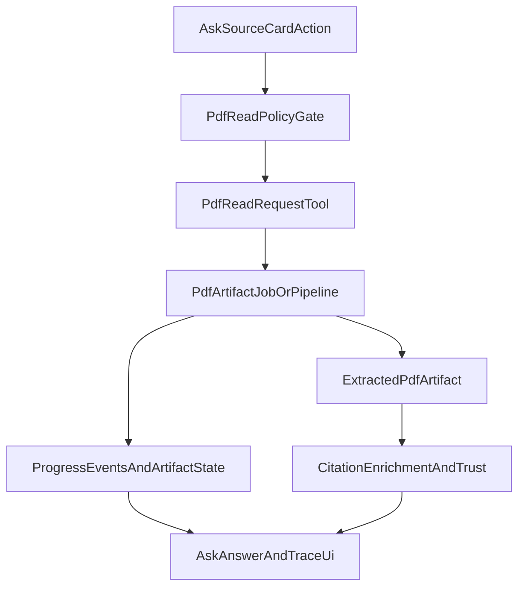

# External Research Tools Workplan

**Doc status:** `active`

**Read hint:** scoped workplan for external research tools; pair with implementation review below.

Date: 2026-05-15

Companion docs:

- Architecture decision: `docs/adr/030-external-research-tools-architecture.md`
- Implementation review/status: `docs/analysis/external-research-tools-implementation-review-2026-05-15.md`
- Runtime acceptance index: `docs/agent/external_research_runtime_acceptance.md`
- Landscape scan (archived stub): `docs/analysis/sci-tools.md`
- Backlog anchor: `docs/backlog/refactor-backend.md` → `[PARTIAL] External research: Semantic Scholar tools` (Phase 5A core shipped; references/citations deferred) and `[PARTIAL] Durable PDF read artifacts` (Redis JSON + stable `artifact_id`; DB/blob audit deferred). Phase 3 **Remaining / Closeout** below tracks optional smoke + doc alignment.

## Goal

Make external scholarly tools useful in chat without turning the product into a pile of switches:

- stable default tools work without user configuration;
- external calls are clear, bounded, and explainable;
- source provenance and evidence quality are visible;
- PDF/full-text work is explicit, cached, and recoverable;
- operator settings and API keys are manageable from one clean settings panel.

## Non-Goals

- Do not build a full MCP research hub in the native path.
- Do not make PDF extraction a thin extension of `arxiv_fetch`.
- Do not expose every backend `Settings` field directly in the UI.
- Do not add duplicate OpenAlex-by-DOI tools; `doi_resolver` owns DOI metadata resolution.

## Workstreams

Keep future PRs in three independent workstreams:

1. **Metadata/Search** — Crossref/arXiv/Unpaywall stabilization, OpenAlex search, Semantic Scholar search.
2. **Full Text** — PDF download/read/extract, artifact lifecycle, section evidence.
3. **Tools UX / Operations** — settings panel, source diagnostics, outbound policy, provenance labels.

## Phase 0 — Stabilize Current Tools

Purpose: make the already-implemented external tools observable and safe before adding more APIs.

### Scope

- `web_search`
- `web_fetch`
- `arxiv_search`
- `arxiv_fetch`
- `unpaywall_lookup`
- `doi_resolver` (as separately gated metadata bridge)

### Backend

- Add optional live smoke checks for:
  - Crossref `web_search`
  - arXiv search/fetch
  - Unpaywall lookup on a known DOI
- Add source diagnostics payload for Settings snapshot:
  - `enabled`
  - `available`
  - `configured`
  - `requires_key`
  - `status`
  - `last_test`
  - `last_error`
- Normalize failure reason vocabulary for external tools:
  - `source_unreachable`
  - `rate_limited`
  - `host_not_allowed`
  - `redirect_blocked`
  - `metadata_only_fallback`

### Frontend

- Rename composer tooltip/copy from “web search” to **external sources**.
- Keep one compact external-sources button in composer.
- Show source diagnostics in detailed trace/settings, not as extra composer controls.

### Tests

- Mock-backed tests for failure reason mapping.
- Regression: external disabled denies external research tools.
- Optional live lane, not default CI.

### Acceptance

- Current unit tests remain green.
- `unpaywall_lookup` and Crossref have at least one documented live smoke result or explicit “not live-validated” status.
- UI copy no longer implies generic Google-like search.

## Phase 1 — Agent Tools Settings Panel

Purpose: turn the existing `agent_tools` section from a placeholder/operator slice into a usable control surface.

### Status (2026-05-15): **shipped (core)**

**Done**

- **Backend:** allowlisted PATCH for `external_research_default_enabled`, `external_research_sources`, `pdf_reading_mode`, `agent_unpaywall_oa_tool_enabled`, `agent_supervisor_max_rounds`, unified `agent_external_http_timeout_seconds`, `agent_external_max_calls_per_turn`, `agent_external_max_source_cards`; merge via runtime overlay; Settings snapshot exposes `effective`, `sources` (tier/status/chips vocabulary), `integrations`, `credentials` (mailto status), `status` meta; schema bump and tests for PATCH / overlay / policy.
- **Agent runtime:** default external research when per-request flag is unset; tool registration respects source toggles + Unpaywall gate; external HTTP clients honor operator timeout from Settings.
- **Frontend:** dedicated `AgentToolsSettingsPanel` — research controls + inline source diagnostics, PDF mode select, read-only MCP summary, mailto/credentials line, advanced limits in accordion, dirty/save wiring and Vitest coverage; layout pass for density (header save, two-column research + diagnostics on wide viewports).
- **Tests:** API PATCH + snapshot contract tests; panel rendering / save / localized credentials status.

**Deferred (explicitly not in this slice)**

- **Credentials card:** per-source **Test** / live-smoke trigger buttons (workplan bullet below still open; diagnostics rows may show `last_test` / `last_error` when populated by future hooks or manual updates).
- **Integrations card:** operator editing of MCP adapter URL / denylist in UI (snapshot remains read-only summary; policy stays env / restart path until a later phase).

### Backend

Extend `runtime_settings.json.agent_tools` and `UpdateAgentToolsSettingsRequest` gradually with allowlisted fields:

- `external_research_default_enabled`
- `external_research_sources`
- `pdf_reading_mode`
- `agent_unpaywall_oa_tool_enabled`
- selected limits:
  - external request timeout
  - max external calls per turn
  - max source cards
  - future PDF bytes/pages/timeouts

Keep secret values out of runtime overrides. Add dedicated secret-store keys only when needed:

- `agent_tools.semantic_scholar_api_key`
- `agent_tools.ncbi_api_key`
- MCP credentials via MCP auth/server layer, not a generic global key.

### Frontend

Implement `AgentToolsSettingsPanel` under Settings:

- **Research sources** card:
  - External scholarly sources main switch.
  - Crossref, arXiv, Unpaywall rows with status chips.
  - OpenAlex row (operator toggle; shipped); Semantic Scholar row (beta; Phase 5A search/paper shipped).
- **Full-text / PDF** card:
  - `PDF reading in chat`: `Off` / `Ask before reading` / `Auto for safe OA/arXiv PDFs`.
  - Advanced limits collapsed.
- **Integrations** card:
  - MCP tools off by default.
  - MCP adapter URL / denylist in advanced.
- **Credentials & diagnostics** card:
  - contact email / polite-pool mailto status.
  - per-source test buttons.
  - last tested / last error.

### UX Rules

- Ordinary user controls: external sources default, PDF reading mode, beta source toggles.
- Admin/operator controls: keys, MCP, limits, outbound policy, source availability defaults.
- Do not expose arXiv vs Crossref as ordinary per-turn toggles.

### Tests

- API PATCH validation for new allowlisted fields.
- Settings snapshot includes source status rows.
- Frontend tests for card rendering and dirty/save behavior.

### Acceptance

- `agent_tools` Settings section is no longer placeholder-only. **Met.**
- Users can understand which sources are on, stable, beta, planned, or need configuration. **Met** via snapshot rows + chips (planned sources shown as not available).
- No secrets are returned to the UI. **Met.**

Remaining acceptance-adjacent UX (optional test buttons, MCP edit surface) is listed under **Deferred** above.

## Phase 2 — Trust Model and Failure UX

Purpose: make answers honest about what evidence they used.

### Status (2026-05-15): **shipped (core)**

**Done**

- **Backend:** `evidence_trust` provenance/quality/mode + normalized fallback reasons; `citation_enrichment` hydrates trust on citations/web_sources; attaches `web_fetch`, `unpaywall_lookup` failures and `doi_resolver` OpenAlex/Crossref lineage for DOI-only citations; writer suffix directives in `subagent_output_contract`.
- **Frontend:** citation trust badges (incl. OpenAlex metadata + evidence quality in detailed mode), localized fallback text, localized tool trace errors when `t` is passed, optional `evidence_summary` line on the answer panel.
- **Tests:** unit coverage for trust helpers, enrichment, and UI helpers.

**Deferred / follow-up**

- Full e2e assertion that the LLM never over-claims full text (remains eval / live lane).
- Broader “attach tool failure → citation” beyond `web_fetch` / `unpaywall_lookup` patterns.

### Backend

- Add/derive evidence quality labels:
  - `strong`
  - `medium`
  - `weak`
  - `variable`
- Add source/provenance labels:
  - `Workspace full text`
  - `Workspace metadata`
  - `Extracted PDF text`
  - `arXiv abstract`
  - `Crossref metadata`
  - `OpenAlex metadata`
  - `Unpaywall OA link`
  - `Web page summary`
  - `MCP external source`
- Ensure writer instructions distinguish metadata-only from full-text evidence.

### Frontend

- Show compact badges on source/citation cards:
  - `full text`
  - `abstract`
  - `metadata only`
  - `external`
  - `PDF read`
- Show fallback reason near the source card when a tool fails.

### Tests

- Metadata-only answer does not claim full-text reading.
- PDF unavailable produces clear fallback.
- Source labels match payload type.
- Writer prefers strong evidence over weak metadata.

### Acceptance

- User can tell whether an answer is based on full text, abstract, metadata, or a web summary.
- Tool failures degrade the answer instead of becoming blanket refusals.

## Phase 3 — OpenAlex Works Search

Purpose: add broad literature discovery without duplicating `doi_resolver`.

### Status (2026-05-15): **shipped (core)**

**Done**

- **Backend:** native `openalex_works_search` (bounded query + optional publication year filter + `max_results`), `source_family="openalex"`, shared `external_research_user_agent`, `web_sources` + `items` + `evidence_origin: "external_web"`; registered via `build_external_research_tools`; governed by per-request external denylist (`EXTERNAL_RESEARCH_TOOL_NAMES`) and operator toggle `external_research_source_openalex_enabled` (persisted under `external_research_sources.openalex`).
- **Routing:** manifest row + `product_step_code_for_tool` → `searching_literature`.
- **Settings snapshot:** OpenAlex row is **available/stable** when enabled; diagnostics table unchanged contract.
- **Frontend:** Agent Tools panel includes OpenAlex in operator source toggles + i18n.
- **Tests:** mock HTTP success/failure, registry includes tool when enabled, manifest/registry sync, denylist ordering.

**Code anchors (core shipped)**

- Tool implementation: `science_graphrag/agent/tools/external/openalex_works_search_tools.py`
- Registration: `science_graphrag/agent/tools/external/__init__.py`
- Per-turn denylist (user external-research toggle): `science_graphrag/agent/request_turn_policy.py` (`EXTERNAL_RESEARCH_TOOL_NAMES`)
- Manifest + product step: `science_graphrag/agent/tool_manifest.py`, `science_graphrag/api/agent_v2_modules/stream_phase_product_steps.py` → `searching_literature`
- Settings snapshot row: `science_graphrag/settings/snapshot_agent_tools.py`
- Operator UI: `ui/src/pages/SettingsPage/AgentToolsSettingsPanel.jsx` (+ i18n under `ui/src/i18n/messages/*/partSettings.js`)
- Tests: `tests/agent/test_openalex_works_search_tools.py` (plus registry/policy/manifest tests as listed above)

### Remaining / Closeout (operator + docs; not part of “core shipped”)

1. **OpenAlex live smoke (optional, non-default CI)**  
   `scripts/live_check/openalex_smoke.py` added (bounded query, structured success/failure contract). Does not run in default unit CI. 2026-05-16 operator run in current contour: `http_status=200`, `results=1` (green).

2. **Backlog / doc alignment**  
   `docs/backlog/refactor-backend.md` external-research card tracks **Semantic Scholar** only; OpenAlex search is treated as delivered.

3. **Diagnostics `status` semantics**  
   Today `snapshot_agent_tools` reports OpenAlex as `ok` when enabled, while Unpaywall can show `needs_live_smoke`. **Decision to take in closeout PR:** either (a) align OpenAlex with `needs_live_smoke` until a recorded live probe updates `source_diagnostics.openalex`, or (b) keep `ok` but document that “ok” means unit-contract + operator trust, not live-validated. `last_test` / `last_error` remain empty until per-source **Test** hooks land (Phase 1 deferred).

### Not in Phase 3 closeout (defer explicitly)

- OpenAlex **open-access-only** filter in the tool args (future enhancement).
- Dedicated **shortlist / intent markers** for OpenAlex (current routing relies on general external intent + manifest; add markers only if product metrics show under-use).
- Any **PDF / full-text** work — Phase 4 only.

### Delivered scope checklist (reference)

- Native tool `openalex_works_search` is present with `source_family: "openalex"` and shared `external_research_user_agent`.
- Bounded filters are implemented (`query`, publication-year bounds, `max_results`); OA-only filter is intentionally deferred.
- Citation-compatible payload is returned (`items`, `web_sources`, `evidence_origin: "external_web"`, `row_count`).
- Manifest row + product step mapping are wired; per-turn denylist includes OpenAlex when external research is disabled.
- Mock HTTP tests, manifest/registry sync tests, and denylist policy tests are in place.
- Functional acceptance is met: OpenAlex discovery is available, while DOI resolution remains owned by `doi_resolver`.

## Phase 4 — PDF Read / Extract Pipeline

Purpose: enable full-text reading from external PDFs **only** via an explicit, bounded pipeline — no hidden download inside `arxiv_fetch` or `web_fetch` (ADR 030).

### Product contract (Stage 1)

- **Explicit user/agent action:** “read PDF” / “extract text” is a first-class action on **source cards** in Ask (`ui/src/components/work/ask/answer/AskSourceList.jsx`), not a new composer control.
- **`pdf_reading_mode`** (already in Settings + snapshot + `AgentToolsSettingsPanel`) gates automation:
  - `off` — no auto pipeline; manual actions only if product allows.
  - `ask` — default for local research: confirm before download/extract.
  - `auto_safe_oa` — auto only for **trusted** flows (e.g. arXiv PDF URL, Unpaywall `oa_pdf_url` with host policy); never arbitrary publisher URLs without confirmation.
- **`pdf_reading_mode` does not replace** operator outbound limits (timeouts, max calls, future max PDF reads) — it only controls *when* the agent may start the pipeline without a user click.

### Data flow (reference)

### Stage 2 — Backend PDF pipeline core

- **New layer** (separate from Atom metadata tools): download → validate → hash → store binary → parse → store extracted text/sections; chat-scoped artifact lifecycle distinct from corpus ingest (use ingest patterns as **reference** only: `science_graphrag/storage/object_keys.py`, `science_graphrag/ingestion/document_orchestrator.py`).
- **Reuse safety transport patterns** from `science_graphrag/agent/tools/web_research_tools.py` (SSRF, private hosts, redirect host checks, byte caps) — PDF URL policy may be **stricter** or use a **PDF-specific allowlist** (arXiv/Unpaywall OA vs generic HTTPS).
- **Suggested surfaces:**
  - `pdf_read_request` (or combined `read_external_pdf`) — validates URL, mode, budgets, returns `artifact_id` / job id;
  - `extract_pdf_text` — optional second step if split improves cancellation; or one tool with internal phases.
- **Pipeline must implement:** content-hash cache/reuse, parser timeout, page/byte limits, cancellation, artifact metadata (`source_url`, `content_sha256`, `status`, `parser`, `pages`, `created_at`, `source_tool`), delete/GC path.
- **Sync vs async (architecture fork):** if extraction exceeds normal LangGraph tool latency, prefer **async-first**: background job + progress SSE + pollable artifact state, rather than blocking a single `tool_result`. Document chosen path in implementation review when implemented.

### Stage 3 — Agent policy / manifest / routing

- Register PDF tool name(s) next to external research assembly (`science_graphrag/agent/tools/external/__init__.py` or sibling module); **decide** whether PDF tools are in `EXTERNAL_RESEARCH_TOOL_NAMES` (`science_graphrag/agent/request_turn_policy.py`) or gated separately (e.g. own denylist + `max_pdf_reads_per_turn`).
- **Manifest:** `science_graphrag/agent/tool_manifest.py` — `source_family` / tool entry for trace + taxonomy.
- **Product steps:** `science_graphrag/api/agent_v2_modules/stream_phase_product_steps.py` + wiring in `science_graphrag/api/agent_v2_modules/stream_phase_tool_events.py`; satisfy `tests/test_product_step_tool_coverage.py`.
- **Budgets (cross-cutting):** add or document `max PDF reads per turn` and max external wall-clock for PDF branch in addition to `agent_external_max_calls_per_turn` / `agent_external_http_timeout_seconds` (`science_graphrag/config_mixins/agent_runtime_fields.py`).

### Stage 4 — Evidence / citation integration

- Extracted text must flow as **evidence**, not raw chat dump: `science_graphrag/agent/evidence_trust.py` (`extracted_pdf_text`, `pdf_read`, fallbacks `pdf_unavailable`, `pdf_too_large`, `pdf_parse_failed`), `science_graphrag/agent/citation_enrichment.py`, writer rules `science_graphrag/agent/subagent_output_contract.py`, system prompt `science_graphrag/agent/prompts/research_chat_system.py`.
- **Acceptance:** citations show provenance for extracted PDF; failures attach localized fallback near the source; writer cannot claim full-text quotes without extraction artifact linkage.

### Stage 5 — API / SSE / progress model

- Progress is a **backend contract**, not only UI: extend tool stream and/or artifact job events (`science_graphrag/api/agent_v2_modules/stream_phase_tool_events.py`, `stream_phase_product_steps.py`).
- **Suggested product-step / phase vocabulary:** `downloading_pdf`, `extracting_pdf_text`, `detecting_pdf_sections`, `pdf_artifact_ready`, `pdf_artifact_failed` (exact codes to align with i18n and trace UX when implemented).
- Long runs: heartbeat / cancellation per `.cursor/rules/long-running-ops.mdc` and existing subagent heartbeat settings in `agent_runtime_fields`.

### Stage 6 — Settings / diagnostics

- Promote `pdf_reading_mode` from “future placeholder” to Phase 4 dependency; extend **allowlisted** PATCH + overlay + snapshot for PDF limits: max bytes, max pages, parser timeout, cache TTL (`science_graphrag/api/settings_models.py`, `science_graphrag/settings/runtime_overlay.py`, `science_graphrag/settings/service.py`, `science_graphrag/settings/snapshot_agent_tools.py`, `science_graphrag/settings/schema.py`).
- Operator diagnostics: last extraction error, cache hit/reuse, safe-OA eligibility, blocked host reason (can reuse `source_diagnostics` pattern when hooks exist).

### Stage 7 — Ask UI / trace UX

- **Source cards:** actions “Read PDF” / “Extract text” / “Open source” in `AskSourceList.jsx` (and small extracted helpers if file grows); respect `pdf_reading_mode` and run-active state.
- **Trace / errors:** `ui/src/components/work/agent/AgentToolTrace.jsx`, `ui/src/components/work/agent/toolTraceError.js`; normalize any new payload fields in `ui/src/services/research/queryModel.js`.
- **Constraints:** no PDF buttons in composer; compact progress **artifact** card in answer area; detailed chat mode may show pipeline substeps, simple mode shows outcome + trust badges (`ui/src/components/work/ask/answer/citationTrust.js`).

### Stage 8 — Tests and live validation

- **Unit / contract:** mock HTTP download, size limit reject, hash reuse skip re-download, artifact delete, parser timeout; policy denylist when external research off; manifest/product-step coverage mirrors `tests/agent/test_request_turn_policy.py`, `tests/test_product_step_tool_coverage.py`.
- **Trust / citations:** extend `tests/test_evidence_trust.py`, `tests/agent/test_citation_enrichment.py` for PDF success/failure hydration.
- **Frontend:** Vitest for source actions + disabled states + progress copy (`AskSourceList` / panel tests).
- **Live (non-default CI):** after contour smoke (`AGENT_LIVE_BASE`, workspace per runbooks): one arXiv PDF happy path, one Unpaywall OA PDF path, one blocked/too-large fallback; optional OpenAlex HTTP smoke from Phase 3 closeout in same operator lane.

### Settings (defaults — unchanged intent)

- `PDF reading in chat`: `Off` / `Ask before reading` / `Auto for safe OA/arXiv PDFs`
- Default: local research workspace → `Ask before reading`; privacy-sensitive deployment → `Off`.

### Acceptance (Phase 4)

**Status (2026-05-15):** Core backend+UI path shipped — typed `pdf_read_request`, `execute_pdf_read` orchestrator, bounded LRU+TTL cache, SSE prefetch steps, denylist/`pdf_reading_mode` alignment, citation hydration on PDF failures, variable evidence quality, Ask UI token+i18n.

**Status (2026-05-16) — Phase 4 closeout slice:** stable `artifact_id` on PDF tool outcomes; optional **Redis-backed** durable JSON cache (`agent_pdf_read_durable_cache_enabled` + `REDIS_URL` wiring) for cold-start reuse of excerpt metadata keyed by URL hash + budget fingerprint; operator credential line for durable-cache availability. Full DB/object-store artifact rows remain deferred (backlog `[PARTIAL] Durable PDF read artifacts`).

- Explicit PDF read produces visible progress + persisted artifact + answer grounded in extracted evidence with correct trust labels.
- Agent never silently claims full-text reading when extraction did not run or failed.

## Phase 5 — Semantic Scholar

Purpose: add citation-aware discovery once current sources and trust model are stable.

**Status (2026-05-16) — Phase 5A shipped:** `semantic_scholar_search` and `semantic_scholar_paper` are registered behind external-research toggles, manifest + product-step mapping (`semantic_scholar_search` → `searching_literature`; `semantic_scholar_paper` → `paper_metadata`), bounded payloads, mock HTTP tests. **Optional** API key (`SCIENCE_GRAPHRAG_SEMANTIC_SCHOLAR_API_KEY` / secret store) improves rate limits — snapshot/UI treat as **beta + optional**, not hard-required. Operator-only HTTP smoke: `scripts/live_check/semantic_scholar_smoke.py` (search + paper lookup). Snapshot keeps `needs_live_smoke` until operator documents a green smoke run. `semantic_scholar_references` / `semantic_scholar_citations` remain explicitly **out of scope** until bounded graph UX exists.

**Phase 5 closeout (quality, no graph tools):** API-key header unit test, transport-failure vocabulary test, extended smoke for paper lookup; doc sync in implementation review.

**Operator acceptance runbook:** use `docs/agent/semantic_scholar_runtime_acceptance.md` → **Operator acceptance checklist** for exact commands and expected outputs (unit contract, registry, live smoke, failure contract).

**Latest live lane note (2026-05-16):** Semantic Scholar smoke in current contour returned `403 Forbidden`; treat as non-green evidence and keep `needs_live_smoke` until a successful operator run is recorded.

### Backend

- Add first:
  - `semantic_scholar_search`
  - `semantic_scholar_paper`
- Add later:
  - `semantic_scholar_references`
  - `semantic_scholar_citations`
- Add optional API key support for higher limits.
- Keep payloads bounded; avoid dumping citation graph by default.

### Frontend / Settings

- Mark source as beta until live-tested.
- Show optional API key status.
- Add diagnostics/test button.

### Tests

- Mock HTTP for search/paper.
- Optional key vs no-key behavior.
- Rate-limit/failure fallback.

### Acceptance

- Agent can fetch citation-aware paper cards.
- Citation graph tools do not overwhelm context or UI.

## Phase 6 — MCP and External Integrations

Purpose: keep MCP available for advanced integrations without making native tools depend on it.

**Status (2026-05-16) — Phase 6 shipped (operator slice):** expanded `agent_tools.integrations` snapshot (operator state, timeout, denylist preview, auth model); allowlisted PATCH for `agent_mcp_request_timeout_seconds` and `agent_mcp_server_denylist` (adapter base URL remains **env-only**); Integrations card with explicit states + MCP advanced fields; operator smoke `scripts/live_check/mcp_adapter_smoke.py`; isolation test that native external tools register independently of MCP gate failures. See `docs/agent/mcp_runtime_acceptance.md`.

**Operator acceptance runbook:** use `docs/agent/mcp_runtime_acceptance.md` → **Operator acceptance checklist** for exact commands and expected outputs (snapshot/overlay/isolation/UI/live smoke).

### Backend

- Keep MCP tools off by default.
- Add per-server diagnostics.
- Clarify auth flow:
  - OAuth / token managed by MCP layer;
  - no generic global “MCP API key”.
- Enforce server denylist and timeout.

### Frontend

- MCP lives under Settings → Agent Tools → Integrations.
- Show connected/unconfigured/denied states.
- Keep raw MCP details in advanced/detailed mode.

### Acceptance

- Native arXiv/Crossref/Unpaywall/OpenAlex flows work without MCP.
- MCP failures do not degrade native external tools.

## Cross-Cutting Policies

### Outbound Policy

Add explicit product semantics:

- `external_research_enabled`: scholarly external sources in chat.
- `outbound_http_policy`: deployment-level operator policy.
- Keep `web_research_enabled` as compatibility alias.

### Budgets

Define and test:

- max external calls per turn;
- max PDF reads per turn;
- max external wall time;
- max source cards by default;
- partial answer behavior.

### Privacy Copy

UI should clearly say:

- external sources send queries to third-party scholarly APIs;
- local mode stays within workspace/corpus;
- PDF read downloads and stores a local artifact.

## PR Slicing

Recommended order (dependencies first):

1. **PR 1: Naming + diagnostics groundwork** — historical; keep as archive reference if needed.
2. **PR 2: Agent Tools Settings Panel** — **done (2026-05-15)** core; follow-ups: per-source **Test** in UI, MCP URL/denylist editing.
3. **PR 3: Trust labels + failure UX** — **done (2026-05-15)** core; follow-ups: broader tool-failure→citation mapping, e2e eval.
4. **PR 4: OpenAlex search** — **done (2026-05-15)** core (`openalex_works_search` + toggle + tests).
5. **PR 4b — Phase 3 closeout (small, docs + optional smoke)**  
   - OpenAlex optional `scripts/live_check/` smoke + one-line runbook in implementation review.  
   - Confirm `snapshot_agent_tools` OpenAlex `status` policy (`ok` vs `needs_live_smoke`) and document operator meaning.  
   - Backlog already scoped to Semantic Scholar only.
6. **PR 5 — Phase 4A:** backend PDF artifact model + policy limits (Settings allowlist/snapshot + storage layout), no Ask UI yet.
7. **PR 6 — Phase 4B:** extraction tool or async job + SSE/progress vocabulary + cancellation/heartbeat.
8. **PR 7 — Phase 4C:** `evidence_trust` / `citation_enrichment` / writer contract wiring for extracted PDF + failure reasons.
9. **PR 8 — Phase 4D:** Ask source-card actions + compact progress card + i18n; trace/error surfaces.
10. **PR 9 — Phase 4E:** live validation matrix (arXiv PDF, Unpaywall OA, blocked/oversize) + implementation review / workplan status lines.

**Later waves (unchanged intent)**

- **PR 10+: Semantic Scholar Phase 5A** — **done (2026-05-16)** (`semantic_scholar_search`, `semantic_scholar_paper`, settings/snapshot beta + optional key, tests, `semantic_scholar_smoke.py`). **Deferred:** reference/citation graph tools (same backlog item, remain `[PARTIAL]`).

## Definition of Done

For each new external tool:

- manifest row with `source_family`;
- Settings/source status row;
- external toggle/denylist decision documented;
- product step mapping;
- mock HTTP tests;
- failure reason tests;
- optional live smoke if source supports it;
- source provenance label;
- docs updated in implementation review and this workplan.

