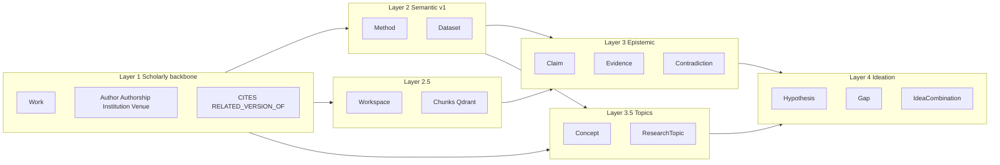
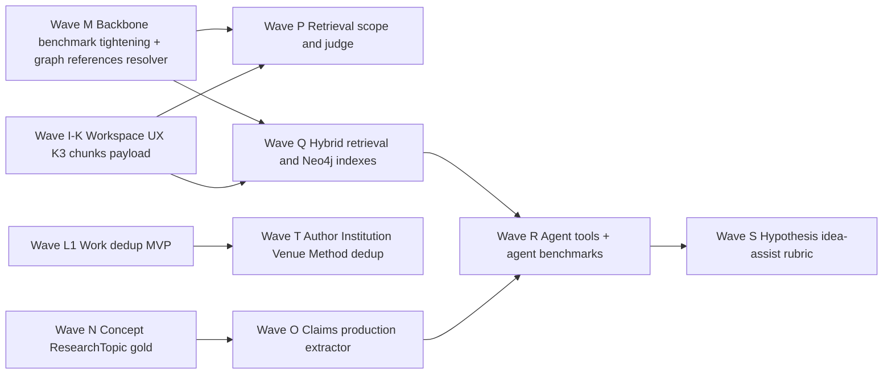
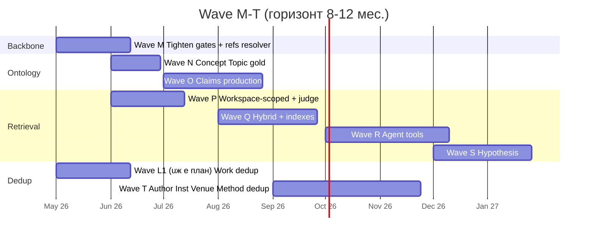

# Карта развития: онтология, индексы, бенчмарки и retrieval — Wave M–T

**Дата:** 2026-04-24  
**Статус:** living working doc; продолжение [workspace-experience-gap-2026-04-24.md](workspace-experience-gap-2026-04-24.md) (Wave I–L) и [runbooks/roadmap-next-waves.md](../runbooks/roadmap-next-waves.md) (Wave A–H).  
**Цель:** дать **единый план** на следующий горизонт — продуктовая разработка фич **в связке** с расширением и ужесточением бенчмарков, чтобы любое движение онтологии / retrieval / графа сопровождалось измеримой регрессионной защитой.

**Что внутри:**

1. Снимок текущего состояния бенчмарков (что зелёное, что слабый сигнал, где критическая дыра).
2. Полная инвентаризация онтологии: что уже извлекаем, что в спеке, что в gold, что в горизонте.
3. Что улучшить в продукте по результатам бенчмарков.
4. Бенчмарки на дедупликацию (отдельная семья, перекрытие с Wave L).
5. Лестница IR/GraphRAG бенчмарков — от текущего structural contract до agent-LLM с инструментами.
6. План индексов Neo4j и payloads/коллекций векторного хранилища (Qdrant сейчас, открытый вопрос Milvus).
7. Сводный план Wave M, N, O, P, Q, R, S, T с чеклистами и acceptance.

**Связанные документы:**

| Документ | Что в нём |
|----------|-----------|
| [../roadmap.md](../roadmap.md) | Phases 0–7 продукта |
| [../runbooks/roadmap-next-waves.md](../runbooks/roadmap-next-waves.md) | Wave A–H статус + I–L (workspace, dedup) — статус |
| [workspace-experience-gap-2026-04-24.md](workspace-experience-gap-2026-04-24.md) | Wave I–L (workspace UX, smart dedup MVP) — анализ |
| [../benchmarks/benchmark-program-overview.md](../benchmarks/benchmark-program-overview.md) | Обзор семейств, lanes, advisory vs core |
| [../benchmarks/benchmark-metrics-values.md](../benchmarks/benchmark-metrics-values.md) | Числа по последнему committed snapshot |
| [../benchmarks/benchmark-roadmap-ir-extraction.md](../benchmarks/benchmark-roadmap-ir-extraction.md) | IR-style четкие метрики |
| [../benchmarks/benchmark-roadmap-fuzzy-eval.md](../benchmarks/benchmark-roadmap-fuzzy-eval.md) | Fuzzy / LLM-judge |
| [../runbooks/benchmark-decision-gate.md](../runbooks/benchmark-decision-gate.md) | GO/CONDITIONAL-GO/NO-GO |
| [../runbooks/benchmark-ontology-expansion-policy.md](../runbooks/benchmark-ontology-expansion-policy.md) | Условие «ontology expansion benchmark-ready» |
| [../specs/ontology-v1-mvp.md](../specs/ontology-v1-mvp.md), [../adr/004-ontology-v1-scope.md](../adr/004-ontology-v1-scope.md) | Текущий scope онтологии в production |
| [../specs/ontology-claims-v1.md](../specs/ontology-claims-v1.md), [../benchmarks/ontology-claims-benchmark-v1.md](../benchmarks/ontology-claims-benchmark-v1.md) | Claims (Wave H1) |
| [../specs/work-dedup-queue-v1.md](../specs/work-dedup-queue-v1.md), [../specs/merge-catalog-wave-h.md](../specs/merge-catalog-wave-h.md) | Dedup backlog |
| [../adr/002-layer1-graph-model.md](../adr/002-layer1-graph-model.md) | Текущая Neo4j-модель |
| [../specs/extraction/](../specs/extraction/) | Backbone-контракты (metadata, authorships, references) |

---

## 1. Снимок: где мы по бенчмаркам сейчас

### 1.1 Status board

| Уровень | Family | Tier / scope | Состояние |
|---------|--------|--------------|-----------|
| **Reference** | YOLOv1: layer1 + graph + layer2 | merge_safe | Все три **`passed`**. Ср. F1 arXiv-ссылок 0.73; методы 1.00; датасеты 0.67. |
| **Core nightly** | Layer-1 `nightly_heavy` (30 кейсов) | `--threshold-profile reporting_skip_f1_gates` | **30/30 contract OK**, ср. F1 arXiv-ссылок = **0.96**, но `count_ok` = 12/30 (PDF→MD дрейф). `references_llm_failed_events` = 6 (диагностический). |
| **Core nightly** | Layer-2 `nightly_semantic` (31 кейс) | nightly | **31/31 ✓**, **ср. precision_methods = 0.76**, **ср. precision_datasets = 0.77**; recall (методы) у 12 кейсов **≤ 0.5** (1/2 или 1/3). |
| **Core graph** | `graph_v1` (yolov1, retinanet_focal_realpdf — без LLM) | merge_safe + nightly | OK, без расширенных кейсов (institutions, dedup violations). |
| Advisory | Retrieval contract (`merge_safe_contract_mock`, `strict_pilot_mock`, `live_corpus_mini`) | mock + 5 живых | Все **5+3+3 ✓**, но это **только структура trace** (hit_count ≥ 1, fingerprints где есть). Релевантность не оценивается. |
| Advisory | Claims (contract / mini / corpus_v2_mini / pilot, до 10 кейсов) | mini → pilot | Все **✓** при recall 1.00 / precision 1.00, **но через harness** (`extract_claims_anchor_harness`), не через production extractor. |
| Advisory | References resolution (refs_mini / contract / graph_stub) | 3+1 | **✓** при recall/precision 1.00, через **synthetic predictions** в gold; нет live resolver поверх Neo4j. |
| Advisory | Live retrieval `live_corpus_mini` | 5 кейсов на пилотном корпусе | Все ✓ по hit_count; reference text / ROUGE-L gold пока не везде заданы. |

### 1.2 Где сильный сигнал, а где «зелень — это контракт, а не качество»

**Сильный сигнал (доверяем числам как качеству):**

- Layer-1 — **identifier-style** метрики (`title`, авторы как множество, arXiv-id из текста). На 30 real-PDF — это **реальная** регрессионная защита backbone.
- Graph-level — `expected_cited_arxiv_ids` precision/recall + invariants по `CITES`, authorships, fingerprint-дублям.

**Слабый сигнал (зелёный, потому что низкий gate / harness):**

- **Layer-1 abstract / count_ok.** `abstract_rouge_l_vs_prefix` исторически давал «12 fail из шума», поэтому профиль `reporting_skip_f1_gates` его не режет; `require_reference_count_ok=false` снимает gate числа ссылок при PDF→MD дрейфе (детали — [nightly-failures-analysis-2026-04-07.md](../benchmarks/nightly-failures-analysis-2026-04-07.md)). Это **осознанное** решение, но значит: **точность extraction abstract / counts реально не измеряется**.
- **Layer-2 datasets recall.** На многих кейсах знаменатель = 1, и recall = 1/1 даёт 100 % — но это значит, что мы покрываем **один** ожидаемый датасет, а не всё семейство. На YOLOv2/YOLOv3/Mask R-CNN ожидание явно неполное.
- **Retrieval.** В core gate **отсутствует**; в advisory — только `hit_count ≥ 1` + опциональные `chunk_fingerprints`. **Нет** оценки релевантности ответа смыслу вопроса (есть зачаток `min_answer_rouge_l`, но в большинстве gold не задан).
- **Claims.** Run через **anchor harness** — фактически совпадение substring; production extractor (LLM) ещё не подключен.
- **References resolution.** Synthetic harness; нет lane против реального graph-resolver.

### 1.3 Декларативные дыры (ничего не измеряется)

| Что | Почему важно | Когда добавить |
|-----|--------------|----------------|
| **Workspace-scoped retrieval** | Wave I/K3 пробрасывает `workspace_id`; нет ни одного кейса «вопрос только в рамках workspace-X — ответ не утекает в external works» | Wave P |
| **Multi-hop graph queries** | API `/v1/works/{id}/graph` принимает `depth`, не реализован; нет benchmark по 2-hop neighborhoods | Wave Q |
| **Cross-paper synthesis** | North-star (сравнение методов, противоречия) — нет ни одного кейса даже с rubric | Wave R/S |
| **Tool-use агента** | Roadmap [agent-LLM + tools] не имеет benchmark family | Wave R |
| **Dedup precision/recall** | Wave L1 декларирует gold-set, но он ещё не написан; есть только Neo4j audit без эталонов | Wave L1 + Wave T |
| **Author / Institution merge gold** | merge-catalog-wave-h backlog; нет ни одной фикстуры | Wave T |
| **Hypothesis / idea-assist** | На горизонте, но даже rubric не зафиксирован | Wave S |

---

## 2. Инвентаризация онтологии (что извлекаем, что планируем)

Систематизируем все типы узлов и рёбер, **что должно жить в production**, по слоям из [roadmap §3](../roadmap.md). Колонка «Статус» делит на:

- **PROD** — извлекается и хранится в Neo4j прямо сейчас;
- **SPEC** — есть контракт extraction, нет production хранения / неполное;
- **GOLD** — есть бенчмарк-фикстуры, но extractor — harness;
- **PLAN** — только в планах (idea.md / ADR / backlog), без gold.

### 2.1 Layer 1 — Scholarly backbone

| Тип | Поля (ключевые) | Источник истины | Статус | Bench family | Целевой индекс |
|-----|-----------------|-----------------|--------|--------------|----------------|
| `Work` | `id`, `doi`, `arxiv_id`, `openalex_id`, `pmid`, `pmcid`, `title`, `normalized_title`, `abstract`, `publication_year`, `work_type`, `language`, `fingerprint`, `ingestion_confidence` | LLM extraction → OpenAlex | **PROD** | layer1, graph_v1 | unique(`doi`,`openalex_id`,`arxiv_id`); idx(`fingerprint`,`normalized_title`,`publication_year`); fulltext(`title`+`abstract`) |
| `Authorship` | `id`, `author_position`, `is_corresponding`, `equal_contribution`, `raw_affiliation`, `extraction_confidence` | LLM | **PROD** | layer1 (authors F1) | unique(`id`) |
| `Author` | `id` (deterministic by normalized_name), `full_name`, `normalized_name`, `orcid`, `openalex_author_id`, `alternative_names[]` | extraction → ORCID/OpenAlex (later) | **PROD** | layer1 + Wave T (author dedup) | unique(`id`,`orcid`); idx(`normalized_name`); fulltext(`full_name`+`alternative_names`) |
| `Institution` | `id`, `name`, `normalized_name`, `ror_id`, `country`, `city`, `institution_type` | extraction → ROR (опц.) | **PROD** (частично; ROR optional) | merge-catalog-wave-h + Wave T | unique(`id`,`ror_id`); idx(`normalized_name`,`country`); fulltext(`name`) |
| `Venue` | `id`, `name`, `normalized_name`, `issn`, `eissn`, `openalex_source_id`, `venue_type` | extraction → OpenAlex source | **PROD** (partial) | merge-catalog-wave-h | unique(`id`,`issn`); idx(`normalized_name`,`venue_type`); fulltext(`name`) |
| `CITES` (Work→Work) | (через DOI/arXiv/title+year fingerprint) | OpenAlex + heuristics | **PROD** | layer1 (arXiv F1), graph_v1 | rel idx |
| `HAS_AUTHORSHIP`, `OF_AUTHOR`, `AFFILIATED_WITH`, `PUBLISHED_IN` | — | — | **PROD** | layer1 + graph_v1 | rel idx |
| `RELATED_VERSION_OF` (Work→Work) | preprint↔journal | OpenAlex `ids` | **PROD** (partial) | graph_v1 (`min/max_related_version_edges`) | rel idx |

### 2.2 Layer 2 — Semantic (ontology v1)

| Тип | Поля | Источник | Статус | Bench | Индекс |
|-----|------|----------|--------|-------|--------|
| `Method` | `id`, `name`, `normalized_name`, `aliases[]`, `description_short`, `confidence` | LLM (semantic stage) | **PROD** | layer2 | unique(`id`); idx(`normalized_name`); fulltext(`name`+`aliases`) |
| `Dataset` | `id`, `name`, `normalized_name`, `aliases[]`, `confidence` | LLM | **PROD** | layer2 | unique(`id`); idx(`normalized_name`); fulltext(`name`+`aliases`) |
| `USES_METHOD` (Work→Method) | `confidence`, `evidence[]` (chunk_id, span) | LLM | **PROD** | layer2 (косвенно) | rel idx |
| `EVALUATED_ON` (Work→Dataset) | `confidence`, `evidence[]` | LLM | **PROD** | layer2 | rel idx |
| `TRAINED_OR_TESTED_ON` (Method→Dataset) | optional | LLM | **SPEC** ([extraction/semantic](../specs/extraction/semantic-method-dataset-v1.md)) | пусто | rel idx |

### 2.3 Layer 2.5 — Workspace + chunking

| Тип | Поля | Статус | Bench | Индекс / payload |
|-----|------|--------|-------|-------------------|
| `Workspace` | `id`, `name`, `description`, `created_at`, `updated_at` | **PROD** | — | unique(`id`); idx(`name`) |
| `CONTAINS` (Workspace→Work) | `attached_at` | **PROD** | — (Wave J добавит graph stats) | rel idx; Wave J назначит payload `workspace_membership = internal\|external` в graph endpoint |
| Qdrant chunk (no Neo4j node) | payload: `work_id`, `document_id`, `chunk_index`, `chunk_fingerprint`, `section_path`, `overlap_prev`, `overlap_next`, `start_offset`, `end_offset`, `text`, `embedding_model` | **PROD** | retrieval contract; чанки сами в graph_v1 не учитываются | (см. §6.2) |

### 2.4 Layer 3 — Epistemic / claims (Wave H1, Wave O)

| Тип | Поля | Статус | Bench | Индекс / payload |
|-----|------|--------|-------|-------------------|
| `Claim` | `id`, `normalized_text`, `claim_type` (`performance` \| `method` \| `comparison` \| `mechanism` \| `limitation`), `polarity`, `confidence` | **GOLD** (harness only); production stub `science_graphrag/ingestion/claims/stub.py` | claims (advisory) | unique(`id`); idx(`claim_type`,`polarity`); fulltext(`normalized_text`); vector(`text_embedding`) |
| `Evidence` | `id`, `chunk_fingerprint`, `quote`, `section_path` | **GOLD** | claims | unique(`id`); idx(`chunk_fingerprint`) |
| `SUPPORTED_BY` (Claim→Evidence) | `confidence` | **GOLD** | claims | rel idx |
| `ANCHORED_IN` (Evidence→Work / chunk) | — | **GOLD** | claims | rel idx |
| `CONTRADICTS` (Claim→Claim) | `evidence_pair_ids[]`, `detector` (`llm`/`structured`) | **PLAN** (Wave S) | — | rel idx |
| `SUPPORTS_CLAIM` / `REFUTES_CLAIM` (Work→Claim) | агрегаты | **PLAN** | — | rel idx |

### 2.5 Layer 3.5 — Concepts / topics (Wave N)

| Тип | Поля | Статус | Bench | Индекс |
|-----|------|--------|-------|--------|
| `Concept` | `id`, `name`, `normalized_name`, `aliases[]`, `domain` | **PLAN** (idea.md §2.2) | — (заводить вместе с фикстурами) | unique(`id`); fulltext(`name`+`aliases`); vector |
| `ResearchTopic` | `id`, `name`, `parent_topic_id?` | **PLAN** | — | unique(`id`); idx hierarchy |
| `MENTIONS_CONCEPT` (Work→Concept) | `confidence` | **PLAN** | — | rel idx |
| `OF_TOPIC` (Work→ResearchTopic) | `confidence` | **PLAN** | — | rel idx |

### 2.6 Layer 4 — Ideation (горизонт; rubric, не F1)

| Тип | Поля | Статус | Eval |
|-----|------|--------|------|
| `Hypothesis` | `id`, `text`, `motivating_claim_ids[]`, `assumption_ids[]`, `generated_by` (`user`\|`llm`) | **PLAN** | rubric + LLM-judge (advisory) |
| `Question` | `id`, `text`, `topic_id?`, `linked_workspace_id?` | **PLAN** | rubric |
| `Gap` | `id`, `description`, `supporting_negative_claim_ids[]` | **PLAN** | rubric |
| `IdeaCombination` | `id`, `method_ids[]`, `dataset_ids?[]`, `rationale_text` | **PLAN** | rubric |

### 2.7 Сводная таблица: статус и зависимости



**Правило для всей карты:** ни один тип ниже Layer 2 не попадает в production граф без `fixture + gold + metric` в том же или соседнем PR (см. [benchmark-ontology-expansion-policy.md](../runbooks/benchmark-ontology-expansion-policy.md)).

---

## 3. Что улучшить в продукте по результатам бенчмарков

### 3.1 Backbone (Layer-1) — закрыть «harness в gate»

**Сигнал:** при `reporting_skip_f1_gates` мы отключили `min_authorship_names_f1` / `min_sample_arxiv_f1` / `require_reference_count_ok` — но именно это чаще ломалось.

**Действие (Wave M):**

- Заменить `abstract_prefix` ↔ `full_abstract` сравнение на **token-Jaccard / containment** + порог `>= 0.7` containment (короткий prefix содержится в полном abstract); добавить metric `abstract_prefix_containment` рядом с `abstract_rouge_l_vs_prefix`.
- Включить `min_sample_arxiv_f1 >= 0.85` для merge_safe (на 30 nightly кейсах сейчас среднее **0.96**, gate безопасен).
- Восстановить `count_ok` как **range** check: `expected_count * 0.7 <= actual <= expected_count * 1.3`, не строгое равенство.

### 3.2 Semantic (Layer-2) — расширение recall

**Сигнал:** на ~12 nightly кейсах recall_methods = 1/2 или 1/3; precision_methods = 0.76 средний.

**Действие (Wave M, продолжение Wave H):**

- Audit `semantic_gold.json`: для multi-method работ (atss, cascade_rcnn, dn_detr, fast_rcnn, mask_rcnn) добавить ожидаемые **contribution-level** методы (как `BiFPN` в efficientdet); пометить `holdout` для подмножества.
- В extractor: добавить **canonical normalization** методов через alias словарь (BiFPN ≡ Bi-directional FPN); это поднимет precision без переобучения промпта.
- Включить `min_dataset_recall_ratio >= 0.6` как gate (сейчас почти всегда денонимтор=1, реальное расширение recall начнётся, когда мы расширим gold).

### 3.3 Retrieval — поднять с structural на содержательный

**Сигнал:** все retrieval-кейсы зелёные, но в core gate их **нет**, и `min_answer_rouge_l` задействован только в стадии scaffolding.

**Действие (Wave P):**

- На пилотном корпусе (`live_corpus_mini`) **зафиксировать `answer_reference_text`** для всех 5 вопросов; включить `min_answer_rouge_l = 0.18` (диапазон, не точное).
- Добавить **workspace-scoped fixtures** (3 вопроса × 2 workspace): scope correctness assert (`retrieval_trace.workspace_id` присутствует, citations все из workspace).
- Промоут retrieval из advisory → **CONDITIONAL core** при `live_corpus_mini` зелёном 14 ночей подряд.

### 3.4 Claims — переход от harness к production

**Сигнал:** `claims_pilot` 10/10 ✓, но через `extract_claims_anchor_harness` (substring match).

**Действие (Wave O):**

- Реализовать LLM-extractor (`science_graphrag/ingestion/claims/`); поведение под флагом `SCIENCE_GRAPHRAG_CLAIMS_EXTRACTION_ENABLED`.
- В benchmark CLI добавить `--extractor production`; запускать parallel lane (advisory) рядом с harness в nightly.
- Когда production lane даст ≥ 0.8 recall на `claims_pilot` без правки gold — promote по [benchmark-family-promotion-review.md](../runbooks/benchmark-family-promotion-review.md) до core.

### 3.5 References resolution — graph-backed lane

**Сигнал:** 4/4 ✓, но через synthetic predictions; реальный resolver в Neo4j ещё не подключен.

**Действие (Wave M):**

- `--graph-stub-lane` в CLI уже есть; реализовать **live resolver** поверх Neo4j (по DOI / arXiv ID / `title_fingerprint`); включить как `--graph-resolver` lane в advisory.
- Через 7 ночей зелёного — promote до core (раздел в [benchmark-decision-gate.md §8](../runbooks/benchmark-decision-gate.md)).

### 3.6 Dedup — измерять, что чиним (Wave L1 prerequisite)

**Сигнал:** есть Neo4j-audit (`find_work_dedup_violations`), нет precision/recall на gold.

**Действие (часть Wave L1, продолжается в Wave T):**

- Завести `tests/fixtures/benchmarks/dedup/works_v1/`: 5–10 кластеров (preprint+journal, 2 написания, разные работы); gold — список «должны слиться» / «не должны».
- Метрики: cluster precision/recall (Rand index или pairwise F1).
- Целевой gate: `precision >= 0.9, recall >= 0.8`.

---

## 4. Дедупликация: бенчмарк-семьи и gold

Wave L анализа [workspace-experience-gap §6 Wave L](workspace-experience-gap-2026-04-24.md#wave-l--smart-dedup-llm--embeddings) описывает пайплайн (embedding + threshold + LLM judge + user-gated merge). Здесь — **бенчмарк-сторона**: какие фикстуры собираем, какие метрики, какие пороги.

### 4.1 Общая структура фикстур

```
tests/fixtures/benchmarks/dedup/
  works_v1/
    case_tiers.json
    <case_id>/
      gold.json          # см. схему
      records.json       # массив кандидатов на дедуп (input)
      README.md          # происхождение
  authors_v1/
    ...
  institutions_v1/
    ...
  methods_v1/
    ...
```

`gold.json` schema (универсальная для всех типов):

```json
{
  "schema_version": 1,
  "entity_type": "work | author | institution | venue | method | dataset | claim",
  "description": "Provenance and adjudication note",
  "expected_clusters": [
    { "cluster_id": "c1", "member_record_ids": ["r1", "r4", "r7"] }
  ],
  "expected_no_merge_pairs": [["r2", "r3"]],
  "min_pairwise_precision": 0.9,
  "min_pairwise_recall": 0.8,
  "max_llm_calls_per_record": 1
}
```

### 4.2 Per-entity scope

| Семья | Что собираем в gold | Embedding signature | Дополнительные сигналы | Тиры |
|-------|---------------------|---------------------|-------------------------|------|
| **`works_v1`** | preprint↔journal (5), 2 написания (3), разные DOI той же работы (2), false-positive «похожие методы / разные авторы» (2) | `title + first_author_normalized + abstract[:512]` | DOI exact / arXiv exact / fingerprint exact (rule lane) | `dedup_works_merge_contract`, `dedup_works_mini`, `dedup_works_pilot` |
| **`authors_v1`** | «J. Smith» vs «John Smith» (5), кит./яп. транслит. (5), ORCID overlap (3), false-positive «однофамильцы из разных доменов» (3) | `normalized_name + top_coauthors[5] + last_institution_id + last_country` | ORCID exact, OpenAlex author id | `dedup_authors_merge_contract`, `dedup_authors_mini` |
| **`institutions_v1`** | «MIT» vs «Massachusetts Institute of Technology» vs «MIT CSAIL» (3), ROR overlap (5), без ROR — fuzzy (3), false-positive (2) | `normalized_name + country + city + institution_type` | ROR exact, OpenAlex source | `dedup_institutions_mini`, `dedup_institutions_pilot` |
| **`venues_v1`** | ISSN overlap (5), preprint server vs journal proceedings (3), legacy названия (2) | `normalized_name + issn + venue_type` | ISSN exact | `dedup_venues_mini` |
| **`methods_v1`** | alias merge (`BiFPN` ≡ `Bi-directional FPN`), сокращения (`R-CNN` vs `Region-based CNN`) | `normalized_name + aliases + top_categories` | substring containment | `dedup_methods_mini` |
| **`datasets_v1`** | версии (`COCO 2014` vs `COCO 2017`), полное vs аббревиатура (`Pascal VOC` vs `VOC`) | то же | substring + hard rule «версия = разные сущности» | `dedup_datasets_mini` |
| **`claims_v1`** (Wave O+) | парафразы того же утверждения с разной evidence (3), близкие но разные claims (3) | `normalized_text` embedding + cited_evidence overlap | Jaccard по evidence work_ids | `dedup_claims_mini` |

### 4.3 Метрики

```python
# eval/dedup/metrics.py (новый раннер, Wave L1 / Wave T):
pairwise_precision = TP / (TP + FP)   # пары, которые мы слили правильно / все слитые пары
pairwise_recall    = TP / (TP + FN)   # все правильно слитые / все, которые должны были быть слиты
cluster_purity     = sum(max_class_in_cluster) / N   # доля доминирующего класса в кластере
adjusted_rand_index = sklearn.metrics.adjusted_rand_score
llm_calls_per_record = total_llm_calls / N_records
auto_merge_rate     = (sim >= high_threshold) / total_pairs   # сколько слили без LLM
```

`auto_merge_rate` — продуктовый KPI (чем выше, тем меньше ручной работы); `pairwise_precision` ≥ 0.9 — gate качества.

### 4.4 Промоушн в core

| Шаг | Условие | Документ |
|-----|---------|----------|
| Mini-pack зелёный | `pairwise_precision ≥ 0.9, recall ≥ 0.8` на frozen mini | benchmark-family-promotion-review |
| Pilot-pack зелёный 7 ночей | плюс расширенный pilot (20 кластеров) | то же |
| Перевод в core | обновить `aggregate_benchmark_metrics.py` + decision-gate | то же |

---

## 5. IR / GraphRAG бенчмарки: лестница зрелости

### 5.1 Уровни (от текущего к target)

| Уровень | Что мерим | Lane | Текущий статус |
|---------|-----------|------|----------------|
| **L0 — Structural contract** | `hit_count >= min`, наличие `retrieval_trace`, форма `citations[]` | `merge_safe_contract_mock` | **есть** ✓ |
| **L1 — Fingerprint anchoring** | каждый `required_chunk_fingerprint` есть в citations | `strict_pilot`, `live_corpus_mini` | **есть** (mock + 5 живых) |
| **L2 — Workspace scope correctness** | при `workspace_id` все citations принадлежат workspace; внешние не утекают | `live_workspace_scoped` | **отсутствует** (Wave P) |
| **L3 — Answer ROUGE-L** | `answer_reference_text` vs ответ модели, ROUGE-L F1 ≥ порога | `live_corpus_mini` (опц.) | scaffold; gold не заполнен |
| **L4 — Hybrid retrieval ablation** | precision/recall/MRR при vector vs vector+BM25 vs vector+BM25+graph traversal | `hybrid_ablation` | **отсутствует** (Wave Q) |
| **L5 — Multi-hop graph queries** | для вопросов «работы, которые цитируют X через 2 hops» — precision на работающем графе | `multihop_v1` | **отсутствует** (Wave Q) |
| **L6 — Claim → evidence retrieval** | для вопроса «какие утверждения работы Y подкрепляются evidence Z» — recall на claims | `claim_evidence_v1` | scaffold через `Claims` advisory; нет ретривала |
| **L7 — Multi-paper synthesis (LLM-judge)** | rubric: фактуальность, покрытие, отсутствие выдумок | `synthesis_judge_v1` | **отсутствует** (Wave R) |
| **L8 — Tool-use (agent) benchmarks** | tool-call correctness, budget, end-to-end answer | `agent_tools_v1` | **отсутствует** (Wave R) |
| **L9 — Hypothesis / idea-assist (rubric + LLM-judge)** | полезность, новизна, безопасность | `idea_assist_v1` | **отсутствует** (Wave S) |

### 5.2 L8 — Agent / tool-use benchmark семья

Вход: набор «сценарных» вопросов, требующих **многоступенчатого** retrieval. Например:

> «Какие методы object detection 2018–2020, использующие FPN, оценивались на COCO без аугментации? Дай 3 самых цитируемых.»

Это разлагается в tool-вызовы:

1. `entity_search(kind="method", q="FPN")` → `Method` ноды.
2. `cypher_query("MATCH (m:Method {name:'FPN'})<-[:USES_METHOD]-(w:Work)-[:EVALUATED_ON]->(d:Dataset {name:'COCO'}) WHERE w.publication_year >= 2018 AND w.publication_year <= 2020 RETURN w ORDER BY w.citation_count DESC LIMIT 3")`.
3. Опционально `idea_search("FPN methods on COCO 2018-2020", workspace_id=…)` — vector + fulltext по chunks/works/methods.
4. `final_answer(...)` с trace.

**Tools (контракт):**

| Tool | Назначение | Входы | Выходы | Резерв (timeout / cap) |
|------|-----------|-------|--------|-------------------------|
| `cypher_query` | произвольный Cypher (read-only) | `query: str`, `params: dict` | rows JSON, `row_count`, `truncated_at` | 5 секунд, max 200 строк, allowlist labels (`Work`/`Author`/...) |
| `entity_search` | поиск ноды по типу + текстовому запросу | `kind: str`, `q: str`, `limit?: int` | список `{id, label, score, snippet}` | Neo4j fulltext + vector (через `:Work.title_embedding` если есть) |
| `edge_search` | поиск рёбер вокруг ноды | `node_id`, `rel_types?: list`, `direction?: in|out|both`, `limit?` | список `{src, rel, tgt, props}` | cap 200 |
| `idea_search` | семантический + полнотекст поиск по `chunks` / `works` / `claims` (когда появятся) | `q: str`, `kinds: list`, `workspace_id?: str`, `top_k?: int` | список `{kind, id, score, work_id, snippet}` | vector top_k + fulltext rerank |
| `summarize_workspace` | LLM-summary scope corpus | `workspace_id`, `top_n_works?` | textual summary, `cited_work_ids[]` | 1 LLM call |
| `final_answer` | завершение | `answer: str`, `citations: list` | — | обязательный |

**Метрики L8 (`agent_tools_v1`):**

| Метрика | Формула | Gate |
|---------|---------|------|
| `tool_call_correctness` | TP_tool / (TP_tool + FP_tool) — выбрал правильный tool на каждом шаге vs gold-trace | ≥ 0.7 (advisory) |
| `tool_budget_ok` | bool: `total_calls <= max_calls_per_question` | true |
| `cypher_safety` | bool: каждый Cypher прошёл allowlist (read-only, известные labels) | 1.0 |
| `answer_grounded` | citations покрывают ≥ 1 work, появившийся в trace tools | ≥ 0.9 |
| `answer_judge_score` | LLM rubric: фактуальность 0..3 + покрытие 0..3 | средний ≥ 4.5 / 6 |
| `latency_p95` | p95 секунд от вопроса до final_answer | ≤ 30 s |

**Gold-trace формат:**

```json
{
  "question": "...",
  "expected_tool_sequence": [
    {"tool": "entity_search", "args_match": {"kind": "method", "q_contains": "FPN"}},
    {"tool": "cypher_query", "args_match": {"query_contains": "USES_METHOD"}, "row_count_min": 3},
    {"tool": "final_answer", "answer_contains_work_ids_min": 3}
  ],
  "expected_answer_topics": ["FPN", "COCO", "object detection"],
  "max_calls": 6
}
```

### 5.3 L7 — Synthesis (LLM-judge advisory)

Rubric (frozen prompt + версия judge-модели в `run_metadata`):

| Критерий | Шкала | Вес |
|----------|-------|-----|
| Фактуальность (нет «выдумок» ни DOI, ни цитат) | 0..3 | 1.0 |
| Покрытие источников (ответ ссылается на ≥ N citations из gold-минимума) | 0..3 | 0.7 |
| Отсутствие противоречий внутри ответа | 0..2 | 0.5 |
| Язык / связность (нативный английский / русский) | 0..2 | 0.3 |

`min_judge_score = 4.5 / 6` — advisory; не пускаем в core gate без 14 ночей стабильности и holdout (см. [fuzzy-eval roadmap](../benchmarks/benchmark-roadmap-fuzzy-eval.md)).

---

## 6. План индексов и payloads

### 6.1 Neo4j: текущее → целевое

**Уже есть** (см. `Neo4jGraphStore.ensure_schema`):

```
CREATE CONSTRAINT *_id_unique FOR (n:Work|Author|Authorship|Institution|Venue|Method|Dataset|Workspace) REQUIRE n.id IS UNIQUE
```

**Целевое (Wave Q добавит, поэтапно):**

| Тип | Cypher | Назначение |
|-----|--------|------------|
| Constraint (где нет) | `CREATE CONSTRAINT work_doi_unique FOR (w:Work) REQUIRE w.doi IS UNIQUE` (с фильтром null через property index) | предотвращает дубли DOI |
| Constraint | `CREATE CONSTRAINT work_arxiv_unique FOR (w:Work) REQUIRE w.arxiv_id IS UNIQUE` | то же для arXiv |
| Constraint | `CREATE CONSTRAINT institution_ror_unique FOR (i:Institution) REQUIRE i.ror_id IS UNIQUE` | ROR |
| Range index | `CREATE INDEX work_year FOR (w:Work) ON (w.publication_year)` | year-range фильтры (`/v1/works`) |
| Range index | `CREATE INDEX work_fingerprint FOR (w:Work) ON (w.fingerprint)` | dedup lookup |
| Range index | `CREATE INDEX work_normalized_title FOR (w:Work) ON (w.normalized_title)` | fuzzy lookup |
| Range index | `CREATE INDEX author_normalized_name FOR (a:Author) ON (a.normalized_name)` | dedup, fulltext fallback |
| Range index | `CREATE INDEX institution_normalized_name FOR (i:Institution) ON (i.normalized_name)` | dedup |
| Range index | `CREATE INDEX venue_issn FOR (v:Venue) ON (v.issn)` | dedup |
| Range index | `CREATE INDEX method_normalized FOR (m:Method) ON (m.normalized_name)` | alias merge |
| Range index | `CREATE INDEX dataset_normalized FOR (d:Dataset) ON (d.normalized_name)` | то же |
| Composite | `CREATE INDEX work_year_type FOR (w:Work) ON (w.publication_year, w.work_type)` | composite фильтры в `/v1/works` и `entity_search` |
| **Fulltext** | `CREATE FULLTEXT INDEX works_title_abstract FOR (n:Work) ON EACH [n.title, n.abstract]` | `entity_search(kind="work")` + `idea_search` |
| Fulltext | `CREATE FULLTEXT INDEX methods_text FOR (n:Method) ON EACH [n.name]` (+ aliases когда станут массивом строк-нод) | tool calls |
| Fulltext | `CREATE FULLTEXT INDEX datasets_text FOR (n:Dataset) ON EACH [n.name]` | то же |
| Fulltext | `CREATE FULLTEXT INDEX authors_text FOR (n:Author) ON EACH [n.full_name, n.normalized_name]` | author search |
| Fulltext | `CREATE FULLTEXT INDEX institutions_text FOR (n:Institution) ON EACH [n.name, n.normalized_name]` | institution search |
| Fulltext | `CREATE FULLTEXT INDEX claims_text FOR (n:Claim) ON EACH [n.normalized_text]` | Claims layer (Wave O) |
| **Vector index** (Neo4j 5.13+) | `CREATE VECTOR INDEX work_title_emb FOR (w:Work) ON w.title_embedding OPTIONS {indexConfig:{`vector.dimensions`:384, `vector.similarity_function`:'cosine'}}` | альтернатива Qdrant `works` коллекции для in-graph similarity (mini-ADR в Wave Q) |
| Vector | `CREATE VECTOR INDEX claim_emb FOR (c:Claim) ON c.text_embedding ...` | Wave O |
| Relationship index | `CREATE INDEX cites_year FOR ()-[r:CITES]-() ON (r.created_at)` | provenance / время добавления |

**GDS named graphs (Wave J → Wave Q):**

- `workspace_<id>_internal` — projection only `:Work` nodes ∈ workspace + `:CITES` edges; используется для community detection и multi-hop запросов tool-агента.
- `methods_dataset_bipartite` — projection `:Method`-`:TRAINED_OR_TESTED_ON`-`:Dataset` для рекомендаций.

### 6.2 Векторное хранилище (Qdrant / альтернатива Milvus)

**Решение по storage:** **остаёмся на Qdrant** в обозримом горизонте; см. mini-ADR в §6.3. Все коллекции ниже — Qdrant; payload-схема одинаково применима к Milvus, если решим мигрировать.

**Текущая коллекция `chunks` (есть):**

```jsonc
{
  "vector": [...384...],
  "payload": {
    "work_id": "uuid",
    "document_id": "uuid",
    "chunk_index": 12,
    "chunk_fingerprint": "sha256...",
    "section_path": "Methods > Architecture",
    "overlap_prev": 80,
    "overlap_next": 80,
    "start_offset": 18234,
    "end_offset": 19012,
    "text": "<= 8000 chars>",
    "embedding_model": "sentence-transformers/all-MiniLM-L6-v2"
  }
}
```

**Расширения `chunks` (Wave I/K3 → Wave Q):**

| Поле | Когда добавить | Назначение |
|------|----------------|------------|
| `workspace_ids: list[str]` | Wave K3 (есть в Wave-плане) | workspace-scope retrieval без list-filter |
| `chunk_kind: str` (`abstract` \| `body` \| `method` \| `result` \| `discussion` \| `references`) | Wave Q | hybrid retrieval rerank по kind |
| `language: str` | Wave Q | многоязычные корпуса |
| `cited_work_ids: list[str]` | Wave Q (после `extract_in_text_citations` стадии) | поиск «упоминается X в чанках которых работ» |
| `mentioned_method_ids`, `mentioned_dataset_ids` | Wave Q | tool `idea_search` filter by entity |

**Новые коллекции:**

| Коллекция | Vector source | Payload | Назначение | Когда |
|-----------|----------------|---------|------------|-------|
| `works` | embed(`title + abstract[:512] + first_author_normalized + str(year)`) | `work_id`, `title`, `year`, `doi`, `arxiv_id`, `first_author_normalized`, `embedding_kind="work_summary_v1"`, `workspace_ids[]` | Wave L1 work dedup; Wave Q tool `idea_search(kinds=['work'])`; Wave R agent поиск работ | Wave L1 |
| `authors` | embed(`normalized_name + ' | ' + ', '.join(top_coauthors[:5]) + ' | ' + last_institution_name + ' | ' + last_country`) | `author_id`, `normalized_name`, `top_coauthors`, `last_institution_id`, `country` | Wave L2 author dedup; tool `entity_search(kind='author')` | Wave L2 (часть Wave T) |
| `institutions` | embed(`normalized_name + ' | ' + country + ' | ' + city`) | `institution_id`, `normalized_name`, `ror_id`, `country` | Wave L3 / T institution dedup | Wave T |
| `venues` | embed(`normalized_name + ' | ' + venue_type`) | `venue_id`, `normalized_name`, `issn`, `venue_type` | Wave T venue dedup | Wave T |
| `methods` | embed(`normalized_name + ' | ' + ', '.join(aliases) + ' | ' + description_short[:200]`) | `method_id`, `normalized_name`, `aliases`, `top_categories` | Wave T method dedup; tool `entity_search(kind='method')` | Wave T |
| `datasets` | embed(`normalized_name + ' | ' + ', '.join(aliases)`) | `dataset_id`, `normalized_name`, `aliases` | Wave T | Wave T |
| `claims` | embed(`normalized_text`) | `claim_id`, `work_id`, `normalized_text`, `polarity`, `claim_type`, `supporting_evidence_ids[]`, `topics[]` | Wave O Claims production extractor; tool `idea_search(kinds=['claim'])` | Wave O |
| `ideas` (опционально) | embed(`text`) | `idea_id`, `workspace_id`, `text`, `motivating_claim_ids[]`, `generated_by` | Wave S idea-assist | Wave S |

**Принципы payload:**

1. Каждая запись несёт `embedding_model` и `embedding_kind` (signature формулы) — миграция на новую модель = backfill через CLI script (паттерн `BLOB_BACKFILL`).
2. Каждая non-chunk коллекция имеет **deterministic point id** = `uuid5(NAMESPACE_URL, f"{kind}:{entity_id}")` — повторный embed одной сущности обновляет, не плодит.
3. `workspace_ids` (multi-tenant) ставится **только** на `chunks` и `works` (workspace = членство по работам); `authors` / `methods` / `datasets` глобальны.

### 6.3 Mini-ADR: Qdrant сейчас, Milvus как option

**Контекст:** запрос пользователя упоминает Milvus; в коде сейчас `QdrantChunkStore`, `qdrant-client>=1.17`.

**Сравнение для нашего профиля:**

| Критерий | Qdrant | Milvus | Победитель |
|----------|--------|--------|------------|
| Управление коллекциями через REST/SDK | удобно (single-binary, low-config) | сложнее (etcd + минио) | **Qdrant** для команды 1–3 чел. |
| Payload фильтры (multi-tenant) | mature; нативные `must`/`should`/`must_not` | mature; expression syntax | паритет |
| Hybrid (vector + BM25) | sparse vectors + dense, рекомендации reranker — есть | есть, но новее | паритет (оба годны для Wave Q) |
| Memory footprint | ~1 ГБ для 100k chunks | ~3–4 ГБ (минимум) | **Qdrant** для dev |
| Масштаб > 10M points | ок (поддерживает sharding) | сильнее в распределённом | **Milvus** только если перерастём |
| GPU acceleration | partial | да | Milvus (но мы не CPU-bound) |
| Зрелость экосистемы Python | hugging face / langchain — оба | оба | паритет |

**Решение:** **остаёмся на Qdrant** до того момента, когда:

- общее число points (chunks + works + authors + methods + datasets + claims) превысит 10M, или
- p95 latency `idea_search` устойчиво > 500ms на dev compose.

Прямо сейчас (~150k chunks на пилотном корпусе) Qdrant с запасом. Любая миграция — отдельный ADR со снимками bench-метрик до/после.

---

## 7. План работ — Wave M, N, O, P, Q, R, S, T

### 7.1 Зависимости



Wave M и N можно вести параллельно; Wave P зависит от K3 (workspace tagging). Wave R — после Q (hybrid retrieval) и O (claims production), потому что агент опирается на индексы и на семантический + claims слой.

### 7.2 Wave M — Backbone benchmark tightening + references resolver

**Цель:** превратить «зелень при ослабленных gate» в **реальную регрессионную защиту backbone**, и поднять references resolution из synthetic harness в graph-backed lane.

**Backend / extraction:**

1. `eval/layer1/metrics.py`: новая метрика `abstract_prefix_containment` (token containment short→long), порог `>= 0.7` для merge_safe; добавить в `Layer1QualityThresholds` как `min_abstract_prefix_containment`.
2. Включить gates `min_sample_arxiv_f1 = 0.85`, `min_authorship_names_f1 = 0.7`, `count_ok` как range `[0.7, 1.3] * expected_count` — обновить `gold.json` для всех `nightly_heavy` кейсов (script-driven).
3. `eval/layer2/metrics.py`: новая агрегатная `min_dataset_recall_ratio = 0.6` в качестве gate; обновить gold по 5 кейсам с явно-пропущенными датасетами (audit list).
4. **Live references resolver:** в `eval/references_resolution/runner.py` добавить `--graph-resolver` lane, который читает `Work` ноды из Neo4j (по `doi` / `arxiv_id` / `title_fingerprint`) и формирует `predictions` без synthetic заглушки.
5. Promotion check: 7 ночей зелёного на `--graph-resolver` + `--mock-answer` lane → promote через [benchmark-family-promotion-review.md](../runbooks/benchmark-family-promotion-review.md).

**Чеклист Wave M:**

- [x] `abstract_prefix_containment` реализован и в gate; `min_sample_arxiv_f1` в profile `merge_safe` и `nightly_heavy`.
- [x] Скрипт `scripts/sync_layer1_thresholds.py` обновляет `gold.json` всех 30 кейсов; PR показывает diff и не ломает зелёное.
- [x] `min_dataset_recall_ratio = 0.6` в `eval/layer2/spec.py`; 5 кейсов в gold расширены (audit-list).
- [x] CLI `science-graphrag-references-resolution-benchmark … --resolver graph` на поднятом стеке; артефакт `eval/results/current-references-resolution-graph.json`.
- [x] Обновлён `aggregate_benchmark_metrics.py`: advisory блок «References resolution graph lane».
- [x] Документ [benchmark-decision-gate.md](../runbooks/benchmark-decision-gate.md) §8 / §8.2 описывает условие promotion.

**Acceptance:** `decision = GO` сохраняется при включённых ужесточениях; `references_resolution_graph` остаётся advisory до 7 зелёных ночей (`refs_mini`, `--resolver graph`) по promotion checklist.

---

### 7.3 Wave N — Ontology v1.5: Concept / ResearchTopic в gold (без production)

**Цель:** до того, как добавлять `Concept` / `ResearchTopic` в production, **сначала** иметь gold-фикстуры и метрику. Это отдельный gate Wave H (см. [ontology-wave-h-backlog.md](../specs/ontology-wave-h-backlog.md)).

**Backend / docs:**

1. ADR 013 «Concept / ResearchTopic ontology v1.5» — поля, anti-bloat, источники истины (LLM extraction → OpenAlex topics ID когда совпадёт). *(Номер 013: ADR 012 занят workspace graph projection.)*
2. Спека `docs/specs/extraction/semantic-concept-topic-v1.md` (по образцу `semantic-method-dataset-v1.md`).
3. `tests/fixtures/benchmarks/concept_topic/` — mini pack 5 кейсов: gold `expected_concepts`, `expected_topics` per work; harness extractor по `anchor_phrase` (как в claims).
4. CLI `science-graphrag-concept-topic-benchmark` (новый, по образцу `claims`).
5. Метрика `concept_recall`, `topic_recall`; advisory только.

**Чеклист Wave N:**

- [x] ADR 013 принят.
- [x] Спека extraction.
- [x] Mini pack 5 кейсов + `case_tiers.json` `concept_topic_mini`.
- [x] CLI + unit test.
- [x] `aggregate_benchmark_metrics.py` показывает advisory секцию.
- [x] **Concept/ResearchTopic в Neo4j НЕ добавляются** до Wave O (production extractor отдельно).

**Acceptance:** advisory benchmark зелёный; production граф не изменился.

---

### 7.4 Wave O — Claims production extractor + promotion

**Цель:** заменить anchor-harness в claims-семье на реальный LLM-extractor; включить ноды `Claim` / `Evidence` в production граф; promote из advisory в core.

**Backend:**

1. Реализовать `science_graphrag/ingestion/claims/extractor.py`: вход — chunks работы, выход — список `ClaimDraft` (text, polarity, claim_type, evidence_chunks). Под флагом `SCIENCE_GRAPHRAG_CLAIMS_EXTRACTION_ENABLED` (по умолчанию off).
2. `Neo4jGraphStore.upsert_claim_with_evidence` — `Claim`, `Evidence`, `SUPPORTED_BY`, `ANCHORED_IN`.
3. Qdrant collection `claims` с payload по §6.2.
4. CLI flag `science-graphrag-claims-benchmark --extractor production`; запускать parallel в nightly при `MAIN_LLM_API_KEY`.
5. Promotion: после 7 ночей `claims_pilot` recall ≥ 0.8 при production extractor — обновить `aggregate_benchmark_metrics.py` (claims в core), `decision_gate.md`.

**Frontend:**

1. На странице Reader (Workspace tab) — collapsible панель **Claims** с recall списком (`claim_text`, `evidence chunk preview`).
2. На странице Evidence — фильтр «only claims with evidence».
3. Контракт API: `GET /v1/works/{id}/claims` (новый эндпоинт).

**Чеклист Wave O:**

- [x] Extractor + флаг + storage метод.
- [x] Coll `claims` в Qdrant + миграция (создать только если нет).
- [x] CLI bench flag; benchmark зелёный recall ≥ 0.8 на pilot.
- [x] Production lane + артефакт `eval/results/current-claims-production-pilot.json`; **promoted to core** в `decision_gate` (см. runbook §8.1).
- [x] UI Reader показывает claims (под флагом видимости).
- [x] Aggregator + runbooks обновлены под core lane.

**Acceptance:** `decision` сохраняет `GO` после promotion; UI показывает извлечённые claims на 5 пилотных работах с осмысленным evidence.

---

### 7.5 Wave P — Workspace-scoped retrieval evaluation + LLM-judge advisory

**Цель:** перевести retrieval из «есть hit_count» в «ответ на вопрос корректен в рамках выбранного workspace».

**Backend:**

1. `tests/fixtures/benchmarks/retrieval/workspace_scoped/` — 6 кейсов (3 вопроса × 2 пилотных workspace); gold:
   ```json
   {
     "workspace_id": "ws-pilot-od",
     "question": "...",
     "expected_workspace_scope": true,
     "forbidden_work_ids": ["external-work-uuid-1"],
     "min_hit_count": 3,
     "answer_reference_text": "...",
     "min_answer_rouge_l": 0.18
   }
   ```
2. CLI `--mode workspace_scoped`; runner проверяет, что `retrieval_trace.workspace_id` совпадает и `citations[].work_id` ⊂ workspace членов.
3. `eval/retrieval/judge.py` (новый) — LLM-judge с frozen rubric (§5.3); advisory.
4. Артефакты `current-retrieval-workspace-scoped.json`, `current-retrieval-judge-pilot.json`.

**Frontend:** ничего нового.

**Чеклист Wave P:**

- [x] 6 workspace-scoped кейсов с gold (`tests/fixtures/benchmarks/retrieval/workspace_scoped/`).
- [x] Runner, metrics, `retrieval_trace.workspace_id` top-level, unit-тесты.
- [x] Judge runner + `judge_prompt_v1.md` (SHA в `run_metadata`) + CLI `science-graphrag-retrieval-judge-benchmark`.
- [x] Aggregator: `retrieval_family.workspace_scoped` + `judge_pilot` (advisory).
- [x] Ни один из них не двигает `decision` до отдельного решения (§8.3).
- [x] Документ promotion roadmap: [benchmark-decision-gate.md §8.3](../runbooks/benchmark-decision-gate.md), чеклист в [benchmark-family-promotion-review.md](../runbooks/benchmark-family-promotion-review.md).

**Acceptance:** workspace scope correctness benchmark = 6/6 (mock или live по политике); judge mean ≥ 4.5/6 на pilot 5 вопросов (`current-retrieval-judge-pilot.json`).

---

### 7.6 Wave Q — Hybrid retrieval + Neo4j indexes + новые Qdrant коллекции

**Цель:** дать tool-агенту (Wave R) надёжную инфраструктуру: индексы Neo4j (вкл. fulltext + vector), коллекция `works`, multi-hop graph endpoint, hybrid (vector+BM25+graph) retrieval.

**Backend:**

1. **Neo4j миграция:** `science_graphrag/storage/neo4j_migrations/002_indexes_and_fulltext.cypher` — добавить все индексы из §6.1; idempotent.
2. **Vector index Neo4j (опц.):** `Work.title_embedding` (vector index 5.13+); backfill через CLI `scripts/backfill_work_title_embeddings.py`. Эксперимент: ablation tool-агента «in-graph vector vs Qdrant `works` коллекция».
3. **Qdrant `works` коллекция** + indexer (вызывается в `ingestion/pipeline.py` после upsert работы).
4. **Hybrid retrieval:** в `science_graphrag/api/retrieval.py` добавить **дополнительный** path: `mode = "hybrid"` — параллельно query Qdrant `chunks` + Neo4j fulltext по `Work` + graph traversal по `:CITES` от citation hits; merge через RRF (Reciprocal Rank Fusion).
5. **Multi-hop graph endpoint:** `GET /v1/works/{id}/graph?depth=2` реализован (сейчас параметр игнорируется); кап `MAX_NEIGHBORS=300`; вернуть `node.distance` для UI palette.
6. Bench `tests/fixtures/benchmarks/retrieval/hybrid_ablation/` — 8 вопросов × {vector_only, hybrid, hybrid+graph}; метрика MRR / nDCG@5 на frozen relevance pool.

**Frontend:**

1. Toggle `Retrieval mode: vector | hybrid` в AskPanel (admin-visible).
2. На GraphPage — `depth: 1 | 2` selector (Wave J уже подготовил toolbar; здесь подключаем backend).

**Чеклист Wave Q:**

- [x] Migration `002_indexes_and_fulltext.cypher` применяется на dev compose без warnings.
- [x] `idea_search` MCP-стиль tool — заглушка возвращает empty (готовится к Wave R).
- [x] Qdrant `works` + индексер + backfill script.
- [x] `mode=hybrid` в `/v1/query` с тестом RRF (unit + smoke).
- [x] `depth=2` работает с cap; benchmark Multi-hop family (`tests/fixtures/benchmarks/retrieval/multihop_v1/`) + CLI реализованы; live precision gate фиксируется отдельным nightly артефактом.
- [x] Hybrid ablation benchmark зелёный (контракт-уровень); цифры опубликованы в advisory.

**Acceptance:** hybrid retrieval измеримо лучше pure-vector на mini ablation (MRR улучшение ≥ 0.05); UI mode toggle работает.

---

### 7.7 Wave R — Agent retrieval + tool-use benchmarks

**Цель:** научный assistant как tool-using агент; tool-use benchmarks как отдельная advisory family.

**Backend (architecture):**

1. ADR 016 «Agent tool registry для retrieval (read-only)».
2. `science_graphrag/agent/tools/` — 6 tools из §5.2 (cypher_query, entity_search, edge_search, idea_search, summarize_workspace, final_answer).
3. **Cypher safety:** parser + allowlist (`Work`/`Author`/...), запрет `WRITE` clauses через grammar check; cap `LIMIT 200`, timeout 5s.
4. Агент: smolagents `ToolCallingAgent` (по референсу [reference-extraction-llm-agent-tools.md](reference-extraction-llm-agent-tools.md)) — простой ReAct loop, model = `MAIN_LLM_*`.
5. API: `POST /v1/agent/query` — `{question, workspace_id?, max_tool_calls=8}` → `{answer, tool_trace[], citations[], duration_ms}`.
6. Bench `tests/fixtures/benchmarks/agent_tools_v1/` — 10 кейсов с `expected_tool_sequence` (см. §5.2); CLI `science-graphrag-agent-benchmark`.
7. Метрики из §5.2: `tool_call_correctness`, `tool_budget_ok`, `cypher_safety = 1.0`, `answer_grounded`, `answer_judge_score`, `latency_p95`.

**Frontend:**

1. На AskPage — toggle `Mode: vector | agent`. В agent режиме — collapsible **Tool trace** (timeline of calls).
2. На WorkspacePage summary — кнопка «Summarize this workspace» (вызывает `summarize_workspace` tool через агента).

**Чеклист Wave R:**

- [x] 6 tools реализованы; unit-тесты на каждом + safety тесты для cypher_query (отказ на WRITE / nonsense).
- [x] Agent endpoint + смок.
- [x] Bench mini зелёный (tool_call_correctness ≥ 0.7).
- [x] UI tool trace показывает каждый шаг (tool name, args summary, row count, latency).
- [x] Артефакт `current-agent-tools-mini.json` в advisory.
- [x] ADR 016 + спека `docs/specs/agent-tools-v1.md`.

**Acceptance:** на 10 mini кейсах — `tool_call_correctness ≥ 0.7`, `cypher_safety = 1.0`, `answer_judge_score ≥ 4.0/6` (advisory).

---

### 7.8 Wave S — Hypothesis / idea-assist (rubric advisory)

**Цель:** проверить, насколько реально помогаем с генерацией гипотез и поиском противоречий — даже если только rubric.

**Backend:**

1. `science_graphrag/agent/idea_workflow.py` — orchestrator: query graph через tools → extract claims (Wave O) → LLM генерирует 3 кандидата гипотез или находит противоречие (через `Claim.polarity` + `:CONTRADICTS`).
2. ADR 016 «Hypothesis / Contradiction слой как rubric-only advisory» — нет production graph до отдельного review.
3. `tests/fixtures/benchmarks/idea_assist_v1/` — 8 ground-truth «scenario cards»: workspace, набор работ, ожидаемая гипотеза (или ожидаемое противоречие). Rubric: новизна, поддержка evidence, отсутствие плагиата.
4. Judge runner + frozen prompt; advisory only.
5. UI: на WorkspacePage — `Generate hypotheses` button (admin-visible); показывает 3 кандидата + supporting claims/evidence.

**Чеклист Wave S:**

- [ ] ADR 016.
- [ ] Idea workflow + UI button.
- [ ] 8 mini кейсов + judge.
- [ ] Mean rubric score ≥ 4.0/6 на pilot.
- [ ] Документация рисков (LLM-выдумки, нужно user gate перед публикацией).

**Acceptance:** advisory benchmark зелёный; manual user-test показывает «3 из 5 гипотез — нетривиальные» на пилотном корпусе.

---

### 7.9 Wave T — Полная dedup pipeline (продолжение Wave L1)

**Цель:** закрыть L2 (Author), L3 (Institution), Venue, Method/Dataset dedup; auto-merge при высоком sim для трёх типов.

**Backend:**

1. ADR 016 «Author / Institution dedup pipeline» — расширение ADR Wave L (W1 ADR 005 если был принят).
2. `WorkDedupConfig` → `EntityDedupConfig` (per-type config).
3. Реализовать `science_graphrag/dedup/<type>_pipeline.py` для author, institution, venue, method, dataset (по шаблону Work).
4. Postgres review queue общая (одна таблица `entity_dedup_conflicts` с `entity_type`).
5. UI: `WorkspaceDedupPage` имеет вкладки `Works | Authors | Institutions | Venues | Methods | Datasets` (как в osint-gr).
6. Bench: все 5 семей dedup из §4.

**Чеклист Wave T:**

- [ ] ADR 016 принят.
- [ ] Per-type pipeline + конфиг.
- [ ] Review queue UI с 5 вкладками.
- [ ] Все 5 семей бенчмарков зелёные на mini (`pairwise_precision ≥ 0.9`).
- [ ] Auto-merge гейт `sim_high = 0.95` для Author/Institution; для Methods/Datasets — alias-merge через словарь без LLM.
- [ ] Reverse merge через CLI / admin endpoint.

**Acceptance:** на pilot корпусе после T — реально снижается число `find_work_dedup_violations` (instituutions/authors дубликаты в Neo4j).

---

## 8. Сводный чеклист по всем волнам

| Wave | Item | Lane / role | Acceptance |
|------|------|-------------|------------|
| **M** | `abstract_prefix_containment` + tighten arxiv F1 / count_ok range | Core gate | decision сохраняет GO |
| **M** | `min_dataset_recall_ratio = 0.6` | Core gate | layer2 nightly стабильно |
| **M** | References resolution `--graph-resolver` lane | Advisory → promote | 7 ночей зелёного |
| **N** | ADR 013 + Concept/Topic spec + mini gold + harness CLI | Advisory only | benchmark зелёный |
| **O** | Claims production extractor + Qdrant `claims` + UI panel | Promote to core | recall ≥ 0.8 на pilot, 7 ночей |
| **O** | `GET /v1/works/{id}/claims` API | Contract | smoke + UI |
| **P** | 6 workspace-scoped retrieval кейсов + judge advisory | Advisory | scope=6/6, judge≥4.5 |
| **Q** | Neo4j migration `002_indexes_and_fulltext.cypher` + vector indexes | Infra | applied idempotent |
| **Q** | Qdrant `works` коллекция + backfill | Infra | все Work проиндексированы |
| **Q** | Hybrid retrieval `mode=hybrid` + ablation bench | Advisory | MRR улучшение ≥ 0.05 |
| **Q** | Multi-hop `depth=2` API + bench | Advisory | precision ≥ 0.7 |
| **R** | 6 agent tools (cypher/entity/edge/idea/summarize/final_answer) | Infra | unit + safety тесты |
| **R** | `POST /v1/agent/query` + UI tool trace | Contract | smoke зелёный |
| **R** | Agent tools benchmark mini | Advisory | tool_call_correctness ≥ 0.7 |
| **S** | Idea workflow + UI button + 8 mini kейсов + judge | Advisory | mean rubric ≥ 4.0/6 |
| **T** | Per-type dedup pipeline (Author / Inst / Venue / Method / Dataset) | Backend | code + unit |
| **T** | Bench mini для всех 5 типов | Advisory | precision ≥ 0.9 |
| **T** | UI 5-tab review queue | UI | manual flow |

---

## 9. Связь с существующими спеками и backlog

При выполнении волн обновить:

1. [roadmap.md](../roadmap.md) Phase 2/3/4/5/7 — добавить ссылки на M/N/O/P/Q/R/S/T в столбце «Дальше».
2. [runbooks/roadmap-next-waves.md](../runbooks/roadmap-next-waves.md) — секция Wave M–T (по образцу I–L).
3. [runbooks/benchmark-program-status.md](../runbooks/benchmark-program-status.md) — таблица «advisory → core» при promotion.
4. [runbooks/benchmark-decision-gate.md](../runbooks/benchmark-decision-gate.md) — обновить §3 critéria при promotion claims/retrieval.
5. [specs/ontology-v1-mvp.md](../specs/ontology-v1-mvp.md) — после ADR 013 (Wave N) добавить Concept/Topic в «MVP candidates».
6. [specs/ontology-claims-v1.md](../specs/ontology-claims-v1.md) — после Wave O пометить статус `Implemented (Wave O)`.
7. [specs/work-dedup-queue-v1.md](../specs/work-dedup-queue-v1.md) → superseded by `entity-dedup-pipeline-v2.md` после Wave T.
8. [specs/merge-catalog-wave-h.md](../specs/merge-catalog-wave-h.md) → закрытие при Wave T.
9. [adr/](../adr/) — Wave N: ADR 013 (Concept/Topic); Wave L: ADR 014 (smart dedup); Wave Q2: ADR 015 (Neo4j vector index); далее по горизонту: 016 (Agent tools), 017 (Hypothesis), 018 (Entity dedup pipeline).
10. [specs/extraction/](../specs/extraction/) — новый `semantic-concept-topic-v1.md` (Wave N), `claims-extraction-v1.md` (Wave O).

---

## 10. Risks и митигация

| Риск | Митигация |
|------|-----------|
| Wave M ужесточение gate ломает зелёный nightly | Запускать с `--dry-run` 3 ночи; включать `min_*` пороги поэтапно (один за вечер) |
| Wave N добавляет Concept без production extractor → rubber-stamp gold | Жёсткое правило: harness в production CLI запрещён до конкретного ADR (Wave O аналог) |
| Wave O claims extractor выдаёт «галлюцинации» утверждений | Каждое `Claim` обязано иметь `Evidence` с непустой `quote`; LLM extractor отказывается без provenance |
| Wave P judge overfit на пилотном корпусе | `benchmark_holdout`: ~30% кейсов вне nightly snapshot (`current-retrieval-judge-holdout.json`, недельный прогон); разные модели generator vs judge (`judge_llm_*` в Settings) |
| Wave Q Neo4j migration падает на больших workspace | Idempotent + `IF NOT EXISTS`; запускать на dev → staging → prod |
| Wave R agent цикл не сходится / зацикливается | `max_tool_calls` cap, `final_answer` обязателен, repeat-call detection (osint pattern) |
| Wave R cypher injection через LLM | Allowlist labels, parser отбрасывает WRITE clauses, тесты на 10 atak |
| Wave S idea-assist предлагает плагиат / уже опубликованное | Rubric пункт «новизна»; сверка с заголовками работ workspace |
| Wave T auto-merge False Positive | High threshold 0.95 для auto; всегда user gate ≤ 0.95; reverse merge через ledger |

---

## 11. Краткий roadmap (1 экран)



Параллельно: Wave I–K из workspace-experience-gap (UX, PDF viewer, batch ingest) — 2026-04…06.

---

## 12. Краткая суть в трёх предложениях

1. **Сейчас бенчмарки зелёные**, но в core gate измеряется backbone (layer1 + graph + layer2) плюс **claims production pilot** (Wave O); retrieval (вкл. workspace_scoped + judge) / harness claims / dedup / refs resolution — преимущественно advisory до promotion.
2. **Следующий горизонт** — закрывать «harness в gate» (Wave M), вводить production claims (O), переводить retrieval в content-grounded eval (P), достраивать индексы и hybrid retrieval (Q), делать tool-using агента (R) и dedup для всех типов сущностей (T) — каждый шаг сопровождается своей бенчмарк-семьёй и явным gate promotion.
3. **Онтологию расширяем строго по правилу:** новый тип в production только с `fixture + gold + metric` в том же или соседнем PR; новые слои (Concept/Topic в N, Claims в O, Hypothesis в S) идут через ADR + advisory лестницу mini → pilot → wide.

---

## 13. История

| Дата | Изменения |
|------|-----------|
| 2026-04-24 | Первая версия. Анализ текущих бенчмарков; инвентаризация онтологии; план Wave M–T; индексы Neo4j + payloads Qdrant; mini-ADR Qdrant/Milvus; чеклисты и зависимости. |
| 2026-04-24 | **Wave P implemented (M/O/P sweep):** workspace-scoped retrieval fixtures + runner/metrics; `workspace_id` в trace; seed workspaces; retrieval judge CLI + pilot JSON; aggregator advisory blocks; decision-gate §8.3 + promotion-review checklist; claims production lane в **core** `decision_gate`; layer2 `min_dataset_recall_ratio` alignment; refs graph artifact path. |
| 2026-04-25 | **Wave M/N/O/Q reconciliation:** подтверждены реализованные пункты (sync layer1 thresholds, Concept/Topic family, claims Qdrant+UI, hybrid/Qdrant works/depth toggles); добавлены Wave Q артефакты `multihop_v1` (fixtures+CLI+aggregator), ADR 015 (Neo4j vector index `Work.title_embedding`), обновлён runbook status; refs graph lane остаётся advisory до 7 зелёных ночей на `refs_mini --resolver graph`. |
| 2026-04-25 | **Wave R implemented:** `science_graphrag/agent/` (6 read-only tools + cypher safety), `POST /v1/agent/query`, AskPanel `mode=agent` + `AgentToolTrace`, Workspace summarize action, `eval/agent_tools/*` + артефакты `current-agent-tools-mini.json` / `current-agent-tools-judge-pilot.json`, ADR 016 и `docs/specs/agent-tools-v1.md`. |
