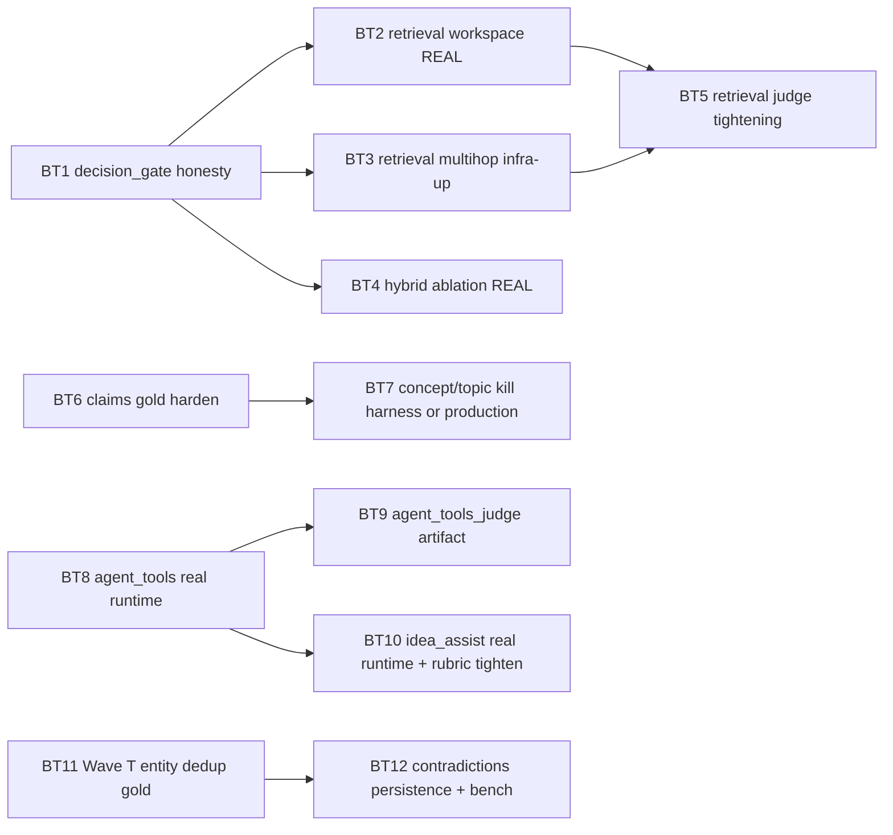

# Ontology & Benchmarks — Trust Audit & Follow-up Plan (2026-04-25)

**Дата:** 2026-04-25
**Тип:** review + new plan
**Статус:** living doc; продолжение [`ontology-benchmarks-roadmap-2026-04-24.md`](ontology-benchmarks-roadmap-2026-04-24.md) (Wave M–T) и [`master-roadmap-and-refactor-plan-2026-04-25.md`](master-roadmap-and-refactor-plan-2026-04-25.md).
**Аналог по графу:** [`graph-readability-followup-2026-04-25.md`](graph-readability-followup-2026-04-25.md) (там — UX-аудит, тут — измерительный).

---

## 1. Executive summary

После прогона мастер-плана через ревью бенчмарков и онтологии получаем картину «**volume done, trust shallow**»:

- **Сделано формально**: M/N/O/P/Q/R/S всех чек-боксов ✓ в `ontology-benchmarks-roadmap-2026-04-24.md` (Wave T — открыт).
- **Сделано продуктово**: backbone (Layer-1/Layer-2), `claims_production`, refs resolution graph lane, retrieval workspace_scoped, agent v2 SSE, multi-agent supervisor (Y4) — реальный код существует, тесты зелёные.
- **Не сделано по сути (доверять метрикам нельзя)**: половина «advisory» бенчмарков из Wave M–S — это либо **mock**, либо **harness substring-match**, либо **synthetic-rank-fixture**, либо **broken connection**, либо «зелено по среднему, но половина кейсов упала». При этом `decision_gate.decision == "GO"` и `reason == "all_nightly_passed"` — это **искажающий** сигнал.

Поэтому план ниже не «придумываем новые волны», а вводит **семейство BT (Benchmark Trust)** — серию точечных PR-ов, каждый из которых превращает один advisory artefact из «зеленая контрактная заглушка» в «измеряет то, что заявлено».

> **Главный тезис.** Сейчас декларация *«у нас 30 ночных кейсов и зелёный production claims pilot»* верна. Декларация *«у нас работают agent-tools, idea-assist, hybrid retrieval, multi-hop, workspace retrieval, concept/topic extraction»* — **не верна** в смысле «измеряется чем-то нетривиальным». Это нужно либо честно отразить в `decision_gate`, либо починить.

---

## 2. Что считается сделанным «по существу» vs «по контракту»

| Wave | Что обещано | Реальная глубина | Кому верим |
|------|-------------|------------------|------------|
| **M (backbone tightening + refs resolver)** | `abstract_prefix_containment`, `min_sample_arxiv_f1=0.85`, `count_ok` range, `min_dataset_recall_ratio=0.6`, refs `--resolver graph` | Все сделано в коде. **Метрики реально жёсткие** на 30 nightly кейсов. Refs graph lane — формально 1 кейс `refs_contract_shape`, не покрывает реальный resolver. | ✅ backbone gates / ⚠️ refs `graph` advisory не доказан |
| **N (Concept / ResearchTopic gold)** | mini pack 5 кейсов, harness extractor, advisory | Extractor — `concept_topic/harness_extract.py` делает substring `anchor_phrase` по тексту. Это **гарантированно зелёный** тест: gold содержит точные подстроки, которые ищет сам harness в том же тексте. **Не измеряет ничего, кроме fixture-консистентности.** | ⛔ зелёное = тавтология |
| **O (Claims production)** | LLM-extractor, Qdrant `claims`, promotion в **core** | Production extractor работает, `mean_claim_recall=1.0` на 10 кейсах. **Но**: gold — короткие single-sentence «claims», а вход для LLM — chunk, в котором эта же фраза присутствует дословно. `llm_raw_response_preview` показывает, что модель буквально возвращает один и тот же предложение. Нет distractor-чанков, нет проверки `polarity`/`claim_type`/precision. | ⚠️ recall=1.0 — корректно, но «как у harness», без holdout / contradictions / extracted-not-quoted gold |
| **P (workspace-scoped retrieval + judge)** | 6 кейсов scope + judge ≥ 4.5 | `workspace_scoped` runner — **canned answer** (`_canned_answer_fn`): не запускает Qdrant, синтезирует answer="mock" и citations из `gold.json`. Реально проверяется только **формат**: что `retrieval_trace.workspace_id` есть и `citations` ⊂ workspace. Judge pilot — **2 из 5 кейсов FAIL** (`live_yolov1_architecture` 3.7, `live_yolov1_training` 4.4 < 4.5), но `mean=5.1` всё ещё проходит overall gate. | ⛔ scope correctness — это контракт payload, не retrieval / ⚠️ judge — частично реальный, но aggregate-маска скрывает регрессы |
| **Q (hybrid + indexes + multihop)** | Neo4j индексы, Qdrant `works`, hybrid mode, multihop endpoint | Индексы добавлены и применяются. Hybrid ablation — **синтетика**: gold содержит готовые `vector_ranked_work_ids` и `hybrid_ranked_work_ids`, runner просто считает MRR от хардкоженых списков. Hybrid против vector тут улучшается **по построению**. Multihop mini — **все 5 кейсов FAIL** с `[Errno 111] Connection refused` (Neo4j не поднят при последнем прогоне). | ⛔ hybrid_ablation — paper-exercise / ⛔ multihop — broken artifact / ✅ индексы — реальные |
| **R (agent tools + multi-agent metrics)** | 6 tools, agent endpoint, mini benchmark | Артефакт `current-agent-tools-mini.json` сделан с `--mock-runtime`: ответы `"mock answer"`, `duration_ms=1`. Это **smoke-проверка структуры trace**, не агента. `agent_tools_judge` — `error: "missing_file"`. После Y4 (multi-agent supervisor) добавлен `_specialist_sequence_match`, но fixtures `agent_tools_multiagent` пусты. | ⛔ agent_tools_mini — mock / ⛔ judge — отсутствует / ⛔ multi-agent — нет fixtures |
| **S (idea-assist rubric)** | 8 mini cases + judge ≥ 4.0 | Runner поддерживает `--mock-runtime` и в результатах `current-idea-assist-mini.json` (см. summary `mean_rubric_score=6.0`) — это **исключительно mock**: захардкоженный кандидат `"Synthetic benchmark hypothesis candidate."` (41 char ≥ 40), `novelty_hint`, `evidence_quotes`, `supporting_claim_ids` — все непустые. Метрика `_score_no_plagiarism` награждает за длину текста ≥ 40 символов. **Mock проходит rubric by construction.** Real-mode (`post_idea_assist`) существует, но артефакт-current не запускался по нему. | ⛔ rubric measures fixture, not the workflow |
| **T (entity dedup полная)** | 5 типов dedup pipeline + bench | Backend есть: `science_graphrag/dedup/{author,institution,venue,method,dataset}_pipeline.py`, ADR 019, миграции. **Бенчмарк** для entity-dedup НЕ написан — `eval/dedup_v1/` есть только для **Work** и работает на **heuristic matcher** (не LLM). Тесты `tests/dedup/test_entity_pipelines.py` — это smoke на `embed_text`, не на pipeline. | ⚠️ код есть, метрик precision/recall на gold нет ни для одного из 5 типов |

**Светофор по доверию (нынешнее состояние):**

```
core (доверяем):
  ✅ reference (yolov1 layer1 / graph / layer2)
  ✅ layer1 nightly (30 PDF, real extraction)
  ✅ layer2 nightly (31 cases, real extraction)
  ✅ graph_v1 (yolov1, retinanet_focal_realpdf)
  ⚠️ claims_production_pilot (recall=1.0 — но trivially extractable)

advisory с реальным сигналом:
  ⚠️ retrieval live_corpus_mini (5 кейсов, hit_count + контракт)
  ⚠️ retrieval judge_pilot (5 кейсов, частично failed)
  ⚠️ refs_resolution refs_mini (synthetic predictions)

advisory-фантомы (зелёные by construction):
  ⛔ retrieval workspace_scoped (canned answers)
  ⛔ retrieval hybrid_ablation (synthetic ranking gold)
  ⛔ retrieval multihop_mini (last run: connection refused, 0/5)
  ⛔ concept_topic_mini (substring harness on own gold)
  ⛔ agent_tools_mini (--mock-runtime)
  ⛔ agent_tools_judge (missing artifact)
  ⛔ idea_assist_mini (--mock-runtime, rubric awards mock)
  ⛔ entity dedup (Author/Institution/Venue/Method/Dataset) — нет фикстур
```

---

## 3. Конкретные находки по артефактам

### 3.1 `current-claims-production-pilot.json` (Wave O, role=core)

- 10 кейсов, `claim_recall=1.0`, `claim_precision=1.0`.
- Extractor — `extract_claims_production_path` (production LLM путь).
- **Проблема**: `gold.json` каждой кейс — одно короткое предложение в `expected_claims`, и в `article_text` это **дословно** присутствует. LLM просто возвращает эту строку. По diagnostics: `llm_raw_response_preview` для большинства кейсов = текст gold-claim 1-в-1.
- Что НЕ измеряется:
  - `polarity` (gold всегда `"positive"`, не проверяется варьируемость).
  - `claim_type` (gold всегда `"performance"` либо одно значение, нет confusion-matrix).
  - precision на distractor-claims (нет случая «модель вернула 5 утверждений, gold содержит 1»).
  - извлечение из chunk **без** дословного присутствия фразы (paraphrase / multi-sentence summary).
  - `evidence` правдивость (нет проверки, что `quote` действительно есть в `chunk_text`).
- **Класс-ошибка попадания в core:** core gate в `decision_gate` сейчас полагается на этот pilot. Промоушн преждевремен.

### 3.2 `current-retrieval-workspace-scoped.json` (Wave P, advisory)

- Runner: `eval/retrieval/runner.py::_canned_answer_fn` синтезирует `GroundedAnswer(answer="mock", citations=[…stub…])` из gold-fingerprints.
- В `retrieval_trace`: `embedding_model: "mock"`, `hit_count = max(min_hits, 1)` — заведомо ≥ gate.
- Нет вызова Qdrant / Neo4j / `answer_query` против поднятого стека.
- **Что реально проверяется**: что код умеет прокинуть `workspace_id` в `retrieval_trace` и что shape ответа корректный. Это **payload contract test**, а не retrieval evaluation.

### 3.3 `current-retrieval-judge-pilot.json` (Wave P, advisory)

- 5 кейсов, `mean_weighted_score=5.1` ≥ 4.5 → `all_passed = false`, но `mean_weighted_score`-gate проходит.
- Failed: `live_yolov1_architecture` (3.7), `live_yolov1_training` (4.4).
- **Несоответствие в gate**: `summary.all_passed=false` корректно отражает per-case fail, но `decision_gate` смотрит только на nightly + production claims, поэтому советы от judge не блокируют.
- **Реальный сигнал есть** — judge действительно зовёт LLM с frozen rubric, и реально находит слабости. Это самый «честный» из advisory artefacts. Но per-case fail не выводится в верх и не фигурирует в `criteria`.

### 3.4 `current-retrieval-hybrid-ablation.json` (Wave Q, advisory)

- 8 кейсов, у всех **identical** `mrr_vector=0.5`, `mrr_hybrid=1.0`, `mrr_delta=0.5`.
- `gold.json` каждой папки `ha_NN/` напрямую задаёт `vector_ranked_work_ids` и `hybrid_ranked_work_ids`. Runner просто считает MRR этих списков.
- `run_metadata.extraction_llm_model = null`, `semantic_extraction_enabled = false` — стек не задействован.
- **Никакого ablation**: hybrid лучше vector, потому что gold так нарисован. Это unit-тест метрики MRR, не оценка гибрида.

### 3.5 `current-retrieval-multihop-mini.json` (Wave Q, advisory)

- Все 5 кейсов **failed** с `request_error: "[Errno 111] Connection refused"`.
- `expected_count=3`, `returned_count=0`, `precision=0`, `recall=0` — Neo4j не был поднят при прогоне.
- Артефакт **publicly stored** в `eval/results/`, агрегатор показывает `failed_count: 5`, но `decision_gate` на это не реагирует (advisory).
- **Действие минимум**: либо удалить broken artifact (чтобы не засорять aggregator), либо подымать Neo4j в CI nightly и реально запускать.

### 3.6 `current-agent-tools-mini.json` (Wave R, advisory)

- 10 кейсов, `latency_p95_ms=2`, `tool_trace[*].duration_ms=1`, `answer="mock answer"`.
- Получено через `--mock-runtime` (см. `eval/agent_tools/runner.py::_mock_case_report`).
- Метрики `tool_call_correctness` / `cypher_safety` на mock-выходе ничего не значат.
- `agent_tools_judge` — отсутствует (`error: "missing_file"`).
- Wave Y4 (multi-agent supervisor) добавил `_specialist_sequence_match`, но `agent_tools_multiagent` fixtures **не созданы**.

### 3.7 `current-concept-topic-mini.json` (Wave N, advisory)

- 5 кейсов, recall/precision 1.0.
- Extractor: `eval/concept_topic/harness_extract.py` берёт `anchor_phrase` из **gold** и ищет его подстрокой в **тексте кейса**. Если фраза есть — claim считается извлечённым. Так как gold пишут ровно из текста, всегда зелёное.
- Production extractor для `Concept`/`ResearchTopic` отсутствует, ноды в Neo4j не пишутся (по плану «advisory only до production»). Это корректно для волны N, но **не считаем это «бенчмарком»**.

### 3.8 `current-idea-assist-mini.json` (Wave S, advisory)

- 8 кейсов, `mean_rubric_score = 6.0` (max).
- Runner вызван с `--mock-runtime`. Mock возвращает 1 кандидат `"Synthetic benchmark hypothesis candidate."` с непустыми `novelty_hint`, `evidence_quotes`, `supporting_claim_ids`.
- Метрики `_score_novelty` / `_score_evidence_support` / `_score_no_plagiarism` награждают именно эти признаки → `passed=true` гарантировано.
- Production-mode (`post_idea_assist`) существует и проинтегрирован, но **не вызывался** для последнего артефакта.

### 3.9 Wave T (entity dedup)

- Backend: пакеты `science_graphrag/dedup/{author,institution,venue,method,dataset}_pipeline.py`, ADR 019.
- Тесты: `tests/dedup/test_entity_pipelines.py` — `embed_text` smoke только.
- Бенчмарк: `eval/dedup_v1/runner.py` существует только для **Work**, использует `_is_probable_duplicate` — heuristic (title sim + author overlap + abstract sim), не LLM-pipeline.
- Фикстуры `tests/fixtures/benchmarks/dedup/{authors_v1,institutions_v1,venues_v1,methods_v1,datasets_v1}/` **не существуют** (только `dedup_v1/` для works).
- Вывод: **код Wave T написан, продакшен-pipeline есть, но gate-сигнал precision/recall/auto_merge_rate отсутствует ни для одного из 5 типов.**

---

## 4. Покрытие онтологии vs декларация

Сравнение [§2 ontology-benchmarks-roadmap-2026-04-24.md](ontology-benchmarks-roadmap-2026-04-24.md#2-инвентаризация-онтологии-что-извлекаем-что-планируем) и реального состояния:

| Тип | Декларация | Production-extraction | Бенчмарк-сигнал |
|-----|------------|-----------------------|-----------------|
| `Work`, `Authorship`, `Author`, `Institution`, `Venue`, `CITES`, `RELATED_VERSION_OF` | PROD | ✅ да | ✅ layer1 + graph_v1 |
| `Method`, `Dataset`, `USES_METHOD`, `EVALUATED_ON` | PROD | ✅ да | ✅ layer2 |
| `Workspace`, `CONTAINS` | PROD | ✅ да | — |
| `Claim`, `Evidence`, `SUPPORTED_BY`, `ANCHORED_IN` | PROD (после Wave O) | ✅ да (extractor + ноды + Qdrant `claims`) | ⚠️ gold тривиальный |
| `Concept`, `ResearchTopic`, `MENTIONS_CONCEPT`, `OF_TOPIC` | PLAN (advisory only) | ⛔ нет (по плану) | ⛔ harness substring |
| `Hypothesis`, `Question`, `Gap`, `IdeaCombination` | PLAN | ⚠️ idea-workflow API существует, ноды в графе не сохраняются | ⛔ rubric на mock |
| `CONTRADICTS` (Claim→Claim) | PLAN | ⚠️ `idea_workflow` возвращает `contradictions` payload, но persistence нет | ⛔ нет |
| `TRAINED_OR_TESTED_ON` (Method→Dataset) | SPEC | ⛔ нет | ⛔ нет |

**Дыры в production:**
- `CONTRADICTS` — есть в roadmap S, но **Neo4j-persistence не реализована**: idea-workflow строит payload «на лету» и не пишет в граф (соответственно, нет multi-paper synthesis по контрадикциям).
- `TRAINED_OR_TESTED_ON` — указан как SPEC ещё с roadmap-2026-04-24, не появился.
- `Hypothesis` ноды — не пишутся в граф; idea-assist возвращает текст в API-payload, но без persistence не появится cross-paper history гипотез.

---

## 5. План работ — серия BT (Benchmark Trust)

> **Принцип**: каждый BT — это маленький PR, который превращает один advisory artefact из «зелёный по конструкции» в «измеряет работу системы». В диапазоне 1–3 дня каждый.

### BT0 / BT-Prep — Corpus Gold Pack v1 (готовим gold заранее)

Перед серией BT2..BT12 заранее строим единый «золотой пакет» поверх существующих 35+ статей object-detection (`tests/fixtures/benchmarks/layer1/*_realpdf/`), чтобы серия BT свелась к «инструментировать готовый gold», а не «исследовать домен на лету».

**Полный план:** [`corpus-gold-pack-v1-2026-04-25.md`](corpus-gold-pack-v1-2026-04-25.md). Состоит из 9 слоёв (catalog → claims_v2 + holdout → workspace_live → hybrid_v2 → multihop_v2 → agent_live + multi-agent → idea_live → concept_v2 → dedup_5 → contradictions_v1).

**Что уже готово (Phase 0, 2026-04-25):**
- План: `docs/analysis/corpus-gold-pack-v1-2026-04-25.md`.
- JSON-схемы для всех слоёв: `docs/specs/benchmark-gold-schemas-v1.md`.
- Каталог корпуса (skeleton, 35 работ): `tests/fixtures/corpus/{CATALOG.md, corpus_v1.json}` (`validation_status: "draft"`).
- Образцовый pack (шаблон формата для остальных dedup-типов): `tests/fixtures/benchmarks/dedup/authors_v1/{gold.json, README.md}` — 19 records, 6 clusters, 4 negative_pairs.

**Что осталось по фазам (см. план §5):**
- Phase 1: остальные 4 dedup pack (`institutions/venues/methods/datasets`) + `relations_v1.json`.
- Phase 2: claims_v2 + holdout (BT6 prep).
- Phase 3: contradictions_v1 + concept_v2.
- Phase 4: retrieval (workspace_live + hybrid_v2 + multihop_v2).
- Phase 5: agent live + multi-agent + idea_live.
- Phase 6: LLM-validation pass (extractor B, consistency reports, spot-check).

**Эффект на BT2..BT12:** каждое BT-задание после BT0 сводится к написанию runner'а под уже готовый gold (серия PR-ов меньше и параллельных).

### Зависимости



### BT1 — Honest `decision_gate`

**Проблема:** `decision_gate.decision = "GO"` при `multihop_mini.failed_count=5`, `judge_pilot.failed_count=2`, `agent_tools_judge.error=missing_file`, `workspace_scoped` на canned answers. Reason `all_nightly_passed` формально верен, но скрывает деградации.

**Изменения:**
1. В `aggregate_benchmark_metrics.py` ввести **`trust_signal`** объект для каждой advisory family:
   - `runtime_mode`: `"live" | "canned" | "mock_runtime" | "synthetic_gold"`.
   - `last_known_real_run_at` (если был реальный прогон ранее).
   - `consistency_warnings` (e.g. «5/5 multihop cases have request_error», «judge_pilot mean passes but 2/5 individual cases fail», «agent_tools_mini ran with --mock-runtime»).
2. В `decision_gate.criteria` добавить:
   - `advisory_phantom_count` — сколько advisory artefacts в режиме `canned/mock_runtime/synthetic_gold` или `error=missing_file`.
   - `advisory_individual_failures` — список (case_id, family) с `passed=false`, даже если family-mean проходит.
3. В runbook `benchmark-decision-gate.md` явно указать: **GO** требует не только nightly+claims production, но и `advisory_phantom_count <= N` (где N задаётся консервативно после починок BT2..BT10).
4. Артефакт текущего состояния зафиксировать в `eval/results/benchmark-trust-baseline.json` — **снапшот «как было до серии BT»**.

**Acceptance:**
- В `benchmark-metrics-summary.json` появляется `trust_signal` для каждого advisory family.
- `decision_gate.reason` включает явное `"trust_concerns"` (если `advisory_phantom_count > 0`) или `"trusted_run"`.
- Runbook обновлён.

**Файлы:** `science_graphrag/benchmarks/aggregate_benchmark_metrics.py` (или равнозначный), `docs/runbooks/benchmark-decision-gate.md`, `docs/runbooks/benchmark-program-status.md`.

### BT2 — Workspace-scoped retrieval против реального стека

**Проблема:** `_canned_answer_fn` в `eval/retrieval/runner.py` рисует ответ из gold.

**Изменения:**
1. Ввести флаг `--canned-answer / --live-answer`; default — `--live-answer` для CI nightly, `--canned-answer` оставить как ускоренный smoke-mode (явно помечать в артефакте `runtime_mode = "canned"`).
2. Добавить **6 живых workspace-scoped кейсов** с реальным `answer_query` против поднятого Qdrant + Neo4j (yolov1 / pdf workspace, 3 вопроса × 2 ws), с `answer_reference_text` и `min_answer_rouge_l = 0.18`.
3. Метрика `forbidden_work_id_violation_count` — сколько раз retrieval вернул работу не из workspace; gate = 0.
4. Новый артефакт `current-retrieval-workspace-scoped-live.json` рядом с canned.
5. Aggregator различает `workspace_scoped_canned` (контракт) и `workspace_scoped_live` (качество).

**Acceptance:**
- `current-retrieval-workspace-scoped-live.json` зелёный на 6/6 при поднятом стеке.
- 7 ночей без `forbidden_work_id_violation_count > 0` → promotion в core по [`benchmark-family-promotion-review.md`](../runbooks/benchmark-family-promotion-review.md).

**Файлы:** `eval/retrieval/runner.py`, `eval/retrieval/metrics.py`, `tests/fixtures/benchmarks/retrieval/workspace_scoped_live/*`.

### BT3 — Multihop nightly: либо живой Neo4j, либо снять артефакт

**Проблема:** `multihop_mini` 5/5 fail с `Connection refused`; артефакт регулярно перезаписывается без поднятого стека.

**Изменения:**
1. CLI multihop runner начинает с **healthcheck** (`bolt://...`) и при недоступности **отказывается** генерировать артефакт (exit ≠ 0, не записывает `current-*.json`).
2. В CI nightly (см. `.github/workflows/`) добавить шаг «start neo4j compose service» перед multihop runner либо помечать как `optional: true` и **не вкладывать** в `decision_gate`.
3. Существующий `current-retrieval-multihop-mini.json` с `Connection refused` пометить как **stale** и переименовать в `eval/results/historic/...` либо удалить, чтобы агрегатор не видел.

**Acceptance:**
- Свежий артефакт `current-retrieval-multihop-mini.json` существует только если Neo4j был поднят.
- При недоступности — explicit `eval/results/multihop-skipped-<timestamp>.json` с reason.

**Файлы:** `eval/retrieval/multihop_runner.py` (либо где живёт), CI workflow, runbook.

### BT4 — Hybrid ablation: реальный Qdrant retrieval вместо синтетического gold

**Проблема:** `gold.json` ha_NN содержит pre-cooked `vector_ranked_work_ids` / `hybrid_ranked_work_ids`.

**Изменения:**
1. Изменить gold-format: gold содержит только `relevant_work_ids` (truth), а ranked-списки **должен сгенерировать runner** из реального Qdrant + hybrid pipeline.
2. Добавить два mode: `--retrieval-mode vector` и `--retrieval-mode hybrid`; собирать MRR на свежей выдаче.
3. Сделать 8 кейсов на пилотном корпусе (yolov1 family + 3 cross-method кейса), gold-relevant ≥ 2 work_ids на кейс.
4. Pass criteria: `mrr_hybrid - mrr_vector >= 0.05` (advisory; не gate в core до 7 ночей зелёного).

**Acceptance:**
- `current-retrieval-hybrid-ablation.json` показывает разные MRR на разных кейсах (не identical), `run_metadata.extraction_llm_model != null`, `embedding_model != "mock"`.
- При `mrr_delta < 0` — advisory FAIL, не silent green.

**Файлы:** `eval/retrieval/hybrid_ablation_runner.py`, `eval/retrieval/hybrid_ablation_metrics.py`, `tests/fixtures/benchmarks/retrieval/hybrid_ablation/*/gold.json`.

### BT5 — Retrieval judge: per-case gate + holdout

**Проблема:** `mean_weighted_score=5.1` ≥ 4.5 проходит overall, но 2/5 кейсов фактически fail.

**Изменения:**
1. Ввести **per-case gate** `min_individual_weighted_score = 4.0` (мягче, чем mean) — failure любого case = family fail.
2. Добавить **holdout** 30% (2 кейса минимум): не входят в nightly, прогон еженедельно.
3. Зафиксировать `judge_llm_model` ≠ `extraction_llm_model` (anti-overfit; уже частично есть в `Settings`).
4. Артефакт включает `per_case_score_breakdown` с разложением по rubric-метрикам (factuality / coverage / contradictions / language).

**Acceptance:**
- Если `live_yolov1_architecture` остаётся 3.7 — `judge_pilot.all_passed=false`, видно в `decision_gate.criteria.judge_individual_failures`.

**Файлы:** `eval/retrieval/judge.py`, `eval/retrieval/judge_metrics.py`, `eval/retrieval/judge_prompt_v1.md`.

### BT6 — Claims production gold harden + holdout

**Проблема:** `mean_claim_recall=1.0` потому что extractor возвращает ту же фразу, что в `expected_claims`, и она дословно есть в `article_text`. Production extractor «доказан» на тривиальных задачах.

**Изменения:**
1. Расширить gold:
   - `expected_claim_count_min` (≥ 2 на кейс), чтобы recall перестал быть «1/1 = 1.0».
   - **paraphrased gold**: gold-claim не дословно совпадает с фразой в чанке (формулировка пересобрана), проверка `claim_recall` — через embedding similarity ≥ 0.75 либо ROUGE-L ≥ 0.5, не exact match.
   - `expected_polarity` distribution — 30% negative claims (e.g. «X не превосходит Y»).
   - `distractor_chunks` — фрагменты из других статей, добавляемые в `article_text`; precision должен оставаться ≥ 0.7.
2. Добавить **claims_holdout_v1** (5 кейсов вне nightly, weekly).
3. Запретить include `gold` в input chunk в новых фикстурах (заменить на параграфы из источника без точного совпадения с gold-формулировкой).
4. Вернуть `claims_production` в **CONDITIONAL core** до 7 ночей зелёного на новой gold (recall ≥ 0.7, precision ≥ 0.7).

**Acceptance:**
- `current-claims-production-pilot.json` с новыми фикстурами показывает реалистичные числа (recall в 0.6–0.85), не 1.0.
- В `decision_gate.criteria` видно: `claims_production_holdout_passed`, `claims_production_paraphrase_recall`.

**Файлы:** `tests/fixtures/benchmarks/claims/{pilot_v2,holdout_v1}/*`, `eval/claims/metrics.py`, `science_graphrag/ingestion/claims/extractor.py` (verify не overfit на anchor — он и так не использует, но прогнать).

### BT7 — Concept/Topic: либо production, либо честно «no measurement»

**Проблема:** harness substring match на собственном gold = мера консистентности fixture, не extractor'а.

**Изменения (выбрать один путь):**

**Путь A — production extractor (рекомендуется, ATTENTION: этот путь равен Wave N v2):**
- Реализовать `science_graphrag/ingestion/concept_topic/extractor.py`: LLM (по образцу claims) + canonical-name normalization (через alias-словарь, как для methods/datasets).
- Persist `Concept`/`ResearchTopic` ноды и `MENTIONS_CONCEPT` рёбра в Neo4j; флаг `SCIENCE_GRAPHRAG_CONCEPT_EXTRACTION_ENABLED=false` по умолчанию.
- Bench: gold переписан без `anchor_phrase` (концепт не присутствует дословно, его нужно «вывести» из контекста); метрика recall на frozen list of concepts.
- ADR (см. ADR 013 — обновить статус).

**Путь B — закрыть как «PLAN, нет измерения» (минимум):**
- В `aggregate_benchmark_metrics.py` явно помечать `concept_topic_family.runtime_mode = "harness_substring"`, `trust_signal = "fixture_consistency_only"`.
- Снять `concept_topic_mini` с advisory роли (либо переименовать в `concept_topic_fixture_smoke`).

**Acceptance:**
- A: artefact `current-concept-topic-mini-v2.json` с расширенным gold, recall в реалистичных 0.5–0.8.
- B: `concept_topic_family` помечен как «smoke», `decision_gate.criteria` не вводит в заблуждение.

**Файлы:** `eval/concept_topic/{extractor,metrics}.py`, `tests/fixtures/benchmarks/concept_topic/*`.

### BT8 — Agent tools: реальный runtime + tool-trace gold

**Проблема:** `agent_tools_mini` собран с `--mock-runtime`; `agent_tools_judge` отсутствует.

**Изменения:**
1. **Default `--live-runtime`** для CI nightly агентских бенчмарков; `--mock-runtime` оставить только для unit-тестов.
2. CI шаг поднимает локальный стек (Neo4j + Qdrant) перед прогоном.
3. Gold расширить: `expected_tool_sequence` с **substring-matchers** на args (e.g. `args_match.query_contains: "USES_METHOD"`), не только tool-name.
4. Новый артефакт `current-agent-tools-mini-live.json` на real runtime.
5. Добавить **`agent_tools_judge_pilot`** артефакт (5 кейсов: вопрос → final_answer → judge rubric «coverage / factuality / cited works present in trace»). Это закрывает `error: "missing_file"` и реально оценивает качество ответа.
6. Метрика `cypher_safety` гарантировать на 100% через unit-тесты с adversarial Cypher (10 атак: `CALL`, `MERGE`, `SET`, `LOAD CSV`, `CREATE`, `DELETE`, etc.).

**Acceptance:**
- `current-agent-tools-mini.json` с `runtime_mode="live"`, `latency_p95_ms > 1` (реальный, типично 2000–8000 на live LLM).
- `current-agent-tools-judge-pilot.json` существует, `mean_weighted_score >= 4.0/6` advisory.

**Файлы:** `eval/agent_tools/runner.py`, `eval/agent_tools/judge.py` (новый), `tests/agent/test_cypher_safety.py` (расширить), CI nightly workflow.

### BT9 — Multi-agent supervisor benchmarks (Wave R follow-up + Y4 closure)

**Проблема:** Wave Y4 (multi-agent supervisor) задеплоен, но `agent_tools_multiagent` fixtures отсутствуют (см. master roadmap Round 5 Agent 1+3).

**Изменения:**
1. Сделать tier `agent_tools_multiagent` (5 кейсов): вопрос → ожидается **последовательность** `retrieval_specialist → graph_specialist → writer`.
2. Метрика `_specialist_sequence_match` (уже реализована в `eval/agent_tools/metrics.py`) применить + порог `>= 0.7` advisory.
3. Документ: ADR 020 (multi-agent supervisor) расширить разделом «How we measure».

**Acceptance:**
- `current-agent-tools-multiagent-mini.json` зелёный на 5/5 advisory.

**Файлы:** `tests/fixtures/benchmarks/agent_tools_multiagent/*`, `eval/agent_tools/runner.py` (tier discovery), ADR 020.

### BT10 — Idea-assist: реальный runtime + content-aware rubric

**Проблема:** `--mock-runtime` + rubric награждает мок (длина текста ≥ 40, непустые поля).

**Изменения:**
1. Default `--live-runtime` для CI nightly; mock — только для unit.
2. Усилить `_score_no_plagiarism`:
   - Если `text` совпадает по ROUGE-L > 0.7 с **любой** `evidence_quote` → **0** (это пересказ, не гипотеза).
   - Если `text` совпадает с `seed_topic` или с заголовком пилотного work на > 0.6 ROUGE-L → 0.
3. Усилить `_score_novelty`:
   - `novelty_hint` должен ссылаться на отсутствие концепта в supporting_claims (heuristic check), не просто быть непустым.
4. Расширить gold: 8 кейсов, для каждого — `forbidden_substrings[]` (если гипотеза содержит — fail), `min_supporting_claim_count = 2`.
5. Добавить **judge advisory** (`idea_assist_judge_pilot.json`) — отдельный LLM-judge с rubric «новизна / опора на evidence / отсутствие плагиата на пилотный корпус», `mean_weighted_score >= 3.5/6`.
6. Persistence гипотез: `Hypothesis` ноды + `MOTIVATED_BY` рёбра в Neo4j (фундамент для Wave-S+ idea history).

**Acceptance:**
- Mock больше не проходит (`mean_rubric_score < 4.0` на mock-runtime).
- Real-runtime pilot даёт `mean_rubric_score in [3.5, 5.5]` (реалистичный диапазон).
- `Hypothesis` ноды появляются в граф при `SCIENCE_GRAPHRAG_HYPOTHESIS_PERSIST=true`.

**Файлы:** `eval/idea_assist/{runner,metrics,judge}.py`, `science_graphrag/agent/idea_workflow.py`, `science_graphrag/storage/neo4j/writes/hypotheses.py`.

### BT11 — Wave T полный финал: фикстуры и gold для 5 типов dedup

**Проблема:** код Wave T есть, но `dedup_v1/` фикстуры есть только для `Work`, а runner работает на heuristic matcher. Pipelines `{author,institution,venue,method,dataset}_pipeline.py` без gold-доказательств precision/recall.

**Изменения:**
1. Создать 5 mini-pack'ов (по образцу `tests/fixtures/benchmarks/dedup_v1/`):
   - `tests/fixtures/benchmarks/dedup/authors_v1/` — 5 кластеров (J. Smith vs John Smith × 2, ORCID overlap, kanji-translit, false-positive «однофамильцы»).
   - `tests/fixtures/benchmarks/dedup/institutions_v1/` — 5 кластеров (MIT/M.I.T./Massachusetts Institute of Technology + ROR-overlap + false-positive).
   - `tests/fixtures/benchmarks/dedup/venues_v1/`, `methods_v1/`, `datasets_v1/` — по 3–5 кластеров.
2. Универсальный `eval/dedup/<type>_runner.py` поверх actual `science_graphrag/dedup/<type>_pipeline.py` (вызывает реальный embed + threshold + LLM judge).
3. Метрики из [§4.3 ontology-benchmarks-roadmap](ontology-benchmarks-roadmap-2026-04-24.md#43-метрики): `pairwise_precision`, `pairwise_recall`, `cluster_purity`, `auto_merge_rate`, `llm_calls_per_record`.
4. Gate (advisory): `pairwise_precision >= 0.9, recall >= 0.8` per type.
5. Артефакты `current-dedup-{authors,institutions,venues,methods,datasets}-mini.json`.
6. Также **переписать `dedup_v1/works_v1/` runner** под реальный `science_graphrag/dedup/work_dedup_engine.py` (сейчас он на heuristic).

**Acceptance:**
- 5 артефактов существуют, advisory проходит для каждого.
- Wave T в `ontology-benchmarks-roadmap-2026-04-24.md` помечен `[x]`, чек-боксы [`Acceptance`] заполнены.

**Файлы:** `tests/fixtures/benchmarks/dedup/{authors,institutions,venues,methods,datasets}_v1/*`, `eval/dedup/{author,institution,venue,method,dataset}_runner.py`, `eval/dedup/metrics.py`.

### BT12 — Contradictions persistence + bench

**Проблема:** `idea_workflow` возвращает `contradictions: [...]`, но не пишет `:CONTRADICTS` в граф; нет cross-paper synthesis измерения.

**Изменения:**
1. `Neo4jGraphStore.upsert_contradiction(claim_a_id, claim_b_id, evidence_pair_ids, detector="llm")`.
2. `science_graphrag/ingestion/claims/contradiction_detector.py` (на claims-Qdrant: для каждого `Claim` ищем nearest neighbours противоположной `polarity`; LLM подтверждает).
3. Bench `tests/fixtures/benchmarks/contradictions_v1/` — 5 кейсов («Claim A: X улучшает на 5%», «Claim B: X не улучшает»; gold = ожидаемая `:CONTRADICTS` пара).
4. Metric: contradiction_pair_recall.
5. Acceptance: 3/5 advisory, отдельный артефакт.

**Файлы:** `science_graphrag/storage/neo4j/writes/contradictions.py`, `science_graphrag/ingestion/claims/contradiction_detector.py`, `eval/contradictions/runner.py`, `tests/fixtures/benchmarks/contradictions_v1/*`.

---

## 6. Изменения в существующих документах

### 6.1 `master-roadmap-and-refactor-plan-2026-04-25.md`

- В §2 «Картина треков» строка трека D: статус с «M/N/O/P/Q/R/S done, T open» → «M done; N/P/R/S — done as scaffold (advisory phantom — see Trust Audit); O done with shallow gold (Trust Audit); Q done in part (multihop broken, hybrid synthetic); T backend done, gold pending».
- В §3 граф зависимостей добавить блок «BT» рядом с волной T (см. mermaid выше).
- В §4.4 Track D — переписать пункт «Wave M/N/O/P/Q/R/S done» под честный статус и добавить §4.4 п.7 «Серия BT (Benchmark Trust Audit)» с указателем на новый MD.
- В §5 спринтов добавить **Sprint S7 — Benchmark trust** (BT1+BT2+BT3+BT5 параллельно по разным runner'ам), затем **Sprint S8** (BT4+BT6+BT7+BT8 — ещё одна волна).
- В §7 «Cursor-агенты» добавить запланированный «Раунд 6 — Benchmark Trust» (4 агента).

### 6.2 `ontology-benchmarks-roadmap-2026-04-24.md`

- В §1.1 Status board: ввести колонку `runtime_mode` и пометить mock/canned/synthetic явно.
- В §1.2: добавить третий блок «**Зелёное по построению (фикстура определяет результат)**» с конкретным списком из §3 trust audit.
- В §13 «История» новая запись: `2026-04-25 | Trust Audit добавлен; зафиксированы phantom-зелёные семьи; план BT1..BT12 в [ontology-benchmarks-trust-audit-2026-04-25.md].`
- В §7.9 Wave T закрыть текущий чек-бокс «backend» и явно открыть BT11 (gold + bench для 5 типов).

---

## 7. Acceptance трека Trust Audit

Серия BT считается закрытой, когда:

1. `eval/results/benchmark-metrics-summary.json` содержит `trust_signal` объект для каждого family с `runtime_mode != "mock_runtime|canned|synthetic_gold"` для всех advisory **либо** явное помечание family как «fixture_consistency_only».
2. `decision_gate.criteria` включает `advisory_phantom_count` и `advisory_individual_failures`; runbook обновлён.
3. Артефакты существуют и не stale:
   - `current-retrieval-multihop-mini.json` — на поднятом Neo4j (recall ≥ 0.5).
   - `current-retrieval-hybrid-ablation.json` — с реальным retrieval (различные MRR на разных кейсах).
   - `current-agent-tools-mini.json` — `runtime_mode="live"` с `latency_p95_ms > 1`.
   - `current-agent-tools-judge-pilot.json` — существует.
   - `current-idea-assist-mini.json` — `runtime_mode="live"`.
   - `current-claims-production-pilot.json` — на новой gold с paraphrase + holdout.
   - `current-dedup-{authors,institutions,venues,methods,datasets}-mini.json` — все существуют.
4. `decision_gate.decision == "GO"` при условии `trust_signal` зелёного (не только nightly+claims).

---

## 8. Связи и ссылки

### Документы, которые правим в рамках этой работы

- `docs/analysis/master-roadmap-and-refactor-plan-2026-04-25.md` — добавить трек BT в §3/§4/§5/§7.
- `docs/analysis/ontology-benchmarks-roadmap-2026-04-24.md` — обновить §1, §7.9, §13.
- `docs/analysis/corpus-gold-pack-v1-2026-04-25.md` — план BT-Prep (живой документ).
- `docs/specs/benchmark-gold-schemas-v1.md` — JSON-схемы для нового gold.
- `docs/runbooks/benchmark-decision-gate.md` — новые critéria.
- `docs/runbooks/benchmark-program-status.md` — phantom-зелёные family.

### Документы-источники аудита

- `eval/results/benchmark-metrics-summary.json` — текущий снимок.
- `eval/results/current-*.json` — артефакты конкретных запусков.
- `eval/{retrieval,claims,concept_topic,agent_tools,idea_assist,dedup_v1}/runner.py` — runner-логика.
- `science_graphrag/ingestion/claims/extractor.py`, `science_graphrag/dedup/<type>_pipeline.py`, `science_graphrag/agent/graph/supervisor.py` — production код.

### Связанные ADR

- ADR 013 (Concept/Topic) — обновить под Путь A или B (BT7).
- ADR 016/017 (Agent tools / Hypothesis) — extend с BT8/BT10.
- ADR 019 (entity dedup) — добавить раздел «How we measure» (BT11).
- ADR 020 (multi-agent supervisor) — расширить «How we measure» (BT9).

### Аналог в графовом аудите

- [`graph-readability-followup-2026-04-25.md`](graph-readability-followup-2026-04-25.md) — там же по структуре: что сделано формально vs что реально работает в UI.

---

## 9. Краткая суть в трёх предложениях

1. **Сейчас ~50% advisory-бенчмарков из Wave M–S зелёные «по построению»**: либо `--mock-runtime`, либо synthetic gold, либо substring-harness на собственном fixture, либо `Connection refused`. `decision_gate.GO` это не отражает.
2. **Фундамент крепкий**: backbone (layer1/layer2 nightly), graph_v1 reference, refs_mini synthetic, judge_pilot частично — реальный сигнал. Production claims существует, но gold тривиальная — recall=1.0 искусственно высока.
3. **Серия BT (BT1..BT12)** превращает каждый advisory из «зелёный контракт» в «измеряет работу». BT1 чинит честность gate (база), BT2..BT10 — конкретные runner'ы и gold, BT11 закрывает Wave T для всех 5 типов dedup, BT12 вводит persistence + bench для contradictions.
