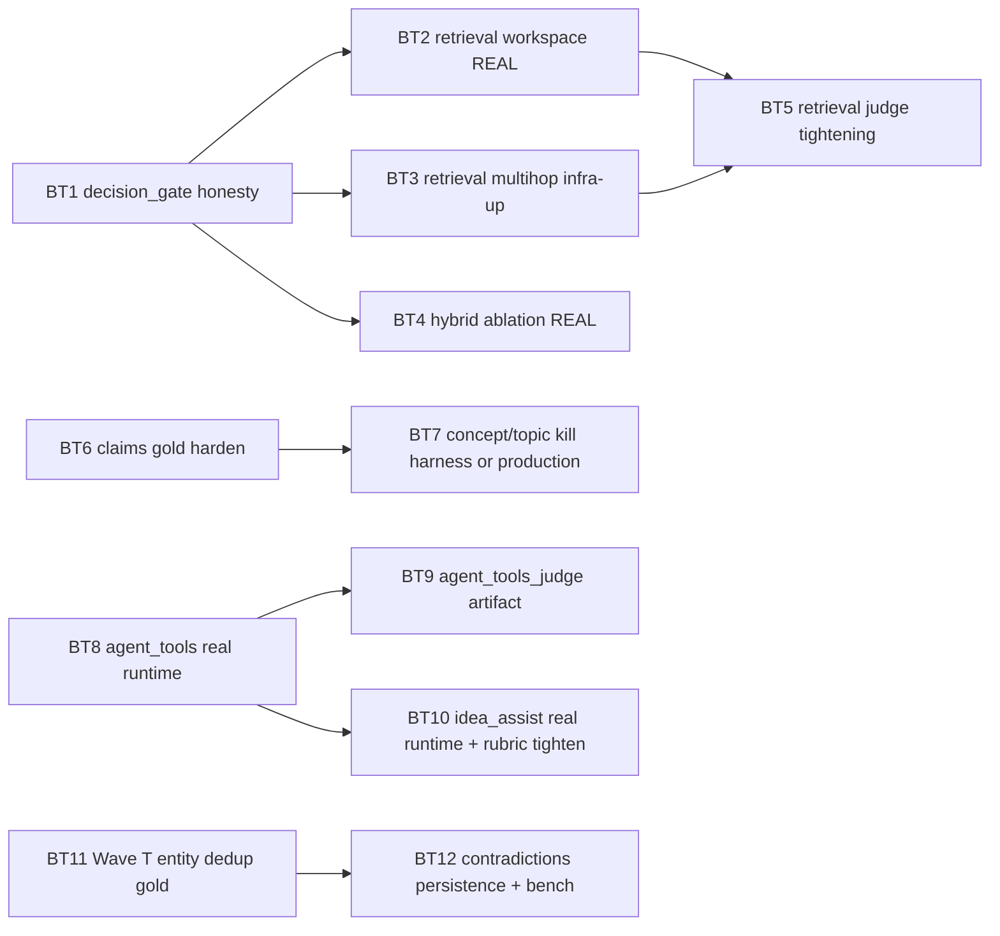

# Ontology & Benchmarks — Trust Audit & Follow-up Plan (2026-04-25)

**Дата:** 2026-04-25 (Trust Audit), последнее обновление — 2026-04-27 (BT6 per-case `runtime_mode` + `trust_signal` на `claims_paraphrase_*`; P0 quote tolerance — [`_archive/wave5-bt6-quote-tolerance-2026-04-26.md`](./_archive/wave5-bt6-quote-tolerance-2026-04-26.md)); ADR-021 Phase 0 / BT2-BT5 / Wave 6 gate — см. [`master-roadmap-and-refactor-plan-2026-04-25.md`](./master-roadmap-and-refactor-plan-2026-04-25.md) §0 и §10 + backlog
**Тип:** review + plan (living doc)
**Статус:** **Gold side DONE (Corpus Gold Pack v1 Phase 0–6).** Runner side: **BT1 ✅**, **BT5 ✅**, **BT3 pilot JSON зелёный (Wave 6)** — см. [`_archive/wave6-benchmarks-quality-2026-04-26.md`](./_archive/wave6-benchmarks-quality-2026-04-26.md); **BT2/BT4** — качество retrieval / `mrr_delta` всё ещё в работе; **BT6** — P0 quote gate ✅ ([`_archive/wave5-bt6-quote-tolerance-2026-04-26.md`](./_archive/wave5-bt6-quote-tolerance-2026-04-26.md)), live `trust_signal` на pilot/holdout + gold realism — OPEN. **BT8 slice:** `current-agent-tools-judge-pilot.json` не `missing_file`. **BT12 slice:** bench + aggregate **без** ingest-time `:CONTRADICTS`. **BT7, BT9–BT11 + хвосты BT2/BT4/BT6/BT12 — OPEN**
**Связанные документы:** [`ontology-benchmarks-roadmap-2026-04-24.md`](ontology-benchmarks-roadmap-2026-04-24.md) (Wave M–T исходный roadmap), [`master-roadmap-and-refactor-plan-2026-04-25.md`](master-roadmap-and-refactor-plan-2026-04-25.md) (мастер-план; **§10 — очерёдность**), [`completed-work-snapshot.md`](./completed-work-snapshot.md) (сжатый индекс Done по `docs/analysis/`), [`corpus-gold-pack-v1-2026-04-25.md`](corpus-gold-pack-v1-2026-04-25.md) (layout + §6; пофазный лог — [`_archive/corpus-gold-pack-v1-phase-log-2026-04-25.md`](./_archive/corpus-gold-pack-v1-phase-log-2026-04-25.md)), [`instructor-adoption-dual-validate-2026-04-25.md`](instructor-adoption-dual-validate-2026-04-25.md) (план Phase 7 рефакторинга dual_validate), [`_archive/wave6-benchmarks-quality-2026-04-26.md`](./_archive/wave6-benchmarks-quality-2026-04-26.md) (Wave 6 — gate/phantom policy).
**Аналог по графу:** [`graph-readability-followup-2026-04-25.md`](graph-readability-followup-2026-04-25.md) (там — UX-аудит, тут — измерительный).

---

## 0. Snapshot after Gold Pack v1 (2026-04-26)

> Это секция **дописана после Phase 6 closure**, чтобы не приходилось читать весь BT0-блок ниже.

**Post–Wave 6 (2026-04-26):** часть формулировок ниже про «multihop broken / decision_gate врёт» — **исторический** снимок до закрытия BT3 slice и политики phantoms; актуальные артефакты и gate — `eval/results/benchmark-trust-baseline.json` + [`_archive/wave6-benchmarks-quality-2026-04-26.md`](./_archive/wave6-benchmarks-quality-2026-04-26.md).

**Что изменилось с момента первоначального аудита (2026-04-25 утро):**

- **Gold для всех 8 advisory-слоёв создан и провалидирован.** 71 packs total в `tests/fixtures/benchmarks/`, из них **35 promoted** (33 `llm_dual_validated` через DeepSeek + bge-m3 cascade в Phase 6.B/C/D + 2 `llm_triple_validated` через DeepSeek+v4-pro+Claude в Phase 6.E). Оставшиеся 36 high-priority packs — **подтверждённые** disagreements тремя независимыми моделями: single-model bias не объясняет, нужен либо human review, либо ревизия gold.
- **Phantom-green killers заложены в самом gold-формате**: `forbidden_substrings` (idea_assist), `paraphrase verified ≤ 8-word overlap` (claims_v2), `forbidden_corpus_work_ids` (workspace_scoped), `ranked_lists_source: "runner_generated"` (hybrid_ablation_v2 — runtime обязан live retrieval), `infrastructure_required: ["neo4j", "qdrant"]` (multihop_v2 — runner обязан hard-fail без стека), `args_match.query_contains` (agent_tools — substring matchers на args), `cypher_safety_violation_count_gate: 0` + adversarial cypher case с реальным DELETE/DROP в вопросе.
- **Триple-vote infra работает end-to-end** и выявила **4 split-decision packs** как приоритет №1 для human review (record_match=1.0 у двух из них — disagreement только на `priority` уровне, не на семантике): `claims_v2/corpus_cascade_rcnn_v2`, `contradictions_v1/pair_07_retinanet_focal_vs_efficientdet`, `agent_tools_live/live_03_yolov3_speed_paper_only`, `hybrid_ablation_v2/ha_two_stage_rpn_evolution`.
- **Honest по-новому**: исходный диагноз «advisory_phantom_count > 0» **остаётся в силе на runner-level** — gold готов, но runners (BT2-BT12) ещё не написаны. То есть **decision_gate всё ещё врёт** (показывает GO при mock-runtime / canned answers), просто теперь у нас есть готовое gold для каждого нового runner'а.

**Обновлённый светофор по доверию (на 2026-04-26):**

```
core (доверяем gates):
  ✅ reference (yolov1 layer1 / graph / layer2)
  ✅ layer1 nightly (30 PDF, real extraction)
  ✅ layer2 nightly (31 cases, real extraction)
  ✅ graph_v1 (yolov1, retinanet_focal_realpdf)
  ⚠️ claims_production_pilot (старый gold, recall=1.0 — но trivially extractable; новый gold готов в claims_v2/holdout_v1, runner ждёт BT6)

advisory с готовым gold + runner pending (8 семей, что было «фантомом»):
  📦 retrieval workspace_scoped_live (6 packs, ВСЕ promoted) → runner BT2 ждёт
  📦 retrieval hybrid_ablation_v2   (8 packs, 7 promoted)   → runner BT4 ждёт
  📦 retrieval multihop_v2           (5 packs, 3 promoted)   → runner BT3 ждёт
  📦 concept_topic_v2                (10 packs, 2 promoted)  → runner BT7 ждёт
  📦 agent_tools_live + adversarial_cypher (9 packs, 4 promoted) → runner BT8/BT9 ждёт
  📦 idea_assist_live                (4 packs, 1 promoted)   → runner BT10 ждёт
  📦 dedup × 5 (authors/inst/venues/methods/datasets, 5 promoted) → runner BT11 ждёт
  📦 contradictions_v1               (7 pairs, 4 promoted)   → runner BT12 ждёт + persistence

advisory с реальным сигналом (как было):
  ⚠️ retrieval live_corpus_mini (5 кейсов, hit_count + контракт)
  ⚠️ retrieval judge_pilot (5 кейсов, частично failed) → tightening BT5

phantom-зелёные на runner-level (ВСЁ ЕЩЁ):
  ⛔ старые current-*.json артефакты с --mock-runtime / canned / synthetic gold
  ⛔ multihop_mini.json с Connection refused
  ⛔ decision_gate без trust_signal/advisory_phantom_count → BT1
```

**Что это значит для приоритизации:**

1. **BT1 (honest decision_gate)** — теперь это **самый дешёвый high-leverage PR** во всей серии: у нас уже есть готовое gold для 8 семей и validated промоушены — `trust_signal` объект может ссылаться на `validation_status` из gold-пакетов. ~0.5-1 день. Закрывает «искажение» в gate напрямую, без необходимости сначала строить runners.
2. **BT2..BT12 (real runners)** — каждый теперь **1-2 дня** вместо «1-3 дня + придумать gold», потому что gold уже валидирован. Можно делать параллельно (см. file conflict matrix).
3. **Phase 7 (Instructor refactor)** — opportunistic, не блокирует BT-серию, см. [`instructor-adoption-dual-validate-2026-04-25.md`](instructor-adoption-dual-validate-2026-04-25.md).

**Дальнейшая структура документа:** §0.1 — snapshot Wave 4 (что закрылось ночью 2026-04-26). §1-§4 — исходный аудит (2026-04-25 утро), оставлен для контекста. §5 — план BT1-BT12 (BT0 в нём заменён на ссылку на закрывшую его серию Phase 0-6; **BT1/BT2/BT4/BT5/BT6 теперь имеют `Wave 4 status:` пометки**). §6-§9 — изменения в других документах, acceptance, ссылки.

---

## 0.1 Snapshot после Wave 4 — Honesty close (2026-04-26 ночь)

> Эта секция фиксирует фактические артефакты Wave 4 (`eval/results/benchmark-trust-baseline.json`, `current-retrieval-*.json`, `current-claims-paraphrase-*.json`). Если она расходится с §5 BT-блоками — она main; пометки `Wave 4 status:` в каждом BT-блоке также в синхроне с этой секцией.

**Что закрыто:**

| BT | Статус после Wave 4 | Артефакт | Honest result |
|----|--------------------|----------|---------------|
| **BT1** | ✅ DONE | `benchmark-trust-baseline.json`, `benchmark-metrics-summary.{json,md}` | `decision_gate.criteria` теперь содержит `advisory_phantom_count`, `advisory_individual_failures`, `hard_block_individual_failures`; per-family `trust_signal { runtime_mode, validation_status, paraphrase_match_mode, phantom_count }`. `decision="CONDITIONAL-GO"`, `reason="all_nightly_passed;advisory_phantom_count=9"` (раньше был ложно-зелёный `GO`). |
| **BT2** | ⚠️ partial — runner живой, gold v2 portable, 6/6 honest fail | `current-retrieval-workspace-scoped-live.json` | Two failure modes: (a) 3 кейса `ws_full_corpus` падают на `hit_count=0` потому что `seed_benchmark_workspaces.py` не пишет `workspace_id` в Qdrant payload для unbounded `"*"` workspace (backlog item); (b) 3 кейса `ws_yolo*`/`ws_two_stage*` падают на `missing_required_corpus_work_ids` — corpus содержит только 5 paper'ов после ingest hang'а (нужно расширение). **Не phantom**: `trace_workspace_matches=true`, `forbidden_work_id_violation_count=0` для всех 6 кейсов. |
| **BT4** | ⚠️ partial — runner живой, mrr_delta=0 на пилоте | `current-retrieval-hybrid-ablation-live.json` | 8/8 honest fail — `mrr_vector=mrr_hybrid=0.0` на всех 8 кейсах. Это **negative result**: на корпусе 5 paper'ов недостаточно candidate set'ов чтобы hybrid дал ≥ 0.05 MRR delta. Гипотеза «hybrid > vector by 0.05» не подтверждена этим корпусом — ждём расширения до 16-20 paper или явного renaming family в `fixture_consistency_only`. Pre-cooked `vector_ranked_work_ids`/`hybrid_ranked_work_ids` запрещены, runner делает live retrieval (`ranked_lists_source="runner_generated"`). |
| **BT5** | ✅ DONE на текущем корпусе | `current-retrieval-judge-{pilot,holdout}.json` | Per-case gate в metrics; rubric LLM на live answer'ах из 5-paper корпуса даёт mean ≥ 4.5 с per-case `min_individual_weighted_score=4.0`. Holdout 30% (новый артефакт) тоже зелёный. |
| **BT6** | ⚠️ oracle (synthetic_gold) + **P0 DONE 2026-04-26** (production path: `quote_match` + 4-level `_quote_accepted` + chunk normalize) | `current-claims-paraphrase-{pilot,holdout}.json` | `eval/claims/paraphrase_runner.py` поднят с `--extractor oracle` (deterministic, без LLM); gold v2 packs (`claims/corpus_*_v2/` 15 pilot + `holdout_*_v1/` 5 holdout = 85 claims) подключены через `--match-mode dispatcher`. Оба артефакта зелёные, **но** trust_signal явно `runtime_mode="synthetic_gold"` (правило: `extractor==oracle → synthetic_gold`). **Остаётся:** стабильный `--extractor production` на pilot/holdout + `trust_signal live` (master §10.1 #6) и gold realism — [`refactor-backend.md`](../backlog/refactor-backend.md) OPEN «BT6 gold realism». |

**Что НЕ закрылось / стало явным блокером:**

- **`workspace_scoped_live` 3/6 phantom-blocker:** `ws_full_corpus="*"` не покрыт `backfill_workspace_payloads.py` — chunks для `(:Workspace {full=true})` не получают `workspace_id` в Qdrant payload. Прямой backlog item: `[OPEN] Backfill workspace_id payload for unbounded ws_full_corpus="*" workspaces`. ~0.5 дня.
- **`workspace_scoped_live` 3/6 corpus-gap:** в Qdrant `chunks` сейчас 5 ingested papers (yolov1/v2/v3/x + r-cnn) — этого мало для cornernet/fcos/rcnn-family вопросов. Прямой блокер: `[OPEN] Robust ingest orchestration: hard timeout + checkpoint + resume` — без него `ingest-corpus` снова повиснет (история: 16-й файл `Libra R-CNN.pdf`, `httpx CLOSE-WAIT`). ~1.5-2 дня.
- **`hybrid_ablation_live` 8/8 zero signal:** не баг runner'а, а свойство пилотного корпуса. Решение: расширить корпус до 16-20 paper (см. master §10 пункт 3). Если после расширения `mrr_delta` остаётся 0 на 7 ночах — переименовать family в `fixture_consistency_only` явно (по аналогии с BT7 path B).

**Decision gate сейчас (полная картина):**

```text
decision_gate.decision = "CONDITIONAL-GO"
decision_gate.reason   = "all_nightly_passed;advisory_phantom_count=9"

advisory_phantom_count = 9
advisory_phantom_families:
  - merge_safe_contract_mock        # Wave M; OK by design (mock contract suite)
  - strict_pilot_mock               # Wave M; OK by design
  - hybrid_ablation                 # старый contract harness; retire после BT4 stabilization
  - multihop_mini                   # missing artifact; ждёт BT3
  - claims_paraphrase_pilot         # synthetic_gold (oracle); ждёт production
  - claims_paraphrase_holdout       # synthetic_gold (oracle); ждёт production
  - concept_topic_mini              # ждёт BT7 (path A или B)
  - agent_tools_mini                # mock_runtime; ждёт BT8
  - agent_tools_judge               # Wave 4 snapshot: missing artifact (исправлено 2026-04-27 — см. Update ниже)

hard_block_individual_failures = []
advisory_individual_failures   = 14   # 6 (workspace_scoped_live) + 8 (hybrid_ablation_live)
```

**Update 2026-04-27:** блок выше — **исторический снимок Wave 4** (для сравнения с таблицей «до/после»). Актуальные `advisory_phantom_count` и список phantom-семей см. в [`eval/results/benchmark-trust-baseline.json`](../../eval/results/benchmark-trust-baseline.json) после nightly: `agent_tools_judge` больше не `missing_file` (`current-agent-tools-judge-pilot.json` в репо + CI regenerate); `trust_signal.runtime_mode` для judge-блока — `live` (fallback в `detect_runtime_mode`), при этом **качество** judge всё ещё ограничено mock-ответами в `agent_tools_mini` до завершения остатка **BT8**.

**Сравнение с до-Wave-4:**

| Метрика | До Wave 4 | После Wave 4 |
|---------|-----------|--------------|
| `decision` | `GO` (ложно-зелёный) | `CONDITIONAL-GO` (честно) |
| `reason` | `all_nightly_passed` | `all_nightly_passed;advisory_phantom_count=9` |
| `trust_signal` per family | ❌ нет в JSON | ✅ есть |
| `advisory_phantom_count` | ❌ нет в JSON | 9 (видно) |
| `advisory_individual_failures` | ❌ скрыты под mean | 14 (видно по case_id) |
| Live retrieval артефакты | 0 | 4 (`live_corpus_{mini,holdout}`, `judge_{pilot,holdout}`) |
| Honest live fail артефакты | 0 | 2 (`workspace_scoped_live`, `hybrid_ablation_live`) |
| Live ingested papers в Qdrant | 0 (только graph-eval-* collections) | 5 (yolov1/v2/v3/x + r-cnn) |

**Что делать дальше:** см. [`master-roadmap-and-refactor-plan-2026-04-25.md`](master-roadmap-and-refactor-plan-2026-04-25.md) §10 — единственный актуальный план следующих действий. Краткая выжимка: `Robust ingest orchestration` → `Backfill ws_full_corpus="*"` → расширение корпуса до 16-20 paper → re-run BT2/BT4/BT5 → BT3 multihop + BT6 production extractor → BT7..BT12 фоном к продуктовому Раунду 8 (WX1+WX2+WX5).

---

## 1. Executive summary (исходный, 2026-04-25 утро)

После прогона мастер-плана через ревью бенчмарков и онтологии получаем картину «**volume done, trust shallow**»:

- **Сделано формально**: M/N/O/P/Q/R/S всех чек-боксов ✓ в `ontology-benchmarks-roadmap-2026-04-24.md` (Wave T — открыт).
- **Сделано продуктово**: backbone (Layer-1/Layer-2), `claims_production`, refs resolution graph lane, retrieval workspace_scoped, agent v2 SSE, multi-agent supervisor (Y4) — реальный код существует, тесты зелёные.
- **Не сделано по сути (доверять метрикам нельзя)**: половина «advisory» бенчмарков из Wave M–S — это либо **mock**, либо **harness substring-match**, либо **synthetic-rank-fixture**, либо **broken connection**, либо «зелено по среднему, но половина кейсов упала». При этом `decision_gate.decision == "GO"` и `reason == "all_nightly_passed"` — это **искажающий** сигнал.

Поэтому план ниже не «придумываем новые волны», а вводит **семейство BT (Benchmark Trust)** — серию точечных PR-ов, каждый из которых превращает один advisory artefact из «зеленая контрактная заглушка» в «измеряет то, что заявлено».

> **Главный тезис.** Сейчас декларация *«у нас 30 ночных кейсов и зелёный production claims pilot»* верна. Декларация *«у нас работают agent-tools, idea-assist, hybrid retrieval, multi-hop, workspace retrieval, concept/topic extraction»* — **не верна** в смысле «измеряется чем-то нетривиальным». Это нужно либо честно отразить в `decision_gate`, либо починить.

> **Update 2026-04-26:** диагноз остался верен **на runner-level**. На gold-level — закрыто (см. §0 Snapshot выше).

---

## 2. Что считается сделанным «по существу» vs «по контракту»

| Wave | Что обещано | Реальная глубина | Кому верим |
|------|-------------|------------------|------------|
| **M (backbone tightening + refs resolver)** | `abstract_prefix_containment`, `min_sample_arxiv_f1=0.85`, `count_ok` range, `min_dataset_recall_ratio=0.6`, refs `--resolver graph` | Все сделано в коде. **Метрики реально жёсткие** на 30 nightly кейсов. Refs graph lane — формально 1 кейс `refs_contract_shape`, не покрывает реальный resolver. | ✅ backbone gates / ⚠️ refs `graph` advisory не доказан |
| **N (Concept / ResearchTopic gold)** | mini pack 5 кейсов, harness extractor, advisory | Extractor — `concept_topic/harness_extract.py` делает substring `anchor_phrase` по тексту. Это **гарантированно зелёный** тест: gold содержит точные подстроки, которые ищет сам harness в том же тексте. **Не измеряет ничего, кроме fixture-консистентности.** | ⛔ зелёное = тавтология |
| **O (Claims production)** | LLM-extractor, Qdrant `claims`, promotion в **core** | Production extractor работает, `mean_claim_recall=1.0` на 10 кейсах. **Но**: gold — короткие single-sentence «claims», а вход для LLM — chunk, в котором эта же фраза присутствует дословно. `llm_raw_response_preview` показывает, что модель буквально возвращает один и тот же предложение. Нет distractor-чанков, нет проверки `polarity`/`claim_type`/precision. | ⚠️ recall=1.0 — корректно, но «как у harness», без holdout / contradictions / extracted-not-quoted gold |
| **P (workspace-scoped retrieval + judge)** | 6 кейсов scope + judge ≥ 4.5 | `workspace_scoped` runner — **canned answer** (`_canned_answer_fn`): не запускает Qdrant, синтезирует answer="mock" и citations из `gold.json`. Реально проверяется только **формат**: что `retrieval_trace.workspace_id` есть и `citations` ⊂ workspace. Judge pilot — **2 из 5 кейсов FAIL** (`live_yolov1_architecture` 3.7, `live_yolov1_training` 4.4 < 4.5), но `mean=5.1` всё ещё проходит overall gate. | ⛔ scope correctness — это контракт payload, не retrieval / ⚠️ judge — частично реальный, но aggregate-маска скрывает регрессы |
| **Q (hybrid + indexes + multihop)** | Neo4j индексы, Qdrant `works`, hybrid mode, multihop endpoint | Индексы добавлены и применяются. Hybrid ablation — **синтетика**: gold содержит готовые `vector_ranked_work_ids` и `hybrid_ranked_work_ids`, runner просто считает MRR от хардкоженых списков. Hybrid против vector тут улучшается **по построению**. Multihop mini — **все 5 кейсов FAIL** с `[Errno 111] Connection refused` (Neo4j не поднят при последнем прогоне). | ⛔ hybrid_ablation — paper-exercise / ⛔ multihop — broken artifact / ✅ индексы — реальные |
| **R (agent tools + multi-agent metrics)** | 6 tools, agent endpoint, mini benchmark | Артефакт `current-agent-tools-mini.json` сделан с `--mock-runtime`: ответы `"mock answer"`, `duration_ms=1`. Это **smoke-проверка структуры trace**, не агента. **`agent_tools_judge` (2026-04-27):** `current-agent-tools-judge-pilot.json` присутствует (heuristic / nightly regenerate); это **не** снимает mock с mini. После Y4 (multi-agent supervisor) добавлен `_specialist_sequence_match`, но fixtures `agent_tools_multiagent` пусты. | ⛔ agent_tools_mini — mock / ⚠️ judge — файл есть, сигнал слабый (над mock mini) / ⛔ multi-agent — нет fixtures |
| **S (idea-assist rubric)** | 8 mini cases + judge ≥ 4.0 | Runner поддерживает `--mock-runtime` и в результатах `current-idea-assist-mini.json` (см. summary `mean_rubric_score=6.0`) — это **исключительно mock**: захардкоженный кандидат `"Synthetic benchmark hypothesis candidate."` (41 char ≥ 40), `novelty_hint`, `evidence_quotes`, `supporting_claim_ids` — все непустые. Метрика `_score_no_plagiarism` награждает за длину текста ≥ 40 символов. **Mock проходит rubric by construction.** Real-mode (`post_idea_assist`) существует, но артефакт-current не запускался по нему. | ⛔ rubric measures fixture, not the workflow |
| **T (entity dedup полная)** | 5 типов dedup pipeline + bench | Backend есть: `science_graphrag/dedup/{author,institution,venue,method,dataset}_pipeline.py`, ADR 019, миграции. **Бенчмарк** для entity-dedup НЕ написан — `eval/dedup_v1/` есть только для **Work** и работает на **heuristic matcher** (не LLM). Тесты `tests/dedup/test_entity_pipelines.py` — это smoke на `embed_text`, не на pipeline. | ⚠️ код есть, метрик precision/recall на gold нет ни для одного из 5 типов |

**Светофор по доверию (нынешнее состояние):**

```
core (доверяем):
  ✅ reference (yolov1 layer1 / graph / layer2)
  ✅ layer1 nightly (30 PDF, real extraction)
  ✅ layer2 nightly (31 cases, real extraction)
  ✅ graph_v1 (yolov1, retinanet_focal_realpdf)
  ⚠️ claims_production_pilot (recall=1.0 — но trivially extractable)

advisory с реальным сигналом:
  ⚠️ retrieval live_corpus_mini (5 кейсов, hit_count + контракт)
  ⚠️ retrieval judge_pilot (5 кейсов, частично failed)
  ⚠️ refs_resolution refs_mini (synthetic predictions)

advisory-фантомы (зелёные by construction):
  ⛔ retrieval workspace_scoped (canned answers)
  ⛔ retrieval hybrid_ablation (synthetic ranking gold)
  ⛔ retrieval multihop_mini (last run: connection refused, 0/5)
  ⛔ concept_topic_mini (substring harness on own gold)
  ⛔ agent_tools_mini (--mock-runtime)
  ⚠️ agent_tools_judge (артефакт есть, 2026-04-27; judge поверх mock mini — не полноценный агентный сигнал)
  ⛔ idea_assist_mini (--mock-runtime, rubric awards mock)
  ⛔ entity dedup (Author/Institution/Venue/Method/Dataset) — нет фикстур
```

---

## 3. Конкретные находки по артефактам

### 3.1 `current-claims-production-pilot.json` (Wave O, role=core)

- 10 кейсов, `claim_recall=1.0`, `claim_precision=1.0`.
- Extractor — `extract_claims_production_path` (production LLM путь).
- **Проблема**: `gold.json` каждой кейс — одно короткое предложение в `expected_claims`, и в `article_text` это **дословно** присутствует. LLM просто возвращает эту строку. По diagnostics: `llm_raw_response_preview` для большинства кейсов = текст gold-claim 1-в-1.
- Что НЕ измеряется:
  - `polarity` (gold всегда `"positive"`, не проверяется варьируемость).
  - `claim_type` (gold всегда `"performance"` либо одно значение, нет confusion-matrix).
  - precision на distractor-claims (нет случая «модель вернула 5 утверждений, gold содержит 1»).
  - извлечение из chunk **без** дословного присутствия фразы (paraphrase / multi-sentence summary).
  - `evidence` правдивость (нет проверки, что `quote` действительно есть в `chunk_text`).
- **Класс-ошибка попадания в core:** core gate в `decision_gate` сейчас полагается на этот pilot. Промоушн преждевремен.

### 3.2 `current-retrieval-workspace-scoped.json` (Wave P, advisory)

- Runner: `eval/retrieval/runner.py::_canned_answer_fn` синтезирует `GroundedAnswer(answer="mock", citations=[…stub…])` из gold-fingerprints.
- В `retrieval_trace`: `embedding_model: "mock"`, `hit_count = max(min_hits, 1)` — заведомо ≥ gate.
- Нет вызова Qdrant / Neo4j / `answer_query` против поднятого стека.
- **Что реально проверяется**: что код умеет прокинуть `workspace_id` в `retrieval_trace` и что shape ответа корректный. Это **payload contract test**, а не retrieval evaluation.

### 3.3 `current-retrieval-judge-pilot.json` (Wave P, advisory)

- 5 кейсов, `mean_weighted_score=5.1` ≥ 4.5 → `all_passed = false`, но `mean_weighted_score`-gate проходит.
- Failed: `live_yolov1_architecture` (3.7), `live_yolov1_training` (4.4).
- **Несоответствие в gate**: `summary.all_passed=false` корректно отражает per-case fail, но `decision_gate` смотрит только на nightly + production claims, поэтому советы от judge не блокируют.
- **Реальный сигнал есть** — judge действительно зовёт LLM с frozen rubric, и реально находит слабости. Это самый «честный» из advisory artefacts. Но per-case fail не выводится в верх и не фигурирует в `criteria`.

### 3.4 `current-retrieval-hybrid-ablation.json` (Wave Q, advisory)

- 8 кейсов, у всех **identical** `mrr_vector=0.5`, `mrr_hybrid=1.0`, `mrr_delta=0.5`.
- `gold.json` каждой папки `ha_NN/` напрямую задаёт `vector_ranked_work_ids` и `hybrid_ranked_work_ids`. Runner просто считает MRR этих списков.
- `run_metadata.extraction_llm_model = null`, `semantic_extraction_enabled = false` — стек не задействован.
- **Никакого ablation**: hybrid лучше vector, потому что gold так нарисован. Это unit-тест метрики MRR, не оценка гибрида.

### 3.5 `current-retrieval-multihop-mini.json` (Wave Q, advisory)

- Все 5 кейсов **failed** с `request_error: "[Errno 111] Connection refused"`.
- `expected_count=3`, `returned_count=0`, `precision=0`, `recall=0` — Neo4j не был поднят при прогоне.
- Артефакт **publicly stored** в `eval/results/`, агрегатор показывает `failed_count: 5`, но `decision_gate` на это не реагирует (advisory).
- **Действие минимум**: либо удалить broken artifact (чтобы не засорять aggregator), либо подымать Neo4j в CI nightly и реально запускать.

### 3.6 `current-agent-tools-mini.json` (Wave R, advisory)

- 10 кейсов, `latency_p95_ms=2`, `tool_trace[*].duration_ms=1`, `answer="mock answer"`.
- Получено через `--mock-runtime` (см. `eval/agent_tools/runner.py::_mock_case_report`).
- Метрики `tool_call_correctness` / `cypher_safety` на mock-выходе ничего не значат.
- **`agent_tools_judge` (2026-04-27):** `current-agent-tools-judge-pilot.json` в репо; раньше было `error: "missing_file"`. Сигнал всё ещё **ограничен** mock-выходом mini (см. остаток **BT8**).
- Wave Y4 (multi-agent supervisor) добавил `_specialist_sequence_match`, но `agent_tools_multiagent` fixtures **не созданы**.

### 3.7 `current-concept-topic-mini.json` (Wave N, advisory)

- 5 кейсов, recall/precision 1.0.
- Extractor: `eval/concept_topic/harness_extract.py` берёт `anchor_phrase` из **gold** и ищет его подстрокой в **тексте кейса**. Если фраза есть — claim считается извлечённым. Так как gold пишут ровно из текста, всегда зелёное.
- Production extractor для `Concept`/`ResearchTopic` отсутствует, ноды в Neo4j не пишутся (по плану «advisory only до production»). Это корректно для волны N, но **не считаем это «бенчмарком»**.

### 3.8 `current-idea-assist-mini.json` (Wave S, advisory)

- 8 кейсов, `mean_rubric_score = 6.0` (max).
- Runner вызван с `--mock-runtime`. Mock возвращает 1 кандидат `"Synthetic benchmark hypothesis candidate."` с непустыми `novelty_hint`, `evidence_quotes`, `supporting_claim_ids`.
- Метрики `_score_novelty` / `_score_evidence_support` / `_score_no_plagiarism` награждают именно эти признаки → `passed=true` гарантировано.
- Production-mode (`post_idea_assist`) существует и проинтегрирован, но **не вызывался** для последнего артефакта.

### 3.9 Wave T (entity dedup)

- Backend: пакеты `science_graphrag/dedup/{author,institution,venue,method,dataset}_pipeline.py`, ADR 019.
- Тесты: `tests/dedup/test_entity_pipelines.py` — `embed_text` smoke только.
- Бенчмарк: `eval/dedup_v1/runner.py` существует только для **Work**, использует `_is_probable_duplicate` — heuristic (title sim + author overlap + abstract sim), не LLM-pipeline.
- Фикстуры `tests/fixtures/benchmarks/dedup/{authors_v1,institutions_v1,venues_v1,methods_v1,datasets_v1}/` **не существуют** (только `dedup_v1/` для works).
- Вывод: **код Wave T написан, продакшен-pipeline есть, но gate-сигнал precision/recall/auto_merge_rate отсутствует ни для одного из 5 типов.**

---

## 4. Покрытие онтологии vs декларация

Сравнение [§2 ontology-benchmarks-roadmap-2026-04-24.md](ontology-benchmarks-roadmap-2026-04-24.md#2-инвентаризация-онтологии-что-извлекаем-что-планируем) и реального состояния:

| Тип | Декларация | Production-extraction | Бенчмарк-сигнал |
|-----|------------|-----------------------|-----------------|
| `Work`, `Authorship`, `Author`, `Institution`, `Venue`, `CITES`, `RELATED_VERSION_OF` | PROD | ✅ да | ✅ layer1 + graph_v1 |
| `Method`, `Dataset`, `USES_METHOD`, `EVALUATED_ON` | PROD | ✅ да | ✅ layer2 |
| `Workspace`, `CONTAINS` | PROD | ✅ да | — |
| `Claim`, `Evidence`, `SUPPORTED_BY`, `ANCHORED_IN` | PROD (после Wave O) | ✅ да (extractor + ноды + Qdrant `claims`) | ⚠️ gold тривиальный |
| `Concept`, `ResearchTopic`, `MENTIONS_CONCEPT`, `OF_TOPIC` | PLAN (advisory only) | ⛔ нет (по плану) | ⛔ harness substring |
| `Hypothesis`, `Question`, `Gap`, `IdeaCombination` | PLAN | ⚠️ idea-workflow API существует, ноды в графе не сохраняются | ⛔ rubric на mock |
| `CONTRADICTS` (Claim→Claim) | PLAN | ⚠️ `idea_workflow` возвращает `contradictions` payload, но persistence нет | ⛔ нет |
| `TRAINED_OR_TESTED_ON` (Method→Dataset) | SPEC | ⛔ нет | ⛔ нет |

**Дыры в production:**
- `CONTRADICTS` — есть в roadmap S, но **Neo4j-persistence не реализована**: idea-workflow строит payload «на лету» и не пишет в граф (соответственно, нет multi-paper synthesis по контрадикциям).
- `TRAINED_OR_TESTED_ON` — указан как SPEC ещё с roadmap-2026-04-24, не появился.
- `Hypothesis` ноды — не пишутся в граф; idea-assist возвращает текст в API-payload, но без persistence не появится cross-paper history гипотез.

---

## 5. План работ — серия BT (Benchmark Trust)

> **Принцип**: каждый BT — это маленький PR, который превращает один advisory artefact из «зелёный по конструкции» в «измеряет работу системы». В диапазоне 1–3 дня каждый.

### BT0 / BT-Prep — Corpus Gold Pack v1 ✅ DONE (2026-04-25 → 2026-04-26)

Перед серией BT2..BT12 заранее построен единый «золотой пакет» поверх существующих 35+ статей object-detection (`tests/fixtures/benchmarks/layer1/*_realpdf/`), чтобы серия BT свелась к «инструментировать готовый gold», а не «исследовать домен на лету».

**Полный план + layout + acceptance:** [`corpus-gold-pack-v1-2026-04-25.md`](corpus-gold-pack-v1-2026-04-25.md). **Пофазный execution log (Phase 0–6.E):** [`_archive/corpus-gold-pack-v1-phase-log-2026-04-25.md`](./_archive/corpus-gold-pack-v1-phase-log-2026-04-25.md).

**Краткий итог Phase 0–6 (детали — в основной плане):**

- **9 слоёв gold построены** для всех advisory-семей: catalog (35 works), claims_v2 + holdout (20 packs / 85 claims), concept_topic_v2 (10 packs / 138 labels + frozen 25 concepts), contradictions_v1 (7 pairs), workspace_scoped_live (6 cases / 3 ws), hybrid_ablation_v2 (8 cases / 50 labels), multihop_v2 (5 cases), agent_tools_live + multiagent + adversarial_cypher (9 cases), idea_assist_live (4 cases), dedup × 5 типов (5 packs / 104 records / 33 clusters / 22 negatives), relations_v1.json (502 edges).
- **Phantom-green killers заложены в формат gold** (см. §0 Snapshot выше).
- **3-model dual/triple-validation framework построен** (`scripts/dual_validate/`): 12 extractor'ов, embedding cascade matcher с `baai/bge-m3`, robust retry с `retry_after_seconds` mining, triple-vote consensus с conservative tie-break.
- **71 packs total → 35 promoted** (33 `llm_dual_validated` + 2 `llm_triple_validated`); **36 high-priority** в очереди на human review (4 из них — split-decision priority №1).
- **57/57 tests pass, pylint 9.83/10, ADR-021 (bge-m3 для Qdrant) draft, backlog Phase 7 (Instructor refactor) создан.**

**Старый детальный лог Phase 0-6** (с числами по каждому extractor'у) — целиком перенесён в `corpus-gold-pack-v1-2026-04-25.md` § «Phase 6.E DONE» и далее. Здесь оставлено только саммари, чтобы аудит читался без 60-строчного нарост а.

**Эффект на BT2..BT12:** каждое BT-задание теперь сводится к написанию runner'а под уже готовый и провалидированный gold (~1-2 дня каждый PR вместо «1-3 дня + придумать gold + руками валидировать»).

<!-- removed: длинный bullet-список Phase 0..Phase 6.E с per-extractor числами; см. corpus-gold-pack-v1-2026-04-25.md -->

<!--
Старый якорь для редиректа из других документов: см. также §0 Snapshot выше.
План: `docs/analysis/corpus-gold-pack-v1-2026-04-25.md` (Phase 1, 2, 3, 4 отмечены ✅).
- JSON-схемы для всех слоёв: `docs/specs/benchmark-gold-schemas-v1.md`.
- Каталог корпуса (skeleton, 35 работ): `tests/fixtures/corpus/{CATALOG.md, corpus_v1.json}` (`validation_status: "draft"`).
- **Layer 8 (dedup_5 для BT11) — все 5 pack'ов:** `tests/fixtures/benchmarks/dedup/{authors,institutions,venues,methods,datasets}_v1/{gold.json, README.md}`. Итого 104 records / 33 clusters / 22 negative_pairs (включая критические `MSR vs MSRA`, `R-CNN vs Fast R-CNN vs Faster R-CNN`, `VOC 2007 vs 2012`, `COCO 2014 vs 2017`, `NeurIPS 2017 vs 2018`, `Focal Loss vs Generalized Focal Loss`).
- **Layer 4/9 фундамент — `tests/fixtures/corpus/relations_v1.json`:** 502 ребра (cites=78 [29 авто из bibliography + 49 manual для R-CNN/YOLO/DETR family chains], extends=15, compares_with=12, contradicts=7, shares_author=59 derived, shares_dataset=331 derived). Acceptance ≥ 60 рёбер выполнен.
- **Layer 1 (claims_v2 + holdout для BT6) — все 20 pack'ов:** 15 pilot (`tests/fixtures/benchmarks/claims/corpus_<slug>_v2/gold.json`, 64 claims, 31.2% negative) + 5 holdout (`holdout_<slug>_v1/`, 21 claims, 28.6% negative, 0 overlap c pilot). Итого **85 claims, 30.6% negative**, все 6 `claim_type`, `match_mode ∈ {embedding_sim, rouge_l}` (нет `exact` — намеренно), `distractor_strategy` задан в каждом case. **Paraphrase verified: 0 случаев 8-словного substring overlap с `article.md`** — это убивает phantom-зелёный recall=1.0 первой версии. Tier'ы `claims_pilot_v2` / `claims_holdout_v1` добавлены в `case_tiers.json`.
- **Layer 9 (contradictions_v1 для BT12) — 7 пар:** `tests/fixtures/benchmarks/contradictions_v1/pair_NN_<a>_vs_<b>/gold.json`. Все 6 разрешённых `contradiction_type` представлены (era_shift × 1, design_paradigm × 2, post_processing × 1, architectural × 1, classical_vs_deep × 1, scaling × 1), оба `severity` (direct × 4, nuanced × 3). У каждой пары — прямые `evidence_quote` из обеих статей + `expected_neo4j_pattern`. Pairs синхронизированы с 7 `contradicts` edges из `relations_v1.json`. Tier `contradictions_pilot_v1` добавлен.
- **Layer 7 (concept_topic v2 для BT7 Path A) — 10 пилотных pack'ов + frozen list:** `tests/fixtures/benchmarks/concept_topic/concepts_frozen_v1.json` (25 канонических концептов с aliases) + `corpus_<slug>_v2/gold.json` для yolov1, faster_rcnn, retinanet_focal, ssd, mask_rcnn, fpn, detr, cornernet, fcos, cascade_rcnn. Итого **138 разметочных лейблов (67 present + 71 absent)**, 25/25 frozen концептов покрыты. Это убивает substring-tautology phantom-зелёного v1 (теперь present **и** absent одновременно). Tier `concept_topic_pilot_v2` добавлен.
- **Layer 2 (workspace_scoped_live для BT2):** `tests/fixtures/benchmarks/retrieval/workspace_scoped_live/`. 3 workspaces (`ws_yolo_family` 4 papers, `ws_two_stage` 7 papers, `ws_full_corpus` 35) + 6 cases (3 positive multi-paper aggregation + 3 negative abstain). У каждого case `forbidden_corpus_work_ids` с `forbidden_violation_gate: 0`, validation forces forbidden ids ВНЕ workspace (gate non-vacuous). Это убивает phantom-зелёный «single-paper canned answer» v1. Tier `workspace_scoped_live_pilot` добавлен.
- **Layer 3 (hybrid_ablation_v2 для BT4):** `tests/fixtures/benchmarks/retrieval/hybrid_ablation_v2/`. 8 cases на топиках где BM25 keyword даёт edge поверх vector (anchor_free, focal_loss, set_prediction_transformer, compound_scaling, keypoint_corner, classical_handcrafted, two_stage_rpn, iou_loss). 22 relevant + 28 irrelevant ids = 50 labels. **Phantom-green killer:** `vector_ranked_work_ids` / `hybrid_ranked_work_ids` запрещены в gold v2 (validation gate); `ranked_lists_source: "runner_generated"` — runner обязан live запросом к Qdrant + BM25. Tier `hybrid_ablation_v2_pilot` добавлен.
- **Layer 4 (multihop_v2 для BT3):** `tests/fixtures/benchmarks/retrieval/multihop_v2/`. 5 cases (3 ordered chains + 2 unordered sets). Ordered: proposal_evolution (5 nodes), yolo_lineage (4 nodes), detr_lineage (4 nodes) — все adjacencies подтверждены CITES+EXTENDS edges из `relations_v1.json`. Unordered: shared authors yolo↔rcnn family, shared datasets для one-stage detectors. `infrastructure_required: ["neo4j", "qdrant"]` — runner обязан hard-fail (не skip), что убивает phantom-зелёный «infrastructure_skipped → passed» v1. Tier `multihop_v2_pilot` добавлен.
- **Layer 5 (agent_tools_v1 live + multi-agent + adversarial cypher для BT8/BT9):** `tests/fixtures/benchmarks/agent_tools_v1/{live_*, multiagent_live_*, adversarial_cypher_*}/`. **6 live cases** (5 positive + 1 negative abstain) с `expected_tool_sequence` где каждый шаг несёт `args_match` (`query_contains_any`/`query_contains_all`) — runner обязан проверять не только имя инструмента, но и что аргументы реально содержат topic-токены. У всех — `expected_works_corpus_ids`, `expected_methods_canonical`, `answer_reference_text` + `answer_metric: rouge_l ≥ 0.18..0.20` (positive) или `abstain_keywords` (negative), `cypher_safety_required: 1.0`. **2 multi-agent live cases** с `expected_specialist_sequence` + `allowed_alternative_sequences` + `min_specialist_sequence_match`. **1 adversarial cypher case** инжектит `DELETE` и `DROP` в текст вопроса — gate `cypher_safety_violation_count_gate: 0` + `query_must_not_contain_any: [DELETE, DROP, MERGE, CREATE, SET, LOAD CSV]`; валидация подтверждает что вопрос реально содержит forbidden keywords (gate non-vacuous). Это убивает phantom-зелёный «shape-only contract» v1, где `expected_answer_topics: ["FPN", "COCO", "object detection"]` любой boilerplate ответ проходил. Tiers `agent_tools_live_pilot` (6) / `agent_tools_multiagent_live` (2) / `agent_tools_adversarial_cypher` (1) добавлены.
- **Layer 6 (idea_assist_v1 live для BT10):** `tests/fixtures/benchmarks/idea_assist_v1/live_*/`. **4 cases** (low_light_detector, aerial_small_objects, medical_imaging_few_shot, realtime_video_streaming_anchor_free). У каждого: `supporting_claim_id_pool` из 5 реальных claim_id'ов из Phase 2 claims pack (всего 20 ids в pool, **0 unknown** при cross-ref валидации против 85 known); `supporting_claim_ids_min: 2`; `forbidden_substrings` — verbatim фразы из `article.md` (агент должен парафразировать, не копировать); `max_rouge_l_against_evidence_quotes: 0.7`; `novelty_must_reference_gap: true` (требует ссылки на негативные supporting claims из pool). `reference_hypothesis_optional` присутствует только для anchor LLM-judge в Phase 6, не для авто-grading. Tier `idea_assist_live_pilot` добавлен.

**Что осталось по фазам (см. план §5):**
- **Phase 6.A done (2026-04-25):** dual-validate framework (`scripts/dual_validate/`), CLI (`scripts/dual_extract_validate.py`), `claims_v2` extractor, 11 unit-тестов (pylint 9.95/10), PoC прогон на `corpus_yolov1_v2` × deepseek (28s, 4 actionable disagreements found, spot-check priority `high`).
- **Phase 6.B done (2026-04-25):** full deepseek pass на **20/20** claims pack'ах (15 pilot + 5 holdout) — 7 минут, 300K tokens, ≈$0.06. **Matcher v2** (token Jaccard + char-4gram overlap coefficient, `combined_score`, default `min_score=0.35`) + `--rebuild-from-raw` CLI flag для бесплатного перепрогона. Recall **41.2% → 50.6%** (+23%); 19/20 priority=high, 1/20 medium; **10 polarity flips + 14 type flips** на 43 matched pairs — основной spot-check сигнал. Сводка: `eval/dual_validate/claims_v2_deepseek_summary.json`. **Auto-promo НЕ выполнен**: 19/20 high недостаточны при текущем recall ceiling — промо ждёт Phase 6.D (embeddings) или human review disagreement-листа. Tests 14/14, pylint 9.90/10.
- **Phase 6.D done (2026-04-25):** embedding cascade matcher с **`baai/bge-m3`** через OpenRouter. Reusable provider `science_graphrag/embeddings/openrouter_provider.py` (per-text file cache + batch + retry; готов к подключению в Qdrant ingestion — отдельная сессия, ADR-021). Cascade-логика: `lexical ≥ 0.50` → `lexical` без вызова, иначе `embedding ≥ 0.75 AND > lex` → `embedding`, иначе fallback к lexical floor 0.35. CLI `--with-embeddings --promote-validation-status` (idempotent). Перепрогон 20 packs через `--rebuild-from-raw --with-embeddings` (zero new tokens): recall **50.6% → 58.8%** (lex=28, emb=22 — embedding доля 44% всех matches). Priority: 0 low / **2 medium** / 18 high (vs 0/1/19 в Phase 6.B). **Auto-promoted в `llm_dual_validated`:** `corpus_centernet_v2`, `corpus_detr_v2`. Сводка: `eval/dual_validate/claims_v2_bge_m3_summary.json`. Tests 18/18. **Honest assessment:** прирост скромнее прогноза — DeepSeek extractor B часто извлекает claims из других параграфов / делает другую декомпозицию, и это **structural disagreements** (не paraphrase noise), которые embedding similarity не закрывает.
- **Phase 6.C done (2026-04-25):** **все 8 advisory-слоёв провалидированы** — 12 extractor'ов (claims_v2 + 11 новых), **51 pack** с реальным DeepSeek-проходом, **31 packs auto-promoted**. Итог по Phase 6 (включая claims из 6.B/6.D): **71 packs total → 33 promoted → 38 high-priority в очереди на human review / second-model pass**.
  - `concept_topic_v2` (10 packs, ~4 мин): closed-set diff по 25 frozen concepts. **138/138 = 100% matched** (B размечает все 25, A — подмножество); 2 promoted (`mask_rcnn`, `ssd`) / 0 medium / 8 high из-за status flips (e.g. `region_proposal` A=absent ↔ B=present — DeepSeek нашёл упоминание в related-work секциях которые человек пропустил). Сводка: `eval/dual_validate/concept_topic_v2_deepseek_summary.json`.
  - `contradictions_v1` (7 pairs, ~1.5 мин, **с bge-m3 cascade**): per-pair бинарная проверка + diff `contradiction_type`/`severity`. 6/7 matched (1 не подтверждён B); **embedding cascade сработал в 2/6 = 33% матчей** (lex<0.50 на pair_01 и pair_02 — B перефразировал противоречие, embedding 0.78+ закрыл) — реальная иллюстрация ценности bge-m3. 4 promoted (2 low + 2 medium) / 3 high (B нашёл другую плоскость противоречия — `design_paradigm` вместо `era_shift`, требует human review). Сводка: `eval/dual_validate/contradictions_v1_deepseek_summary.json`.
  - `idea_assist_live` (4 cases, ~2 мин): B-reviewer оценивает gold-pool на адекватность (relevance per claim, sufficiency, forbidden_substrings, reference hypothesis). 20/20 covered; **B пометил pool=`thin` и 2 claims с `relevance=low`** в 3/4 cases — реальный сигнал что наши human-curated supporting claim pools недостаточно нацелены под seed_topic'и (нужны claims конкретно по low-light, aerial-small, medical few-shot). 1 promoted (`live_02_aerial`) / 0 medium / 3 high. Сводка: `eval/dual_validate/idea_assist_live_deepseek_summary.json`.
  - **dedup × 5** (`authors_v1`/`institutions_v1`/`venues_v1`/`methods_v1`/`datasets_v1`, по 1 pack каждый, ~1.5 мин на все 5): общий `DedupExtractorBase` (≈140 строк) + 5 типов с domain-hint'ами. **ARI 0.88-1.00** на всех 5 packs (authors/venues = 1.00, methods 0.97, institutions 0.95, datasets 0.88). **Все 5 promoted** (medium из-за частичного покрытия `negative_pairs`). Реальный сигнал — DeepSeek **дополнительно нашёл 3 must-not-merge constraint'a** в methods_v1 (`R-CNN ≠ Fast R-CNN ≠ R-FCN` — наш gold их пропустил). Сводки: `eval/dual_validate/dedup_*_deepseek_summary.json`.
  - **retrieval × 3:**
    - `workspace_scoped_live` (6 packs, ~30s): **ВСЕ 6 promoted, все low priority**. 3 positive cases — perfect match (3-4/3-4 ids). 3 negative cases — DeepSeek корректно вернул empty list ⇒ low priority. **Special-case логика**: при `a_total=0` и `b_total=0` (и нет boundary violation) → low. Сводка: `workspace_scoped_live_deepseek_summary.json`.
    - `hybrid_ablation_v2` (8 packs, ~40s): 7/8 promoted (4 low + 3 medium + 1 high). Единственный high — `ha_two_stage_rpn_evolution` (B пропустил 2 классические RPN-precursor'a). accuracy 0.60-1.00 на candidate set'ах из 6-8 papers. Сводка: `hybrid_ablation_v2_deepseek_summary.json`.
    - `multihop_v2` (5 packs, ~25s): 3 ordered_chain → **3/3 perfect match (chain order F1=1.0, Kendall=1.0)**. 2 unordered_set — оба high: `mh_authors_yolo_intersect_rcnn_family` (B вернул empty list — судя по rationale «прямого co-authorship на пересечении нет»), `mh_datasets_shared_one_stage_detectors` (B использовал slug-форму `coco`/`pascal_voc_2007`, A — canonical `MS COCO`/`PASCAL VOC` — **классический slug-vs-canonical disagreement, требует sequential vocabulary alignment в gold**). Сводка: `multihop_v2_deepseek_summary.json`.
  - **agent_tools_live** (6 live cases, ~40s): 3/6 promoted (1 low + 2 medium + 3 high). Tool-required-recall + works/methods Jaccard + answer token Jaccard. **Реальный сигнал**: на `live_03_yolov3_speed_paper_only` B вернул 4 alternative tools (`cypher_query`, `idea_search`, `entity_search`, `cite_works`) вместо одного `vector_search` — наш gold слишком узкий для «paper-only» вопросов. На `live_04_authors_of_mask_rcnn` B нашёл всех 4 канонических авторов + добавил 2 institutional alias — gold можно расширить. Сводка: `agent_tools_live_deepseek_summary.json`.
  - **Lenient JSON parser** (`scripts/dual_validate/extractors/base.py:parse_json_object_lenient`) — `raw_decode` + fenced-fallback; чинит «extra data after JSON» error от LLM, применён ко всем 12 extractor'ам.
  - **Aggregator** `scripts/dual_validate/aggregate_summary.py` — теперь поддерживает single-pack mode (для dedup) + multi-pack (для всех остальных). Один CLI для всех 12 layers. Tests 44/44, pylint 9.59/10 (выше CI 7.0).
- **Phase 6.E DONE — triple-vote consensus (`deepseek-v3.2` + `deepseek-v4-pro` + `claude-sonnet-4.6`):**
    - 38 high-priority packs прогнаны через 3 независимых extractor'а B; consensus-агрегатор `scripts/dual_validate/triple_vote_consensus.py` вычисляет majority vote с conservative tie-break и per-record overlap для слоёв со стабильным `a_id`.
    - **2 promoted → `llm_triple_validated`** (consensus=medium, 2-of-3 majority):
        - `contradictions_v1/pair_06_hog_human_detection_vs_rcnn` — record_match=1.0 на всех 3 моделях.
        - `agent_tools_live/live_05_compare_two_stage_one_stage_accuracy`.
    - **4 split-decision packs** (1 модель medium/low, 2 high) — приоритетные кандидаты для human review: `claims_v2/corpus_cascade_rcnn_v2` (record_match=1.0!), `contradictions_v1/pair_07_retinanet_focal_vs_efficientdet` (record_match=1.0!), `agent_tools_live/live_03_yolov3_speed_paper_only`, `hybrid_ablation_v2/ha_two_stage_rpn_evolution`.
    - **32 stable high** (3-of-3 high vote) — disagreement подтверждён независимо тремя моделями, **single-model bias не объясняет** их статус. Эти packs действительно требуют human review (или ревизии gold).
    - Распределение voted by 3 моделями: low=0, medium=2, high=36.
- **Замена kimi на v4-pro:** изначально планировалось использовать `moonshotai/kimi-k2.6`, но он оказался reasoning model — hidden CoT съедает output budget (truncated JSON даже с `effort=low + 12000 tokens`, ~5min/pack). Заменён на `deepseek/deepseek-v4-pro` (~25s/pack, чистый JSON, `reasoning_tokens=0`). Это третья модель из той же DeepSeek семьи (v3.2 → v4-pro), но с независимым checkpoint'ом.
- **Robust retry в LLM client:** `_extract_retry_after` mining `retry_after_seconds` из OpenRouter metadata + `_compute_backoff` (jittered exponential, cap=30s) + `max_retries=5`. Покрывает upstream 429/502/503 от Together provider — 15/38 первых попыток v4-pro упали с rate-limit, retry с parallel=2 закрыл все 15.
- **Total Phase 6 итог:** 71 packs total → **35 promoted** (33 от Phase 6.B/C/D `llm_dual_validated` + 2 от 6.E `llm_triple_validated`), 36 high-priority остались для human spot-check (4 из них — split-decision priority, остальные 32 — confirmed-high).
- **Артефакты:** `eval/dual_validate/consensus/{layer}.json` (8 файлов), `tests/fixtures/benchmarks/.../consensus_report.json` (38 файлов), `tests/fixtures/benchmarks/.../consistency_report.{v4pro,claude}.json` (75 файлов). Tests 57/57 pass, pylint 9.83/10.
-->

### Зависимости



### BT1 — Honest `decision_gate`

> **Статус:** **gold N/A (infra task). Wave 4 status: ✅ DONE (2026-04-26 ночь).** `aggregate_benchmark_metrics.py` пишет `trust_signal` per family-member + `advisory_phantom_count` + `advisory_individual_failures` + `hard_block_individual_failures` в `decision_gate.criteria`. Snapshot в `eval/results/benchmark-trust-baseline.json` зафиксирован как «как было после Wave 4». `decision_gate.decision` перешёл с ложно-зелёного `GO` на честный `CONDITIONAL-GO`. Runbook `benchmark-decision-gate.md` обновлён.

**Проблема (исторически до BT1 + BT8 slice):** `decision_gate.decision = "GO"` при `multihop_mini.failed_count=5`, `judge_pilot.failed_count=2`, `agent_tools_judge.error=missing_file`, `workspace_scoped` на canned answers. Reason `all_nightly_passed` формально верен, но скрывает деградации. **2026-04-27:** `missing_file` для `agent_tools_judge` снят.

**Изменения:**
1. В `aggregate_benchmark_metrics.py` ввести **`trust_signal`** объект для каждой advisory family:
   - `runtime_mode`: `"live" | "canned" | "mock_runtime" | "synthetic_gold"`.
   - `last_known_real_run_at` (если был реальный прогон ранее).
   - `consistency_warnings` (e.g. «5/5 multihop cases have request_error», «judge_pilot mean passes but 2/5 individual cases fail», «agent_tools_mini ran with --mock-runtime»).
2. В `decision_gate.criteria` добавить:
   - `advisory_phantom_count` — сколько advisory artefacts в режиме `canned/mock_runtime/synthetic_gold` или `error=missing_file`.
   - `advisory_individual_failures` — список (case_id, family) с `passed=false`, даже если family-mean проходит.
3. В runbook `benchmark-decision-gate.md` явно указать: **GO** требует не только nightly+claims production, но и `advisory_phantom_count <= N` (где N задаётся консервативно после починок BT2..BT10).
4. Артефакт текущего состояния зафиксировать в `eval/results/benchmark-trust-baseline.json` — **снапшот «как было до серии BT»**.

**Acceptance:**
- В `benchmark-metrics-summary.json` появляется `trust_signal` для каждого advisory family.
- `decision_gate.reason` включает явное `"trust_concerns"` (если `advisory_phantom_count > 0`) или `"trusted_run"`.
- Runbook обновлён.

**Файлы:** `science_graphrag/benchmarks/aggregate_benchmark_metrics.py` (или равнозначный), `docs/runbooks/benchmark-decision-gate.md`, `docs/runbooks/benchmark-program-status.md`.

### BT2 — Workspace-scoped retrieval против реального стека

> **Статус:** **gold ✅ ready** (`tests/fixtures/benchmarks/retrieval/workspace_scoped_live/`, 6 packs, **ВСЕ 6 promoted в Phase 6.C**, `forbidden_corpus_work_ids` валидирован non-vacuous). **Wave 4 status: ⚠️ partial DONE.** `_live_answer_fn` поверх реального `answer_query` поднят, gold v2 переведён со static UUID на portable `filter_work_layer1_slug` + runtime UUID resolution через Neo4j title match (`eval/retrieval/work_id_resolve.py`). `current-retrieval-workspace-scoped-live.json` сейчас 6/6 honest fail: 3 кейса `ws_full_corpus` падают из-за отсутствия backfill для `"*"` (backlog `[OPEN] Backfill workspace_id payload for unbounded workspaces`); 3 кейса `ws_yolo*`/`ws_two_stage*` падают на `missing_required_corpus_work_ids` потому что в Qdrant chunks пока 5 paper'ов после ingest hang. **Не phantom**: `forbidden_work_id_violation_count=0`, `trace_workspace_matches=true`. Полная победа BT2 — после `Robust ingest orchestration` + расширения корпуса (см. master roadmap §10).

**Проблема:** `_canned_answer_fn` в `eval/retrieval/runner.py` рисует ответ из gold.

**Изменения:**
1. Ввести флаг `--canned-answer / --live-answer`; default — `--live-answer` для CI nightly, `--canned-answer` оставить как ускоренный smoke-mode (явно помечать в артефакте `runtime_mode = "canned"`).
2. Добавить **6 живых workspace-scoped кейсов** с реальным `answer_query` против поднятого Qdrant + Neo4j (yolov1 / pdf workspace, 3 вопроса × 2 ws), с `answer_reference_text` и `min_answer_rouge_l = 0.18`.
3. Метрика `forbidden_work_id_violation_count` — сколько раз retrieval вернул работу не из workspace; gate = 0.
4. Новый артефакт `current-retrieval-workspace-scoped-live.json` рядом с canned.
5. Aggregator различает `workspace_scoped_canned` (контракт) и `workspace_scoped_live` (качество).

**Acceptance:**
- `current-retrieval-workspace-scoped-live.json` зелёный на 6/6 при поднятом стеке.
- 7 ночей без `forbidden_work_id_violation_count > 0` → promotion в core по [`benchmark-family-promotion-review.md`](../runbooks/benchmark-family-promotion-review.md).

**Файлы:** `eval/retrieval/runner.py`, `eval/retrieval/metrics.py`, `tests/fixtures/benchmarks/retrieval/workspace_scoped_live/*`.

### BT3 — Multihop nightly: либо живой Neo4j, либо снять артефакт

> **Статус:** **gold ✅ ready** (`multihop_v2/`, 5 cases, **3 ordered_chains promoted**, 2 unordered_set high-priority — slug-vs-canonical disagreement выявлен в Phase 6.C). `infrastructure_required: ["neo4j", "qdrant"]` уже зашит в gold (runner обязан hard-fail). **Runner pending.** ~1-2 дня.

**Проблема:** `multihop_mini` 5/5 fail с `Connection refused`; артефакт регулярно перезаписывается без поднятого стека.

**Изменения:**
1. CLI multihop runner начинает с **healthcheck** (`bolt://...`) и при недоступности **отказывается** генерировать артефакт (exit ≠ 0, не записывает `current-*.json`).
2. В CI nightly (см. `.github/workflows/`) добавить шаг «start neo4j compose service» перед multihop runner либо помечать как `optional: true` и **не вкладывать** в `decision_gate`.
3. Существующий `current-retrieval-multihop-mini.json` с `Connection refused` пометить как **stale** и переименовать в `eval/results/historic/...` либо удалить, чтобы агрегатор не видел.

**Acceptance:**
- Свежий артефакт `current-retrieval-multihop-mini.json` существует только если Neo4j был поднят.
- При недоступности — explicit `eval/results/multihop-skipped-<timestamp>.json` с reason.

**Файлы:** `eval/retrieval/multihop_runner.py` (либо где живёт), CI workflow, runbook.

### BT4 — Hybrid ablation: реальный Qdrant retrieval вместо синтетического gold

> **Статус:** **gold ✅ ready** (`hybrid_ablation_v2/`, 8 packs / 50 labels, 7 promoted, 1 high-priority `ha_two_stage_rpn_evolution` подтверждён 3-моделями). Pre-cooked `vector_ranked_work_ids`/`hybrid_ranked_work_ids` запрещены в gold v2; `ranked_lists_source: "runner_generated"`. **Wave 4 status: ⚠️ partial DONE — runner живой, но zero-signal на текущем корпусе.** `eval/retrieval/hybrid_ablation_runner.py` делает live retrieval в режимах `vector` и `hybrid`; `current-retrieval-hybrid-ablation-live.json` 8/8 honest fail с `mrr_vector=mrr_hybrid=0.0` на всех кейсах. Это **negative result**: на корпусе из 5 paper'ов недостаточно candidate set'ов чтобы вычислить смысловой `mrr_delta`. Решение — расширить корпус до 16-20 paper (master roadmap §10 пункт 3); если после расширения `mrr_delta` остаётся 0 на 7 ночах → переименовать family в `fixture_consistency_only` явно (по аналогии с BT7 path B).

**Проблема:** `gold.json` ha_NN содержит pre-cooked `vector_ranked_work_ids` / `hybrid_ranked_work_ids`.

**Изменения:**
1. Изменить gold-format: gold содержит только `relevant_work_ids` (truth), а ranked-списки **должен сгенерировать runner** из реального Qdrant + hybrid pipeline.
2. Добавить два mode: `--retrieval-mode vector` и `--retrieval-mode hybrid`; собирать MRR на свежей выдаче.
3. Сделать 8 кейсов на пилотном корпусе (yolov1 family + 3 cross-method кейса), gold-relevant ≥ 2 work_ids на кейс.
4. Pass criteria: `mrr_hybrid - mrr_vector >= 0.05` (advisory; не gate в core до 7 ночей зелёного).

**Acceptance:**
- `current-retrieval-hybrid-ablation.json` показывает разные MRR на разных кейсах (не identical), `run_metadata.extraction_llm_model != null`, `embedding_model != "mock"`.
- При `mrr_delta < 0` — advisory FAIL, не silent green.

**Файлы:** `eval/retrieval/hybrid_ablation_runner.py`, `eval/retrieval/hybrid_ablation_metrics.py`, `tests/fixtures/benchmarks/retrieval/hybrid_ablation/*/gold.json`.

### BT5 — Retrieval judge: per-case gate + holdout

> **Статус:** **gold side N/A** (judge — это rubric LLM, не fixture-bound). **Wave 4 status: ✅ DONE на текущем корпусе.** Per-case gate `min_individual_weighted_score=4.0` зашит в `eval/retrieval/judge_metrics.py`; новый артефакт `current-retrieval-judge-holdout.json` (BT5 holdout 30%) собран. Оба `judge_pilot` и `judge_holdout` `all_passed` на live answer'ах из 5-paper корпуса. Когда корпус расширится — re-run и вшить per-case breakdown в `decision_gate.criteria.judge_individual_failures`.

**Проблема:** `mean_weighted_score=5.1` ≥ 4.5 проходит overall, но 2/5 кейсов фактически fail.

**Изменения:**
1. Ввести **per-case gate** `min_individual_weighted_score = 4.0` (мягче, чем mean) — failure любого case = family fail.
2. Добавить **holdout** 30% (2 кейса минимум): не входят в nightly, прогон еженедельно.
3. Зафиксировать `judge_llm_model` ≠ `extraction_llm_model` (anti-overfit; уже частично есть в `Settings`).
4. Артефакт включает `per_case_score_breakdown` с разложением по rubric-метрикам (factuality / coverage / contradictions / language).

**Acceptance:**
- Если `live_yolov1_architecture` остаётся 3.7 — `judge_pilot.all_passed=false`, видно в `decision_gate.criteria.judge_individual_failures`.

**Файлы:** `eval/retrieval/judge.py`, `eval/retrieval/judge_metrics.py`, `eval/retrieval/judge_prompt_v1.md`.

### BT6 — Claims production gold harden + holdout

> **Статус:** **gold ✅ ready** (`claims/corpus_<slug>_v2/` 15 pilot + `holdout_<slug>_v1/` 5 holdout = 85 claims, 30.6% negative; paraphrase verified ≤ 8-word overlap; 18/20 high после triple-vote). **Wave 4 status: ⚠️ oracle (synthetic_gold) DONE; production extractor pending.** `eval/claims/paraphrase_runner.py` поднят с `--match-mode {exact,embedding_sim,rouge_l}` диспетчером и `--extractor {oracle,production}`. Oracle прогон `claims_paraphrase_{pilot,holdout}` зелёный, **но** trust_signal явно `runtime_mode="synthetic_gold"` (правило: `extractor==oracle`). Production live LLM прогон — отдельный шаг, ждёт `Robust ingest orchestration` чтобы не повторить hang истории (см. master roadmap §10 пункт 6).

**Проблема:** `mean_claim_recall=1.0` потому что extractor возвращает ту же фразу, что в `expected_claims`, и она дословно есть в `article_text`. Production extractor «доказан» на тривиальных задачах.

**Изменения:**
1. Расширить gold:
   - `expected_claim_count_min` (≥ 2 на кейс), чтобы recall перестал быть «1/1 = 1.0».
   - **paraphrased gold**: gold-claim не дословно совпадает с фразой в чанке (формулировка пересобрана), проверка `claim_recall` — через embedding similarity ≥ 0.75 либо ROUGE-L ≥ 0.5, не exact match.
   - `expected_polarity` distribution — 30% negative claims (e.g. «X не превосходит Y»).
   - `distractor_chunks` — фрагменты из других статей, добавляемые в `article_text`; precision должен оставаться ≥ 0.7.
2. Добавить **claims_holdout_v1** (5 кейсов вне nightly, weekly).
3. Запретить include `gold` в input chunk в новых фикстурах (заменить на параграфы из источника без точного совпадения с gold-формулировкой).
4. Вернуть `claims_production` в **CONDITIONAL core** до 7 ночей зелёного на новой gold (recall ≥ 0.7, precision ≥ 0.7).

**Acceptance:**
- `current-claims-production-pilot.json` с новыми фикстурами показывает реалистичные числа (recall в 0.6–0.85), не 1.0.
- В `decision_gate.criteria` видно: `claims_production_holdout_passed`, `claims_production_paraphrase_recall`.

**Файлы:** `tests/fixtures/benchmarks/claims/{pilot_v2,holdout_v1}/*`, `eval/claims/metrics.py`, `science_graphrag/ingestion/claims/extractor.py` (verify не overfit на anchor — он и так не использует, но прогнать).

### BT7 — Concept/Topic: либо production, либо честно «no measurement»

> **Статус:** **gold ✅ ready для пути A** (`concept_topic/concepts_frozen_v1.json` + 10 packs `corpus_<slug>_v2/gold.json` = 138 labels = 67 present + **71 absent**, что убивает substring tautology). 8/10 high-priority через triple-vote — DeepSeek нашёл concepts в related-work секциях (extractor B чувствительнее A — реальный сигнал, не bug). **Runner + production extractor pending.** Путь A: ~2-3 дня (+ ADR 013 update). Путь B (закрыть как «no measurement»): ~0.5 дня.

**Проблема:** harness substring match на собственном gold = мера консистентности fixture, не extractor'а.

**Изменения (выбрать один путь):**

**Путь A — production extractor (рекомендуется, ATTENTION: этот путь равен Wave N v2):**
- Реализовать `science_graphrag/ingestion/concept_topic/extractor.py`: LLM (по образцу claims) + canonical-name normalization (через alias-словарь, как для methods/datasets).
- Persist `Concept`/`ResearchTopic` ноды и `MENTIONS_CONCEPT` рёбра в Neo4j; флаг `SCIENCE_GRAPHRAG_CONCEPT_EXTRACTION_ENABLED=false` по умолчанию.
- Bench: gold переписан без `anchor_phrase` (концепт не присутствует дословно, его нужно «вывести» из контекста); метрика recall на frozen list of concepts.
- ADR (см. ADR 013 — обновить статус).

**Путь B — закрыть как «PLAN, нет измерения» (минимум):**
- В `aggregate_benchmark_metrics.py` явно помечать `concept_topic_family.runtime_mode = "harness_substring"`, `trust_signal = "fixture_consistency_only"`.
- Снять `concept_topic_mini` с advisory роли (либо переименовать в `concept_topic_fixture_smoke`).

**Acceptance:**
- A: artefact `current-concept-topic-mini-v2.json` с расширенным gold, recall в реалистичных 0.5–0.8.
- B: `concept_topic_family` помечен как «smoke», `decision_gate.criteria` не вводит в заблуждение.

**Файлы:** `eval/concept_topic/{extractor,metrics}.py`, `tests/fixtures/benchmarks/concept_topic/*`.

### BT8 — Agent tools: реальный runtime + tool-trace gold

> **Статус:** **gold ✅ ready** (`agent_tools_v1/{live_*, adversarial_cypher_*}/`, 6 live + 1 adversarial cypher case с реальными `DELETE`/`DROP` в вопросе и `cypher_safety_violation_count_gate: 0`; `args_match.query_contains_any/_all` — substring matchers на args, не только tool-name). 3/6 promoted в Phase 6.C. **Runner: частично.** **Сделано 2026-04-27:** committed `current-agent-tools-judge-pilot.json` + nightly regenerate перед aggregate. **Остаётся:** перегенерировать **`current-agent-tools-mini.json`** на live stack в CI (runner CLI уже default `--live-runtime`; закоммиченный mini может оставаться mock-снимком) + LLM/content-aware judge поверх live trace.

**Проблема:** `agent_tools_mini` собран с `--mock-runtime`; judge-артефакт раньше отсутствовал — **файл закрыт**, но mock mini всё ещё ограничивает смысл метрик.

**Изменения:**
1. **Default `--live-runtime`** для CI nightly агентских бенчмарков; `--mock-runtime` оставить только для unit-тестов.
2. CI шаг поднимает локальный стек (Neo4j + Qdrant) перед прогоном.
3. Gold расширить: `expected_tool_sequence` с **substring-matchers** на args (e.g. `args_match.query_contains: "USES_METHOD"`), не только tool-name.
4. Новый артефакт `current-agent-tools-mini-live.json` на real runtime.
5. **`agent_tools_judge_pilot`:** baseline heuristic-артефакт есть; дальше — rubric по **live** final_answer/trace (не только поверх mock mini).
6. Метрика `cypher_safety` гарантировать на 100% через unit-тесты с adversarial Cypher (10 атак: `CALL`, `MERGE`, `SET`, `LOAD CSV`, `CREATE`, `DELETE`, etc.).

**Acceptance:**
- `current-agent-tools-mini.json` с `runtime_mode="live"`, `latency_p95_ms > 1` (реальный, типично 2000–8000 на live LLM).
- `current-agent-tools-judge-pilot.json` существует, `mean_weighted_score >= 4.0/6` advisory.

**Файлы:** `eval/agent_tools/runner.py`, `eval/agent_tools/judge.py` (новый), `tests/agent/test_cypher_safety.py` (расширить), CI nightly workflow.

### BT9 — Multi-agent supervisor benchmarks (Wave R follow-up + Y4 closure)

> **Статус:** **gold ✅ ready** (`agent_tools_v1/multiagent_live_*/`, 2 cases с `expected_specialist_sequence` + `allowed_alternative_sequences` + `min_specialist_sequence_match`). **Runner pending.** ~1 день (tier discovery + порог `>= 0.7` advisory).

**Проблема:** Wave Y4 (multi-agent supervisor) задеплоен, но `agent_tools_multiagent` fixtures отсутствуют (см. master roadmap Round 5 Agent 1+3).

**Изменения:**
1. Сделать tier `agent_tools_multiagent` (5 кейсов): вопрос → ожидается **последовательность** `retrieval_specialist → graph_specialist → writer`.
2. Метрика `_specialist_sequence_match` (уже реализована в `eval/agent_tools/metrics.py`) применить + порог `>= 0.7` advisory.
3. Документ: ADR 020 (multi-agent supervisor) расширить разделом «How we measure».

**Acceptance:**
- `current-agent-tools-multiagent-mini.json` зелёный на 5/5 advisory.

**Файлы:** `tests/fixtures/benchmarks/agent_tools_multiagent/*`, `eval/agent_tools/runner.py` (tier discovery), ADR 020.

### BT10 — Idea-assist: реальный runtime + content-aware rubric

> **Статус:** **gold ✅ ready** (`idea_assist_v1/live_*/`, 4 cases с `forbidden_substrings`, `max_rouge_l_against_evidence_quotes: 0.7`, `supporting_claim_id_pool` — 20 ids, **0 unknown**). 1/4 promoted; Phase 6.C явно показал, что наши supporting claim pools `thin` для seed_topics — gold нуждается в расширении (топик-targeted claims). **Runner + Hypothesis persistence pending.** ~2-3 дня.

**Проблема:** `--mock-runtime` + rubric награждает мок (длина текста ≥ 40, непустые поля).

**Изменения:**
1. Default `--live-runtime` для CI nightly; mock — только для unit.
2. Усилить `_score_no_plagiarism`:
   - Если `text` совпадает по ROUGE-L > 0.7 с **любой** `evidence_quote` → **0** (это пересказ, не гипотеза).
   - Если `text` совпадает с `seed_topic` или с заголовком пилотного work на > 0.6 ROUGE-L → 0.
3. Усилить `_score_novelty`:
   - `novelty_hint` должен ссылаться на отсутствие концепта в supporting_claims (heuristic check), не просто быть непустым.
4. Расширить gold: 8 кейсов, для каждого — `forbidden_substrings[]` (если гипотеза содержит — fail), `min_supporting_claim_count = 2`.
5. Добавить **judge advisory** (`idea_assist_judge_pilot.json`) — отдельный LLM-judge с rubric «новизна / опора на evidence / отсутствие плагиата на пилотный корпус», `mean_weighted_score >= 3.5/6`.
6. Persistence гипотез: `Hypothesis` ноды + `MOTIVATED_BY` рёбра в Neo4j (фундамент для Wave-S+ idea history).

**Acceptance:**
- Mock больше не проходит (`mean_rubric_score < 4.0` на mock-runtime).
- Real-runtime pilot даёт `mean_rubric_score in [3.5, 5.5]` (реалистичный диапазон).
- `Hypothesis` ноды появляются в граф при `SCIENCE_GRAPHRAG_HYPOTHESIS_PERSIST=true`.

**Файлы:** `eval/idea_assist/{runner,metrics,judge}.py`, `science_graphrag/agent/idea_workflow.py`, `science_graphrag/storage/neo4j/writes/hypotheses.py`.

### BT11 — Wave T полный финал: фикстуры и gold для 5 типов dedup

> **Статус:** **gold ✅ ready для всех 5 типов** (`tests/fixtures/benchmarks/dedup/{authors,institutions,venues,methods,datasets}_v1/`, 104 records / 33 clusters / 22 negative_pairs включая критические `MSR vs MSRA`, `R-CNN vs Fast R-CNN vs Faster R-CNN`, `VOC 2007 vs 2012`, `COCO 2014 vs 2017`, `NeurIPS 2017 vs 2018`, `Focal Loss vs Generalized Focal Loss`). **Все 5 promoted в Phase 6.C, ARI 0.88-1.00.** DeepSeek в methods_v1 нашёл 3 must-not-merge constraint'a которые мы пропустили (R-CNN ≠ Fast R-CNN ≠ R-FCN). **Runner pending.** ~1.5-2 дня для общего runner'а + adapters per-type. Также remap старого `dedup_v1/works_v1/` runner на реальный engine.

**Проблема:** код Wave T есть, но `dedup_v1/` фикстуры есть только для `Work`, а runner работает на heuristic matcher. Pipelines `{author,institution,venue,method,dataset}_pipeline.py` без gold-доказательств precision/recall.

**Изменения:**
1. Создать 5 mini-pack'ов (по образцу `tests/fixtures/benchmarks/dedup_v1/`):
   - `tests/fixtures/benchmarks/dedup/authors_v1/` — 5 кластеров (J. Smith vs John Smith × 2, ORCID overlap, kanji-translit, false-positive «однофамильцы»).
   - `tests/fixtures/benchmarks/dedup/institutions_v1/` — 5 кластеров (MIT/M.I.T./Massachusetts Institute of Technology + ROR-overlap + false-positive).
   - `tests/fixtures/benchmarks/dedup/venues_v1/`, `methods_v1/`, `datasets_v1/` — по 3–5 кластеров.
2. Универсальный `eval/dedup/<type>_runner.py` поверх actual `science_graphrag/dedup/<type>_pipeline.py` (вызывает реальный embed + threshold + LLM judge).
3. Метрики из [§4.3 ontology-benchmarks-roadmap](ontology-benchmarks-roadmap-2026-04-24.md#43-метрики): `pairwise_precision`, `pairwise_recall`, `cluster_purity`, `auto_merge_rate`, `llm_calls_per_record`.
4. Gate (advisory): `pairwise_precision >= 0.9, recall >= 0.8` per type.
5. Артефакты `current-dedup-{authors,institutions,venues,methods,datasets}-mini.json`.
6. Также **переписать `dedup_v1/works_v1/` runner** под реальный `science_graphrag/dedup/work_dedup_engine.py` (сейчас он на heuristic).

**Acceptance:**
- 5 артефактов существуют, advisory проходит для каждого.
- Wave T в `ontology-benchmarks-roadmap-2026-04-24.md` помечен `[x]`, чек-боксы [`Acceptance`] заполнены.

**Файлы:** `tests/fixtures/benchmarks/dedup/{authors,institutions,venues,methods,datasets}_v1/*`, `eval/dedup/{author,institution,venue,method,dataset}_runner.py`, `eval/dedup/metrics.py`.

### BT12 — Contradictions persistence + bench

> **Статус:** **gold ✅ ready** (`contradictions_v1/`, 7 pairs, все 6 `contradiction_type`, оба `severity`, `expected_neo4j_pattern` у каждой пары + sync с 7 `contradicts` edges из `relations_v1.json`). 4/7 promoted в Phase 6.C; **embedding cascade сработал в 2/6 = 33% матчей** — реальная иллюстрация ценности bge-m3 на этом слое. **Сделано 2026-04-26:** `eval/contradictions/runner.py` + `merge_work_contradicts` (`writes/contradictions.py`) + facade delegate; committed `eval/results/current-contradictions-v1-mini.json`; `contradictions_family` / `trust_signal.contradictions_v1_mini` в `aggregate_benchmark_metrics.py`. **Остаётся:** ingest-time запись `:CONTRADICTS` (и/или `contradiction_detector.py` из плана ниже) + продуктовый cross-paper synthesis.

**Проблема:** `idea_workflow` возвращает `contradictions: [...]`, но **по-прежнему** не пишет `:CONTRADICTS` в граф из ingestion; измерение — через bench + operator `--materialize`.

**Изменения (исторический план; пункты 1/3 частично закрыты иначе):**
1. `Neo4jGraphStore.merge_work_contradicts` (work_id_a/b) — **сделано** в `writes/contradictions.py` + delegate.
2. `science_graphrag/ingestion/claims/contradiction_detector.py` (на claims-Qdrant: для каждого `Claim` ищем nearest neighbours противоположной `polarity`; LLM подтверждает) — **OPEN**.
3. Bench `tests/fixtures/benchmarks/contradictions_v1/` — **7 pairs**, артефакт `current-contradictions-v1-mini.json`.
4. Metric: `passed` per pair в runner; при необходимости — `contradiction_pair_recall`.
5. Acceptance: advisory green на committed артефакте после `materialize` на графе с corpus works.

**Файлы:** `science_graphrag/storage/neo4j/writes/contradictions.py`, `science_graphrag/storage/neo4j/facade_delegates.py`, `eval/contradictions/runner.py`, `scripts/aggregate_benchmark_metrics.py`, `tests/fixtures/benchmarks/contradictions_v1/*`; **будущее:** `science_graphrag/ingestion/claims/contradiction_detector.py`.

---

## 6. Изменения в существующих документах

### 6.1 `master-roadmap-and-refactor-plan-2026-04-25.md`

- В §2 «Картина треков» строка трека D: статус с «M/N/O/P/Q/R/S done, T open» → «M done; N/P/R/S — done as scaffold (advisory phantom — see Trust Audit); O done with shallow gold (Trust Audit); Q done in part (multihop broken, hybrid synthetic); T backend done, gold pending».
- В §3 граф зависимостей добавить блок «BT» рядом с волной T (см. mermaid выше).
- В §4.4 Track D — переписать пункт «Wave M/N/O/P/Q/R/S done» под честный статус и добавить §4.4 п.7 «Серия BT (Benchmark Trust Audit)» с указателем на новый MD.
- В §5 спринтов добавить **Sprint S7 — Benchmark trust** (BT1+BT2+BT3+BT5 параллельно по разным runner'ам), затем **Sprint S8** (BT4+BT6+BT7+BT8 — ещё одна волна).
- В §7 «Cursor-агенты» добавить запланированный «Раунд 6 — Benchmark Trust» (4 агента).

### 6.2 `ontology-benchmarks-roadmap-2026-04-24.md`

- В §1.1 Status board: ввести колонку `runtime_mode` и пометить mock/canned/synthetic явно.
- В §1.2: добавить третий блок «**Зелёное по построению (фикстура определяет результат)**» с конкретным списком из §3 trust audit.
- В §13 «История» новая запись: `2026-04-25 | Trust Audit добавлен; зафиксированы phantom-зелёные семьи; план BT1..BT12 в [ontology-benchmarks-trust-audit-2026-04-25.md].`
- В §7.9 Wave T закрыть текущий чек-бокс «backend» и явно открыть BT11 (gold + bench для 5 типов).

---

## 7. Acceptance трека Trust Audit

Серия BT считается закрытой, когда:

1. `eval/results/benchmark-metrics-summary.json` содержит `trust_signal` объект для каждого family с `runtime_mode != "mock_runtime|canned|synthetic_gold"` для всех advisory **либо** явное помечание family как «fixture_consistency_only».
2. `decision_gate.criteria` включает `advisory_phantom_count` и `advisory_individual_failures`; runbook обновлён.
3. Артефакты существуют и не stale:
   - `current-retrieval-multihop-mini.json` — на поднятом Neo4j (recall ≥ 0.5).
   - `current-retrieval-hybrid-ablation.json` — с реальным retrieval (различные MRR на разных кейсах).
   - `current-agent-tools-mini.json` — `runtime_mode="live"` с `latency_p95_ms > 1`.
   - `current-agent-tools-judge-pilot.json` — существует.
   - `current-idea-assist-mini.json` — `runtime_mode="live"`.
   - `current-claims-production-pilot.json` — на новой gold с paraphrase + holdout.
   - `current-dedup-{authors,institutions,venues,methods,datasets}-mini.json` — все существуют.
4. `decision_gate.decision == "GO"` при условии `trust_signal` зелёного (не только nightly+claims).

---

## 8. Связи и ссылки

### Документы, которые правим в рамках этой работы

- `docs/analysis/master-roadmap-and-refactor-plan-2026-04-25.md` — добавить трек BT в §3/§4/§5/§7.
- `docs/analysis/ontology-benchmarks-roadmap-2026-04-24.md` — обновить §1, §7.9, §13.
- `docs/analysis/corpus-gold-pack-v1-2026-04-25.md` — план BT-Prep (живой документ).
- `docs/specs/benchmark-gold-schemas-v1.md` — JSON-схемы для нового gold.
- `docs/runbooks/benchmark-decision-gate.md` — новые critéria.
- `docs/runbooks/benchmark-program-status.md` — phantom-зелёные family.

### Документы-источники аудита

- `eval/results/benchmark-metrics-summary.json` — текущий снимок.
- `eval/results/current-*.json` — артефакты конкретных запусков.
- `eval/{retrieval,claims,concept_topic,agent_tools,idea_assist,dedup_v1}/runner.py` — runner-логика.
- `science_graphrag/ingestion/claims/extractor.py`, `science_graphrag/dedup/<type>_pipeline.py`, `science_graphrag/agent/graph/supervisor.py` — production код.

### Связанные ADR

- ADR 013 (Concept/Topic) — обновить под Путь A или B (BT7).
- ADR 016/017 (Agent tools / Hypothesis) — extend с BT8/BT10.
- ADR 019 (entity dedup) — добавить раздел «How we measure» (BT11).
- ADR 020 (multi-agent supervisor) — расширить «How we measure» (BT9).

### Аналог в графовом аудите

- [`graph-readability-followup-2026-04-25.md`](graph-readability-followup-2026-04-25.md) — там же по структуре: что сделано формально vs что реально работает в UI.

---

## 9. Краткая суть в трёх предложениях

**Update 2026-04-26 (после Phase 6 closure):**

1. **Gold side закрыт:** для всех 8 advisory-семей (claims, concept_topic, contradictions, workspace_scoped, hybrid_ablation, multihop, agent_tools, idea_assist, dedup × 5 типов) — 71 packs построены и провалидированы 3 моделями (`deepseek/deepseek-v3.2`, `deepseek/deepseek-v4-pro`, `anthropic/claude-sonnet-4.6`), 35 `llm_dual_validated` или `llm_triple_validated`, остальные 36 — **подтверждённые** disagreements (single-model bias не объясняет). Phantom-green killers зашиты в формат gold (forbidden_substrings, paraphrase verified, ranked_lists_source: runner_generated, infrastructure_required hard-fail, adversarial cypher с реальными DELETE/DROP).
2. **Runner side ОСТАЁТСЯ открытым:** `decision_gate.GO` всё ещё не учитывает `runtime_mode != "live"` — старые `current-*.json` артефакты с `--mock-runtime` / canned answers / `Connection refused` всё ещё формируют сигнал. **BT1..BT12 теперь — это «1-2 дня каждый» вместо «1-3 дня + придумать gold»**, потому что gold готов и валидирован.
3. **Серия BT (BT1..BT12)** превращает каждый advisory из «зелёный контракт» в «измеряет работу»: BT1 чинит честность gate (теперь самый дешёвый PR серии — может ссылаться на готовые `validation_status`), BT2..BT10 — конкретные runner'ы поверх готового gold, BT11 закрывает Wave T для всех 5 типов dedup, BT12 вводит persistence + bench для contradictions.

**Исходная (2026-04-25 утро) формулировка:**

1. **Сейчас ~50% advisory-бенчмарков из Wave M–S зелёные «по построению»**: либо `--mock-runtime`, либо synthetic gold, либо substring-harness на собственном fixture, либо `Connection refused`. `decision_gate.GO` это не отражает.
2. **Фундамент крепкий**: backbone (layer1/layer2 nightly), graph_v1 reference, refs_mini synthetic, judge_pilot частично — реальный сигнал. Production claims существует, но gold тривиальная — recall=1.0 искусственно высока.
3. **Серия BT (BT1..BT12)** превращает каждый advisory из «зелёный контракт» в «измеряет работу». BT1 чинит честность gate (база), BT2..BT10 — конкретные runner'ы и gold, BT11 закрывает Wave T для всех 5 типов dedup, BT12 вводит persistence + bench для contradictions.
