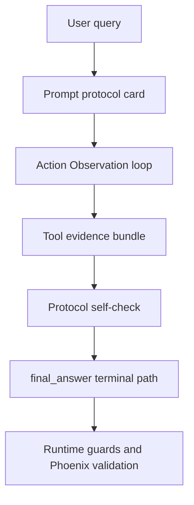

# Smolagents Prompt Patterns for Agent Runtime

**Doc status:** `active` (Phases 0–5 shipped; Phase 6 toolcalling experiment lane shipped behind flag; 2026-05-17 A/B evidence saved; next step = controlled re-baseline before default promotion)  
**Date:** 2026-05-17  
**Checked on:** 2026-05-17  
**Owner:** agent runtime / external research  
**Reviewers:** operator lane owner for trace-review + external-research acceptance  
**Scope:** prompt/tool/final-answer discipline for `science-graphrag` agent runtime.  
**Phase scope:** Phase 0 = source-backed architecture note + instrumentation alignment only (no runtime code changes).  
**Read hint:** architecture note + implementation roadmap; pair with [external-research-tools-workplan-2026-05-15.md](./external-research-tools-workplan-2026-05-15.md), the Phase 6 [decision memo](./phase6-toolcalling-experiment-decision-2026-05-17.md), and the live-audit artifacts linked below.

## Relationship to existing docs

| Doc | Relationship |
|---|---|
| [external-research-tools-workplan-2026-05-15.md](./external-research-tools-workplan-2026-05-15.md) | Product workplan for external tools; **Phase 0 there** = stabilize tools; **Phase 0 here** = prompt/loop/terminal discipline architecture note. |
| [external_research_runtime_acceptance.md](../agent/external_research_runtime_acceptance.md) | Operator acceptance index; use for live gates after Phase 1+. |
| [agent-runtime-overview-ru.md](../architecture/agent-runtime-overview-ru.md) | LangGraph mode map; this note does not replace it. |
| [agent-trace-review-sop.md](../runbooks/agent-trace-review-sop.md) | Trace-review profiles; pairs with observability layering below. |
| [030-external-research-tools-architecture.md](../adr/030-external-research-tools-architecture.md) | ADR for tool package boundary; this note covers model behavior on top of those tools. |
| [langgraph-migration-plan-2026-04-25.md](./langgraph-migration-plan-2026-04-25.md) | **Historical:** smolagents library removal / LangGraph migration — not the same as borrowing prompt patterns without the dependency. |
| [agent-runtime-tools-context-roadmap-2026-05-04.md](./agent-runtime-tools-context-roadmap-2026-05-04.md) | Operational roadmap for `tool_search`, compaction, writer discipline; see also, do not duplicate here. |

## Executive Summary

`smolagents` demonstrates a strong prompt-layer discipline that reduces common agent failure modes: action loops that never terminate, repeated tool calls, and weak recovery after tool errors. The key insight is not any single line like "always call final_answer", but a coherent protocol:

1. explicit step loop (`Action/Observation` or `Thought/Code/Observation`);
2. narrow terminal path through `final_answer`;
3. concrete anti-pattern rules for tool invocation;
4. examples of recoverable failure behavior;
5. contract-style output for managed subagents.

For `science-graphrag`, this is directly applicable in prompt architecture, but not as a replacement for runtime invariants. Safety policy, tool availability, and observability must remain deterministic in code.

The broader lesson from smolagents/ReAct/OpenAI Agents/LangGraph is that reliable agents need three layers working together:

1. **Prompt protocol**: tells the model how to think, act, observe, recover, and terminate.
2. **Runtime loop contract**: decides when to continue, hand off, validate, pause, or stop.
3. **Validation and observability**: proves whether the terminal answer and tool spans actually happened.

Our current work should therefore not be framed as "replace deterministic code with prompts". It should be framed as "move model-intended behavior into a clear protocol, while keeping invariants as enforcement and diagnostics".

## Decision Summary

### Borrow

- Smolagents-style protocol cards: concise step contract, failure contract, and terminal contract.
- ReAct's explicit `reason -> act -> observe -> answer` loop as prompt vocabulary.
- OpenAI Agents' production-loop framing: continue until tool call, handoff, or final answer; treat pauses/failures as first-class states.
- Smolagents `final_answer_checks` concept, implemented locally against our typed `final_answer` payload and evidence metadata.
- Managed-agent report shape for forked retrieval/subagent output.

### Reject

- Do not migrate the main runtime to smolagents `CodeAgent`.
- Do not install smolagents as a production dependency for this work.
- Do not replace SSRF/PDF/source policies, tool allowlists, or Phoenix checks with prompt text.
- Do not create a second production agent loop unless a small experimental lane wins on the same live matrix.

### Keep Invariant

- LangGraph remains the production orchestration layer.
- Deterministic safety, evidence, and observability guards remain code-owned.
- External research quality is judged by three independent surfaces: runtime result, tool trace, and Phoenix trace.
- Generic fallback is not an acceptable terminal answer when grounded partial evidence exists.

## Source Snapshot

| Source | Version / surface checked | Checked on | Used for |
|---|---|---|---|
| smolagents prompt templates | GitHub `main` (`code_agent.yaml`, `toolcalling_agent.yaml`, `structured_code_agent.yaml`) | 2026-05-17 | protocol wording, terminal `final_answer`, anti-pattern style |
| smolagents docs | `v1.23.0` agents reference | 2026-05-17 | `MultiStepAgent`, `max_steps`, `final_answer_checks`, result/stream surfaces |
| smolagents docs | `v1.11.0` "Building good agents" | 2026-05-17 | conservative workflow guidance, deterministic functions, tool error information flow |
| ReAct paper | arXiv `2210.03629v3` | 2026-05-17 | conceptual reason/action/observation loop |
| OpenAI Agents docs | live "Running agents" guide | 2026-05-17 | production loop, handoff/final-answer stopping, state/resume/failure framing |
| LangGraph docs | live agents documentation | 2026-05-17 | explicit graph state, tool calls, graph-level control flow |
| Live baseline | [`external-web-hot-topics-cv-live-2026-05-16.md`](../../eval/results/external-web-hot-topics-cv-live-2026-05-16.md) (+ harness JSON when present) | 2026-05-16 run | observed failure classes and metric split |
| Live A/B baseline | [`external-web-hot-topics-cv-live-baseline.md`](../../eval/results/external-web-hot-topics-cv-live-baseline.md) / [`json`](../../eval/results/external-web-hot-topics-cv-live-baseline.json) / [`phoenix failures`](../../eval/results/external-web-hot-topics-cv-live-baseline_phoenix_failures.jsonl) | 2026-05-17 run | conservative lane after Phases 1–5; `next_slice_gates.all_ok=false` |
| Live A/B experiment | [`external-web-hot-topics-cv-live-experiment.md`](../../eval/results/external-web-hot-topics-cv-live-experiment.md) / [`json`](../../eval/results/external-web-hot-topics-cv-live-experiment.json) / [`phoenix failures`](../../eval/results/external-web-hot-topics-cv-live-experiment_phoenix_failures.jsonl) | 2026-05-17 run | Phase 6 flagged toolcalling lane; `next_slice_gates.all_ok=true` |

### Revalidation policy

- **Versioned smolagents docs:** re-check when bumping any planned Phase 1+ prompt protocol.
- **GitHub `main` prompt YAML:** pin to a commit SHA in the PR that changes prompt text derived from those templates; at minimum re-read `main` before each external-research prompt rollout.
- **Live OpenAI/LangGraph URLs:** verify links still resolve; terminology drift is acceptable if decisions (loop until tool/handoff/final answer; graph state) still hold.
- **Live audit baseline:** re-run `scripts/live_check/external_web_hot_topics_cv_audit.py` after Phase 1+ slices; update the baseline artifact reference in this doc when the matrix changes.

## Observed Failure Context (Current Baseline)

Recent external CV live audit (`1/10` passed) highlights failures that are partly prompt-shape problems and partly runtime contract problems:

- tool-leg often remains at `coordinator_gate` with fallback answer;
- missing `final_answer` tool in some successful-looking runs;
- Phoenix span mismatch (`tool_trace.final_answer` present, span absent);
- generic fallback text despite available intermediate evidence;
- noisy routing under time-budget pressure.

Reference: [`eval/results/external-web-hot-topics-cv-live-2026-05-16.md`](../../eval/results/external-web-hot-topics-cv-live-2026-05-16.md)

The most important signal from this baseline is not only the pass rate. It is the split between layers:

| Metric | Result |
|---|---:|
| Passed cases | 1 / 10 |
| `web_search` / `web_fetch` coverage | 5 / 10 |
| `semantic_scholar` coverage | 5 / 10 |
| `read_external_pdf` coverage | 5 / 10 |
| `final_answer` in tool trace | 3 / 10 |
| runtime-ok cases | 4 / 10 |
| tool-trace-ok cases | 3 / 10 |
| Phoenix-ok cases | 1 / 10 |

This means the remaining problem is multi-layered: tool access improved, but terminalization, budget behavior, route handoff, and Phoenix alignment are still unstable.

## Current A/B Evidence (2026-05-17)

The Phase 6 operator run compared the conservative baseline lane against the flagged toolcalling protocol lane on the same CV hot-topics matrix and workspace (`ws-pilot-od`).

| Lane | Artifact | Passed | runtime_ok | tool_trace_ok | phoenix_ok | final_answer | next_slice_gates |
|---|---|---:|---:|---:|---:|---:|---|
| Conservative baseline | [`md`](../../eval/results/external-web-hot-topics-cv-live-baseline.md) / [`json`](../../eval/results/external-web-hot-topics-cv-live-baseline.json) | 4 / 10 | 5 | 5 | 4 | 5 | `all_ok=false` |
| Toolcalling experiment (`SCIENCE_GRAPHRAG_AGENT_EXTERNAL_RESEARCH_TOOLCALLING_EXPERIMENT_ENABLED=1`) | [`md`](../../eval/results/external-web-hot-topics-cv-live-experiment.md) / [`json`](../../eval/results/external-web-hot-topics-cv-live-experiment.json) | 7 / 10 | 10 | 10 | 7 | 10 | `all_ok=true` |

Sidecars:

- Baseline Phoenix failures: [`external-web-hot-topics-cv-live-baseline_phoenix_failures.jsonl`](../../eval/results/external-web-hot-topics-cv-live-baseline_phoenix_failures.jsonl)
- Experiment Phoenix failures: [`external-web-hot-topics-cv-live-experiment_phoenix_failures.jsonl`](../../eval/results/external-web-hot-topics-cv-live-experiment_phoenix_failures.jsonl)
- Latest alias after the run: [`external-web-hot-topics-cv-live-latest.md`](../../eval/results/external-web-hot-topics-cv-live-latest.md) / [`json`](../../eval/results/external-web-hot-topics-cv-live-latest.json)

Interpretation:

- The experiment is a strong positive signal: it completed all 10 cases, hit all next-slice gates, and improved runtime/tool/final-answer coverage.
- The baseline comparison is not clean enough for immediate default promotion because 5 baseline cases hit `ReadTimeout` at 300s. Treat this as "promote candidate", not "flip default today".
- Production/default runtime should remain the conservative path until a controlled re-baseline reduces the timeout confound.

## Smolagents Prompt Inventory

### 1) `code_agent.yaml`

- Loop model: `Thought -> Code -> Observation`.
- Explicit instruction: finish only via `final_answer`.
- Includes anti-pattern rules:
  - avoid duplicate calls;
  - avoid invalid variables;
  - chain cautiously when output shape is unstable;
  - preserve state across iterations.
- Includes managed-agent framing and a structured plan template.

Source: [code_agent.yaml](https://raw.githubusercontent.com/huggingface/smolagents/main/src/smolagents/prompts/code_agent.yaml)

### 2) `structured_code_agent.yaml`

- Same semantics as code-agent, but output shape is constrained by JSON envelope (`thought`, `code`).
- Better machine readability and safer parsing for orchestration.

Source: [structured_code_agent.yaml](https://raw.githubusercontent.com/huggingface/smolagents/main/src/smolagents/prompts/structured_code_agent.yaml)

### 3) `toolcalling_agent.yaml`

- Pure tool-calling loop:
  - every step is an `Action` blob;
  - loop ends only with `final_answer` action.
- Very compact and strict for production tool routers.
- Minimal but strong hygiene rules:
  - always call a tool;
  - no repeated identical calls;
  - correct argument values.

Source: [toolcalling_agent.yaml](https://raw.githubusercontent.com/huggingface/smolagents/main/src/smolagents/prompts/toolcalling_agent.yaml)

## Smolagents Runtime Inventory

The prompt files are only one part of smolagents. The runtime documentation adds several ideas that matter more for our failures than prompt wording alone.

### `MultiStepAgent`

Smolagents agents are organized around a bounded multi-step loop. The reference docs expose `max_steps` as a first-class parameter and describe final-output surfaces (`return_full_result`, streaming, and step objects). This is close to our LangGraph ReAct loop, but smolagents makes the step boundary more explicit as a product concept.

Relevant lesson for us: expose and test the **turn terminal reason** more clearly, not only the final user text. A failed external-research run should end with machine-readable status like `final_answer_ok`, `partial_final_answer`, `budget_exhausted_with_partial`, or `validation_failed`.

Source: [smolagents Agents reference](https://huggingface.co/docs/smolagents/v1.23.0/reference/agents)

### `final_answer_checks`

Smolagents has a `final_answer_checks` hook: validation functions run before accepting a final answer. This is directly relevant to our current failures. We currently detect a completed `final_answer` in `science_graphrag/agent/final_answer_policy.py`, but we do not have a general answer acceptance layer equivalent to "the final answer exists and is valid for this evidence state".

Candidate local analogue:

- validate non-empty `answer`;
- reject generic fallback if evidence exists;
- check citations against evidence modes;
- flag metadata-only claims;
- require explicit limitation text for failed fetch/PDF-unavailable states;
- attach validation verdict to trace/run metadata before enforcement is enabled.

Source: [smolagents Agents reference](https://huggingface.co/docs/smolagents/v1.23.0/reference/agents)

### `CodeAgent` vs `ToolCallingAgent`

Smolagents positions `CodeAgent` as more expressive and `ToolCallingAgent` as more structured/safe. For `science-graphrag`, the natural mapping is:

- do **not** adopt `CodeAgent` as the main runtime;
- use `ToolCallingAgent` as the conceptual reference for our existing tool-call ReAct loops;
- consider a small isolated external-research experiment only if prompt/validation hardening is insufficient.

Source: [smolagents Guided tour](https://huggingface.co/docs/smolagents/guided_tour)

### `managed_agents`

Smolagents managed agents are called like tools but have explicit names, descriptions, inputs, output types, and report contracts. Our closest equivalent is `specialist_results_v3` plus fork bundles in retrieval. The important lesson is not "spawn more agents"; it is "make the child output contract easy for the parent writer to trust".

Mapping to our runtime:

- `append_parent_tool_leg` / `append_*_leg` already provide typed provenance;
- `merge.writer_directive` carries guidance to writer;
- subagent text should be constrained into a managed-report shape so the writer need not infer too much from arbitrary prose.

Source: [smolagents prompt templates](https://github.com/huggingface/smolagents/tree/main/src/smolagents/prompts)

### Building good agents guidance

The smolagents "Building good agents" guide is more conservative than a prompt-only reading might suggest. It explicitly recommends simplifying workflows, grouping tools where this reduces latency/error risk, preferring deterministic functions where possible, and improving the information flow into the model through clear tool descriptions and useful error messages.

This matters for our roadmap because it supports the current conservative direction:

- strengthen prompts where the model must choose;
- keep deterministic routing/evidence/SSRF policies where code can decide;
- make tool outputs and tool errors easier for the next model step to interpret;
- reduce avoidable multi-step tool choreography when a typed tool or merge layer can package the evidence more reliably.

Source: [smolagents Building good agents](https://huggingface.co/docs/smolagents/v1.11.0/en/tutorials/building_good_agents)

## Cross-framework Synthesis

### ReAct foundation

The ReAct paper frames the core loop as interleaving reasoning traces and actions so the model can update plans, handle exceptions, and gather external evidence. This is exactly the class of failure we saw: once a tool path failed or budget tightened, the agent often did not convert partial observations into a bounded final answer.

Source: [ReAct: Synergizing Reasoning and Acting in Language Models](https://arxiv.org/abs/2210.03629v3)

### OpenAI Agents runtime loop

OpenAI's agent-loop documentation describes the production loop in operational terms:

1. call current agent model;
2. inspect output;
3. execute tool calls and continue;
4. switch agents on handoff;
5. return when there is a final answer with no more tool work.

It also separates ordinary runtime failures from intentional pauses/resumes and recommends choosing one conversation-state strategy per conversation. This is useful for our API/SSE layer: budget exhaustion, resume handling, and missing final answer should not collapse into a generic user fallback; they should become explicit terminal states.

Source: [OpenAI Running agents](https://developers.openai.com/api/docs/guides/agents/running-agents)

### LangGraph production concerns

LangGraph is closest to our implementation model: explicit state, graph edges, tool nodes, and handoffs. Production ReAct issues called out in ecosystem material match our current symptoms:

- empty responses;
- stuck loops;
- context overflow;
- silent termination;
- tool errors that do not become user-visible limitations;
- final response extraction problems.

This reinforces that prompt hardening alone is insufficient: graph edges and state reducers must expose terminal reasons.

Source: [LangGraph agents documentation](https://langchain-ai.github.io/langgraph/agents/agents/)

## Root Cause Reframing

The live-audit failures should be grouped by layer instead of treated as one "bad prompt" problem.

| Layer | Symptom in audit | Likely owner | Required response |
|---|---|---|---|
| Prompt protocol | Retrieval loops or skips required sequence | `retrieval_subgraph.py`, `subagent_output_contract.py` | Protocol cards + anti-pattern clauses |
| Tool availability | Agent cannot call intended tool or sees noisy catalog | `tool_search.py`, allowed-tools matrix | Bind-surface assertions and trace metadata |
| Loop/handoff | Tool evidence exists but writer not reached or not accepted | `route_planner.py`, `supervisor_decisions.py`, `react_edges.py` | Explicit handoff and terminal reasons |
| Final answer validation | Plain answer/fallback without valid `final_answer` tool | `writer_agent.py`, `final_answer_policy.py` | `final_answer_checks` analogue |
| Timeout/budget | "response budget almost exhausted" answer | `writer_agent.py`, response-budget cutoff | partial-answer synthesis before cutoff |
| Observability | `tool_trace.final_answer` present but Phoenix span missing | tracing/export/live audit | keep separate Phoenix verdict and sidecar spans |

### Failure classes from current CV matrix

- **Coordinator-gate-only fallback:** cases like `vla_robotics`, `efficient_edge_cv`, `synthetic_data_cv`, `multimodal_pretraining_cv`, `document_vlm_ocr_free`. This points to first-hop route/tool-policy failure or API fallback before retrieval.
- **Evidence-rich missing final answer:** `open_vocabulary_detection` produced answer text and citations, but no `final_answer` tool. This is a terminal contract failure.
- **Budget-exhausted terminal text:** `gaussian_splatting` and `medical_foundation_vision` reached many tools and a `final_answer`, but surfaced budget-exhaustion copy and Phoenix mismatch. This is loop/budget/observability interaction, not just retrieval quality.
- **Generic fallback after tool work:** `video_diffusion_world_models` used many external tools but returned generic fallback. This is the clearest case for a final-answer validation/salvage layer.

### Timeout and budget scope

Budget handling is not only a prompt problem. The current cutoff path lives around `react_chat_response_budget_cutoff` in [`react_edges.py`](../../science_graphrag/agent/graph/react_edges.py), and the user-visible text currently says the turn stopped before another model step. For external research, that is often the wrong last mile: if evidence already exists, stopping should prefer a bounded partial answer over a generic budget notice.

Implementation scope:

- preserve the hard budget cutoff and reserve settings;
- attach `agent_response_budget_cutoff` as a terminal diagnostic;
- before emitting budget text, check whether tool evidence or `specialist_results_v3` can support a partial answer;
- record whether salvage was attempted, accepted, or unavailable;
- make live audit report budget cutoff separately from missing-tool and missing-final-answer failures.

Out of scope:

- removing the response budget;
- letting the model exceed timeout to synthesize a prettier answer;
- hiding budget failure under a successful-looking answer without terminal metadata.

## Patterns Worth Adopting

### A. Protocol-first prompt style

Use a compact "protocol card" at the top of specialist prompts:

- **Step contract:** what must happen before completion.
- **Completion contract:** exact terminal condition.
- **Failure contract:** how to degrade gracefully.

This is more robust than long narrative prompt text.

### B. Terminal-path clarity

`smolagents` repeatedly reinforces that `final_answer` is the only completion action.  
We should reinforce this in prompt language for writer and retrieval handoff expectations.

### C. Anti-pattern denial in prompt

Port concise "do not" rules:

- do not repeat same tool call with same args;
- do not stop on metadata-only evidence when fetchable URLs exist;
- do not claim full-text findings without full-text evidence mode;
- do not emit generic refusal if partial grounded synthesis is possible.

### D. Managed-subagent output contracts

`smolagents` has explicit "report sections" for managed agents.  
This aligns with our typed merge (`specialist_results_v3`) and can improve subagent consistency.

### E. Final answer checks

Adopt the concept behind smolagents `final_answer_checks`, but implement it natively:

- first as diagnostics;
- then as optional enforcement behind a feature flag;
- finally as a required gate for external-research lanes.

The checker should not call another LLM by default. It should inspect structured `final_answer` payload, citations, tool trace, `specialist_results_v3.merge`, and evidence modes.

Draft verdict shape:

```json
{
  "status": "ok | warn | fail",
  "reasons": ["generic_fallback_with_evidence"],
  "terminal_reason": "partial_final_answer",
  "evidence_present": true,
  "citation_count": 3,
  "enforcement_mode": "diagnostic | enforced",
  "user_visible_answer_allowed": true
}
```

This verdict should be trace/debug metadata first. Enforcement should only block or rewrite answers after diagnostic live evidence shows low false positives.

## Patterns Not Suitable for Direct Adoption

### 1) Prompt-only replacement of runtime safety

Not acceptable:

- SSRF / URL policy (`web_fetch`/PDF host policy) cannot be prompt-trusted;
- denylist / allow-matrix cannot be prompt-trusted;
- observability assertions (Phoenix spans) cannot be prompt-trusted.

### 2) Full migration to Python code-agent loop

Our runtime is LangGraph + tool nodes + typed state, not notebook-like code execution.  
A direct switch to code-agent mode would add complexity, not reduce it.

### 3) Removing deterministic fallback guards

Given current failures, removing `_ensure_terminal_final_answer_tool_call`-class guards would regress reliability.

### 4) Treating `ToolCallingAgent` as a drop-in replacement

Smolagents `ToolCallingAgent` is conceptually aligned, but our runtime already has:

- LangGraph state transitions;
- API/SSE event contracts;
- Phoenix trace contracts;
- typed specialist merge;
- workspace and graph tools;
- PDF/SSRF policy.

A drop-in migration would likely create a second agent runtime instead of simplifying the existing one.

## Mapping to Current Runtime

| Runtime area | Current mechanism | Smolagents-inspired improvement | Keep deterministic guard? |
|---|---|---|---|
| Retrieval prompt | Long narrative `SYSTEM_PROMPT` in [`retrieval_subgraph.py`](../../science_graphrag/agent/graph/nodes/retrieval_subgraph.py) | Add compact `ExternalResearchProtocol` section with explicit step gates and anti-patterns | Yes |
| Writer terminal behavior | Prompt + runtime fallback in [`writer_agent.py`](../../science_graphrag/agent/graph/nodes/writer_agent.py) | Add explicit `WriterTerminalProtocol` and partial-answer synthesis rule in prompt | Yes |
| Tool selection | Rule shortlist in [`tool_search.py`](../../science_graphrag/agent/tool_search.py) | Reduce heuristic sprawl by moving some sequencing expectations into protocol prompts | Yes |
| Subagent contracts | Typed legs/merge in [`specialist_results_v3.py`](../../science_graphrag/agent/subagents/specialist_results_v3.py) | Adopt stronger managed-agent sectioned output style | Yes |
| Writer guidance | Directive bundle in [`subagent_output_contract.py`](../../science_graphrag/agent/subagent_output_contract.py) | Reformat into protocol cards (`must`, `must-not`, `if-failure`) | Yes |
| Final answer validation | Completed-tool detection in [`final_answer_policy.py`](../../science_graphrag/agent/final_answer_policy.py) | Add smolagents-like `final_answer_checks` analogue | Yes |
| Loop / handoff | Route plan + supervisor decisions | Make terminal/handoff reason explicit in state and traces | Yes |

## Traceability Matrix (failure → source → runtime → phase)

| Live-audit failure class | Borrowed pattern / source | Runtime area (existing files) | Phase |
|---|---|---|---|
| Coordinator-gate-only fallback | OpenAI loop: distinguish handoff vs stop; smolagents terminal discipline | `supervisor_decisions.py`, `route_planner.py`, API salvage | 3 |
| Evidence-rich missing `final_answer` | smolagents `final_answer` + `final_answer_checks`; ReAct bounded answer | `writer_agent.py`, `final_answer_policy.py` | 2, 3 |
| Budget-exhausted generic text | OpenAI failure vs pause; partial synthesis before stop | `react_edges.py`, `runtime_answer_salvage.py`, `writer_agent.py` | 3 |
| Generic fallback after tool work | smolagents anti-patterns; local `final_answer_checks` analogue | `writer_agent.py`, `runtime_answer_salvage.py` | 2 |
| Phoenix span mismatch | Keep runtime/tool/Phoenix as independent verdicts (this note) | tracing export, `external_web_hot_topics_cv_audit.py` | 0, 3 |
| Metadata-only / weak fetch mix | Retrieval protocol + evidence policy gates | `retrieval_subgraph.py`, `web_evidence_policy.py`, `subagent_output_contract.py` | 1 |
| Noisy tool catalog / wrong tool | smolagents "simplify workflow"; deterministic shortlist | `tool_search.py`, `request_turn_policy.py` | 1 (prompt), keep code guards |
| Subagent prose hard to merge | smolagents managed-agent report sections | `specialist_results_v3.py`, `retrieval_fork_legs.py` | 4 |

## Proposed Prompt Contracts (Draft — Phase 0 hypotheses only)

**Status:** draft hypotheses for Phase 1+ implementation. Not an accepted runtime or API contract until covered by prompt-contract tests and live-audit movement.

### Retrieval: `ExternalResearchProtocol`

1. If web intent: call `web_search` + at least one `web_fetch` for fetchable URL.
2. If scholar intent: include `semantic_scholar_search`/`semantic_scholar_paper`.
3. If PDF intent:
   - find candidate via arXiv/OA/Unpaywall/S2;
   - call `read_external_pdf` when safe candidate exists;
   - else emit structured `pdf_unavailable` limitation.
4. Do not end on metadata-only evidence when fetch paths are available.
5. Return tool outputs only.

### Writer: `WriterTerminalProtocol`

1. Always terminate with `final_answer`.
2. If evidence is partial, synthesize bounded partial answer with explicit limitations.
3. Never claim full-text support for metadata-only evidence.
4. If official sources not fetched, avoid negative-existence claims.

### Subagents: `ManagedReportProtocol`

Use explicit report sections in subagent text payload:

- `Task outcome (short)`
- `Task outcome (detailed)`
- `Open limitations / next checks`

This aligns with `specialist_results_v3.merge.writer_directive` and completion-state logic.

## Architecture Options

### Option A: Conservative (recommended now)

- Prompt hardening only (protocol cards + anti-pattern clauses).
- Keep current deterministic runtime guards untouched.
- Measure delta via existing live harness.

Risk: low.  
Expected gain: medium (consistency, fewer prompt-level misses).

Implementation target:

- no dependency changes;
- no new runtime;
- prompt protocol cards;
- final-answer validation in diagnostics mode only.

### Option B: Medium

- Option A + tighter loop budget signaling + explicit self-check substep before completion.
- Light simplification of some deterministic heuristics where prompt coverage proves stable.
- Terminal reason vocabulary in run metadata.

Risk: medium.  
Expected gain: medium-high.

### Option C: Experimental

- Isolated runner that emulates `toolcalling_agent` loop style for external research turns only.
- A/B behind feature flag.
- Must reuse existing external tools, SSRF/PDF guards, and Phoenix span wrappers.

Risk: high.  
Expected gain: uncertain.

## Recommended Rollout

### Phase 0 (source-backed architecture note) — **done in this doc**

- This document is the canonical architecture note for prompt/loop/terminal discipline.
- Inbound links: workplan, acceptance index, runtime overview, trace-review SOP, ADR 030, analysis README.
- Raw prompt dumps and large trace snippets belong in `docs/analysis/_snippets/` or `eval/results/`, not as primary prose here.

Acceptance (Phase 0 only):

- explicit `Borrow`, `Reject`, and `Keep Invariant` decisions;
- traceability matrix and instrumentation alignment appendix;
- no production smolagents dependency and no runtime migration as prerequisite.

Implementation phases **1–6** below are **out of Phase 0 scope** until opened as separate PRs.

### Phase boundary (do not mix slices)

| Phase | In scope | Out of scope |
|---|---|---|
| **1** | Named protocol cards in prompts; prompt-contract unit tests | Answer validation enforcement, `terminal_reason` emission, budget salvage behavior changes |
| **2** | `final_answer_checks` analogue; diagnostics verdict JSON; optional enforcement flag | Phoenix field alignment, route-plan changes |
| **3** | `terminal_reason` vocabulary in run metadata; partial synthesis on budget cutoff; live-audit reporting | Removing `_ensure_terminal_final_answer_tool_call` guards |

Code anchors for Phase 1: [`science_graphrag/agent/prompt_protocol_cards.py`](../../science_graphrag/agent/prompt_protocol_cards.py), [`retrieval_subgraph.py`](../../science_graphrag/agent/graph/nodes/retrieval_subgraph.py), [`writer_agent.py`](../../science_graphrag/agent/graph/nodes/writer_agent.py), [`subagent_output_contract.py`](../../science_graphrag/agent/subagent_output_contract.py).

### Phase 1 (prompt protocols, no structural risk) — **shipped**

- Protocol-card format in retrieval/writer prompt builders (`ExternalResearchProtocol`, `WriterTerminalProtocol`).
- All existing hard guards unchanged.
- Focused prompt-contract tests in `tests/agent/test_prompt_protocol_cards.py`.

Acceptance (Phase 1):

- [x] retrieval prompt has a named external-research protocol block;
- [x] writer prompt/suffix has a named terminal protocol block;
- [x] tests assert required clauses for `final_answer`, partial evidence, metadata-only evidence, and PDF-unavailable behavior;
- [x] no existing deterministic guard removed in this phase.

**Live regression baseline after Phase 1:** prefer CV matrix  
[`eval/results/external-web-hot-topics-cv-live-2026-05-16.md`](../../eval/results/external-web-hot-topics-cv-live-2026-05-16.md)  
(`scripts/live_check/external_web_hot_topics_cv_audit.py`) for runtime/tool/Phoenix split. Use orchestrated closeout  
[`eval/results/external-research-closeout-2026-05-17/index.json`](../../eval/results/external-research-closeout-2026-05-17/index.json)  
for per-source lane health — see [`external_research_runtime_acceptance.md`](../agent/external_research_runtime_acceptance.md) §Canonical operator snapshots.

### Phase 1 closeout (documentation / evidence — not new prompt logic)

Code acceptance for Phase 1 is **done** (protocol cards + `tests/agent/test_prompt_protocol_cards.py`). Remaining work is operator/doc alignment only:

| Item | Owner | Status |
|---|---|---|
| Re-run CV matrix after prompt/validation slices | `scripts/live_check/external_web_hot_topics_cv_audit.py` | operator lane |
| Compare against baseline `eval/results/external-web-hot-topics-cv-live-2026-05-16.*` | analysis + acceptance index | reference |
| Per-source lane health | `eval/results/external-research-closeout-2026-05-17/index.json` | canonical when matrix unchanged |
| Managed-subagent report section tests | Phase 4 (`ManagedReportProtocol`) | **out of Phase 1 scope** |

**Acceptance Checks** numeric gates (`runtime_ok_cases >= 6/10`, etc.) are **next-slice targets**, not claims that Phase 1 alone moved the baseline. See §Acceptance Checks for minimum vs stretch targets.

### Phase 2 (final answer validation analogue) — **shipped (diagnostics-only)**

- Add a native validator inspired by `final_answer_checks`.
- Start in diagnostics-only mode.
- Validate:
  - non-empty answer;
  - no generic fallback when evidence exists;
  - citation/evidence-mode compatibility;
  - explicit limitation for metadata-only/PDF-unavailable/failed-fetch states.

Concrete files:

- [`science_graphrag/agent/final_answer_policy.py`](../../science_graphrag/agent/final_answer_policy.py)
- [`science_graphrag/agent/graph/nodes/writer_agent.py`](../../science_graphrag/agent/graph/nodes/writer_agent.py)
- [`science_graphrag/agent/subagents/specialist_results_v3.py`](../../science_graphrag/agent/subagents/specialist_results_v3.py)
- [`science_graphrag/agent/runtime_answer_salvage.py`](../../science_graphrag/agent/runtime_answer_salvage.py)

Acceptance:

- [x] validator returns structured verdicts, not only booleans (`science_graphrag/agent/final_answer_validation.py`);
- [x] diagnostics mode records verdicts via `debug_events` type `final_answer_validation` → `run_metadata.final_answer_validation` without changing user-visible behavior by default;
- [x] tests in `tests/agent/test_final_answer_validation.py` and writer integration tests;
- [x] enforcement flag `agent_final_answer_validation_enforcement_enabled` defaults **off** until live evidence improves.
- [x] enforcement-readiness gates documented in code (`ENFORCEMENT_READINESS_GATES` in `final_answer_validation.py`); flip enforcement only after CV matrix meets next-slice targets.

Code anchors: [`final_answer_validation.py`](../../science_graphrag/agent/final_answer_validation.py), [`runtime.py`](../../science_graphrag/agent/runtime.py) (canonical per-turn verdict after citation hydration), [`runtime_answer_salvage.py`](../../science_graphrag/agent/runtime_answer_salvage.py) (enforcement partial synthesis), [`debug_events_telemetry.py`](../../science_graphrag/agent/debug_events_telemetry.py).

### Phase 3 (loop and handoff discipline) — **shipped (runtime metadata + audit split)**

- Add explicit terminal reason vocabulary.
- Ensure budget-exhaustion paths synthesize partial answers when evidence exists.
- Make route/handoff failures visible in run metadata and Phoenix events.

Initial terminal reason vocabulary:

- `final_answer_ok`
- `partial_final_answer`
- `budget_exhausted_with_partial`
- `budget_exhausted_without_evidence`
- `coordinator_gate_fallback`
- `validation_failed`
- `tool_trace_missing_final_answer` *(audit-only; live harness `audit_diagnostics`, not runtime `terminal_reason`)*
- `phoenix_missing_final_answer_span` *(audit-only; live harness `audit_diagnostics`, not runtime `terminal_reason`)*

Concrete files:

- [`science_graphrag/agent/terminal_reason.py`](../../science_graphrag/agent/terminal_reason.py)
- [`science_graphrag/agent/runtime.py`](../../science_graphrag/agent/runtime.py)
- [`science_graphrag/agent/debug_events_telemetry.py`](../../science_graphrag/agent/debug_events_telemetry.py)
- [`science_graphrag/agent/coordination/route_planner.py`](../../science_graphrag/agent/coordination/route_planner.py)
- [`science_graphrag/agent/graph/supervisor_decisions.py`](../../science_graphrag/agent/graph/supervisor_decisions.py)
- [`science_graphrag/agent/graph/react_edges.py`](../../science_graphrag/agent/graph/react_edges.py)
- `scripts/live_check/external_web_hot_topics_cv_audit.py`

Acceptance:

- [x] `terminal_reason` resolved in `runtime.py` and emitted via `run_metadata.terminal_reason`, nested `final_answer_validation.terminal_reason`, and `debug_events` (`terminal_outcome`);
- [x] coordinator-gate-only fallback distinguishable (`coordinator_gate_fallback`) from budget/validation outcomes;
- [x] budget pressure with evidence attempts partial synthesis before generic fallback (not only under enforcement);
- [x] live audit reports `terminal_reason` + `audit_diagnostics` alongside runtime/tool_trace/phoenix verdicts;
- [ ] numeric next-slice gates on CV matrix (`runtime_ok_cases >= 6/10`, …) — **2026-05-17 baseline rerun** (`eval/results/external-web-hot-topics-cv-live-baseline.json`): `all_ok=false` (5/5/4/5 vs 6/6/5/8); 5× `ReadTimeout` on long cases — see fail-buckets below.

### Phase 4 (subagent contract simplification) — **shipped (typed merge + parser)**

- Align forked subagent output with a managed-agent report contract.
- Prefer typed merge fields over free-form prompt prose.
- Keep `specialist_results_v3` as the parent-facing contract.

Concrete files:

- [`science_graphrag/agent/graph/nodes/retrieval_fork_legs.py`](../../science_graphrag/agent/graph/nodes/retrieval_fork_legs.py)
- [`science_graphrag/agent/subagents/specialist_results_v3.py`](../../science_graphrag/agent/subagents/specialist_results_v3.py)
- [`science_graphrag/agent/subagent_output_contract.py`](../../science_graphrag/agent/subagent_output_contract.py)

Acceptance:

- [x] subagent report sections are documented and testable (`ManagedReportProtocol` in `subagent_output_contract.py`, `tests/agent/test_subagent_output_contract.py`);
- [x] `specialist_results_v3.merge` carries `limitations`, `next_checks`, `outcome_summary`, `report_sections_present` in typed metadata;
- [x] writer/salvage/validation consume typed merge fields; `writer_directive` remains backward-compatible synthesis text.

### Phase 5 (controlled simplification) — **shipped (dedup slice)**

- Centralized `final_answer` nudge copy in [`prompt_protocol_cards.py`](../../science_graphrag/agent/prompt_protocol_cards.py) (consumed by `react_edges.py`).
- Typed managed-report fields no longer duplicated into `writer_directive` when `report_sections_present` (see `specialist_results_v3._compute_merge`).
- Salvage partial answers use `format_salvage_limitation_lines` so typed `limitations` / `next_checks` are not re-labeled as duplicate prose.

Acceptance:

- [x] nudge text single source + contract test (`tests/agent/test_prompt_protocol_cards.py`);
- [x] managed-report directive dedup + salvage formatter tests;
- [x] safety/SSRF/PDF/Phoenix invariants unchanged (code-owned).

### Phase 6 (optional experiment) — **shipped (flagged lane; A/B evidence positive)**

- Flag: `SCIENCE_GRAPHRAG_AGENT_EXTERNAL_RESEARCH_TOOLCALLING_EXPERIMENT_ENABLED` (default off).
- Retrieval specialist swaps to `## ToolcallingExternalResearchProtocol` via `build_retrieval_system_prompt(settings)`.
- CV harness: `--lane-label` + `--compare-json` on `scripts/live_check/external_web_hot_topics_cv_audit.py`.
- Decision memo: [`phase6-toolcalling-experiment-decision-2026-05-17.md`](./phase6-toolcalling-experiment-decision-2026-05-17.md).

Acceptance:

- [x] experiment behind feature flag; reuses existing tools/safety wrappers;
- [x] same runtime/tool/Phoenix verdict schema as main lane;
- [x] operator A/B on CV matrix (2026-05-17): experiment lane `next_slice_gates.all_ok=true` vs baseline `false` (baseline had 5× ReadTimeout); see [`phase6-toolcalling-experiment-decision-2026-05-17.md`](./phase6-toolcalling-experiment-decision-2026-05-17.md). Default runtime remains conservative path.

Decision:

- Keep the experiment lane available behind `SCIENCE_GRAPHRAG_AGENT_EXTERNAL_RESEARCH_TOOLCALLING_EXPERIMENT_ENABLED=1`.
- Do **not** delete it: it beat the conservative lane on this matrix.
- Do **not** flip it default-on yet: baseline had 5× `ReadTimeout`, so the comparison needs one cleaner confirmation run.

## Operator fail-buckets (baseline CV 2026-05-17)

Fresh run on healthy contour (`eval/results/external-web-hot-topics-cv-live-baseline.md`):

| Bucket | Count | Typical signal | Follow-up module |
|---|---:|---|---|
| Request timeout | 5 | `ReadTimeout`, empty tool trace | `agent_step_timeout` / CV `--timeout`; consider narrower cases |
| Phoenix span mismatch | 1 | `missing_span_but_tool_trace_present` | observability / `final_answer` span export |
| Next-slice gate miss (completed cases) | 5 ok cases | runtime/tool_trace/phoenix short of 6/6/5/8 | Phase 5+ routing/budget, not Phase 4 merge |

`generic_fallback_with_evidence_cases == 0` — Phase 2/4 salvage path held on completed runs.

## Next Decision

Recommended next step: run a **controlled re-baseline** before promoting Phase 6.

1. Re-run conservative baseline with a less confounded setup:
   - same matrix/workspace;
   - `--timeout 600` or split the 10-case matrix into smaller batches;
   - API stable contour (`docker-compose.live-check.yml`);
   - no repo file edits during the run.
2. Re-run the toolcalling experiment under the same conditions.
3. Promote `agent_external_research_toolcalling_experiment_enabled` from operator-only to default-on only if:
   - experiment still passes `next_slice_gates.all_ok`;
   - experiment is not worse on `phoenix_ok_cases`;
   - `generic_fallback_with_evidence_cases` remains `0`;
   - baseline timeouts no longer explain the delta.

If the confirmation run matches the 2026-05-17 signal, the practical next implementation slice is small: rename the flag from "experiment" to a stable external-research protocol setting, keep an emergency disable flag for one release, and update operator docs to treat the toolcalling protocol as the default external-research prompt path.

## Acceptance Checks

### Unit / contract

- Existing:
  - `tests/agent/test_web_evidence_policy.py`
  - `tests/agent/test_writer_agent_tool_guard.py`
  - `tests/scripts/live_check/test_external_web_hot_topics_cv_audit.py`
- Add prompt-contract checks:
  - retrieval protocol presence;
  - writer protocol presence;
  - managed-subagent report section checks.
- Add final-answer validation checks:
  - generic fallback rejected when citations/tool payloads exist;
  - metadata-only claims require limitation;
  - budget-exhausted partial answer is accepted only with explicit terminal reason.

### Live / runtime

- Re-run external CV matrix and compare against current baseline.
- Minimum next-slice gates:
  - `runtime_ok_cases >= 6/10`;
  - `tool_trace_ok_cases >= 6/10`;
  - `phoenix_ok_cases >= 5/10`;
  - `final_answer` tool-trace coverage `>= 8/10`;
  - generic fallback after non-empty evidence `0/10`.
- Stretch target after enforcement:
  - `runtime_ok_cases >= 8/10`;
  - `tool_trace_ok_cases >= 8/10`;
  - Phoenix mismatch (`tool_trace.final_answer` present, span absent) `<= 1/10`.

### Observability

- Track `missing_span_but_tool_trace_present` separately from runtime misses.
- Keep sidecar span dump as mandatory artifact for failed cases.
- Emit terminal reason in run metadata and/or debug events.

## Non-goals (Explicit)

- No replacement of safety policies with prompt text.
- No removal of terminal final-answer guardrails until covered by explicit tests and live evidence.
- No migration to full Python code-agent runtime.
- No production dependency on smolagents in this analysis step.
- No parallel prompt stack that duplicates existing LangGraph runtime semantics.

## Instrumentation Alignment Appendix

Phase 0 defined vocabulary; Phase 3 emits runtime `terminal_reason` in production metadata. Audit-only mismatch keys remain in live harness `audit_diagnostics`.

### Three verdict surfaces (keep independent)

| Surface | What it proves | Example failure signal |
|---|---|---|
| **Runtime** | User-visible answer acceptable for the question | generic fallback, budget notice only |
| **Tool trace** | Catalog tools ran in expected sequence | missing `final_answer`, coordinator-only leg |
| **Phoenix** | Observability spans match tool trace | `final_answer` in trace, span absent |

Live harness reference: `scripts/live_check/external_web_hot_topics_cv_audit.py` (reports `runtime` / `tool_trace` / `phoenix` per case).

### `terminal_reason` (runtime-owned run/debug metadata)

| Value | Meaning | Should correlate with |
|---|---|---|
| `final_answer_ok` | Completed `final_answer` with passing validation | tool trace + Phoenix |
| `partial_final_answer` | Bounded answer with explicit limitations | evidence in `specialist_results_v3` |
| `budget_exhausted_with_partial` | Budget cutoff after salvage attempt with evidence | `agent_response_budget_cutoff` debug event |
| `budget_exhausted_without_evidence` | Budget cutoff, no grounded salvage | coordinator or early stop |
| `coordinator_gate_fallback` | No specialist leg; gate-only path | tool trace stops at `coordinator_gate` |
| `validation_failed` | `final_answer_checks` analogue rejected payload | diagnostics before enforcement |

Audit-only (live harness `audit_diagnostics`, not `terminal_reason`):

| Key | Meaning |
|---|---|
| `tool_trace_missing_final_answer` | No `final_answer` tool in trace |
| `phoenix_missing_final_answer_span` | Tool trace vs Phoenix span mismatch |

### Field placement (current)

| Field / concept | Run/debug metadata | Tool trace / SSE | Phoenix / live audit |
|---|---|---|---|
| `terminal_reason` | yes (`extract_runtime_telemetry_from_debug_events`) | `debug_events` `terminal_outcome` | reported in CV audit JSON/MD |
| `audit_diagnostics` | no (harness-computed) | no | per-case in CV audit |
| `final_answer_validation` | diagnostics JSON | no | no |
| `budget_stop_reasons` | already partially (`agent_response_budget_cutoff`) | yes | compare in trace-review |
| Per-case verdicts | — | — | `runtime_ok`, `tool_trace_ok`, `phoenix_ok` |

## Conceptual Flow



## Phase 0 Definition of Done

- [x] Source snapshot includes `checked_on` and revalidation policy.
- [x] `Borrow` / `Reject` / `Keep Invariant` and relationship to adjacent docs are explicit.
- [x] Traceability matrix links live failures → sources → files → phases.
- [x] Instrumentation alignment appendix defines verdict surfaces and `terminal_reason` vocabulary.
- [x] Inbound links from workplan, acceptance, architecture overview, trace-review SOP, ADR 030, and analysis README.
- [x] Draft prompt contracts marked as Phase 0 hypotheses, not shipped contracts.
- [x] No runtime code change required to accept Phase 0.

## Conclusion

`smolagents` is useful here as a prompt-discipline reference, not as a runtime replacement.  
Best path for `science-graphrag`: adopt protocolized ReAct/tool instructions and managed-output structure while retaining deterministic safety and observability invariants.
