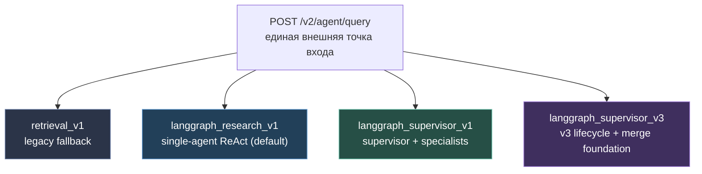
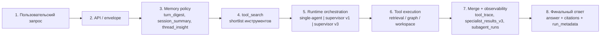
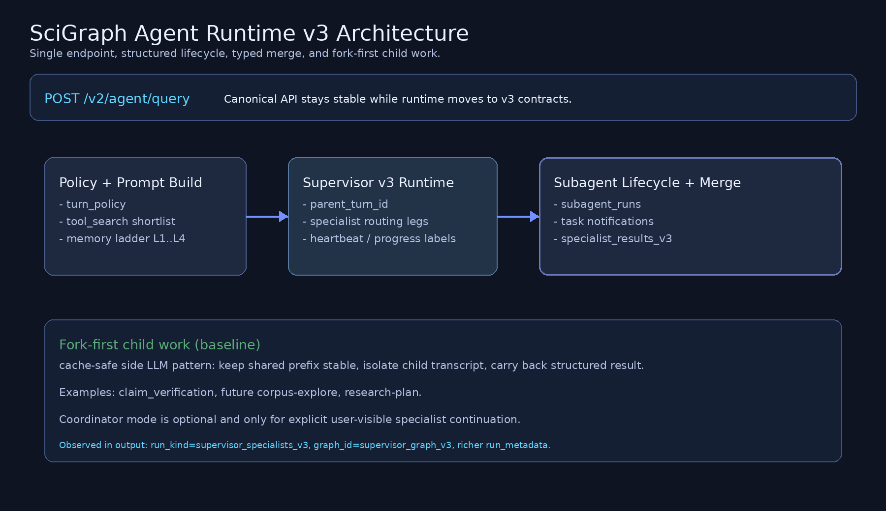

# Архитектура агентного рантайма SciGraph

Практический обзор того, **какие варианты архитектуры агента уже есть в репозитории**, **как они связаны между собой** и **в какой целевой контур движется система**.

Документ задуман как инженерная точка входа: его можно читать без предварительного погружения в roadmap, ADR и кодовую базу. Для детальных контрактов и исторических решений в конце есть ссылки на первоисточники.

**См. также (англ., external research / terminal discipline):** [`smolagents-prompt-patterns-for-agent-runtime-2026-05-17.md`](../analysis/smolagents-prompt-patterns-for-agent-runtime-2026-05-17.md) — как усилить промпт-протокол и `final_answer` поверх этого runtime, не заменяя LangGraph и детерминированные guards.

## Зачем это читать

Этот обзор отвечает на четыре вопроса:

1. Почему под одним `POST /v2/agent/query` у нас живут несколько разных runtime-режимов.
2. Чем отличаются `single-agent`, `supervisor` и `v3 subagent foundation`.
3. Где в системе находятся память, `tool_search`, merge и observability.
4. Почему стратегический вектор сейчас направлен в `langgraph_supervisor_v3`, но без взрывного переписывания всего HTTP/API слоя.

## Коротко

- **Исторически** у нас есть legacy-контур `retrieval_v1`.
- **Текущий дефолт** в настройках - `langgraph_research_v1`: один ReAct-агент с урезанным shortlist инструментов.
- **Более структурный контур** - `langgraph_supervisor_v1`: `supervisor -> retrieval_agent / graph_agent -> writer_agent`.
- **Целевой фундамент** - `langgraph_supervisor_v3`: тот же продуктовый API, но уже с `parent_turn_id`, lifecycle child legs, sidechain transcript, typed merge и fork-style subagent contract.
- **Выбор траектории** уже зафиксирован: для side work базовый паттерн - **fork-mode**, а не coordinator-mode.

## 1. Карта текущих режимов

### 1.1. Что означает каждая ветка

| Runtime | Роль в системе | Сильные стороны | Главные ограничения |
|--------|-----------------|-----------------|---------------------|
| `retrieval_v1` | Legacy fallback / non-graph harness | Совместимость со старым контуром | Не является целевым агентным контуром |
| `langgraph_research_v1` | Single-agent ReAct, текущий default | Самый простой runtime, прозрачный ход, меньше orchestration overhead | Вся специализация сидит в одном цикле |
| `langgraph_supervisor_v1` | Фиксированный multi-specialist graph | Явно разделяет retrieval, graph и writer | Это ещё не настоящий dynamic spawn runtime |
| `langgraph_supervisor_v3` | Новый foundation для subagent lifecycle и merge | Нормальная observability, sidechain, typed merge, шаг к fanout/fork | Пока во многом делит сам граф с `v1`, различие больше в контракте и telemetry |

### 1.2. Где это выбирается

Ключевая настройка - `Settings.agent_runtime` в `science_graphrag/config.py`.

Поддерживаемые значения:

- `langgraph_research_v1`
- `langgraph_supervisor_v1`
- `langgraph_supervisor_v3`
- `retrieval_v1`

Это значит, что внешний API остаётся единым, а способ исполнения запроса меняется внутри рантайма.

## 2. Как проходит один запрос

### 2.1. Не только граф

Практически любой ход агента в SciGraph состоит из **четырёх слоёв**, а не только из LangGraph-узлов:

1. **API / envelope layer**
   Принимает запрос, запускает sync или SSE режим, собирает итоговый ответ, warnings, typed payloads и `run_metadata`.

2. **Runtime / orchestration layer**
   Выбирает конкретный граф или legacy-контур. Здесь живут:
   - single-agent ReAct;
   - supervisor + specialists;
   - v3 lifecycle / subagent observability.

3. **Tool layer**
   Инструменты не просто "все доступны всегда". Перед ходом работает `tool_search`, который строит shortlist под вопрос, режим и контекст треда.

4. **Memory / compaction layer**
   В prompt попадает не "вся история как есть", а результат политики памяти:
   - `turn_digest`;
   - `session_summary`;
   - `thread_insight`;
   - optional compaction artifacts и post-compact attachments.

### 2.2. Почему это важно

Если смотреть только на узлы графа, легко пропустить реальные архитектурные решения:

- почему модель видит не все tools;
- почему у long-thread поведения отдельная логика;
- почему `v3` - это не только новые ноды, но и новый lifecycle contract;
- почему writer получает уже агрегированный контекст, а не просто "сырую стену сообщений".

## 3. Что реально делают специалисты

### `retrieval_agent`

Главный read-heavy specialist для research-задач. Использует retrieval-инструменты:

- `workspace_inspect`
- `find_works`
- `paper_profile`
- `paper_quote_search`
- `idea_search`
- `format_bibliography_gost`

Когда нужен:

- найти работы по названию, автору, ключевым словам;
- поднять профиль конкретной статьи;
- найти цитаты и evidence;
- сделать semantic discovery по корпусу.

### `graph_agent`

Узкий specialist для **структурных** запросов по графу:

- `edge_search`
- `cypher_query`

Когда нужен:

- path / neighborhood / relation tracing;
- графовые паттерны между сущностями;
- структурные запросы, где free-text discovery уже не главная задача.

### `writer_agent`

Финальный synthesis-слой. Его задача - не искать данные, а:

- собрать результаты retrieval / graph;
- применить merge contract;
- вызвать `final_answer` и отдать grounded user-facing ответ.

В `direct` и `clarify` режимах writer также может отвечать без запуска рабочего tool loop, но итог всё равно нормализуется через `final_answer`.

## 4. Где находится "агентность" помимо графа

### 4.1. `tool_search`

Важный факт: у нас уже давно не модель "LLM видит весь каталог и сама как-нибудь разберётся".

Сейчас `tool_search`:

- rule-based;
- умеет учитывать discovered tools из history;
- умеет строить shortlist под роль specialist'а;
- готов к hybrid-модели `rules + LLM rerank`.

Практический эффект:

- меньше шумовых tool calls;
- меньше schema payload;
- проще держать role-specific surface;
- легче двигаться к deferred schema transport.

### 4.2. Память и compaction

Текущая лестница памяти:

- **L1** - `turn_digest`
- **L2** - `session_summary`
- **L3** - capsules / attachments
- **L4** - full-history compaction boundary и optional LLM compact

Это означает, что long-thread архитектура у нас уже отделена от самого runtime-графа. И это правильно: memory policy эволюционирует отдельно от orchestration policy.

### 4.3. Typed merge

Слой `specialist_results_v3` важен не меньше, чем сами child legs.

Он даёт writer'у структурированный вход:

- откуда пришло evidence;
- насколько ему доверять;
- есть ли конфликт;
- есть ли partial failure;
- что именно нужно проговорить пользователю.

Это движение от "writer сам распарсит всё из transcript" к более инженерной схеме:

`tool/subagent outputs -> typed merge -> writer`

## 5. Почему `v3` - это не просто "ещё один supervisor"

> Картинка генерируется скриптом `docs/architecture/scripts/generate_agent_runtime_v3_visual.py`.

### 5.1. Что уже изменилось в `v3`

В `langgraph_supervisor_v3` добавлены или нормализованы:

- `run_kind=supervisor_specialists_v3`
- `graph_id=supervisor_graph_v3`
- `parent_turn_id`
- `subagent_runs`
- `subagent_task_notifications`
- `subagent_observability_lane`
- sidechain transcript rows
- lifecycle SSE события
- typed merge `specialist_results_v3`
- optional `claim_verification` child path

То есть `v3` - это уже **новый runtime contract**, даже если часть графовой проводки пока ещё общая с `v1`.

### 5.2. Почему не сделали новый `/v3/agent/query`

Решение сознательное:

- не дублировать продуктовый surface;
- не плодить отдельные клиентские интеграции;
- атрибутировать режим через `run_metadata`, `run_kind`, `graph_id` и lifecycle fields.

Это снижает стоимость миграции и даёт возможность эволюционировать внутреннюю архитектуру без слома API.

## 6. Куда мы движемся

### 6.1. Северная звезда

Целевой контур выглядит так:

- единый `POST /v2/agent/query`;
- основной orchestrator - `langgraph_supervisor_v3`;
- fork-style child runs для side work;
- typed merge между child results и writer;
- stronger long-thread memory;
- hybrid tool search;
- полная observability по lifecycle child legs.

### 6.2. Почему baseline - fork-mode

В roadmap и ADR уже зафиксирована важная развилка: **coordinator-mode vs fork-mode**.

Для SciGraph выбран такой приоритет:

- **fork-mode** - базовый путь для внутренних child-задач;
- **coordinator-mode** - только если появится продуктовый сценарий "продолжи диалог с конкретным specialist'ом".

Причина проста: у SciGraph критична **экономика LLM** и предсказуемость prompt cache reuse.

Fork-mode даёт:

- shared prefix;
- стабильный cache key;
- дешёвые side-LLM вызовы;
- удобный паттерн для verification / summarization / bounded fanout.

### 6.3. Какие child roles уже намечены

На ближайшей траектории фигурируют:

- `claim_verification`
- `corpus-explore`
- `research-plan`

Из них `claim_verification` уже фактически служит proof-of-pattern:

- отдельный prompt contract;
- ограниченный tool surface;
- read-only policy;
- typed result с `VERDICT`;
- merge назад в parent artifacts.

## 7. Как этим пользоваться инженеру

### Если вам нужен самый предсказуемый baseline

Берите `langgraph_research_v1`.

Подходит для:

- простого debugging;
- локального воспроизведения;
- проверки prompt/tool behavior без supervisor routing;
- сценариев, где multi-specialist orchestration не нужна.

### Если вам нужно явное role split

Берите `langgraph_supervisor_v1`.

Подходит для:

- вопросов, где retrieval и graph реально различаются;
- сравнения specialist routing;
- работы с `writer_agent` как отдельным synthesis-слоем.

### Если вы работаете над будущим product runtime

Фокусируйтесь на `langgraph_supervisor_v3`.

Именно здесь сейчас важно:

- развивать merge contract;
- усиливать child lifecycle;
- добавлять bounded fanout;
- наращивать fork-safe side work;
- улучшать trace-review и качество observability.

## 8. Что читать дальше

Если нужен следующий уровень детализации:

- API и продуктовый контракт: [../specs/agent-chat-v1.md](../specs/agent-chat-v1.md)
- Каталог tools и карта surfaces: [agent-chat-tools.md](agent-chat-tools.md)
- Решение по v3 subagents: [../adr/028-agent-runtime-v3-subagents.md](../adr/028-agent-runtime-v3-subagents.md)
- История перехода к runtime attribution: [../adr/027-agent-trace-runtime-attribution.md](../adr/027-agent-trace-runtime-attribution.md)
- Канонический roadmap по context / tools / subagents: [../analysis/agent-runtime-tools-context-roadmap-2026-05-04.md](../analysis/agent-runtime-tools-context-roadmap-2026-05-04.md)

## 9. Главное, что стоит запомнить

SciGraph уже не является "одним chat-agent'ом с набором тулов". Это система из нескольких слоёв:

- **runtime orchestration**
- **tool visibility and policy**
- **memory / compaction**
- **typed merge and answer synthesis**
- **observability**

Текущая инженерная траектория не про "добавить ещё один модный режим", а про то, чтобы собрать эти слои в один зрелый `v3` runtime с понятными контрактами, хорошей отладкой и предсказуемой стоимостью LLM.
