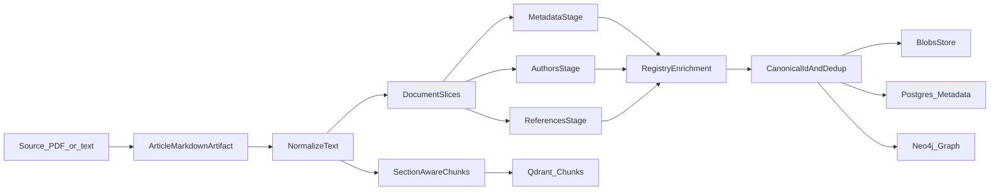

# Phase 1: Scholarly backbone и ingestion MVP

## Цель

Рабочая вертикаль: **документ → Markdown artifact → метаданные / авторы / references → обогащение реестрами → граф цитирования** плюс минимальный **chunk vector** индекс для будущего retrieval.

Соответствует [roadmap Phase 1](../roadmap.md) и первому слою в [idea.md](../idea.md).

## Границы

**В scope Phase 1**

- Узлы: `Work`, `Authorship`, `Author`, `Institution`, `Venue`.
- Рёбра: `HAS_AUTHORSHIP`, `OF_AUTHOR`, `AFFILIATED_WITH`, `PUBLISHED_IN`, `CITES`, `RELATED_VERSION_OF`.
- Идентификаторы как **атрибуты** на сущностях (не отдельные узлы `Identifier` в MVP).
- Каскад стадий ingestion: PDF/text/markdown → `article.md` → нормализация → **LLM-first** metadata / authorships / references (с эвристическим fallback) → enrichment → dedup → запись в хранилища.

**Вне scope Phase 1**

- Научный семантический слой (`Method`, `Claim`, …) — Phase 2+.
- Полноценный UI и GraphRAG query-time — Phase 5–6.
- Идеальный entity resolution: допускаются низкая уверенность и ручной разбор позже.

## Локальный стек (runnable MVP)

| Компонент | Роль |
|-----------|------|
| Файловая система | Blobs: исходные PDF, извлечённый текст |
| PostgreSQL | Реляционные метаданные документов, jobs, сырые extractions |
| Neo4j | Граф первого слоя |
| Qdrant | Векторы чанков (текст + embedding id) |
| Python 3.11+ | Пакет `science_graphrag`, CLI, HTTP-клиенты к реестрам |

**Docker Compose:** канонический способ поднять Postgres, Neo4j и Qdrant локально — корневой `docker-compose.yml` и [runbooks/deploy.md](../runbooks/deploy.md). Политика как можно более **ранней** контейнеризации новых сервисов зафиксирована в [roadmap §1.5](../roadmap.md).

**PDF extraction (текущий код):** режим **VL-first**. При наличии `SCIENCE_GRAPHRAG_VL_API_KEY` используется vision-language PDF → Markdown; иначе pipeline сохраняет `pypdf` fallback в тот же `article.md`. Дефолтная VL-модель: `qwen/qwen3-vl-235b-a22b-instruct` (см. `.env.example`).

**Chunking (после Markdown):** нормализованный текст режется на слайсы **front matter** и **references scope** для стадий Layer 1; векторный индекс (Qdrant) — **section-aware chunks** с `chunk_fingerprint` и путём секции. Подробно: [chunking-strategy.md](chunking-strategy.md), ADR [003](../adr/003-chunking-and-dedup-strategy.md).

**Обогащение (текущий код):** клиент **OpenAlex** для work по DOI и для цитируемых работ **с DOI**. **Crossref / ORCID / ROR** — следующие шаги (то же API-слой `httpx`, отдельные модули), без блокировки текущего ingest.

**Цитирование в графе:** ребро `CITES` создаётся при наличии у ссылки **DOI** (с разрешением через OpenAlex), иначе при **`arxiv_id`**, иначе при паре **title + year** (`title_fingerprint`) — см. `science_graphrag/ingestion/pipeline.py` (`_persist_reference_citation`).

Детали: [adr/001-phase1-stack.md](../adr/001-phase1-stack.md).

## Поток данных

## Связанные документы

- [source-of-truth-v1.md](source-of-truth-v1.md)
- [chunking-strategy.md](chunking-strategy.md)
- [adr/002-layer1-graph-model.md](../adr/002-layer1-graph-model.md)
- [adr/003-chunking-and-dedup-strategy.md](../adr/003-chunking-and-dedup-strategy.md)
- [specs/extraction/](../specs/extraction/)
