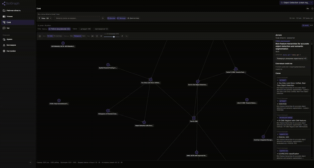
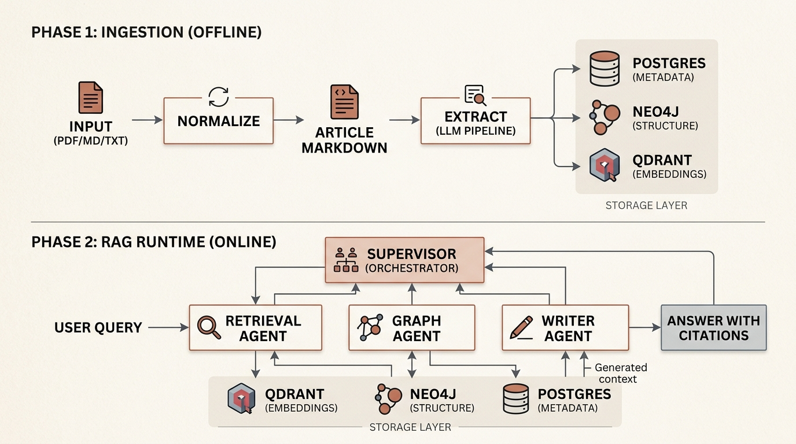
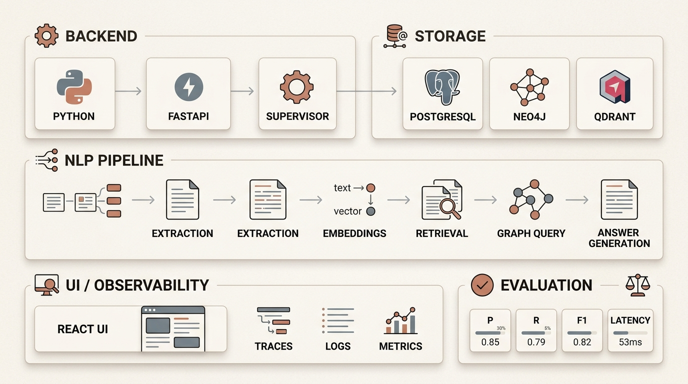
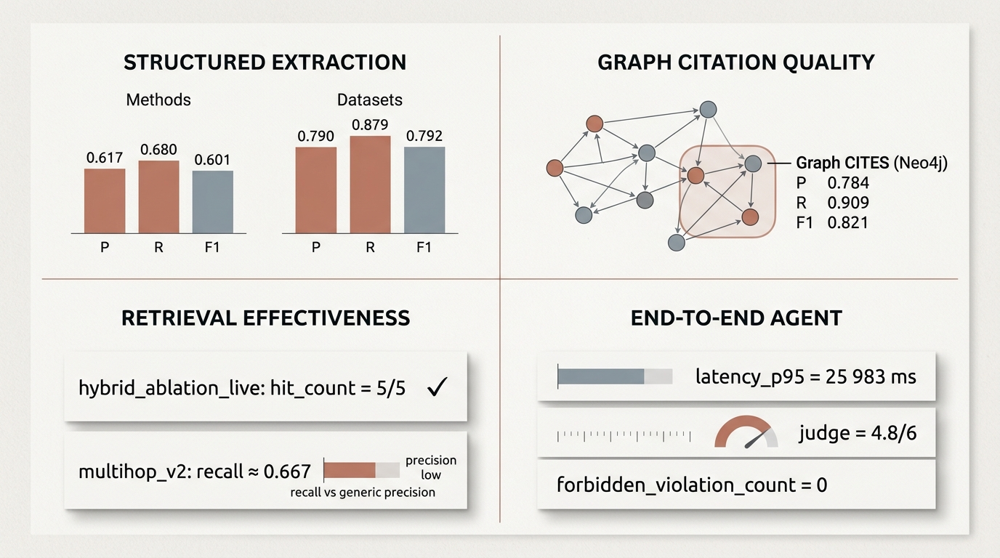

# SciGraph: GraphRAG для научной библиотеки — граф знаний, агент с инструментами и честная оценка

> Выпускной проект курса **OTUS NLP Advanced**.
> Автор: Роман (@xabarov) · Исходники и материалы проекта: **[github.com/xabarov/science-graphrag](https://github.com/xabarov/science-graphrag)**



**Сначала о методе:** в центре текста — не «красивая схема из трёх баз», а **программа честной оценки**: какие прогоны считаются доказательством, как разведены пилот и holdout, что означает `trust_signal` в JSON бенчмарка. Ключевые метрики ниже имеют смысл только в этой рамке.

## TL;DR

Я собрал **универсальный GraphRAG-конвейер для научного корпуса**: на вход — произвольный набор PDF/статей, на выход — структурированный граф, эмбеддинги и API/UI. Для **первой версии бенчмарка** мне нужен был связный пилотный корпус: я взял **35 статей по object detection** (YOLO, R-CNN, DETR и т.д.) — не потому что система «про детекцию», а потому что с чего-то начинать всё равно пришлось, а в этом домене много явных цитирований и понятных родословных методов. Под капотом — граф знаний в Neo4j, векторный поиск в Qdrant, операционное состояние в Postgres. Поверх — research-агент с инструментами, который выбирает между семантическим поиском, обходом графа и финальным ответом с обязательными цитатами.

Ключевые цифры из последнего прогона (модель извлечения — `mistralai/mistral-small-3.2-24b-instruct` через OpenRouter):

- F1 имён авторов / аффилиаций по корпусу — **`0.981` / `0.951`**;
- F1 рёбер цитирования (`CITES` в Neo4j, 11 кейсов с graph-эталоном) — **`0.821`**;
- Сквозной агент с инструментами: **10/10** сценариев пройдено, время ответа `p95 ≈ 26 секунд`, средняя оценка LLM-судьи — **`4.8/6`**;
- Извлечение утверждений на перефразированном эталоне: macro-F1 **`0.224`** (пилот) и **`0.190`** (holdout) после **итерации v2** промпта (май 2026; см. §4.1). До промпта на тех же сплитах **`0.217` / `0.187`** — `eval/results/habr-window-2026-05-*.json`. **Июнь 2026:** офлайн пост-дедуп на майских предсказаниях — **`0.223605` / `0.190398`** (`habr-window-2026-06-dedupe-*.json`); **новый live** production BT6 с дедупом в пути — **~`0.249` / ~`0.219`** (`habr-window-2026-06-live-*.json`); сводка — `eval/results/habr-window-2026-06-manifest.txt`. *Как считаю F1:* для каждого кейса \(F_1 = 2PR/(P+R)\) из `claim_precision` / `claim_recall`, затем **среднее по кейсам** (macro по кейсам).

Если контрольные наборы устроены «удобно», метрики легко выглядят красиво — но не значат ничего. Я специально оставлю в тексте «неудобные» цифры и расскажу, почему это полезнее, чем единица.

Дальше: зачем для научного корпуса нужен граф, как устроена архитектура, как работает агент с инструментами, как именно я мерил качество — и какие грабли собрал по дороге (`httpx CLOSE-WAIT` на 16-м файле ingest, multihop с precision `0.02` — обычная палитра граблей такого проекта).

---

## 1. Зачем для научной библиотеки нужен GraphRAG

### Что плохо работает у обычного векторного RAG


Базовый векторный RAG над папкой PDF удобен для узкого класса вопросов: «что говорится в документе про X». Если у вас — научная библиотека и вы исследователь, появляются три типа вопросов, на которых косинусная близость пасует.

1. **Вопросы про структуру предметной области.** «Какие работы образуют цепочку развития метода ATSS?» — это не «найди похожий по смыслу фрагмент текста», это «пройди по графу `RELATED_VERSION_OF` / `CITES` от центральной работы и верни упорядоченный список». Косинусной близостью такое восстанавливать неудобно: близкие по тексту работы вовсе не обязательно образуют родословную.
2. **Вопросы про авторство и противоречия.** «В каких работах автор A менял оценку метода M?» — нужен `Author` как узел и `Authorship` как отдельная связь с порядком и аффилиациями. «Какие пары утверждений противоречат друг другу?» — нужны узел `Claim` и ребро `CONTRADICTS`. В векторном индексе такого слоя просто нет.
3. **Проверяемость.** Чат «в общем», без trace и без обязательных цитат — для research-сценария блокер. Исследователь не будет верить ответу, не зная, из каких именно фрагментов он собран.

К этим трём типам вопросов добавляется ещё одна, методическая, боль. Во внутренних ML/NLP-проектах контрольные наборы часто устроены **слишком удобно**: часть проверяет форму JSON, часть воспроизводит зашитый ответ, часть позволяет дословно скопировать решение из источника. Тогда высокий балл **ни о чём не говорит**: непонятно, заслуга ли это пайплайна или того, что тест измеряет не поведение в мире, а совпадение с заранее удобным эталоном.

### Что должна была делать система

Цель проекта — собрать **сквозной исследовательский инструмент** для ограниченного, но содержательно связанного корпуса. Такая система должна:

- превращать статьи в **структурированное представление** (граф + чанки + эмбеддинги);
- извлекать сущности и связи, полезные для научного анализа (`Method`, `Dataset`, `Claim`, `CITES`, `USES_METHOD`, `EVALUATED_ON`, `CONTRADICTS`);
- поддерживать и обычный retrieval, и **запросы со структурой графа**;
- синтезировать ответы с **обязательными ссылками на источники**;
- оцениваться так, чтобы хорошие метрики **действительно означали** хорошую работу.

Последний пункт — самый важный, и весь раздел 6 будет о нём.

### Что считается вкладом

Для проектной работы курса хочется ясно понимать, что нового. Я выделяю три части.

1. **Системный вклад.** Рабочий GraphRAG-конвейер с ingest, графом, векторным поиском, API, UI и исследовательским агентом с инструментами (LangGraph ReAct, один LLM-агент на запрос).
2. **Методический вклад.** Программа оценки, в которой каждый артефакт помечен **сигналом доверия** (`trust_signal`) — он явно различает реальные прогоны, контрактные проверки формата и имитационные режимы. Часть эталонов проходит двойную / тройную верификацию независимыми LLM, а в эталоне извлечения утверждений запрещено дословное копирование из исходной статьи.
3. **Прикладной вклад.** На пилотном бенчмарк-корпусе (первую версию собрал на object detection) показано, что система решает не только текстовые, но и многошаговые запросы, поиск противоречий и структурные связи между работами.

---

## 2. Ограничения проекта

Чтобы дальше не возникало вопроса «а где же fine-tuning, ваш GPU-кластер и миллион статей», явно зафиксирую рамки.

- **Узкий корпус.** Все эксперименты — на 35 статьях по object detection (YOLO, R-CNN, SSD, RetinaNet, FCOS, ATSS, DETR-семейство, базовые HOG/DPM/Selective Search). Это удобный домен для проверки графа: много явных связей цитирования, выраженные родословные методов, понятные датасеты. Но переносимость промптов извлечения на другие науки этим **не доказывается**.
- **Извлечение — через OpenRouter,** базовая модель `mistralai/mistral-small-3.2-24b-instruct`. Выбор по балансу качество / стоимость / задержка, не «лучшая модель». В разделе 6 даю ещё сравнение с двумя другими моделями (`deepseek/deepseek-v3.2` и `moonshotai/kimi-k2.6`) на отложенной выборке утверждений — чтобы видно было, что бенчмарк различает модели, а не «всем ставит одинаково хорошо».
- **Эмбеддинги — BGE-M3 через OpenRouter**, размерность 1024 (обоснование выбора — в ADR в репозитории).
- **Время ответа пока заметное.** Сквозной агент: 95-й перцентиль ≈ 26 секунд на 10 кейсах. Функционально работает, продакшен-ready ещё нет.
- **Это проектная работа курса**, а не годовой R&D. Масштабы корпуса и числа держим в этих рамках.
- **Публикационные прогоны.** Для текста статьи фиксирую дату, коммит и JSON в `eval/results/` (см. май 2026: `habr-window-2026-05-manifest.txt`). Актуальный план измерений и нарратива для статьи — [`habr-article-narrative-and-measurement-plan-2026-07.md`](../analysis/habr-article-narrative-and-measurement-plan-2026-07.md).

---

## 3. Архитектура и стек



Картинка выше — сжатая схема. На ней Research Agent показан одним блоком; внутри — **один** LLM-агент в цикле вызова инструментов (ReAct), см. раздел 5.

### Большая схема одной строкой

```
PDF / MD / TXT
   → Markdown (Article Markdown)
   → структурированное извлечение через LLM
   → Postgres (operational state) + Neo4j (knowledge graph) + Qdrant (vectors)
   → агент с инструментами (LangGraph: шаги chat ↔ tools до final_answer)
   → ответ с обязательными цитатами
```

Ingest — **офлайн**: данные готовятся заранее, runtime только читает. Ничего не извлекается в момент пользовательского запроса.

### Стек по слоям



| Слой | Технологии | Зачем |
|---|---|---|
| **Backend** | Python 3.11, FastAPI, LangGraph (ReAct-агент + инструменты) | API, оркестрация ingest и runtime |
| **Storage** | PostgreSQL · Neo4j · Qdrant | разные роли (см. ниже) |
| **NLP Pipeline** | LLM-extractors (function calling), BGE-M3 embeddings, retrieval, graph query, answer generation | превращает PDF в граф + вектора + ответы |
| **UI / Observability** | React UI, Phoenix / OpenTelemetry, traces · logs · metrics | дёргать систему руками и видеть, что внутри |
| **Evaluation** | пакет бенчмарков и скрипты агрегации в репозитории, dual-validate | разделение `live` / `canned` / `mock_runtime`, `trust_signal` на каждом артефакте |

### Почему три хранилища, а не одно

Три хранилища — не декорация и не «модно делать так». Каждое выбрано по своей сильной стороне.

| Хранилище | Роль | Что хранится |
|---|---|---|
| **PostgreSQL** | операционное состояние конвейера | документы, задачи ingest, raw extraction, артефакты стадий |
| **Neo4j** | граф знаний | `Work`, `Author`, `Authorship`, `Method`, `Dataset`, `Claim`, `Concept`, `Venue` и связи `CITES`, `RELATED_VERSION_OF`, `USES_METHOD`, `EVALUATED_ON`, `CONTRADICTS` |
| **Qdrant** | семантический поиск | эмбеддинги фрагментов (`chunks`), эмбеддинги работ (`works`), при необходимости эмбеддинги утверждений |

**Аргумент простой.** Qdrant отлично решает задачу «найди релевантные текстовые фрагменты», но «какие работы образуют цепочку развития метода» в нём не выражается. Neo4j — наоборот: для родословных и противоречий подходит идеально, для семантического retrieval — нет. Postgres держит операционное состояние и не пытается заниматься ни тем, ни другим.

### Ключевое решение: Authorship — отдельный узел

Самое важное архитектурное решение в графе — авторство **не** моделируется простым ребром `Work → Author`. Между ними стоит отдельный узел `Authorship` со своими свойствами:

```text
(:Work) -[:HAS_AUTHORSHIP]-> (:Authorship) -[:OF_AUTHOR]-> (:Author)

Authorship:
  order: 2
  affiliation_at_publication: "Google Brain"
```

Это даёт: корректные карьеры авторов, порядок авторства в работе, аффилиации **на момент публикации** (а не текущие), возможность отвечать на вопросы вида «в какой работе автор сменил аффилиацию». Подробнее — в ADR про authorship в репозитории.

### Observability через Phoenix / OpenTelemetry

Каждая существенная LLM-стадия обёрнута в свой trace/span. Это даёт три вещи: видим, где тратятся токены и время; разбираем падения пошагово; сопоставляем стоимость с биллингом OpenRouter.

Для научного отчёта (и для статьи) это не «приятно иметь», а необходимое условие. Без Phoenix нельзя честно говорить, что система воспроизводима — иначе это «чёрный ящик с хорошими числами».

Чтобы связать «`p95 ≈ 26` секунд» с доказательством, в репозитории лежит **иллюстративный** JSON-эксцерт иерархии span’ов (`llm.chat_completion` → инструменты → снова `llm…`) — [`phoenix-trace-multistep-excerpt.json`](../analysis/phoenix-trace-multistep-excerpt.json) (структура как у OTLP-трейсов, попадающих в Phoenix; не один конкретный прод-trace).

---

## 4. Ingestion: как PDF превращается в граф

Конвейер ingest — отдельный процесс, который запускается до runtime. Команда `science-graphrag ingest path/to/paper.pdf` (или `ingest-corpus` для целой папки) проходит по статье серию стадий.

### Стадии конвейера

В коде и артефактах эти стадии исторически называются «слои»: **слой 1** — фактические метаданные, **слой 2** — семантика для графа. Дальше в статье я буду писать читаемые имена, а технические идентификаторы давать рядом, чтобы их можно было найти в репозитории.

1. **PDF → Markdown.** Извлекаем текст и приводим к нормализованному `article.md`.
2. **Слой 1 — метаданные, авторы, ссылки.** Заголовок, аннотация, авторы с аффилиациями, библиография с резолюцией DOI / arXiv.
3. **Слой 2 — методы и датасеты (семантика для графа).** Имена методов с алиасами, датасеты, рёбра `USES_METHOD` и `EVALUATED_ON`.
4. **Утверждения** (узлы `Claim`). Содержательные утверждения статьи с якорями в тексте.
5. **Цитирования** (рёбра `CITES`). Ссылки разрезолвлены по корпусу — если цитируемая работа уже есть как узел `Work`, рисуется ребро.
6. **Концепты и темы.** Тематические узлы для навигации.
7. **Эмбеддинги.** Фрагменты текста (`chunks`) и сами работы (`work-level vectors`) кодируются BGE-M3 и пишутся в Qdrant.
8. **Запись в Neo4j.** Все сущности и рёбра проецируются в граф.

Каждая стадия — отдельный LLM-вызов с **structured output** (function calling). Сигнатура задана Pydantic-схемой; LLM не возвращает свободный текст и не выдумывает поля. Это базовая, но критичная гигиена для производственного pipeline.

### Урок: долгие LLM-операции должны иметь heartbeat и checkpoint

В одной из волн разработки `ingest-corpus` повис на **16-м файле** и простоял **около трёх часов** на `httpx CLOSE-WAIT`. Цепочка была классической для «тихого» сбоя HTTP: провайдер закрывал соединение, клиент его не дочитывал, накапливались `CLOSE-WAIT` сокеты, а основной процесс не выходил из ожидания — потому что ни heartbeat, ни per-file timeout, ни checkpoint в конвейере на тот момент не было.

С тех пор в репозитории появилось несколько вещей, которые я считаю обязательными для любой долгой LLM-операции:

- **Pre-flight smoke-check** — `science-graphrag config-check` с exit-code `1`, если критичная конфигурация не готова к длинному прогону;
- **Heartbeat** в логе ingest не реже одного раза в минуту даже на «тихих» стадиях;
- **Per-file timeout** и checkpoint-файл на диске — ingest можно возобновить с упавшего файла;
- **Runbook** по ingest в репозитории — с чек-листом: что проверить до запуска и что делать при hang.

Если у вас тоже есть LLM-конвейер длиннее минуты — это не «потом сделаю», это нужно с первого дня.

---

## 5. Research-агент с инструментами

### Каталог инструментов

В runtime пользовательский запрос обслуживает не один монолитный prompt, а агент с **каталогом инструментов**. Каждый инструмент — это Python-функция со схемой аргументов, которая адаптером превращается в JSON-схему для LLM. Сигнатура и docstring — это контракт, который видит модель.

Базовый набор:

| Инструмент | Что делает | Куда ходит |
|---|---|---|
| `workspace_inspect` | инвентаризация работ в текущем рабочем наборе | Postgres |
| `find_works` | полнотекстовый поиск по работам (заголовок, авторы, фрагменты) | Postgres |
| `paper_profile` | компактная карточка работы (метаданные, авторы, ключевые методы) | Neo4j + Postgres |
| `idea_search` | семантический поиск по чанкам и работам | Qdrant |
| `paper_quote_search` | дословные цитаты из конкретной работы | Postgres + Qdrant |
| `cypher_query` | read-only Cypher по графу | Neo4j |
| `edge_search` | окрестности узла по типам рёбер | Neo4j |
| `format_bibliography` | финальное форматирование библиографии (ГОСТ) | производный |
| `final_answer` | финализирующий шаг с обязательными цитатами | синтез |

Главное здесь не список, а **разделение ответственности**. У каждого инструмента — своё хранилище и своя задача. Семантический поиск не пытается быть Cypher-ом, граф не пытается быть полнотекстовым индексом.

### Сигнатура инструмента — это контракт для LLM

Хочу показать живой пример. Это сильно сокращённый, но реальный код инструмента семантического поиска по чанкам:

```python
class IdeaSearchArgs(BaseModel):
    query: str = Field(..., description=(
        "Natural-language search query; trimmed and internal whitespace collapsed "
        "(same normalization as paper_quote_search) before embedding."
    ))
    kinds: list[str] = Field(default_factory=lambda: ["chunk"],
                             description="Result kinds: chunk/work.")
    workspace_id: str | None = Field(default=None, description="Workspace scope.")
    top_k: int = Field(default=DEFAULT_AGENT_CHUNK_TOP_K, ge=1, le=MAX_AGENT_CHUNK_TOP_K,
                       description="Max items to return.")


@tool("idea_search", args_schema=IdeaSearchArgs, return_direct=False)
def idea_search_tool(query: str, kinds: list[str] | None = None,
                     workspace_id: str | None = None,
                     top_k: int = DEFAULT_AGENT_CHUNK_TOP_K) -> dict[str, Any]:
    """Embedding retrieval over chunks and/or work-level vectors (see kinds).

    Pass workspace_id when the user cares about this workspace only; omit for corpus-wide
    semantic exploration. Use chunk-heavy kinds for broad scan; include work when comparing papers.

    When the question requires citations, verbatim quotes, or chunk-level evidence, follow
    with paper_quote_search (not repeated paper_profile alone).
    """
    ...
```

В этом коде важны три вещи. Первое — Pydantic-схема `IdeaSearchArgs` адаптером превращается в JSON-схему, которую видит LLM, и модель не может вернуть свободный текст вместо аргументов: либо строка `query`, либо ошибка валидации. Второе — `description` каждого поля попадает прямо в prompt: LLM читает «`query` — это строка с нормализованным текстом, как у `paper_quote_search`», и понимает, что в неё класть. Третье — docstring инструмента содержит **указания по маршрутизации** между инструментами: «если нужны цитаты — следующим вызови `paper_quote_search`, не зацикливайся на `paper_profile`». Это работает как мини-prompt engineering, встроенный в код, а не вынесенный в отдельный файл.

### Как устроен runtime по умолчанию: один агент, один граф ReAct

Пользовательский запрос обслуживает **одна** модель в цикле ReAct: узлы LangGraph «chat» (LLM с привязанными инструментами) и «tools» (исполнение вызовов) чередуются, пока модель не завершит ход инструментом **`final_answer`**. Какой инструмент вызывать на следующем шаге, решает та же модель — по системному промпту и уже полученным `ToolMessage`; отдельного слоя маршрутизации «над» ней нет.

На каждом LLM-ходе runtime (по умолчанию) **ранжирует инструменты детерминированными правилами**: совпадения с формулировкой вопроса, теги и метаданные в манифесте, учёт workspace, плюс **сдвиг по ожидаемому типу вопроса** — класс ответа приходит из оболочки или считается эвристикой по тексту. Из ранжирования формируется список для `bind_tools`, к которому **доклеивается типовой набор** поиска/карточек/семантики, чтобы не «зажать» retrieval. Если сигнал слабый или набор вышел слишком узким, срабатывает **откат на полный каталог** — то есть это не гарантия «короткого» списка на каждом шаге, а попытка сузить с разумным fallback. Дисциплина и обязательный финальный `final_answer` заданы в системном промпте («не заканчивать голым текстом ассистента»). Граница «нужен ли поход в корпус» тоже задаётся прежде всего промптом и поведением модели, без отдельного координатора до входа в ReAct.

В первых итерациях мы пробовали **разнести retrieval, граф и финальный ответ по разным под-агентам** и отдельно маршрутизировать ход между ними. На практике траектории оказались **плохо предсказуемыми**: лишние LLM-вызовы только на выбор «куда пойти», рост задержки и стоимости, сложнее отлаживать и объяснять поведение. От этой схемы отказались в пользу **одного** ReAct-агента с сильным системным промптом и вспомогательными эвристиками для shortlist инструментов — так стабильнее и проще рассуждать о качестве.

### Защита от бесконечного цикла

На стороне графа зашиты **бюджет вызовов инструментов** на один пользовательский запрос, **лимит рекурсии** LangGraph и политика завершения: если модель закончила текстом без `final_answer`, после уже выполненных инструментов граф может один раз подтолкнуть её через «nudge» к обязательному `final_answer`; при исчерпании бюджета допускается только финальный ответ, чтобы не потерять завершение хода.

Это та инженерия, которую обычно не показывают в RAG-туториалах, но без которой агент в продакшен-сценарии живёт минуту до первого «извините, что-то пошло не так» или до сжигания бюджета на циклах вызовов инструментов.

---

## 6. Программа оценки: как я мерил качество


Без этого раздела все цифры выше не имеют смысла. Если вам интересен только GraphRAG как технология — можно листать дальше. Но именно дисциплина оценки, а не сама архитектура с тремя хранилищами, — главный практический take-away проекта.

### Принцип 1: сигнал доверия на каждом артефакте

Каждый прогон бенчмарка сохраняет JSON с метаданными модели и блоком `trust_signal` — это и есть «сигнал доверия». Сильно сокращённый пример:

```json
{
  "artifact": "current-retrieval-workspace-scoped-live.json",
  "summary": {
    "case_count": 6,
    "all_passed": true,
    "retrieval_eval": true
  },
  "failed_count": 0,
  "trust_signal": {
    "runtime_mode": "live",
    "validation_status_aggregate": "llm_dual_validated",
    "is_phantom": false
  }
}
```

Что здесь критично. Поле `runtime_mode` принимает четыре значения: `live` (реальный запуск против реальных Postgres/Neo4j/Qdrant и реального LLM), `canned` (с заготовленными ответами, для контрактной проверки формата), `mock_runtime` (с имитационными хранилищами) и `synthetic_gold` (на синтетическом эталоне). **В отчёт идут только `live`-прогоны.** Все остальные нужны для разработки и CI, но они не доказательство качества системы.

`is_phantom: false` означает: артефакт не подделан и не сгенерирован пустым шаблоном. На раннем этапе проекта были случаи, когда runner писал внешне корректный JSON, но при этом вообще не запускался (упал до запроса к LLM). `trust_signal` такие случаи отсекает.

### Принцип 2: разделение реальных и имитационных режимов

Дисциплина простая — но именно её обычно не хватает в проектных работах:

- **Имитационные прогоны не лежат в одной папке с реальными.** Артефакты с префиксом `current-*.json` — это «живые» прогоны и стабильные фикстуры; имитационные runner-ы пишут отдельные имена и не агрегируются с реальными.
- **CI-проверки формата JSON отдельно от eval-набора.** Контрактная проверка, что в ответе есть поле `metrics`, — нужна, но это не качество. В отчёт она не попадает.
- **Двойная и тройная верификация эталона.** Часть эталонов проходит через несколько независимых LLM с независимыми промптами. Если две из трёх дают разные ответы — кейс в эталон не идёт. Скрипты двойной верификации лежат в репозитории.

### Принцип 3: два уровня измерения, и не путать их

Это место в моём отчёте часто вызывало вопросы. Объясняю.

| Уровень | Назначение | Метрика | Цель |
|---|---|---|---|
| **Регрессионный контроль** ночных бенчмарков слоёв 1–2 | «что-то сломалось?» | `failed_count` (число упавших кейсов) | **0** при стабильном корпусе |
| **Качество** (retrieval, многошаговый обход графа, перефраз для утверждений, сквозной агент) | «как хорошо отвечает?» | P / R / F1, hit@K, MRR, judge score, p95 | максимизация при разумной стоимости |

Если эти два уровня смешать в одну колонку, получится путаница: для одних бенчмарков целевое значение — ноль, для других — «больше — лучше», и это не противоречие, а две разные постановки. Такая нарезка подробно разобрана в полном отчёте курса (см. репозиторий).

**Про holdout на пять кейсов (`claims_holdout_v1`).** Это намеренно узкий «замок» от подгонки промпта: macro-F1 в TL;DR — **среднее по кейсам**, и при \(n=5\) отдельные кейсы сильно тянут среднее. На июньском live-артефакте `eval/results/habr-window-2026-06-live-holdout.json` per-case \(F_1\) по кейсам лежит примерно между **0.0** и **0.4** (медиана порядка **0.25**). Доверительные интервалы здесь не притворяемся считать: важно другое — **пилот и holdout не смешиваются** в одну «головную цифру» (см. Appendix A).

**Как воспроизвести headline-число по holdout без полного ingest корпуса** (нужны ключи OpenRouter и поднятый `docker compose` из README):

```bash
git clone https://github.com/xabarov/science-graphrag.git && cd science-graphrag
cp .env.example .env   # заполнить SCIENCE_GRAPHRAG_*_API_KEY
docker compose up -d
.venv/bin/python -m venv .venv && .venv/bin/pip install -e . --quiet
.venv/bin/science-graphrag config-check
.venv/bin/science-graphrag-claims-paraphrase-benchmark \
  tests/fixtures/benchmarks/claims --suite --tier claims_holdout_v1 \
  --extractor production --no-fail-on-red-cases \
  --json-out eval/results/repro-holdout.json
```

Зафиксированный снимок для сравнения с текстом статьи — коммит из `eval/results/habr-window-2026-06-manifest.txt` (и смежные JSON в `eval/results/`).

### Принцип 4: запрет дословного копирования в эталоне утверждений

Самый важный из принципов. Узел **`Claim`** в графе — это не «скопировать предложение из PDF», а **нормализованное утверждение** (тип, полярность, связный текст). Для оценки извлечения я держу **две разные постановки** — от этого зависят и цифры, и то, что они вообще значат.

**Цитатный эталон** — в эталоне задана **якорная подстрока**, которая **реально встречается в тексте статьи** (часто из аннотации или ключевого абзаца). Бенчмарк по сути проверяет: «нашёл ли экстрактор тот же факт, что уже буквально лежит на странице». На таком наборе у меня на 10 кейсах **`recall = 1.0`** — звучит бодро, но это почти не про «понимание», а про совпадение с очень удобным якорем.

*Учебный мини-пример из фикстур бенчмарка* (`yolov1_speed_claim`): якорь в PDF — фраза про **«45 frames per second»**; эталонное утверждение коротко пересказывает ту же мысль («base YOLO runs at about 45 fps»). Если пайплайн видит тот же числовой факт в том же контексте, попасть в метрику легко.

**Перефразированный эталон** — каждое эталонное утверждение **переписано своими словами** и проходит ограничение на перекрытие с исходником: нельзя выиграть, просто склеив подстрочник из PDF. Метрика спрашивает: узнаёт ли модель **тот же смысл**, что зафиксировал автор эталона, если формулировки разные. На полном прогоне пилота (15 кейсов, тир `claims_pilot_v2`) — macro-F1 **`0.224`** после итерации v2 промпта (май 2026); на отложенной выборке (5 кейсов, `claims_holdout_v1`) — **`0.190`**. Июнь 2026: (1) **офлайн re-score** майских предсказаний с пост-дедупом — **`0.223605`** / **`0.190398`**; (2) **новый live** прогон production BT6 с дедупом в пути — **~`0.249`** / **~`0.219`** macro-F1 по кейсам (`eval/results/habr-window-2026-06-live-*.json`; сводка — `eval/results/habr-window-2026-06-manifest.txt`). До одной оси изменений (только текст SYSTEM_BENCHMARK для claims) на тех же сплитах было **`0.217` / `0.187`** — см. заморозку в `eval/results/habr-window-2026-05-manifest.txt`. Методология сплитов и скоринга — Appendix A в [`docs/benchmarks/ontology-claims-benchmark-v1.md`](../benchmarks/ontology-claims-benchmark-v1.md).

*Пример одного тезиса из набора по DETR* (идентификатор в эталоне: `detr_bipartite_matching_no_nms`; текст эталона — из `corpus_detr_v2` в фикстурах бенчмарка; после волны **gold-v2** формулировка в фикстуре приближена к тому, как production-экстрактор уже пишет «set-based loss + bipartite matching + без NMS»):

| Что проверяем | Текст |
|---|---|
| **Эталон** (как должно быть сформулировано утверждение в ответе экстрактора) | *«DETR uses a set-based global loss that forces unique predictions via bipartite matching between predictions and ground truth, so parallel decoding can avoid classical hand-crafted non-maximum suppression.»* |
| **Что обычно бывает у модели** | Тот же абзац статьи даёт длиннее и шире, например про «set-based global loss» и bipartite matching в составе DETR — модель часто вытягивает **общую** фразу про matching и трансформер, но **не связывает** её в один тезис «один объект — одно предсказание → на инференсе можно без NMS». Другой частый сценарий — вместо этого тезиса в списке claims оказываются **другие** предложения из введения (про отказ от anchor/NMS в целом), и узкий claim из эталона **пропадает**. На перефразе это даёт низкий recall и шум в precision. |

Между «recall 1.0 на якорях» и низким F1 на перефразе — пропасть. И именно об этом стоит говорить читателю, а не о красивой единице на удобном эталоне.

### Итерация извлечения v2 (окно май 2026)

Один согласованный шаг без смены схемы JSON: в промпте **benchmark**-режима извлечения claims добавлен блок про выравнивание формулировок с эталоном (сохранять имена методов, числа и кто-кого сравнивает, дробить утверждения, чтобы каждое имело свой quote). Повторный прогон теми же CLI и теми же тирами (`claims_pilot_v2`, `claims_holdout_v1`), продакшен-экстрактор.

| Сплит | Macro-F1 до (baseline) | Macro-F1 после v2 (май) | Июнь: offline dedupe на майских preds | Июнь: live production + dedupe | JSON артефакты |
|------|------------------------|-------------------------|----------------------------------------|----------------------------------|----------------|
| Пилот (15 кейсов) | **0.217** | **0.224** | **0.223605** | **~0.249** | май → `habr-window-2026-05-*.json`; июнь offline → `habr-window-2026-06-dedupe-pilot.json`; июнь live → `habr-window-2026-06-live-pilot.json` |
| Holdout (5 кейсов) | **0.187** | **0.190** | **0.190398** | **~0.219** | май → `habr-window-2026-05-*.json`; июнь offline → `habr-window-2026-06-dedupe-holdout.json`; июнь live → `habr-window-2026-06-live-holdout.json` |

Прирост небольшой, зато честно сопоставим: один протокол, зафиксированные файлы, дата и сводка в `eval/results/habr-window-2026-05-manifest.txt` (май) и `eval/results/habr-window-2026-06-manifest.txt` (июнь). Примеры промахов — `eval/results/habr-window-2026-05-failure-analysis.md`.

**Волна gold-v2 (май 2026, фикстуры `schema_version: 3`).** На **пяти** строках `expected_claims` (DINO ×2, DETR ×1, EfficientDet ×2) я подтянул формулировки к тому, что реально печатает production-экстрактор в live BT6, не меняя `claim_id` и не трогая `match_mode`. Отдельный повторный прогон зафиксирован в `eval/results/habr-window-2026-07-gold-v2-*.json` и `eval/results/habr-window-2026-07-manifest.txt`. **Headline-цифры в TL;DR остаются на июньском live-снимке**: один свежий прогон после правки эталона сильно смешивает эффект gold с **дисперсией LLM** и иногда с дорожкой дистракторов; пилотное среднее в этом артефакте почти не изменилось, а holdout «прыгнул» — честнее трактовать gold-v2 как **аудит эталона**, а не как гарантированный +macro без мульти-сидовой агрегации.

Компактная выжимка по трём разобранным кейсам из `eval/results/habr-window-2026-05-failure-analysis.md`:

| Case id | Сигнал | Почему промах |
|---|---|---|
| `holdout_dino_v1` | BT6 даёт **0** совпавших строк при семантически близких числах в предсказаниях | Дрейф формулировок относительно «схемы» эталона под embedding/ROUGE-гейтами. |
| `corpus_efficientdet_v2` | Мало предсказаний, **0** recall по строкам EfficientDet в suite JSON | Недобор покрытия (omission) относительно плотного gold. |
| `corpus_detr_v2` | На plain-тексте recall **0.75**, но suite **FAIL** из-за `precision_drop_with_distractors` | Шум под дистракторами: precision падает сильнее допустимого порога. |

*Пример, где промпт v2 реально помог (пилот, macro-F1 по кейсу):* `corpus_cascade_rcnn_v2` — с **~0.267** (baseline) до **~0.414** после v2 на том же сплите (см. `eval/results/habr-window-2026-05-baseline-pilot.json` vs `habr-window-2026-05-iter-v2-pilot.json`).

### Главная сводная таблица результатов



В таблицах ниже — итоговые цифры по всем экспериментам, идущим в основной нарратив. Исходные JSON-артефакты бенчмарков приложены к репозиторию.

**Качество извлечения сущностей (macro по слотам):** подробная markdown-таблица по слотам вынесена в [`docs/report/habr-article-appendix-metrics-table-2026-06.md`](habr-article-appendix-metrics-table-2026-06.md), чтобы укоротить §6; ниже остаются сводки по графу, сквозному агенту и retrieval.

**Граф знаний:**

| Эксперимент | Результат | Интерпретация |
|---|---|---|
| Рёбра цитирования (`CITES` в Neo4j, 11 кейсов с graph-эталоном) | macro F1 **0.821** | граф восстанавливает цитирования по ⌀ хорошо |
| Многошаговый обход графа (3 кейса) | recall **0.667**, precision **0.02** | находит цепочки, но тащит лишних соседей |
| Противоречия между утверждениями | 7/7 материализованы | слой `Claim` / `CONTRADICTS` работает |
| Дедупликация сущностей (5 типов) | ARI **0.88–1.00** | словари согласованы |

**Сквозной агент с инструментами** (10 полных пользовательских сценариев):

| Метрика | Значение |
|---|---|
| Прошло формальные проверки | **10/10** |
| Время ответа, 95-й перцентиль | **25 983 ms** (≈ 26 с) |
| Средняя оценка LLM-судьи (1–6) | **4.8** |

**Retrieval на реальном корпусе:**

- **Retrieval с ограничением рабочего набора:** **6/6** кейсов прошли, ни одного выхода за пределы выбранного подмножества — retrieval соблюдает границы и корректно отказывается от ответа вне области данных.
- **Гибридный retrieval (абляция):** на каждом из 8 кейсов в топе все 5 нужных работ (`hit_count = 5/5`), верхние косинусные близости в диапазоне `0.65–0.74`.
- **Живой mini-tier (`live_corpus_mini`, июнь 2026):** три кейса на пилотном корпусе (векторный поиск + отпечатки чанков) — **3/3** PASS, артефакт `eval/results/habr-window-2026-06-retrieval-live-corpus-mini.json` (см. `habr-window-2026-06-manifest.txt`). Контрактный smoke без реального Qdrant — `habr-window-2026-06-retrieval-merge-safe-mock.json`.

### Почему я оставляю в статье «болезненный» F1 на перефразе (пилот ≈ 0.22)


Если бы я взял только цитатный эталон, в TL;DR можно было бы написать «recall = 1.0» и закрыть тему. Это было бы враньём: на цитатном эталоне опорная фраза дословно лежит в тексте, и любая модель, которая хотя бы дотягивается до фрагментов, получит этот recall. Метрика измеряет не извлекатель утверждений, а «работает ли pipeline вообще».

Macro-F1 **≈ 0.22** на перефразированном пилоте (15 кейсов, итерация v2) всё ещё **низок в абсолюте** — и это **число про систему**, а не «про плохой набор вручную». Оно говорит: на нетривиально сформулированных утверждениях извлекатель часто пропускает цели из эталона и добавляет шум. Это плохо для продукта — но **полезно для отчёта**, потому что метрика различает сильное и слабое поведение там, где цитатный эталон всем даёт почти единицу.

Когда удастся поднять эту цифру до **`0.30+`** при том же контракте — это будет заметное улучшение. Поднять с `1.0` до `1.0` на якорном эталоне — нельзя, и это самое неприятное свойство «удобных» контрольных наборов.

Дополнительно — для перефразированного эталона есть диагностический скрипт (`scripts/report_claims_paraphrase_diagnostics.py`), который раскладывает кейсы по таксономии «полный recall / частичный / ноль» и **отдельно** считает lexical overlap между эталоном и предсказаниями (порог покрытия токенов эталона ≥ 0.35; это **не** то же самое, что `embedding_sim` в BT6). На артефакте итерации v2 (`eval/results/habr-window-2026-05-diagnostics.md`, пилот) средние P / R / F1 по этой ослабленной калибровке порядка **`0.18 / 0.07 / 0.10`** — то есть слабость извлечения **не сводится** к одному только «жёсткому» paraphrase-матчингу.

### Бенчмарк действительно различает модели: три прогона на одной выборке

*Примечание:* таблица ниже — **отдельный** мультимодельный срез на holdout (исторический прогон в `eval/results/multimodel/`); актуальные пары «baseline / итерация v2» на тех же тирах для основной линии статьи — в таблице §4.1 выше и в `eval/results/habr-window-2026-05-*.json`. Числа в колонках **не обязаны совпадать** с macro-F1 по кейсам из TL;DR: там другой способ свёртки (агрегат по gold-строкам того прогона), зато сравнение **трёх моделей между собой** на одном срезе остаётся валидным. Отдельно: ось июня 2026 (дедуп предсказаний перед скорингом BT6 на основной линии) **не пересчитывает** этот исторический мультимодельный прогон — он остаётся полезным именно как поперечное сравнение моделей на одном срезе.

Сильное обвинение в адрес перефразированного эталона звучало бы так: «у вас просто плохой эталон, на котором любая LLM получит низкий F1». Чтобы это проверить, я прогнал тот же набор отложенных кейсов утверждений (5 кейсов, отложенная выборка, перефразированный эталон) на трёх извлекающих моделях через OpenRouter — без всяких изменений промптов и пайплайна, меняется только параметр модели.

| Модель | Recall | Precision | F1 | Кейсов с нулём |
|---|---|---|---|---|
| `mistralai/mistral-small-3.2-24b-instruct` (база) | **0.250** | **0.142** | **0.150** | 1 / 5 |
| `deepseek/deepseek-v3.2` | **0.340** | 0.104 | **0.150** | 1 / 5 |
| `moonshotai/kimi-k2.6` | 0.100 | 0.060 | **0.075** | **4 / 5** |

Что здесь видно. **Mistral и deepseek дают сопоставимый F1** на этой выборке (`0.150` у обеих), несмотря на то что у deepseek заметно выше recall — за это она расплачивается более низкой precision (генерирует больше шума). А **kimi-k2.6 на этой версии промптов проседает в два раза**: по 4 кейсам из 5 модель вообще не возвращает ничего, что считалось бы попаданием в перефразированный эталон. Это не «модель плохая вообще» — это «текущая упаковка наших промптов извлечения утверждений плохо ложится на kimi».

Главный методический вывод: если бы мы мерили эти три модели **только по цитатному эталону**, у всех трёх получился бы recall в районе единицы — и мы бы не отличили рабочий вариант от провального. На перефразированном эталоне разница между «хорошо» (`F1 = 0.15`) и «плохо» (`F1 = 0.075`) — двукратная. Дальше можно осмысленно сравнивать промпт-варианты, версии экстрактора и провайдеров.

### Что в итоге считалось правильным выводом

В финальной части отчёта я зафиксировал три тезиса:

1. **GraphRAG здесь оправдан.** Запросы про родословные, противоречия и связи действительно неудобны для чисто векторного RAG, и граф решает их по-настоящему (F1 `0.821` на цитированиях, 7/7 материализованных противоречий, recall `0.667` на многошаговом обходе).
2. **Конвейер работает на реальных PDF.** На большинстве слотов (заголовок, авторы, аффилиации, идентификаторы в библиографии) F1 ≥ `0.93`. Бинарный ночной контракт всё ещё ловит остаточные регрессии — это норма для регрессионного слоя.
3. **Оценка не скрывает слабые места.** На перефразированном эталоне утверждений и на precision у многошагового обхода сразу видно ограничения, которые на удобных тестах были бы невидимы.

---

## 7. Истории трудностей: что болело

В этом разделе — четыре кейса, которые мне пришлось разруливать руками. Все они закончились либо багфиксом, либо изменением процесса. Если вы строите похожую систему — берегите время, начните сразу с этих защит.

### 7.1 Ingest повис на 3 часа на CLOSE-WAIT

**Симптомы.** Терминал не обновлялся 3 часа на 16-м из 35 файлов. Прогресс встал, ничего не падает, в логах LLM не видно.

**Диагностика.** `lsof -i -nP -p <PID> | grep CLOSE-WAIT` показал десятки полузакрытых соединений к API провайдера. Провайдер закрывал сокет, клиент его не читал.

**Корневая причина.** Не столько «одна строка в конфиге», сколько отсутствие контракта «ошибка должна всплыть сразу»: при частично некорректной интеграции с API полузакрытые сокеты копились, а пайплайн не имел ни явного fail-fast, ни таймаута на файл.

**Фикс.** Жёсткий pre-flight (`science-graphrag config-check`), heartbeat и per-file timeout в ingest, checkpoint; отдельно — правки загрузки настроек, чтобы такие ситуации ловились до долгого прогона. Детали и постмортем — в репозитории.

**Take-away для читателя.** Долгие LLM-операции **обязаны** иметь pre-flight проверку готовности окружения и видимый heartbeat. Без этого CLOSE-WAIT — не вопрос «если», а вопрос «когда».

### 7.2 Multihop вытаскивал precision 0.02

**Симптомы.** Двухшаговый обход графа в плотном корпусе по 35 статей возвращал в среднем **94 работы-кандидата** на запрос про родословную DETR. Из них правильных — две из трёх (recall 0.667), но 92 — лишние (precision 0.021).

**Диагностика.** Граф плотный, у каждой статьи много рёбер `CITES` и `RELATED_VERSION_OF`. Глубина 2 в таком графе разворачивается до десятков узлов даже для аккуратной центральной работы.

**Фикс.** В runner-е multihop появился опциональный шаг **повторного ранжирования соседей-`Work` по cosine-similarity** к подсказке из запроса (по умолчанию включён, параметр `--rerank-top-k`). Граф остался в роли поставщика структурных кандидатов; финальная фильтрация — по семантике.

**Урок.** «Берём всех соседей в радиусе 2» — типичная ошибка наивного GraphRAG. Граф полезен **как источник кандидатов**, но без последующей фильтрации на плотном корпусе это шум.

### 7.3 Цитатный эталон утверждений давал recall 1.0 — и это было предупреждением, а не победой

**Симптомы.** На раннем эталоне извлечения утверждений модель показывала recall = 1.0 на всех кейсах. Звучало подозрительно хорошо.

**Диагностика.** Эталон был построен из тех же фрагментов текста, которые модель и получала на вход. Опорная фраза дословно лежала в исходнике. Бенчмарк проверял не извлечение, а «работает ли вообще конвейер».

**Фикс.** Сделал отдельный, перефразированный эталон — формулировки утверждений переписаны и ограничены по перекрытию с исходным текстом (порог покрытия токенов исходника). На первых полных прогонах recall по кейсам был порядка `0.25–0.33`, macro-F1 — **~0.15–0.19** (пилот/holdout, до майской итерации v2). После одной волны правок промпта benchmark-режима (май 2026) те же тиры дают **~0.22 / ~0.19** macro-F1 по кейсам — см. §4.1; рост небольшой, зато сопоставим по протоколу.

**Урок.** Если ваш бенчмарк показывает 1.0 — посмотрите ещё раз на эталон. Скорее всего, вы измеряете самих себя.

### 7.4 Время ответа p95 ≈ 26 секунд

**Симптомы.** Сквозной агент проходит 10/10 на правильность, но 95-й перцентиль времени ответа — около 26 секунд. Для UI заметно.

**Диагностика.** В режиме одного ReAct-агента время складывается из **нескольких LLM-ходов подряд**: каждый шаг «модель решила → вызвали инструменты → снова модель» — это отдельные вызовы чата с провайдером. На сложном вопросе цепочка `idea_search` / `find_works` → `paper_profile` → `cypher_query` или `edge_search` → `final_answer` легко даёт **несколько секунд на каждый hop**, суммарно десятки секунд.

**Фикс (частичный).** Укороченный список инструментов на ход, лимиты шага и бюджета, опциональная компактизация длинных `ToolMessage` в истории — всё это снижает стоимость контекста и лишние раунды.

**Что не доделано.** Полное решение задержки — более быстрая модель (с риском для качества), агрессивнее сжимать доказательства в промпте, streaming UI с промежуточными статусами.

**Урок.** Многошаговый ReAct **дорог по latency** почти линейно от числа раундов инструментов. Если в продакшен — закладывайте бюджет на оптимизацию цепочки вызовов и на UX ожидания (стриминг, прогресс).

**Не путать «сквозной 10/10» с узким `agent_tools_mini`.** В тире `agent_tools_mini` gold жёстко фиксирует `expected_tool_sequence` (часто первый шаг — `idea_search`). На июньском live-артефакте при `SCIENCE_GRAPHRAG_AGENT_TOOL_SEARCH_SCORE_BAND=1.35` формально проходит **1/10** кейсов, хотя ответы часто остаются grounded: доминирует **несовпадение маршрута** с эталоном (`find_works` / `workspace_inspect` вместо ожидаемого первого инструмента, лишние циклы `paper_profile`). Разбор по `tool_trace` без нового LLM-прогона — [`habr-window-2026-07-tool-search-rca.md`](../../eval/results/habr-window-2026-07-tool-search-rca.md); повторить таблицу: [`scripts/diag_agent_tools_mini.py`](../../scripts/diag_agent_tools_mini.py).

В Phoenix по одному запросу видно «лесенку» из нескольких `chat_completion` и вызовов инструментов; упрощённый пример структуры — [`phoenix-trace-multistep-excerpt.json`](../analysis/phoenix-trace-multistep-excerpt.json).

---

## 8. Демонстрация

В двух словах сценарий из gif в шапке статьи:

1. Поднимаем стек по README репозитория: `.env`, `docker compose up`, UI обычно на `http://localhost:8787/ui/`.
2. Загружаем PDF через CLI (`science-graphrag ingest …`; для папки — режим корпуса, подробности в runbook в репозитории).
3. В UI выбираем работу — видим карточку с метаданными, авторами, методами и датасетами, цитированиями, выделенным графом подграфом.
4. Задаём вопрос агенту в чате. Например: «Какие работы образуют родословную DETR в этом корпусе, в хронологическом порядке?» Агент сам выберет инструменты графа (`cypher_query`, `edge_search`, при необходимости — поиск работ и цитаты), возвращает упорядоченный список работ — каждая со ссылкой на PDF и фрагмент-цитатой.

Полное демо — в gif в шапке статьи; запись экрана можно выложить отдельно (исходник большого размера лежит в репозитории).

---

## 9. Что бы я сделал иначе

После защиты отчёта — несколько вещей, которые я бы перенёс в начало проекта.

1. **Перефразированный эталон с первого дня.** Цитатный эталон — это smoke-тест. Реальная оценка — только перефраз.
2. **Heartbeat и checkpoint в ingest — с первого ingest-а.** Не «потом, как руки дойдут», а в стартовой версии CLI.
3. **Развести модели «извлекатель» и «судья» по стеку.** Сейчас обе крутятся через OpenRouter. Для оценки чище, когда они из разных провайдерских семейств — меньше риска корреляции ошибок.
4. **Раньше прибить multihop reranker.** Без него precision — выкинутый показатель. Поверх голого графа на плотном корпусе ничего полезного не построить.
5. **Phoenix включить с самого начала, не «потом».** Ранние сессии разработки без observability сожрали много времени на отладку «почему ingest медленный»; с Phoenix то же самое решается за 10 минут.

---

## 10. Куда планирую двигать дальше

*Про текст статьи и измеримые «beats» — отдельный чеклист:* [`habr-article-narrative-and-measurement-plan-2026-07.md`](../analysis/habr-article-narrative-and-measurement-plan-2026-07.md).

Три параллельных направления (продукт / R&D, не только статья):

1. **Агенты.** Сейчас — один ReAct-агент с rule-based shortlist (с откатом на полный каталог); при росте сложности — более умный отбор инструментов по смыслу запроса (tool-retrieval) и, при необходимости, явный router до тяжёлого ReAct, без возврата к нестабильной multi-agent схеме ранних итераций.
2. **Контекст и бенчмарки.** Суммаризация длинных диалогов — история сообщений и результатов инструментов растёт; компактизация tool-history уже опциональна в настройках, но для длинных сессий нужны более умные свёртки. Расширение регрессионных наборов; связка прогонов с трассами и провальными кейсами в одном UI.
3. **Продукт.** Движок графа в UI — сейчас Neo4j-картинка отдельно, а граф, который видит retrieval, — отдельно. Устойчивый ingestion с resume (есть, но хочется проще). Дедупликация похожих работ и сущностей (`ARI 0.88–1.00` уже неплохо, но новые домены потянут вниз).

---

## 11. Выводы

Если в одном абзаце — **GraphRAG для научного корпуса оправдан, но не «потому что модно».** Он окупается на тех вопросах, которые неудобны для векторного поиска: родословные методов, авторство, противоречия, многошаговые связи. Для поиска похожих текстовых фрагментов можно обойтись и обычным RAG.

Главное, что я унёс из проекта — **не сама архитектура с тремя хранилищами и инструментальным слоем**, а дисциплина оценки. Без неё любая система выглядит хорошо ровно до первой строгой проверки. С ней даже посредственные числа становятся осмысленными — потому что понятно, что именно они показывают.

Если у вас сейчас на руках свой RAG / GraphRAG и вы чувствуете, что метрики «слишком хорошие», — попробуйте сделать три вещи. Перефразировать эталон так, чтобы он не лежал дословно в источнике. Развести реальные прогоны и контрактные / имитационные — и не агрегировать их в одну таблицу. Добавить на каждый артефакт сигнал доверия: режим запуска, статус валидации, флаг «не подделан». Это занимает день; результат — обычно полезный, иногда отрезвляющий.

---

## Ссылки

Архитектура, ADR, runbooks, полный отчёт защиты, артефакты бенчмарков — всё в **[репозитории на GitHub](https://github.com/xabarov/science-graphrag)**.

---

> Эта статья подготовлена на основе проекта, выполненного и защищённого в рамках курса **OTUS NLP Advanced** в 2026 году.
> Если хотите пройти подобный путь — от теории трансформеров и retrieval до защищаемого выпускного проекта с собственным GraphRAG-конвейером, — на курсе как раз разбирают и архитектуру, и оценку, и инженерию вокруг LLM.
