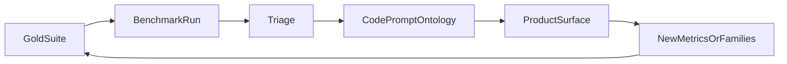
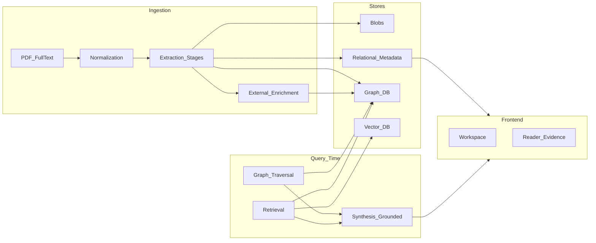
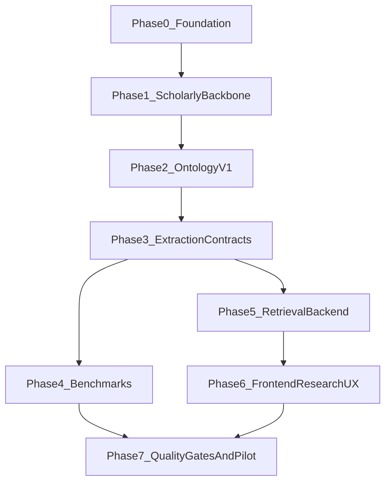

# Roadmap: science-graphrag

Документ задаёт **управленческий и технический план** создания проекта GraphRAG для помощи учёному при работе с литературой, генерации гипотез и навигации по исследованиям. Он дополняет и структурирует материал из [idea.md](idea.md).

**Статус:** living document — обновлять по мере реализации фаз.

---

## 1. Контекст и продуктовая цель

### 1.1. Проблема

Исследователю нужно не только «найти статьи», но и:

- связывать методы, данные, результаты и теории;
- видеть пробелы и противоречия в литературе;
- опираться на **трассируемые** утверждения с привязкой к источникам.

### 1.2. North star

Система помогает учёному в:

- **навигации** по корпусу и цитированию;
- **синтезе** знаний из нескольких работ с цитатами и provenance;
- **поиске противоречий и открытых вопросов**;
- **поддержке генерации идей** (гипотезы, комбинации методов, перенос между областями) — с явным разложением на утверждения и свидетельства.

### 1.3. Принципы (из idea.md)

- Не строить «идеальную онтологию науки» сразу — использовать **многоуровневую рабочую схему**: библиографический слой → семантический → эпистемический → слой идей.
- Каждая важная научная сущность должна быть **привязана к источнику**; идеи должны быть **разложимы до утверждений и доказательств**.
- LLM — **extractor и генератор кандидатов**; каноническая правда по метаданным и идентификаторам — через **внешние реестры** (OpenAlex, Crossref, ORCID, ROR и т.д.), см. [idea.md §7](idea.md).

### 1.4. Итеративный цикл: продукт и бенчмарк (flywheel)

Развитие продукта и eval **не линейны**: расширение или ужесточение gold-set и семейств метрик → прогон бенчмарков (CLI и/или UI) → triage регрессий → правки кода, промптов и границ онтологии → новые пользовательские сценарии (reader, graph, query) → новые требования к извлечению и новые кейсы в бенчмарке. Такой цикл держит scope онтологии и промптов **доказуемым** относительно эталона. Практический порядок шагов для разработчика — [runbooks/benchmark-driven-dev-loop.md](runbooks/benchmark-driven-dev-loop.md).

### 1.5. Docker и Compose: ранняя упаковка

**Политика проекта:** по мере появления зависимостей — как можно **раньше** упаковывать их в **Docker** (образы) и сводить запуск в **`docker-compose.yml`**, чтобы разработка, интеграционные тесты и бенчмарки опирались на **один и тот же** воспроизводимый стек (порты и URL согласованы с CI: `integration-nightly`, reference lane). Избегать сценария «сначала только README с ручной установкой Neo4j/Postgres/Qdrant». Новые **stateful** сервисы и **долеживаемые** процессы (API, workers) по умолчанию получают **Dockerfile** и/или сервис в compose, а не только текстовую инструкцию. Команды и состав стека: [runbooks/deploy.md](runbooks/deploy.md).

---

## 2. Стратегия реализации: greenfield vs копирование

| Подход | Суть | Решение для science-graphrag |
|--------|------|------------------------------|
| **Copy-first** | Скопировать репозиторий-аналог и заменить фронт, онтологию, benchmarks | **Не выбрано** — высокий риск перетащить доменно-специфичные решения и технический долг. |
| **Greenfield + selective reuse** | Новый проект с нуля; из референса брать **паттерны**, документацию, идеи архитектуры | **Выбрано** — явное проектирование scholarly-онтологии, extraction и UX под исследователя. |

**Референсный проект:** [osint-gr](/home/roman/pyprojects/ML/Prod/osint-gr) — зрелая структура docs, ADR, benchmark families, testing strategy, CI/gates. Использовать как **образец процессов и разбиения подсистем**, не как источник прямого копирования кода доменного слоя.

---

## 3. Целевая архитектура (верхний уровень)

**Слои данных (логически):**

1. **Scholarly backbone** — `Work`, `Author`, `Institution`, `Venue`, `Authorship`, цитирование, версии работ.
2. **Scientific semantic layer** — темы, задачи, методы, концепты, сущности предметной области, модели.
3. **Epistemic / claims layer** — утверждения, ограничения, конфликты, открытые вопросы (после стабилизации слоёв 1–2).
4. **Ideation layer** — гипотезы, комбинации, пробелы (опционально, post-MVP).

Подробная модель первого слоя и каскад промптов — в [idea.md](idea.md).

---

## 4. Матрица переиспользования: osint-gr

| Подсистема | Действие | Комментарий |
|------------|----------|-------------|
| Документация: `docs/architecture`, `docs/adr`, roadmap, policies, runbooks | **Reuse (паттерн)** | Воспроизвести структуру каталогов и дисциплину ADR под science-domain. |
| Разделение benchmark families (KG / IR / stream / gates) | **Reuse (паттерн)** | Адаптировать таксономию под scholarly сценарии (см. §8). |
| Testing strategy: unit / integration / smoke, merge-blocking subset | **Reuse (паттерн)** | Определить свои маркеры и gates под наличие инфраструктуры. |
| Docker / compose: граф + вектор + SQL + объекты | **Adapt** | Тот же класс стека часто уместен; конкретные сервисы и версии — решение проекта. **Политика:** ранняя упаковка и единый compose для dev/CI — см. §1.5 и [runbooks/deploy.md](runbooks/deploy.md). |
| FastAPI shell, auth, middleware | **Adapt** | Каркас HTTP — по необходимости; доменные роуты — новые. |
| Agent orchestration, subagents, tool registry | **Adapt** | Идея «оркестратор + инструменты» переносима; инструменты — literature/graph/citation, не OSINT-case. |
| Онтология, extractors, KG models | **Rebuild** | Полная замена под scholarly graph (Work, Claim, Method, …). |
| Frontend: чат и расследовательский UI | **Rebuild** | UX под **исследовательский workflow** (корпус, чтение, граф, доказательства), не копировать сценарии расследования. |
| Benchmark fixtures и eval-кейсы | **Rebuild** | Новые корпуса, JSON-кейсы, эталоны под извлечение и RAG. |

---

## 5. Фазы разработки

Для каждой фазы ниже: **цель**, **артефакты**, **риски**, **критерии выхода (exit criteria)**.

### Phase 0 — Product frame и фундамент репозитория

**Цель:** зафиксировать scope MVP, north star и минимальную структуру репозитория и документации.

**Deliverables:**

- Краткий PRD или раздел в README: пользователи, сценарии, non-goals MVP.
- Каркас `docs/`: `architecture/`, `adr/`, ссылка на этот roadmap и на [idea.md](idea.md).
- Decision log (ADR-000 или `docs/adr/000-greenfield-strategy.md`): greenfield + selective reuse от osint-gr.

**Риски:** размытый MVP → расползание scope. **Митигация:** явный список «не в MVP».

**Exit criteria:** согласованы структура репо, north star, список модулей (ingestion, graph, retrieval, API, UI, eval).

**Статус Phase 0:** закрыта (2026-03-30): см. корневой [README.md](../README.md), [docs/README.md](README.md), [adr/000-greenfield-strategy.md](adr/000-greenfield-strategy.md), каталоги модулей в корне репозитория.

---

### Phase 1 — Scholarly backbone и ingestion MVP

**Цель:** рабочая вертикаль «документ → нормализация → метаданные/авторы/ссылки → обогащение → граф цитирования».

**Deliverables (по факту реализации):**

| Статус | Что |
|--------|-----|
| **Сделано** | Граф первого слоя в Neo4j: `Work`, `Authorship`, `Author`, `Institution`, `Venue`, `CITES`, `PUBLISHED_IN`, `HAS_AUTHORSHIP`, `OF_AUTHOR`, `AFFILIATED_WITH` — см. [adr/002-layer1-graph-model.md](adr/002-layer1-graph-model.md). |
| **Сделано** | Ingestion: PDF/text/markdown → `article.md` → нормализация → **LLM-first** извлечение `WorkDraft` / `AuthorshipDraft` / `ReferenceDraft` с эвристическим fallback (`science_graphrag/ingestion/llm/stage_extraction.py`). |
| **Сделано** | Task-aware **document slices** (front matter, references scope) для промптов Layer 1; **section-aware chunks** + Qdrant; см. [architecture/chunking-strategy.md](architecture/chunking-strategy.md), [adr/003-chunking-and-dedup-strategy.md](adr/003-chunking-and-dedup-strategy.md). |
| **Сделано** | Рёбра **`CITES`**: по DOI (OpenAlex при успехе), иначе по **`arxiv_id`**, иначе по паре **title + year** (`title_fingerprint`) — см. `science_graphrag/ingestion/pipeline.py`. |
| **Сделано** | Обогащение реестром: **OpenAlex** по DOI для основной работы и для цитируемых с DOI. |
| **Сделано** | Хранилища: blobs, Postgres (`documents`, `ingestion_runs`), Neo4j, Qdrant; артефакты `article.md` + `extraction_diagnostics.json`. |
| **Частично** | Canonical ID / **dedup для `Work`** (DOI, arXiv, fingerprint) — без полного merge-каталога между корпусами. |
| **Частично** | **Author / Institution**: `:Author` с детерминированным id по нормализованному имени (одно написание → один узел между работами); `Institution.ror_id` — опционально через ROR API при `SCIENCE_GRAPHRAG_ROR_LOOKUP_ENABLED=true`. |
| **Частично** | Ребро **`RELATED_VERSION_OF`**: журнальный DOI + arXiv в OpenAlex `ids` → связь опубликованной работы с preprint-узлом. |
| **Сделано** | **Batch/corpus ingest**: `science-graphrag ingest-corpus <dir>` (рекурсивно `.pdf`/`.md`/`.txt`) и пост-аудит кластеров дублей `Work` по DOI / OpenAlex / fingerprint / arXiv в Neo4j. |
| **Отложено** | Интеграции **Crossref**, **ORCID** как отдельные клиенты; полноценный ROR-каталог и merge институций между корпусами. |

**Риски:** шум в entity resolution; слабые PDF. **Митигация:** метрики по слою 1 отдельно; ручная разметка малого gold-set.

**Exit criteria:** подтверждён **надёжный single-document (и малый корпус вручную)** ingest: связный библиографический граф с осмысленными `CITES` там, где извлечение даёт DOI / arXiv / title+year. **Сделано для корпуса:** CLI `ingest-corpus`, пост-аудит дублей `Work` в Neo4j, multi-case benchmark suite. Цель «десятки работ **без критического** дублирования Work» остаётся: сейчас есть **обнаружение** кластеров-дублей, без автоматического merge-каталога.

**Статус Phase 1:** **runnable MVP** (2026-03-30, обновлено **2026-03-31**): пакет `science_graphrag`, `docker-compose.yml`, CLI `science-graphrag ingest` / **`ingest-corpus`**, документы [architecture/phase-1-backbone.md](architecture/phase-1-backbone.md), [adr/001-phase1-stack.md](adr/001-phase1-stack.md), [adr/002-layer1-graph-model.md](adr/002-layer1-graph-model.md), [benchmarks/strategy-v1.md](benchmarks/strategy-v1.md).

**Дополнение (2026-03-30):** после PDF→Markdown ingestion использует **task-aware document slices** (front matter / references scope) для Layer 1 LLM и **section-aware chunks** с детерминированными id для Qdrant; см. [architecture/chunking-strategy.md](architecture/chunking-strategy.md), [adr/003-chunking-and-dedup-strategy.md](adr/003-chunking-and-dedup-strategy.md).

**Дополнение (2026-03-31):** batch-ingest + Neo4j `find_work_dedup_violations`; канонический `:Author` по имени; опциональный ROR; `RELATED_VERSION_OF` при arXiv в OpenAlex для DOI-работы; реальные CV-pdf фикстуры (pypdf→MD) — см. Phase 4.

---

### Phase 2 — Scientific ontology v1

**Цель:** версионированная онтология научного слоя поверх backbone.

**Deliverables:**

- Спецификация сущностей: `ResearchTopic`, `Problem`, `Question`, `Hypothesis`, `Claim`, `Concept`, `Entity` (или подтипы), `Method`, `Model`, `Dataset`, `Software` — в объёме MVP vs later ([idea.md начало](idea.md)).
- Таксономия отношений (например: работа исследует тему, метод применён к задаче, утверждение поддержано экспериментом — уточнять в ADR).
- Матрица Source of Truth: что из текста, что из реестров, что только с confidence.
- ADR: scope ontology v1, anti-bloat (не раздувать типы узлов без benchmark-покрытия).

**Риски:** онтология «на все случаи жизни» без данных. **Митигация:** жёсткий MVP-поднабор сущностей и связей.

**Exit criteria:** зафиксирован документ ontology v1 + policy изменений; согласовано с Phase 3 extraction.

**Статус Phase 2 (2026-04-06):** **MVP ontology v1** — сущности и связи **`Method` / `Dataset`** реализованы в **Neo4j**, ingestion и API (в т.ч. `science_graphrag/graph/neo4j_store.py`, semantic extraction по [specs/extraction/semantic-method-dataset-v1.md](specs/extraction/semantic-method-dataset-v1.md)). Спецификация и границы scope: [specs/ontology-v1-mvp.md](specs/ontology-v1-mvp.md), [adr/004-ontology-v1-scope.md](adr/004-ontology-v1-scope.md). **Дальнейшее расширение** онтологии остаётся **gated** золотыми эталонами и бенчмарками — см. [benchmarks/benchmark-expansion-v1.md](benchmarks/benchmark-expansion-v1.md).

---

### Phase 3 — Extraction pipeline и prompt contracts

**Цель:** воспроизводимое извлечение научного слоя с контрактами и метриками по этапам.

**Deliverables:**

- Независимые stages: metadata (уже из Phase 1), затем научные сущности/связи, затем claims/evidence (по готовности).
- Версионированные спецификации промптов и JSON-схем (вынести из [idea.md](idea.md) в `docs/specs/extraction/` по мере стабилизации).
- Поля: `confidence`, provenance (span/work id), failure modes, fallback (пропуск vs низкая уверенность).

**Риски:** один «большой промпт» на всё. **Митигация:** каскад как в [idea.md §8](idea.md).

**Exit criteria:** для каждого активного stage есть schema, контракт выхода, путь деградации и способ измерения качества (связь с Phase 4).

**Измеримый контракт semantic-stage (MVP):** выход и деградации — [specs/extraction/semantic-method-dataset-v1.md](specs/extraction/semantic-method-dataset-v1.md); в отчётах benchmark обязательны **`benchmark_run_metadata`** с `layer1_prompt_fingerprint` / `semantic_prompt_fingerprint` (или эквивалент) и идентификатором модели — без этого прогон не считается сопоставимым с предыдущими. На эталонных кейсах layer-2 (`yolov1_semantic` и suite `nightly_semantic`) не допускаются **необъяснимые** `llm_empty_result` при доступном LLM; остаточные fail классифицируются по [runbooks/benchmark-stabilization-triage.md](runbooks/benchmark-stabilization-triage.md).

**Статус Phase 3 (2026-03-31):** контракт и спецификация зафиксированы; стабилизация поведения на эталоне — Wave B ([runbooks/roadmap-next-waves.md](runbooks/roadmap-next-waves.md)). **Claims / evidence (Wave O):** production LLM stage + Neo4j + Qdrant + `GET /v1/works/{id}/claims` — [analysis/ontology-benchmarks-roadmap-2026-04-24.md](analysis/ontology-benchmarks-roadmap-2026-04-24.md) §7.4, флаг `SCIENCE_GRAPHRAG_CLAIMS_EXTRACTION_ENABLED`.

---

### Phase 4 — Benchmarks и eval-система

**Цель:** качество измеряется системно; регрессии ловятся автоматически там, где возможно.

#### 4.1. Семейства бенчмарков (аналог логики osint-gr benchmark families)

| Family | Вопрос качества | Примечание для science-graphrag |
|--------|-----------------|--------------------------------|
| **KG extraction** | Precision/Recall/F1 против эталона (граф или тройки) | Слой 1: метаданные, авторы, ссылки; слой 2: сущности/связи. |
| **Retrieval / citation** | Попадание в релевантные чанки/работы, attribution | Вопросы с заранее заданными gold-документами или чанками. |
| **Answer / synthesis** | Структурные инварианты ответа: цитаты, trace, отсутствие «голого» текста | Аналог «stage 6»-мышления: не обязательно совпадение формулировок. |
| **Hypothesis / idea-assist** | Полезность и безопасность идей | Часто **human-in-the-loop** + rubric; не блокирует merge как единственный gate. |

#### 4.2. Внешние датасеты и реестры (ориентиры из idea.md)

- **OpenAlex** — backbone для works/authors/institutions/sources; валидация и weak supervision.
- **SciERC** — классический IE/relations на научном тексте.
- **SciREX** — документный scientific IE.
- **ORKG** — примеры структурирования research contributions.
- Дополнительно упоминаемые направления: SciER (dataset/method/task) и др. — подбирать под конкретные слои извлечения.

Использование: не обязательно «end-to-end продукт», а **подмножества** для калибровки экстракторов и регрессий.

#### 4.3. Собственный benchmark pack (где нет gold-standard)

- Малый **gold-set** (10–50 работ или фрагментов) с ручной разметкой под критичные типы.
- Формат кейсов: JSON (id, входные артефакты, ожидаемые узлы/рёбра или допустимые варианты).
- Процесс adjudication и версионирование эталона.
- Отчёты регрессий (JSON/Markdown), сравнение с baseline.

**Риски:** дорогая разметка; утечка train/test при итерациях промптов. **Митигация:** holdout; фиксация версий промптов и моделей в отчётах.

**Exit criteria:** документ `docs/benchmarks/strategy-v1.md` (или раздел здесь) + минимальный автоматический прогон хотя бы для слоя 1 extraction; план merge vs nightly gates.

**Статус Phase 4:** **в процессе** (2026-03-30, углубление **2026-03-31**).

**Dev/QA:** визуальная консоль бенчмарков (`/benchmark` в `ui/`, API `/v1/benchmark/*`) — **основной** интерфейс для просмотра `article.md`, эталона (`gold`) и сравнения с выводом модели **наряду с CLI** и [benchmark-decision-gate](runbooks/benchmark-decision-gate.md); не заменяет воспроизводимые прогоны и агрегатор метрик. См. Phase 6 и [architecture/frontend-phase6-bridge-backlog.md](architecture/frontend-phase6-bridge-backlog.md) (`A5`, `B4`).

**Политика: бенчмарки с LLM как эталон качества.** Локальные и ручные регрессионные прогоны, по которым судят о качестве извлечения (метаданные, ссылки, семантический слой) и о содержимом Neo4j после ingest, следует выполнять **с включённым LLM** (`SCIENCE_GRAPHRAG_EXTRACTION_LLM_ENABLED=true`, ключ и base URL в `.env` — см. [eval/README.md](../eval/README.md), `MAIN_LLM_*` / `SCIENCE_GRAPHRAG_EXTRACTION_LLM_*`). Прогон **без** LLM остаётся для быстрых эвристик и merge CI; его метрики и граф **не** считаются эталоном поведения в продакшене.

**Уже есть:**

- [docs/benchmarks/strategy-v1.md](benchmarks/strategy-v1.md), [benchmarks/README.md](benchmarks/README.md), [eval/README.md](../eval/README.md).
- **Gold-set layer1** (каталог `tests/fixtures/benchmarks/layer1/<case_id>/`): YOLOv1; синтетические шаблоны (`doi_refs_heavy`, `arxiv_refs_heavy`, `noisy_layout_stub`); **реальные статьи** из pypdf→MD (`retinanet_focal_realpdf`, `fcos_realpdf`, скрипт `scripts/build_real_pdf_layer1_fixture.py`, см. `SOURCE.txt` в кейсе).
- **Draft-level** раннер: `eval/layer1/`, CLI `science-graphrag-layer1-benchmark`; в отчёте **`run_metadata`** (модель + `layer1_prompt_fingerprint`).
- **Suite:** один прогон по всем кейсам: `--suite` на корне фикстур (layer-1 и graph-v1).
- **Graph-level** eval: `eval/graph_v1/`, CLI `science-graphrag-graph-benchmark`, `graph_expectations` в `gold.json`; опционально **`max_work_dedup_violations`**, **`min_related_version_edges` / `max_related_version_edges`** (см. [benchmarks/graph-level-eval-v1.md](benchmarks/graph-level-eval-v1.md)).
- **Merge CI:** `.github/workflows/ci.yml` — `pytest -m "not integration"` на push/PR в `main`/`master`.
- **Nightly / manual CI:** `.github/workflows/integration-nightly.yml` — контейнеры Neo4j + Qdrant, `pytest tests -m integration` (`workflow_dispatch` + еженедельный cron).
- **Интеграция локально:** `pytest -m integration` — `tests/integration/test_full_ingest_integration.py` (Neo4j+Qdrant; skip при недоступности); политика merge vs nightly — [benchmarks/graph-level-eval-v1.md](benchmarks/graph-level-eval-v1.md).
- Общие хелперы suite: `eval/bench_common.py`; тесты discovery/dedup/OpenAlex-хелперов.

**Дальше (backlog Phase 4, приоритет):**

1. **Nightly+:** при наличии `MAIN_LLM_API_KEY` в GitHub secrets nightly запускает **layer-2 `nightly_semantic`** и **layer-1 `nightly_heavy`** (обновлено 2026-04-19, `.github/workflows/integration-nightly.yml`). Полный graph suite с живым OpenAlex остаётся advisory.
2. **Graph suite в CI:** тяжёлый шаг; либо отдельный job на nightly, либо один лёгкий кейс без OpenAlex на merge (на nightly уже есть `yolov1` + `retinanet_focal_realpdf` graph benchmarks без LLM).
3. **Gold для real-pdf:** заполнить `authorships[]` и при необходимости ужесточить `graph_expectations` под прогон **с включённым LLM** (отдельный job).
4. Новые **families** и gold по мере Phase 2+ — [benchmarks/benchmark-expansion-v1.md](benchmarks/benchmark-expansion-v1.md).

#### CI и gate-политика (merge vs nightly vs advisory)

| Уровень | Что входит | Роль |
|---------|------------|------|
| **Merge (обязательно на PR)** | `.github/workflows/ci.yml`: `pytest -m "not integration"` | Быстрая регрессия кода **без** живых Neo4j/Qdrant и **без** LLM-бенчмарков как эталона прод-поведения. |
| **Integration (nightly / manual)** | `.github/workflows/integration-nightly.yml`: сервисы Neo4j + Qdrant + `pytest -m integration` | Проверка полного ingest-пайплайна против реальных сторов. |
| **Benchmark LLM (локально / nightly+)** | `science-graphrag-layer1-benchmark` / `science-graphrag-graph-benchmark` / `science-graphrag-layer2-benchmark` с `--suite`, см. [eval/README.md](../eval/README.md) | **Эталон качества** извлечения при включённом LLM; артефакты `current-*` + [runbooks/benchmark-decision-gate.md](runbooks/benchmark-decision-gate.md). |
| **Advisory** | Полный graph suite с живым OpenAlex, расширение gold | По мере готовности инфраструктуры; не блокирует merge, пока явно не включено в gate. |

**Wave A (decision gate):** переход к Wave B–D привязан к `GO` / `CONDITIONAL-GO` в `eval/results/benchmark-metrics-summary.md` — см. [runbooks/benchmark-decision-gate.md](runbooks/benchmark-decision-gate.md) и [runbooks/roadmap-next-waves.md](runbooks/roadmap-next-waves.md).

#### Execution policy (локальная разработка и автоматизация)

- **Docker / Compose:** команды `docker` / `docker compose` выполняются **без `sudo`** (предполагается, что пользователь в группе `docker` на Linux или использует Docker Desktop).
- **Прогоны benchmark и decision gate:** если по плану roadmap или runbook требуется прогон (suite, интеграция, агрегатор метрик), его можно выполнять **без дополнительного подтверждения** от владельца репозитория; перед прогоном при необходимости поднимают зависимости из `docker-compose.yml`.
- **Пересборка API / образов:** при изменениях backend или для валидного e2e-прогона допустимы `docker compose up -d --build` и перезапуск `science-graphrag-api`, если это нужно получить согласованный результат теста.

Подробнее по критериям GO/NO-GO: [runbooks/benchmark-decision-gate.md](runbooks/benchmark-decision-gate.md). Волны **A–D** и следующие **E–H**: [runbooks/roadmap-next-waves.md](runbooks/roadmap-next-waves.md).

---

### Phase 5 — Retrieval и GraphRAG backend

**Цель:** query-time контур: lexical + vector + обход графа + синтез с опорой на источники.

**Deliverables:**

- Классы запросов учёного: поиск литературы, сравнение методов, трассировка claim → evidence, противоречия, открытые вопросы.
- API и контракты: запрос → retrieval trace → ответ с цитатами/ссылками на чанки и работы.
- Политики: когда углубляться в граф vs вектор; лимиты контекста.

**Риски:** галлюцинации при синтезе. **Митигация:** обязательные citations; тесты из Phase 4.

**Exit criteria:** end-to-end путь для **3–5** ключевых user journeys с воспроизводимым trace.

**Статус Phase 5 (2026-03-31, обновлено 2026-04-19):** **MVP in progress** — реализованы `GET /health`, `POST /v1/query`, UI-facing `GET /v1/works` (в т.ч. фильтры `year_min` / `year_max` / `has_semantic`), `GET /v1/works/{work_id}`, `GET /v1/works/{work_id}/graph`, `GET /v1/works/{work_id}/chunks`; **опциональный второй этап LLM** для ответа (`SCIENCE_GRAPHRAG_QUERY_ANSWER_LLM_ENABLED`, см. `.env.example`, `science_graphrag/api/retrieval.py`). Сценарии учёного: [runbooks/user-journeys-retrieval-v1.md](runbooks/user-journeys-retrieval-v1.md). Дальше — семейство retrieval-бенчмарков ([benchmarks/retrieval-eval-v1.md](benchmarks/retrieval-eval-v1.md)) и стабилизация контрактов.

**Обязательный happy-path (Wave C):** задокументирован в [specs/frontend-ui-api-contracts-v1.md](specs/frontend-ui-api-contracts-v1.md) (раздел *Mandatory API happy-path*); smoke `tests/test_api_smoke.py` покрывает `/health`, `/v1/query`, `/v1/works`, `/v1/works/{work_id}`, `/v1/works/{work_id}/graph`, `/v1/works/{work_id}/chunks` через моки (без живых Neo4j/Qdrant).  
**Текущий статус валидации (2026-03-31):** `pytest tests -m integration` на поднятом compose (`neo4j`, `postgres`, `qdrant`) — `3 passed`.

---

### Phase 6 — Frontend под исследовательский workflow

**Цель:** UI не как «общий чат», а рабочее место исследователя.

**Поверхности (приоритизация — отдельным UX-доком):**

- Workspace корпуса / проекта.
- Чтение статьи + панель извлечённых сущностей и связей.
- Обзор графа (фильтры по типам узлов).
- Панель доказательств и цитат к ответу системы.
- Композер запросов; опционально «доска идей» (post-MVP).
- **Benchmarks (dev/QA):** страница просмотра фикстур и запуска прогонов в UI — тот же класс задач, что консоль бенчмарков в референсе [osint-gr](/home/roman/pyprojects/ML/Prod/osint-gr) (`frontend/src/pages/BenchmarkPage/`, вспомогательно `backend/tests/bench/`, `backend/osint_graphrag/utils/bench/`). Рекомендуется **с ранних Phase 3–4** для визуального QA извлечения (см. §1.4). Не заменяет CLI и [benchmark-decision-gate](runbooks/benchmark-decision-gate.md); дополняет Phase 4 для локальной итерации. См. [architecture/frontend-phase6-bridge-backlog.md](architecture/frontend-phase6-bridge-backlog.md) (`A5`, `B4`).

**MVP flow:** ingest корпуса → просмотр графа/метаданных → вопрос с grounded ответом → инспекция цитат.

**Риски:** тяжёлый UI до готовности данных. **Митигация:** сначала минимальный reader + chat с citations, затем graph explorer.

**Exit criteria:** карта экранов, модель состояния, контракты API для UI; реализация MVP-набора согласно приоритетам.

**Статус Phase 6 (2026-03-31):** **parallel track approved** — допускается запуск в две волны:  
1) `frontend shell + mock-driven screens + contract-first planning`;  
2) полная интеграция после стабилизации Phase 5 API-контрактов.  
См. [architecture/frontend-parallel-track-strategy.md](architecture/frontend-parallel-track-strategy.md), [specs/frontend-ui-api-contracts-v1.md](specs/frontend-ui-api-contracts-v1.md), [architecture/frontend-phase6-bridge-backlog.md](architecture/frontend-phase6-bridge-backlog.md).

**Benchmark console (2026-04-06):** поверхность **Benchmarks** (`/benchmark` в `ui/`, API `/v1/benchmark/*` в `science_graphrag/api/benchmark.py`, фоновые прогоны `science_graphrag/api/task_store.py`). Текущий охват — **layer-1** / **layer-2**; история прогонов **файловая** (`data/benchmark_runs/*.json`, восстановление после рестарта). Опциональный **admin gate**: `SCIENCE_GRAPHRAG_ADMIN_API_KEY` + заголовок `X-Admin-Key` для `/v1/benchmark/*` и `/v1/settings/*`. Backlog UX: [frontend-phase6-bridge-backlog.md](architecture/frontend-phase6-bridge-backlog.md) (`A5`, `B4`).

---

### Phase 7 — Quality gates, документация, пилот

**Цель:** зрелость процесса и проверка ценности на реальном мини-корпусе.

**Deliverables:**

- CI: unit; integration; подмножество benchmarks на merge; при необходимости smoke с инфраструктурой (nightly/manual). **Частично (2026-03-31):** merge-gate — `.github/workflows/ci.yml` (`pytest -m "not integration"`); integration — `.github/workflows/integration-nightly.yml` (сервисы Neo4j/Qdrant + `pytest -m integration`, ручной/еженедельный запуск). Полный benchmark suite в CI пока не обязателен.
- Runbooks: деплой, бэкапы, ключи API внешних реестров.
- Пилот: узкий научный домен, критерии успеха (время до ответа, доля ответов с корректными цитатами, субъективная полезность).

**Pilot package (Wave D):** единый чеклист и KPI — [runbooks/pilot-checklist.md](runbooks/pilot-checklist.md). **Предусловие:** не слабее **CONDITIONAL-GO** по [runbooks/benchmark-decision-gate.md](runbooks/benchmark-decision-gate.md) (с задокументированными blockers); иначе сначала Wave A.

**Post-MVP (milestones в roadmap):** мульти-статьёвый синтез, граф противоречий, расширенная оценка idea-assist.

**Exit criteria:** пилот завершён с зафиксированными выводами и backlog на следующую волну.

---

## 6. Зависимости между фазами

Диаграмма задаёт **логический** порядок введения возможностей. **Phase 2–4** на практике развиваются **спиралью**: онтология, контракты извлечения, gold-set и прогоны бенчмарков чередуются с правками промптов и кода, пока метрики на эталоне не стабилизируются (см. §1.4).

Параллельно допустимо:  
- вести `shell/contracts`-волну Phase 6 параллельно с доработкой Phase 5;  
- переводить UI на full integration только после стабилизации API-контрактов;  
- Phase 4 итеративно углублять с Phase 1–3.

**Волны Wave A–D:** операционная последовательность и зависимость Wave A → gate → B/C/D — [runbooks/roadmap-next-waves.md](runbooks/roadmap-next-waves.md). Следующие волны **E–H** (CI/пилот, retrieval, UI/UX, онтология) описаны в том же runbook.

---

## 7. Риски проекта (сводка)

| Риск | Митигация |
|------|-----------|
| Раздувание онтологии без данных | Ontology v1 + anti-bloat ADR; расширение только с benchmark |
| Нехватка gold-разметки | Внешние benchmarks + малый in-house gold; weak metrics на регистрах |
| Перегруз фронта до стабильной модели | Сначала data/API контракты и минимальный UI |
| Зависимость от внешних API | Кэш, лимиты, offline-деградация для чтения уже загруженного |

---

## 8. Связанные документы

| Документ | Назначение |
|----------|------------|
| [runbooks/roadmap-next-waves.md](runbooks/roadmap-next-waves.md) | Wave A–D и E–H: decision gate, semantic, e2e, pilot, CI maturity, retrieval, UI/UX, ontology |
| [runbooks/user-journeys-retrieval-v1.md](runbooks/user-journeys-retrieval-v1.md) | Сценарии Phase 5: corpus → query → evidence (воспроизводимый trace) |
| [benchmarks/retrieval-eval-v1.md](benchmarks/retrieval-eval-v1.md) | Заготовка семейства retrieval/citation benchmarks |
| [benchmarks/teacher-gold-audit-v1.md](benchmarks/teacher-gold-audit-v1.md) | Процедура аудита teacher-gold фикстур |
| [specs/ui-empty-loading-audit-v1.md](specs/ui-empty-loading-audit-v1.md) | Чеклист empty/loading/error по UI |
| [specs/ontology-wave-h-backlog.md](specs/ontology-wave-h-backlog.md) | Backlog расширения онтологии (Claims, merge) |
| [runbooks/benchmark-driven-dev-loop.md](runbooks/benchmark-driven-dev-loop.md) | Короткий цикл: кейс → прогон → compare; CLI и UI `/benchmark` |
| [runbooks/benchmark-decision-gate.md](runbooks/benchmark-decision-gate.md) | GO / NO-GO и связь с Wave A–D |
| [runbooks/pilot-checklist.md](runbooks/pilot-checklist.md) | Phase 7: pilot package и KPI |
| [runbooks/deploy.md](runbooks/deploy.md) | Compose-стек, политика ранней Docker-упаковки |
| [architecture/frontend-parallel-track-strategy.md](architecture/frontend-parallel-track-strategy.md) | Strategy параллельного frontend-трека до полного закрытия Phase 5 |
| [specs/frontend-ui-api-contracts-v1.md](specs/frontend-ui-api-contracts-v1.md) | Минимальные frontend-facing API контракты v1 |
| [architecture/frontend-phase6-bridge-backlog.md](architecture/frontend-phase6-bridge-backlog.md) | Стартовый backlog: frontend shell + backend bridge + **benchmark console** (`A5`/`B4`) |
| [benchmarks/graph-level-eval-v1.md](benchmarks/graph-level-eval-v1.md) | План graph-level benchmark после ingest |
| [benchmarks/benchmark-expansion-v1.md](benchmarks/benchmark-expansion-v1.md) | Расширение корпуса и семейств бенчмарков |
| [idea.md](idea.md) | Онтология по слоям, первый слой графа, нормализация, промпты, внешние источники |
| Референс: `osint-gr/docs/README.md` | Образец индекса документации |
| Референс: `osint-gr/docs/architecture/benchmark-families.md` | Идея семейств бенчмарков |
| Референс: `osint-gr/docs/testing/testing-strategy.md` | Уровни тестов и gates |

---

## 9. История изменений

| Версия | Дата | Изменения |
|--------|------|-----------|
| 2.4 | 2026-04-19 | Wave **E–H** в [runbooks/roadmap-next-waves.md](runbooks/roadmap-next-waves.md); Phase 5: опциональный second-stage LLM для `/v1/query`, фильтры `GET /v1/works`, user journeys; nightly **layer1 nightly_heavy** при секрете; admin gate `X-Admin-Key`; API `/v1/ask-sessions` (file-backed); документы retrieval eval, teacher-gold audit, UI empty-state audit, ontology Wave H backlog; пилот: rubric + corpus target в exit record / pilot corpus runbook. |
| 2.3 | 2026-04-06 | §1.5 и строка в матрице §4: политика **ранней** упаковки сервисов в Docker и `docker-compose.yml`; [runbooks/deploy.md](runbooks/deploy.md) — секция *Policy: Docker and Compose (early)*. |
| 2.2 | 2026-04-06 | §1.4: flywheel продукт ↔ бенчмарк; §6: спираль Phase 2–4; Phase 4/6: консоль `/benchmark` как основной dev/QA интерфейс наряду с CLI; §8: ссылка на [benchmark-driven-dev-loop.md](runbooks/benchmark-driven-dev-loop.md). |
| 2.1 | 2026-04-06 | Phase 6: в планах и backlog явно добавлены **Benchmarks** (страница просмотра/запуска бенчмарков, референс osint-gr `BenchmarkPage` + `tests/bench` + `utils/bench`); контракт `/v1/benchmark/*` — [specs/frontend-ui-api-contracts-v1.md](specs/frontend-ui-api-contracts-v1.md); Wave C — опциональный пункт про benchmark UI. |
| 2.0 | 2026-04-06 | Phase 2: статус — MVP `Method`/`Dataset` в Neo4j, ingestion и API; semantic extraction и контракты синхронизированы. Wave D: [pilot-checklist.md](runbooks/pilot-checklist.md), [pilot-corpus-wave-d.md](runbooks/pilot-corpus-wave-d.md), [pilot/wave-d-exit-record.md](pilot/wave-d-exit-record.md); UI Phase 6 bridge (маршруты Workspace/Reader/Graph/Ask/Evidence); CI job `ui` для `ui/`. |
| 1.9 | 2026-03-31 | Wave A закрыта до `GO`: authoritative rerun `layer1 nightly_heavy` + `layer2 nightly_semantic` и пересборка агрегатора дали `decision=GO` (`layer1 failed=0`, `layer2 failed=0`). Обновлены runbooks gate/waves. |
| 1.8 | 2026-03-31 | Wave A: синхронизированы layer-1 gold `abstract_prefix` для realpdf-кейсов; выполнены targeted retests (`centernet`, `deformable_detr`, `fcos`, `selective_search`) — все `passed=True`; агрегатор метрик расширен supplementary-учётом `deformable_detr`. |
| 1.7 | 2026-03-31 | Wave B: `nightly_semantic` suite перепрогнан после `nano_retry` — `layer2 nightly failed: 0`; обновлены decision-gate и wave runbooks (single-case + suite snapshots). |
| 1.6 | 2026-03-31 | Wave B: в `semantic_extraction` добавлен `nano_retry` (после compact/micro) и обновлён `semantic_prompt_fingerprint`; цель — снизить `llm_empty_result` на `nightly_semantic`. |
| 1.5 | 2026-03-31 | Wave C: подтверждён "живой" e2e-контур — `pytest tests -m integration` (`3 passed`) на поднятом compose; roadmap/runbooks/spec синхронизированы с этим статусом. |
| 1.4 | 2026-03-31 | Wave C: расширен `tests/test_api_smoke.py` (мок-покрытие `/v1/query`, `/v1/works*`, `/v1/works/{id}/graph`, `/v1/works/{id}/chunks` без живых сторов); синхронизированы roadmap/runbooks/spec с фактическим smoke-покрытием happy-path. |
| 1.3 | 2026-03-31 | Phase 4: таблица **CI и gate-политика** (merge / integration / LLM benchmark / advisory); явная связь **Wave A** с [benchmark-decision-gate.md](runbooks/benchmark-decision-gate.md). Phase 3: измеримый контракт semantic-stage + fingerprints. Phase 5/6: ссылка на **mandatory API happy-path** в [frontend-ui-api-contracts-v1.md](specs/frontend-ui-api-contracts-v1.md). Phase 7: **pilot package** и предусловие по decision gate. §6: ссылка на Wave A–D. §8: индекс runbooks. |
| 1.2 | 2026-03-31 | Phase 4/7: зафиксирована **Execution policy** (Docker/compose без `sudo`, автономные прогоны benchmark/decision gate, допустимая пересборка API); добавлен [runbooks/roadmap-next-waves.md](runbooks/roadmap-next-waves.md) (Wave A–D). |
| 1.1 | 2026-03-31 | Phase 5/6 bridge: реализованы `GET /v1/works` и связанные endpoints по [frontend-ui-api-contracts-v1.md](specs/frontend-ui-api-contracts-v1.md); UI-прототип показывает список works; layer-1 метрики: нормализация unicode-дефисов в `abstract_prefix`; semantic extraction: третья попытка (micro slice); Phase 7: pilot checklist + CI шаг `aggregate_benchmark_metrics.py`. После обновления gold перезапустите LLM suite и обновите `eval/results/current-*.json`. |
| 1.0 | 2026-03-31 | Phase 5/6 bridge: зафиксирован параллельный frontend-трек (`shell + mocks + contract-first`), добавлены UI API contracts v1 и общий backlog для frontend shell + backend bridge endpoints; roadmap синхронизирован с фактическим статусом API MVP (`POST /v1/query`). |
| 0.9 | 2026-03-31 | Phase 4: зафиксирована политика — ручные/репрезентативные бенчмарки с **LLM** как эталон качества; без LLM — только быстрые эвристики / merge CI. |
| 0.8 | 2026-03-31 | Phase 4/7: nightly CI Postgres + интеграции ingest/SQL/batch; layer1 + graph yolov1 бенчмарки без LLM; `case_tiers.json`, `--tier`; real-pdf gold: dedup graph, authorships для SSD/DETR. Phase 2/3: [adr/004-ontology-v1-scope.md](adr/004-ontology-v1-scope.md), [specs/extraction/semantic-method-dataset-v1.md](specs/extraction/semantic-method-dataset-v1.md) |
| 0.7 | 2026-03-31 | Phase 2: черновик [specs/ontology-v1-mvp.md](specs/ontology-v1-mvp.md); Phase 4: graph-v1 метрики `max_work_dedup_violations`, `RELATED_VERSION_OF` (через `graph_expectations`); GitHub Actions **integration-nightly** (Neo4j+Qdrant + `pytest -m integration`); roadmap: backlog 4.3 пересортирован после закрытия merge-gate / nightly-базиса / инвариантов графа |
| 0.6 | 2026-03-31 | Phase 1: `ingest-corpus`, Neo4j dedup audit, canonical Author id, опциональный ROR, `RELATED_VERSION_OF` из OpenAlex; Phase 4: benchmark **suite** (`--suite`), `bench_common`, integration ingest test, расширенный gold-set (синтетика + real-pdf), документация merge/nightly; Phase 7: старт CI merge-gate |
| 0.5 | 2026-03-30 | LLM-first layer-1 extraction; YOLOv1 layer-1 benchmark (`eval/layer1`); initial graph-level eval (`eval/graph_v1`); `CITES` без DOI (arxiv / title+year); Phase 1 deliverables разбиты на done/partial/deferred; Phase 4 статус in progress; план расширения benchmark |
| 0.4 | 2026-03-30 | Task-aware chunking, document slices, ADR 003, semantic-chunks spec, Qdrant chunk fingerprints |
| 0.3 | 2026-03-30 | Phase 1: `science_graphrag`, Docker stack, Neo4j/Postgres/Qdrant ingest, ADR 001–002, benchmarks strategy v1 |
| 0.2 | 2026-03-30 | Phase 0: корневой README (PRD), индекс `docs/`, ADR-000, каркас модулей `ingestion`…`eval` |
| 0.1 | 2026-03-30 | Первоначальный roadmap по плану greenfield + фазы 0–7 |
