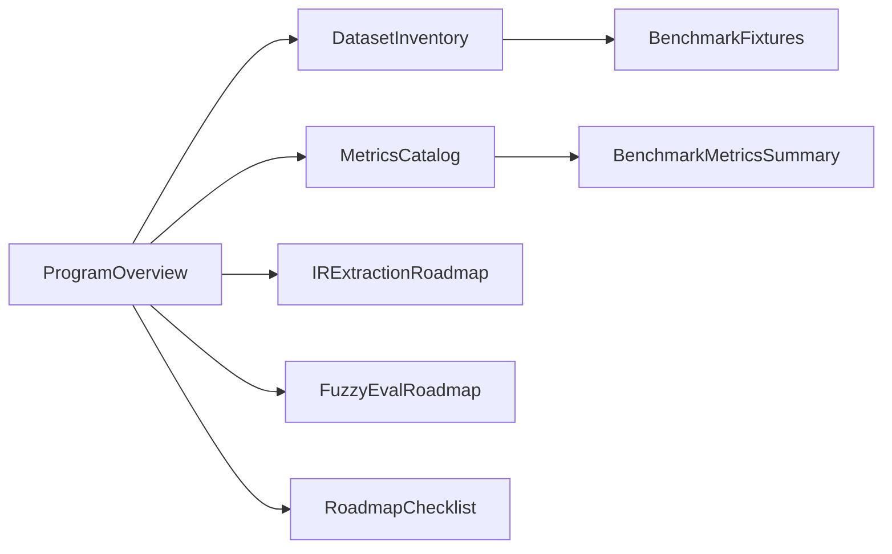

# Чеклист: benchmark roadmap (операционный runbook)

Короткие списки для команды. Детали программы: [../benchmarks/benchmark-program-overview.md](../benchmarks/benchmark-program-overview.md), gate: [benchmark-decision-gate.md](benchmark-decision-gate.md), промоушен: [benchmark-family-promotion-review.md](benchmark-family-promotion-review.md).

---

## Новый benchmark family

- [ ] **Спека:** цель семьи, схема gold JSON, что считается pass/fail (одна страница в `docs/specs/` или `docs/benchmarks/`).
- [ ] **Код метрик:** `eval/<family>/metrics.py` + runner; unit-тест на scoring из фикстуры.
- [ ] **Фикстуры:** минимум `*_merge_contract` (1 кейс) + `*_mini` (3–5 кейсов); README в `tests/fixtures/benchmarks/<family>/`.
- [ ] **`case_tiers.json`:** имена тиров согласованы с CLI и CI.
- [ ] **Роль:** явно `advisory` или будущий core; для advisory — запись в [benchmark-program-status.md](benchmark-program-status.md).
- [ ] **Сводка:** при готовности артефактов — ключи в `scripts/aggregate_benchmark_metrics.py` + строка в `eval/results/benchmark-metrics-summary.md` (генерация скриптом).
- [ ] **Документация:** ссылка из [../benchmarks/README.md](../benchmarks/README.md) и из overview-пакета.

---

## Расширение dataset pack

- [ ] **Источник данных** помечен: real-PDF corpus / markdown-only / synthetic / live API.
- [ ] **Нет утечки:** если крутим промпты на тех же кейсах — завести `benchmark_holdout` / отдельный тир (как в claims `pilot_train` vs `pilot`).
- [ ] **Стабильность gold:** эталон не зависит от недетерминированного LLM «на лету»; правки gold сопровождаются причиной в PR.
- [ ] **Тиры:** новые кейсы сначала в mini/pilot; в `nightly_*` — после зелёной истории.
- [ ] **Команды прогона** добавлены в [`eval/README.md`](../../eval/README.md) при необходимости.

---

## Перед promotion: advisory → stronger gate

Использовать полный процесс: [benchmark-family-promotion-review.md](benchmark-family-promotion-review.md).

Краткий чеклист:

- [ ] Core gate (`layer1`/`graph`/`layer2`) в здоровом состоянии.
- [ ] Есть **parallel** сигнал: не только mock/self-referential predictions, а live или graph-backed lane (если применимо).
- [ ] **Стоимость** прогона и секреты приемлемы для предлагаемого tier (merge vs nightly).
- [ ] Обновлены: `benchmark-decision-gate.md`, `benchmark-program-status.md`, `aggregate_benchmark_metrics.py`, заголовок спеки семьи.

---

## Запуск fuzzy-eval (ROUGE / judge)

План трека: [../benchmarks/benchmark-roadmap-fuzzy-eval.md](../benchmarks/benchmark-roadmap-fuzzy-eval.md).

- [ ] **Gold:** эталонный текст или bullet list ожиданий; версия датасета зафиксирована.
- [ ] **Rubric:** критерии оценки (чеклист для человека или judge).
- [ ] **Judge prompt:** frozen текст + hash / id в метаданных прогона.
- [ ] **Модель:** имя judge, версия API; temperature зафиксирована.
- [ ] **Стоимость:** оценка токенов / бюджет на прогон.
- [ ] **Стабильность:** пилот на N кейсах, дисперсия скоров; при высокой — не расширять gate.
- [ ] **Holdout:** отдельный набор, не используемый при настройке промптов.
- [ ] **Артефакты:** raw outputs в JSON под `eval/results/`; не сохранять API-ключи и прочие секреты (см. `.cursor/rules/security-sensitive.mdc`).
- [ ] **Интеграция в summary:** только advisory-секция или отдельный файл, пока политика не изменится.

---

## Навигация по пакету документов

