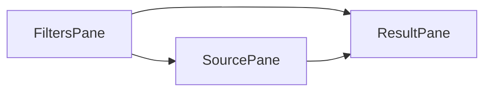

# Benchmark Workbench UI Plan

Дата: `2026-04-07`

## Цель

Добавить в `SciGraph` полноценную страницу просмотра и запуска бенчмарков, чтобы пользователь мог:

- листать исходный `article.md` по кейсу;
- видеть ожидаемое извлечение (`gold` / `gold_teacher`);
- видеть фактическое извлечение модели;
- видеть side-by-side diff по полям;
- запускать бенчмарки на выбранной модели:
  - по одному кейсу,
  - по выбранному набору,
  - по tier,
  - по всему benchmark suite;
- получать метрики, таблицы, историю прогонов и drill-down до уровня кейса и поля.

План опирается на текущий MVP `/benchmark` в `SciGraph` и расширяет его до режима benchmark workbench.

## Контекст и текущий статус

Сейчас в проекте уже есть базовый `/benchmark`:

- UI:
  - `ui/src/pages/BenchmarkPage/BenchmarkPage.jsx`
  - `ui/src/pages/BenchmarkPage/RunTab.jsx`
  - `ui/src/pages/BenchmarkPage/ResultsTab.jsx`
  - `ui/src/pages/BenchmarkPage/CasesTab.jsx`
  - `ui/src/pages/BenchmarkPage/CaseDetailDialog.jsx`
  - `ui/src/pages/BenchmarkPage/ResultsDialog.jsx`
- API:
  - `science_graphrag/api/benchmark.py`
- Клиент:
  - `ui/src/services/benchmarkApi.js`

Текущий MVP уже умеет:

- показывать список кейсов;
- запускать `layer1` и `layer2` прогоны;
- показывать историю run-ов;
- открывать детали run-а;
- отображать basic comparison tables.

Но сейчас UX всё ещё ориентирован на dev/QA console, а не на удобный benchmark review workflow:

- кейсы смотрятся как raw `article.md` + pretty-printed JSON;
- нет удобного разделения по полям, сущностям и mismatch-ам;
- нельзя выбрать модель для run из UI;
- нет teacher/student comparison режима;
- нет удобной навигации по длинному тексту статьи;
- нет устойчивой истории прогонов с фильтрами;
- нет dedicated screen для анализа одного кейса и одной модели;
- нет таблиц агрегированных метрик по suite с drill-down;
- graph-family остаётся только catalog-only.

## Пользовательские сценарии

### Сценарий 1. Разбор одного кейса

Пользователь открывает кейс, например `yolov2_realpdf`, и видит:

- исходный текст статьи;
- структурированное gold-представление;
- предсказание текущей модели;
- список mismatch-ов:
  - title,
  - authors,
  - affiliations,
  - references,
  - semantic methods/datasets;
- итоговые метрики по кейсу;
- статус contract checks.

### Сценарий 2. Запуск на выбранной модели

Пользователь выбирает:

- benchmark family: `layer1` / `layer2` / позже `graph`;
- модель:
  - teacher preset,
  - student preset,
  - custom model id;
- selector:
  - один кейс,
  - несколько кейсов,
  - `merge_safe`,
  - `nightly_*`,
  - all.

После запуска он видит:

- progress;
- статус по кейсам;
- промежуточные метрики;
- итоговую таблицу с pass/fail и macro averages.

### Сценарий 3. Анализ suite

Пользователь открывает run и видит:

- summary cards;
- таблицу кейсов;
- сортировку по worst cases;
- фильтр только по failed;
- drill-down в case result;
- сравнение нескольких моделей на одном наборе кейсов.

## Целевой UX

## Информационная архитектура

Предлагаемая страница `/benchmark` в целевом состоянии:

1. `Workbench`
2. `Runs`
3. `Cases`
4. `Catalog`

### 1. `Workbench`

Главный рабочий экран.

Содержит 3 области:

- Левая колонка: список кейсов / фильтры / search / tier / family
- Центральная панель: исходный текст и gold
- Правая панель: predicted / diff / metrics

### 2. `Runs`

Экран истории запусков:

- список run-ов;
- фильтры по family, model, date, status;
- summary metrics;
- переход в детальный run report.

### 3. `Cases`

Каталог fixture-ов:

- просмотр fixtures;
- качество fixture-ов;
- наличие `article.md`, `gold.json`, `gold_teacher.json`, `semantic_gold.json`, `graph_expectations`;
- служебная диагностика benchmark corpus.

### 4. `Catalog`

Отдельный режим для benchmark families:

- `layer1`
- `layer2`
- `graph`
- позже: `teacher_gold`, `student_vs_teacher`, `compare_runs`

## Предлагаемый layout



### FiltersPane

- family selector
- tier selector
- model selector
- run selector
- case search
- toggles:
  - failed only
  - mismatches only
  - show diagnostics
  - compare against teacher gold

### SourcePane

- case header
- metadata chips
- article outline
- original markdown viewer
- optional section navigator:
  - title
  - abstract
  - authors
  - references

### ResultPane

- predicted structured output
- field-by-field comparison
- mismatch table
- metrics card
- contract checks
- diagnostics

## Целевые UI-компоненты

Ниже список новых компонентов для `ui/src/pages/BenchmarkPage/`:

- `BenchmarkWorkbenchPage.jsx`
- `BenchmarkWorkbenchLayout.jsx`
- `BenchmarkFiltersPanel.jsx`
- `BenchmarkCaseList.jsx`
- `BenchmarkCaseInspector.jsx`
- `BenchmarkSourceViewer.jsx`
- `BenchmarkGoldViewer.jsx`
- `BenchmarkPredictionViewer.jsx`
- `BenchmarkDiffPanel.jsx`
- `BenchmarkMetricsSummary.jsx`
- `BenchmarkChecksTable.jsx`
- `BenchmarkRunTable.jsx`
- `BenchmarkRunSummaryCards.jsx`
- `BenchmarkRunCasesTable.jsx`
- `BenchmarkModelSelector.jsx`
- `BenchmarkSuiteMetricsTable.jsx`
- `BenchmarkMismatchTable.jsx`

Можно реализовывать инкрементально и частично переиспользовать:

- `ComparisonTable`
- `SemanticComparisonTable`
- `MetricsCard`

## UX-представление одного кейса

Для `layer1` показывать не raw JSON first, а нормализованные секции:

### Gold panel

- `work_metadata`
- `authorships`
- `references`
- `quality_thresholds`
- `graph_expectations` при наличии

### Prediction panel

- `predicted.work_metadata`
- `predicted.authorships`
- `predicted.references`
- `diagnostics`

### Diff panel

Для каждого поля:

- `status`: match / partial / miss / extra
- `gold value`
- `predicted value`
- `score`
- `notes`

Особенно важны отдельные таблицы:

- `authors`: name, position, affiliation overlap
- `references`: count, sampled arxiv/dois, missing refs
- `metadata`: title, year, abstract, work_type

Для `layer2`:

- methods
- datasets
- relations
- confidence
- normalized token match

## Метрики и таблицы

Нужно явно показывать две категории:

### 1. Suite metrics

- case count
- passed count
- pass rate
- macro averages
- worst cases
- checks distribution

### 2. Case metrics

`layer1`:

- `names_precision`
- `names_recall`
- `names_f1`
- `affiliations_f1`
- `sample_arxiv_f1`
- `sample_doi_f1`
- `title_rouge_l`
- `title_token_f1`
- `abstract_rouge_l_vs_prefix`
- contract checks

`layer2`:

- precision / recall по methods
- precision / recall по datasets
- pass/fail
- notes

### 3. Diagnostic tables

- failed checks frequency
- fallback source stats:
  - `metadata_source`
  - `authorships_source`
  - `references_source`
- per-model comparison

## Сравнение моделей

Ключевое требование пользователя: запускать benchmark на выбранной модели.

Текущий API этого не поддерживает:

- `POST /v1/benchmark/runs` принимает только:
  - `case_ids`
  - `label`
  - `family`

Нужно добавить model override.

## Предлагаемое расширение API

### `POST /v1/benchmark/runs`

Расширить `RunCreateRequest` в `science_graphrag/api/benchmark.py`:

- `model_profile: str | None`
- `model_id: str | None`
- `base_url_override: str | None`
- `api_key_env_name: str | None`
- `gold_source: str | None`
- `threshold_profile: str | None`

Примеры `model_profile`:

- `teacher_deepseek_v32`
- `student_mistral_small_32`
- `env_default`
- `custom`

### Новый endpoint: `GET /v1/benchmark/models`

Возвращает список доступных пресетов моделей для UI:

- label
- model_id
- family support
- role (`teacher` / `student` / `generic`)

### Новый endpoint: `GET /v1/benchmark/runs/{run_id}/cases/{case_id}`

Нужен для удобного drill-down без загрузки всего run payload.

Возвращает:

- case metadata
- gold
- predicted
- metrics
- diagnostics
- source paths

### Новый endpoint: `GET /v1/benchmark/cases/{case_id}/artifacts`

Возвращает доступные benchmark artifacts:

- `gold.json`
- `gold_teacher.json`
- `semantic_gold.json`
- last predictions by model/run

### Новый endpoint: `GET /v1/benchmark/runs/{run_id}/summary`

Для UI summary cards и aggregate tables без чтения full payload.

## Backend changes

## 1. Durable run history

Текущий `task_store` in-memory не подходит для workbench:

- после рестарта теряется история;
- неудобно сравнивать модели;
- нельзя строить аналитические таблицы по накопленным run-ам.

Нужно перейти минимум на file-backed storage:

- directory: `data/benchmark_runs/`
- run record per file
- case results persisted отдельно или в составе run json

Средний вариант:

- lightweight SQLite / Postgres table for runs metadata
- file blobs for large result payloads

### Recommendation

Фаза 1:

- file-backed persistent runs

Фаза 2:

- durable metadata index for querying and compare views

## 2. Model override execution

Сейчас runner использует `.env` / `get_settings()`.

Нужно добавить безопасный механизм запуска benchmark с override settings:

- model id
- base URL
- API key source
- gold source
- threshold profile

Это должно работать как для `layer1`, так и для `layer2`.

### Safe approach

При создании run:

- сохранить requested model config в metadata run-а;
- создать settings snapshot;
- передать snapshot в task runner;
- не менять глобальный `.env`.

## 3. Gold source modes

UI должен уметь переключать benchmark target:

- `curated_gold`
- `teacher_gold`
- `semantic_gold`
- позже: `compare_runs`

Для `layer1` особенно полезны режимы:

- Mistral vs curated gold
- Mistral vs teacher gold
- Teacher vs curated gold

## 4. Case artifact normalization

Сейчас `CaseDetailDialog` работает с raw `article_md` и `gold`.

Для workbench API лучше отдавать уже структурированное представление:

- `article_sections`
- `gold_sections`
- `predicted_sections`
- `comparison_rows`

Это снимет лишнюю логику с frontend и сделает UI проще.

## Предлагаемая структура payload для case view

```json
{
  "case_id": "yolov2_realpdf",
  "family": "layer1",
  "article": {
    "raw_markdown": "...",
    "sections": [
      { "id": "title", "label": "Title", "start": 1, "end": 3 },
      { "id": "abstract", "label": "Abstract", "start": 20, "end": 42 }
    ]
  },
  "gold": {
    "source": "gold_teacher",
    "payload": {}
  },
  "predicted": {
    "payload": {}
  },
  "comparison": {
    "metadata_rows": [],
    "authorship_rows": [],
    "reference_rows": [],
    "failed_checks": []
  },
  "metrics": {},
  "diagnostics": {}
}
```

## Frontend implementation phases

## Phase A. Workbench foundation

Цель: заменить raw-preview UX на удобный кейс-инспектор.

Сделать:

- новый `Workbench` tab
- case list + filters
- case inspector with:
  - original text panel
  - gold panel
  - predicted panel
  - diff panel

Можно начать с чтения уже существующих run payloads и case detail endpoints.

## Phase B. Model-aware run launcher

Цель: запускать benchmark на выбранной модели из UI.

Сделать:

- `BenchmarkModelSelector`
- run form:
  - model profile
  - custom model id
  - gold source
  - threshold profile
- сохранение последнего выбора в `localStorage`

## Phase C. Suite analytics

Цель: сделать полноценный обзор run-а.

Сделать:

- suite summary cards
- per-case table
- filters by failed checks
- sort by worst metrics
- quick open case in workbench

## Phase D. Compare mode

Цель: сравнивать две модели или два run-а.

Сделать:

- select run A / run B
- aggregate diff
- per-case diff
- metric deltas

## Phase E. Graph integration

Graph пока лучше оставить CLI-first, но в UI дать:

- richer graph expectations viewer
- snapshot viewer for existing graph run artifacts
- compare gold expectations vs graph snapshot json

Не обязательно делать это в первой волне.

## UX specifics for `SciGraph`

Нужно следовать текущим UI-правилам проекта:

- компактный layout;
- тёмная тема;
- использовать кастомные кнопки из `ui/src/components/common`;
- без heavy MUI default look;
- без перегруженных таблиц и лишних теней.

Поэтому recommended style:

- split-pane layout;
- compact filter bar;
- tabs only where действительно нужна смена контекста;
- sticky case list and sticky metrics summary;
- monospace viewer for raw markdown/json;
- structured tables for field diff.

## Testing plan

## Backend

- API tests for:
  - `GET /v1/benchmark/models`
  - extended `POST /v1/benchmark/runs`
  - durable persisted run retrieval
  - case artifact/detail endpoint

## Frontend

- smoke render `/benchmark`
- test model selection
- test case drill-down
- test failed-only filtering
- test run completion state rendering

## Manual validation

Проверить минимум сценарии:

1. Открыть кейс `yolov2_realpdf` и увидеть:
   - text
   - gold
   - predicted
   - failed checks
2. Запустить выбранные кейсы на student model
3. Запустить весь `nightly_heavy`
4. Открыть completed run и отсортировать провалы
5. Открыть `efficientdet_semantic` и увидеть mismatch methods vs gold

## Риски

### 1. Слишком тяжёлые payloads

`article.md` и full run results могут быть большими.

Mitigation:

- отдельные detail endpoints;
- lazy loading;
- pagination по кейсам;
- server-side summaries.

### 2. Секреты и model override

UI не должен отправлять raw API keys.

Mitigation:

- выбирать только `model_profile` / `api_key_env_name`
- ключи читать только на backend

### 3. Смешение benchmark policy и UI policy

Workbench не должен сам придумывать gold/threshold semantics.

Mitigation:

- benchmark policy живёт в backend fixtures and runner config;
- UI только отображает source + selection.

### 4. Слишком большая первая волна

Если делать всё сразу, задача распухнет.

Mitigation:

Первая поставка должна ограничиться:

- workbench case viewer
- persistent runs
- model selection
- suite summary table

Без compare-runs и без graph execution.

## Recommended delivery order

### Wave 1

- durable runs
- model selector
- new workbench case viewer
- improved run details page

#### Wave 1 Checklist

- [x] Backend: persistent run storage and restore
- [x] Backend: run creation accepts model override fields
- [x] Backend: models/catalog endpoint for UI
- [x] Backend: run detail payload ready for workbench
- [x] Frontend: model-aware launcher
- [x] Frontend: workbench tab and layout
- [x] Frontend: improved run details and suite summary
- [x] Verification: backend tests, frontend checks, manual benchmark smoke

### Wave 2

- artifact-aware case API
- suite analytics tables
- failed checks filters

#### Wave 2 Checklist

- [x] Backend: `GET /v1/benchmark/cases/{case_id}/artifacts` (+ smoke tests)
- [x] Backend: `GET /v1/benchmark/runs/{run_id}/summary` (compact cases, no `result`) + `task_store.get_run_summary`
- [x] Frontend: `getBenchmarkRunSummary`, `getBenchmarkCaseArtifacts`; Results dialog loads summary first, optional full run
- [x] Frontend: per-case sort + failed-check filters (Results table + Workbench case list) via `benchmarkRunUiHelpers.js`
- [x] Frontend: Cases `CaseDetailDialog` — artifact chips + `gold_source` switching from API inventory
- [x] Docs: this checklist + `frontend-ui-api-contracts-v1.md` benchmark table rows

### Wave 3

- compare mode
- graph artifact viewer

#### Wave 3 Checklist

- [x] Backend: `normalize_api_run_for_compare` in [`eval/report_compare.py`](../../eval/report_compare.py); `GET /v1/benchmark/runs/compare` (before `/{run_id}` route) + pytest smoke
- [x] Frontend: вкладка «Сравнение», [`CompareTab.jsx`](../../ui/src/pages/BenchmarkPage/CompareTab.jsx), `compareBenchmarkRuns` в [`benchmarkApi.js`](../../ui/src/services/benchmarkApi.js), Workbench из строк compare
- [x] Frontend: [`CaseDetailDialog`](../../ui/src/pages/BenchmarkPage/CaseDetailDialog.jsx) — таблицы `graph_expectations`, загрузка snapshot JSON, [`graphSnapshotCompare.js`](../../ui/src/pages/BenchmarkPage/graphSnapshotCompare.js)
- [x] Docs: этот чеклист + строка compare в [`frontend-ui-api-contracts-v1.md`](frontend-ui-api-contracts-v1.md)

### Wave 4

- Scale: лёгкий `summary` для больших run-ов, пагинация кейсов, UI «Load more»
- Compare: экспорт JSON/Markdown, фильтры таблиц, лимит размера compare на API
- Graph: две колонки gold vs snapshot в диалоге кейса, баннер при несовпадении `case_id`
- Artifacts: `last_run_hints` через скан недавних `data/benchmark_runs/*.json`

#### Wave 4 Checklist

- [x] Backend: [`task_store.py`](../../science_graphrag/api/task_store.py) — `get_run_summary` без полного `get_run`; при `case_count` > порога — `cases: []`, `cases_paginated`, `cases_total`; `get_run_cases_page`
- [x] Backend: [`benchmark.py`](../../science_graphrag/api/benchmark.py) — `GET /v1/benchmark/runs/{run_id}/cases` (`offset`, `limit`) **перед** `.../cases/{case_id}`
- [x] Frontend: [`benchmarkApi.js`](../../ui/src/services/benchmarkApi.js) `getBenchmarkRunCasesPage`; [`BenchmarkRunCasesTable.jsx`](../../ui/src/pages/BenchmarkPage/BenchmarkRunCasesTable.jsx), [`BenchmarkWorkbenchTab.jsx`](../../ui/src/pages/BenchmarkPage/BenchmarkWorkbenchTab.jsx) при `cases_paginated`
- [x] Compare: [`compare_result_to_markdown`](../../eval/report_compare.py); ответ compare с полем `markdown`; UI export + фильтры + опционально «unchanged»
- [x] Graph: [`CaseDetailDialog.jsx`](../../ui/src/pages/BenchmarkPage/CaseDetailDialog.jsx) side-by-side панели snapshot
- [x] Artifacts: `find_last_run_hint_for_case` в task store + `last_run_hints` в `_collect_case_artifacts`
- [x] Tests: pytest для summary/pagination, cases endpoint, compare markdown/limit, last-run hint
- [x] Docs: этот чеклист, [`frontend-ui-api-contracts-v1.md`](frontend-ui-api-contracts-v1.md), backlog `B4`

### Wave 5

- Heavy-run: лимит полного `GET .../runs/{run_id}`, sidecar `{run_id}.summary.json`, поля `full_run_blocked` в summary
- Graph: `POST .../graph-snapshot-preview` + Python diff [`graph_snapshot_diff.py`](../../science_graphrag/api/graph_snapshot_diff.py)
- UX: deep-link `/benchmark?tab=…&run=…&case=…`, фильтры списка run-ов, чип `last_run_hints` → Workbench

#### Wave 5 Checklist

- [x] Backend: [`task_store.py`](../../science_graphrag/api/task_store.py) — `RunPayloadTooLargeError`, лимиты `_FULL_RUN_MAX_CASE_IDS` / `_FULL_RUN_MAX_FILE_BYTES`, запись/чтение `.summary.json`, пропуск sidecar в `_load_persisted_runs`
- [x] Backend: [`benchmark.py`](../../science_graphrag/api/benchmark.py) — **413** на полный run; `GET /benchmark/runs` query `family`, `status`, `q`; `POST /benchmark/cases/{case_id}/graph-snapshot-preview`
- [x] Frontend: [`ResultsDialog.jsx`](../../ui/src/pages/BenchmarkPage/ResultsDialog.jsx), [`BenchmarkPage.jsx`](../../ui/src/pages/BenchmarkPage/BenchmarkPage.jsx), [`ResultsTab.jsx`](../../ui/src/pages/BenchmarkPage/ResultsTab.jsx), [`CaseDetailDialog.jsx`](../../ui/src/pages/BenchmarkPage/CaseDetailDialog.jsx), [`benchmarkApi.js`](../../ui/src/services/benchmarkApi.js)
- [x] Tests: pytest graph diff, graph preview API, list filters, full-run 413, sidecar persist, full_run_blocked
- [x] Docs: этот чеклист + [`frontend-ui-api-contracts-v1.md`](frontend-ui-api-contracts-v1.md)

## Concrete file targets

### Frontend

- `ui/src/pages/BenchmarkPage/BenchmarkPage.jsx`
- `ui/src/pages/BenchmarkPage/RunTab.jsx`
- `ui/src/pages/BenchmarkPage/ResultsTab.jsx`
- `ui/src/pages/BenchmarkPage/ResultsDialog.jsx`
- `ui/src/pages/BenchmarkPage/CasesTab.jsx`
- new workbench components under `ui/src/pages/BenchmarkPage/`
- `ui/src/services/benchmarkApi.js`

### Backend

- `science_graphrag/api/benchmark.py`
- `science_graphrag/api/task_store.py`
- benchmark run persistence layer under `science_graphrag/api/` or `science_graphrag/eval/`
- runner wiring for settings overrides

### Docs

- `docs/specs/frontend-ui-api-contracts-v1.md`
- `docs/architecture/frontend-phase6-bridge-backlog.md`
- `eval/README.md`

## Definition of done

Функционал считается завершённым, когда пользователь может:

1. Открыть `/benchmark`
2. Выбрать `layer1` или `layer2`
3. Выбрать модель или preset
4. Запустить benchmark для:
   - одного кейса,
   - выбранных кейсов,
   - tier,
   - all
5. После завершения увидеть:
   - suite summary
   - таблицу кейсов
   - failed checks / mismatches
6. Открыть любой кейс и наглядно сравнить:
   - original text
   - gold
   - predicted
   - metrics
7. Вернуться позже и найти run в persistent history

## Final recommendation

Не расширять старые MVP-диалоги точечными патчами до бесконечности.

Лучше перейти к новой benchmark workbench architecture:

- `Runs` как durable analytics surface
- `Workbench` как основной case review screen
- `Run launch` как model-aware control panel

Это даст понятный UX для ежедневного анализа benchmark-ов и уберёт зависимость от raw JSON/CLI при сохранении CLI как эталонного execution path.
