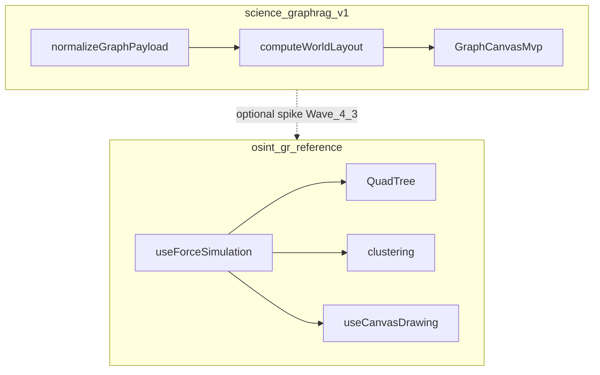

# Graph UI plan (science-graphrag)

Companion to **Phase 4** in [`ui-ux-master-plan.md`](./ui-ux-master-plan.md). This doc fixes the **API ↔ UI contract** and targets for canvas work (Phases 4.1–4.4).

## Scope

- **In scope:** read-only visualization of `GET /v1/works/{work_id}/graph`, selection + detail panel, URL/trace sync, empty/loading/error, performance limits.
- **Out of scope (for now):** mutating Neo4j from the UI, OSINT-style chat, case/workspace contexts from osint-gr.

## Backend contract

**Endpoint:** `GET /v1/works/{work_id}/graph`  
**Implementation:** [`science_graphrag/api/works.py`](../../science_graphrag/api/works.py) — `work_graph_neighborhood`.

Response shape (conceptual):

| Field | Type | Notes |
|-------|------|--------|
| `work_id` | string | Center work |
| `nodes` | array | Each: `id`, `type`, `label` (and optional extra fields preserved in `raw` after normalize) |
| `edges` | array | Each: `source`, `target`, `type` (relationship type); orientation matches Neo4j (`startNode`→`source`, `endNode`→`target`); may omit `id` (UI synthesizes) |
| `meta` | object | e.g. `semantic_available` |

**Server limit:** neighborhood query caps at **200** adjacent rows; additional **client caps** for rendering are `GRAPH_UI_MAX_NODES` / `GRAPH_UI_MAX_EDGES` in [`graphUiLimits.js`](../../ui/src/components/graph/graphUiLimits.js).

## Normalized UI model

**Code:** [`ui/src/components/graph/graphViewState.js`](../../ui/src/components/graph/graphViewState.js) — `normalizeGraphPayload`, `resolveSelectedNodeId`, `deriveGraphDetail`.

After normalization:

- **Node:** `{ id, label, type, raw }`
- **Edge:** `{ id, source, target, type, raw }`
- **Graph:** `{ workId, nodes, edges, meta, nodeCount, edgeCount, selectedNodeId, warnings }`

**Duplicate `node.id`:** The first occurrence keeps the original string; later duplicates get deterministic ids `originalId__dup1`, `originalId__dup2`, … so selection and edges stay referencable. A human-readable message is appended to `warnings` for each reassignment.

**Orphan edges:** Edges whose `source` or `target` is not in the set of normalized node ids are **dropped** (not rendered). A single summary line is added to `warnings` with the drop count.

**Empty graph:** `warnings` may be empty; `nodeCount` / `edgeCount` reflect the final arrays after the rules above.

**Adapter:** [`ui/src/components/graph/graphAdapter.js`](../../ui/src/components/graph/graphAdapter.js) — `fetchWorkGraphNormalized(workId)` wraps the API and `normalizeGraphPayload`.

### Canvas target model (Phase 4.2+)

Any canvas or graph library should consume the **normalized** graph (or a thin mapper from it):

- **Nodes** need stable `id` for selection and URL round-trip.
- **Edges** need `source` / `target` referencing node `id`s (directed as in Neo4j); orphan edges are **filtered** in `normalizeGraphPayload` and summarized in `warnings` (not only dev logs).
- **Layout:** initial positions can be random or circular; force simulation (see osint-gr) or library layout fills `x`, `y` in an internal structure — do not persist layout to API unless product requires it.

### URL and traceability

- **Standalone:** [`GraphPage.jsx`](../../ui/src/pages/GraphPage.jsx) — `work_id`, optional trace params via [`traceabilityState.js`](../../ui/src/components/work/traceabilityState.js).
- **Selection:** `selectedNodeId` (or `node` in URL where applicable) must resolve with `resolveSelectedNodeId` so deep links never point to a missing id silently without fallback. Optional **`edge`** query param selects a normalized edge id (Canvas); mutual exclusion with `node` is enforced in [`traceabilityState.js`](../../ui/src/components/work/traceabilityState.js) / [`GraphWorkspacePanel.jsx`](../../ui/src/components/graph/GraphWorkspacePanel.jsx).

## UI composition (current)

| Piece | File | Role |
|-------|------|------|
| Shell | `GraphWorkspacePanel.jsx` | Load graph, Cards/Graph toggle, normalization + UI-cap alerts, grid + detail |
| List view | `GraphVisualization.jsx` | Phase 4 **v0** — card grid |
| Canvas | `GraphCanvasMvp.jsx` | HTML Canvas: zoom/pan, fit / center / reset zoom, Escape; node + edge hover highlight + cursor; directed edges (arrow at `target`); labels on nodes and edges |
| Limits | `graphUiLimits.js` | `capGraphForUi` (`GRAPH_UI_MAX_*`); chips show full API counts |
| Legend | `GraphTypeLegend.jsx`, `graphTypeLegend.js` | Unique `node.type` / `edge.type` chips from `displayGraph` |
| Shell states | `graphShellStates.jsx` | Shared empty / loading / error patterns (Graph page, tab, panel) |
| Canvas math | `graphCanvasTransform.js` | World layout + fit + screen/world mapping; `worldRadiusForNodeCount(n)` grows the circle when many nodes reduce chord spacing |
| Canvas styles | `graphCanvasStyle.js` | Node type colors, hover stroke, truncated node/edge labels on canvas |
| Details | `GraphDetailPanel.jsx` | Node payload + related edges, or **selected edge** (source/target/type); `deriveGraphDetail` on **full** graph |
| Data | `graphAdapter.js`, `graphViewState.js` | Fetch + normalize + derive |

**Modes:** **Cards** vs **Graph** share capped `displayGraph`; detail panel uses the full normalized graph.

### Phase 4.2 stack decision (spike)

**Chosen for the in-repo spike:** lightweight **HTML Canvas** view (`GraphCanvasMvp.jsx`) — no extra npm dependency, circle layout, click-to-select wired to the same `selectedNodeId` / `deriveGraphDetail` as the card grid. **Optional later:** evaluate **React Flow / Sigma** or a **port of osint-gr** patterns for force layout or very large graphs.

### Phase 4.3 (navigation and resilience)

- **Canvas:** wheel zoom (cursor anchor), drag-to-pan, **Fit**, **Center on selected**; world-space positions; focusable region; **Escape** clears selection (URL drops `node` via `buildTraceabilityParams` when `nodeId` is empty).
- **UI caps:** `GRAPH_UI_MAX_NODES` / `GRAPH_UI_MAX_EDGES` in `graphUiLimits.js`; selected node kept visible when possible; Alert when caps apply (separate from normalization `warnings`).
- **Layout:** `minHeight` + stretched columns in `GraphWorkspacePanel` (aligned with osint-gr visualization section idea).

### Phase 4.4 (polish and Graph Lab)

- **Shared states:** [`graphShellStates.jsx`](../../ui/src/components/graph/graphShellStates.jsx) — consistent empty/loading/error copy and styles for [`GraphPage.jsx`](../../ui/src/pages/GraphPage.jsx), [`GraphTab.jsx`](../../ui/src/pages/WorkspacePage/tabs/GraphTab.jsx), and the panel.
- **Legend:** [`GraphTypeLegend.jsx`](../../ui/src/components/graph/GraphTypeLegend.jsx) under the Cards/Graph toggle.
- **Graph Lab:** query flag `lab=1` on `/graph` or workspace graph tab — diagnostics JSON expanded by default; otherwise hidden behind **Show diagnostics** (`Collapse`).
- **Layout source of truth:** circle positions and fit/zoom math live in [`graphCanvasTransform.js`](../../ui/src/components/graph/graphCanvasTransform.js) (used by `GraphCanvasMvp`); unit tests in `graphCanvasTransform.test.js`. Ring **radius scales with node count** (`worldRadiusForNodeCount`) so dense 1-hop neighborhoods stay readable after **Fit**.

### Post–4.4 behavior (canvas + cards)

- **Canvas:** changing selection does **not** auto-pan the viewport (avoids fighting user pan/zoom). **Fit** refits the full graph after load or graph change; **Center on selected** pans to the current node at the same zoom; **Reset zoom** sets scale to `1` keeping the world point under the viewport center fixed. The displayed node set changing (new `work_id` / normalized graph) runs **Fit** again via layout effect.
- **Cards:** [`GraphVisualization.jsx`](../../ui/src/components/graph/GraphVisualization.jsx) uses **roving `tabIndex`**: one card is tab-focusable at a time; **Arrow** keys move focus and update selection; **Enter** / **Space** activate the focused card.
- **Responsive / a11y slice:** [`GraphWorkspacePanel.jsx`](../../ui/src/components/graph/GraphWorkspacePanel.jsx) stacks the graph + detail columns on narrow viewports (`xs` single column, `md` two columns). [`GraphCanvasMvp.jsx`](../../ui/src/components/graph/GraphCanvasMvp.jsx) exposes a visually hidden **`aria-live="polite"`** line for the current selection and an **`aria-label`** on the canvas element.
- **Further narrow-view polish:** [`GraphTypeLegend.jsx`](../../ui/src/components/graph/GraphTypeLegend.jsx) uses slightly reduced padding and label size on `xs`. Benchmark **Case** / **Results** dialogs ([`CaseDetailDialog.jsx`](../../ui/src/pages/BenchmarkPage/CaseDetailDialog.jsx), [`ResultsDialog.jsx`](../../ui/src/pages/BenchmarkPage/ResultsDialog.jsx)) use MUI **`fullScreen`** below the `sm` breakpoint.

### Phase 4 completion (product)

For **Phase 4 UI**, the shipped **v1** (circle layout + raw Canvas, ADR above) meets acceptance: read-only neighborhood graph, cards/canvas, URL-driven selection, limits, Graph Lab, post-4.4 hardening (checklist). **Force-directed layout, graph npm libraries, or an osint-gr simulation port** are **not** required to call Phase 4 done; they remain **backlog / optional spike** ([`refactor-frontend.md`](../backlog/refactor-frontend.md)).

### Layout stack v1 (product decision)

- **Shipped v1:** deterministic **circle layout** with **adaptive world radius** in [`graphCanvasTransform.js`](../../ui/src/components/graph/graphCanvasTransform.js) + raw **Canvas** in `GraphCanvasMvp` — no graph npm dependency, predictable for neighborhood size; on-canvas **type-colored nodes**, **hover** highlight, **truncated labels** for nodes and edge types ([`graphCanvasStyle.js`](../../ui/src/components/graph/graphCanvasStyle.js)).
- **Canvas layout modes (2026-04):** In **Graph** (canvas) mode, the toolbar includes **Circle** | **Force** (persisted as `graphCanvasLayoutMode`). **Circle** keeps the deterministic ring + existing fit/pan/zoom. **Force** runs an in-repo **force simulation** (QuadTree repulsion, edge springs, optional structural communities — ported from osint-gr patterns, no OSINT domain types) seeded from the same circle positions as Circle so switching modes does not jump from empty space; **repulsion** slider + `localStorage` (`graphCanvasRepulsionPercent`). **Force toolbar:** **Restart sim** (re-seed with jitter + new run id, like osint reset), **Unpin all** (clear pinned nodes after drag). **Keyboard** (graph section focused): `+` / `−` zoom at center, `0` fit — similar to Neo4j-style graph controls, without command bar. Data path unchanged: `normalizeGraphPayload` / `capGraphForUi` → `buildSimulationState` / `useScienceGraphForceSimulation`. Not Neo4j Browser feature parity; `GRAPH_UI_MAX_*` still apply. See [`docs/adr/007-canvas-force-layout-port.md`](../adr/007-canvas-force-layout-port.md).
- **Live graph + inspector (2026-04-19):** Product default is **Canvas** visualization (`graphVizMode` in `localStorage`) with **Force** as the default canvas layout (`graphCanvasLayoutMode`). Backend [`GET /v1/works/{id}/graph`](../../science_graphrag/api/main.py) returns enriched nodes/edges (stable `edge.id`, `display_label`, `summary`, `properties`, truncation `meta`) and accepts `neighbor_limit` / `depth` query params. The right column uses [`graphInspectorModel.js`](../../ui/src/components/graph/graphInspectorModel.js) on **`displayGraph`** (post-`capGraphForUi`) plus a redesigned [`GraphDetailPanel.jsx`](../../ui/src/components/graph/GraphDetailPanel.jsx) (human-readable first, raw JSON under Advanced). Canvas **Fit** applies a **minimum scale** so dense 1-hop neighborhoods stay visible. See [`docs/adr/011-graph-live-ux-and-payload.md`](../adr/011-graph-live-ux-and-payload.md).
- **Wave 4.3 library POC (optional):** third mode **Flow** — [`@xyflow/react`](https://reactflow.dev/) in [`GraphFlowView.jsx`](../../ui/src/components/graph/GraphFlowView.jsx), same normalized graph + UI caps; initial positions = same circle layout as Canvas; node/edge selection and `GraphDetailPanel` unchanged. **Not** the default view; bundle cost only when the Flow chunk loads.
- **Phase B (Flow parity, shipped):** [`getGraphLayoutSignature`](../../ui/src/components/graph/graphFlowAdapter.js) drives `fitView` only on topology changes (not selection); toolbar **Fit / Reset zoom / Center on selected** (center supports node or edge endpoints) + **Escape** + empty state match Canvas ergonomics; `onlyRenderVisibleElements`, `nodesDraggable={false}`, `React.memo` on custom nodes for large capped graphs.
- **Phase C (optional polish, shipped):** Flow **MiniMap** (bottom-right, dark styling, node colors from [`graphCanvasStyle`](../../ui/src/components/graph/graphCanvasStyle.js)) + toolbar **Show/Hide minimap** (persisted in `localStorage` as `graphFlowMinimap`). Benchmark **Case** dialog — graph tab: accordion **Side-by-side: canonical graph_expectations vs snapshot file gold (raw)** when a CLI snapshot JSON is loaded ([`CaseDetailDialog.jsx`](../../ui/src/pages/BenchmarkPage/CaseDetailDialog.jsx)). Cross-cutting **durable run catalog** beyond current file-backed store — backend backlog ([`frontend-phase6-bridge-backlog.md`](../architecture/frontend-phase6-bridge-backlog.md) B4), not a graph-UI blocker.
- **When to revisit:** **Sigma** comparison, force-directed **Flow** (`@xyflow/react`), deeper osint parity (controls, styling), or server-persisted layouts — keep `normalizeGraphPayload`, `capGraphForUi`, URL selection, and `GraphDetailPanel` as the contract.

## Reference implementation (osint-gr)

Use for **patterns**, not copy-paste of product logic. The osint-gr graph stacks **force simulation**, **spatial acceleration**, and **canvas drawing**; science-graphrag ships **circle** by default and an optional **force** canvas mode built from the same patterns (see *Parity* below).

| Topic | Path (repo `osint-gr`) | Why open it |
|-------|-------------------------|-------------|
| Composition | `frontend/src/components/features/GraphVisualization.jsx` | Wires resize, simulation, draw, pointer handlers |
| Force + cooling + bounds | `frontend/src/components/features/graphVisualization/hooks/useForceSimulation.js` | Custom physics, stability threshold, optional QuadTree repulsion |
| Barnes–Hut | `frontend/src/components/features/graphVisualization/utils/quadTree.js` | O(n log n) repulsion for larger graphs |
| Clustering | `frontend/src/components/features/graphVisualization/utils/clustering.js` | `detectHybridCommunities`, personId / community hints |
| Force helpers | `frontend/src/components/features/graphVisualization/utils/forceUtils.js` | Repulsion tuning, fast sqrt variants |
| Canvas draw | `frontend/src/components/features/graphVisualization/hooks/useCanvasDrawing.js` | Edges, arrows at target, node shapes, `Map` for O(1) node lookup |
| Hit testing | `frontend/src/components/features/graphVisualization/hooks/useCanvasEvents.js` | Zoom/pan, node/edge pick, drag |
| Geometry | `frontend/src/components/features/graphVisualization/utils.js` | `pointToLineDistance` for edge hover |
| Controls | `frontend/src/components/features/graphVisualization/components/GraphControls.jsx` | Repulsion slider, reset simulation, center |
| Page shell | `frontend/src/pages/KnowledgeGraphPage.jsx` | App-level wiring |
| Layout split | `frontend/src/pages/KnowledgeGraphPage/components/KnowledgeGraphVisualizationSection.jsx` | Section layout |

### Parity vs osint-gr (Wave 3+ baseline)

**Already aligned (ideas ported or matched):**

- Directed edges in API (`source`/`target` = Neo4j orientation); arrows at **target** on canvas; edge hover by **distance to segment** in screen space ([`graphCanvasGeometry.js`](../../ui/src/components/graph/graphCanvasGeometry.js)).
- `Map` of positions by node id in layout/draw; type-colored nodes; shared legend chip colors via [`graphCanvasStyle.js`](../../ui/src/components/graph/graphCanvasStyle.js).

**Optional / partial (Canvas force mode, 2026-04):**

- Force-directed layout, rAF simulation, drag nodes (pin when stable), repulsion slider — see `ui/src/components/graph/physics/` and ADR 007.

**Still not in scope (defer / backlog):**

- **personId** / hybrid community hints as in osint; full Neo4j Browser–style tooling; OSINT-specific graph semantics.
- Edge/selection model in osint includes **click edge** (we added **Wave 4.1**: selected edge + detail + optional `edge` URL param).
- Minimap, icons on nodes, dashed edge styles by domain rules, OSINT-specific graph data.

### Wave 4 roadmap (execution order)

1. **Wave 4.1** — Canvas **edge selection** + **GraphDetailPanel** section for the selected relationship; optional URL query `edge` (see [`traceabilityState.js`](../../ui/src/components/work/traceabilityState.js)); mutual exclusion with `node` selection for deep links.
2. **Wave 4.2** — Canvas micro-polish: explicit `Map` for nodes where helpful; **edge label draw order** so hovered/selected labels paint last (readability). **Shipped** — see *Canvas micro-polish (Wave 4.2)* below.
3. **Wave 4.3** — Time-boxed **layout stack spike**: React Flow / Sigma POC **or** isolated port of osint `useForceSimulation` + QuadTree without OSINT domain hooks — record outcome in [`docs/adr/006-graph-layout-stack-spike.md`](../../docs/adr/006-graph-layout-stack-spike.md) and keep `normalizeGraphPayload` + `GraphDetailPanel` as the contract. **When prioritized**, follow the *Execution checklist* in that ADR (spike remains optional until product need).

### Canvas micro-polish (Wave 4.2)

**Goal:** Readability when edges and nodes overlap: **hovered/selected** edge and node chrome paint **on top**, edge type labels are not hidden under node discs.

**Shipped (Wave 4.2):**

- [`GraphCanvasMvp.jsx`](../../ui/src/components/graph/GraphCanvasMvp.jsx): Paint order — edge strokes, then node discs (**hovered/selected discs last**), then edge labels (**inactive first, hovered/selected edge labels last**, stable id tie-break), then node name labels (**hovered/selected last**). `nodeById` remains for hit-testing; draw loops use sorted `graph.nodes` / `graph.edges` for z-order.

### Standalone Graph page — workspace maximization (Wave 5)

**Goal:** On [`GraphPage.jsx`](../../ui/src/pages/GraphPage.jsx) (`/graph`), the **canvas should use as much of the viewport as practical** for pan/zoom and selection. Secondary UI (page chrome, `work_id` form, warnings, legend, diagnostics, detail column) must not permanently consume most of the vertical space.

**Non-functional targets:**

- **Flex chain:** `DashboardLayout` `main` → route outlet → `GraphPage` → [`GraphWorkspacePanel.jsx`](../../ui/src/components/graph/GraphWorkspacePanel.jsx) use `flex: 1`, `minHeight: 0`, and column flex so [`GraphCanvasMvp.jsx`](../../ui/src/components/graph/GraphCanvasMvp.jsx) receives a real height from [`ResizeObserver`](../../ui/src/components/graph/GraphCanvasMvp.jsx).
- **Chrome:** Collapsible **page header** / long description; compact **work_id** toolbar; optional query `compact=1` to start in a denser layout.
- **Panel:** Collapsible **normalization / UI-cap** alerts when lists are long; **legend** behind a toggle; **detail** column hideable for a graph-only column.
- **Embedded:** Workspace **Graph** tab keeps usable layout; standalone mode may apply stronger maximization.

**Implementation notes:** See [`refactor-frontend.md`](../backlog/refactor-frontend.md) (Wave 5 item); do not mix with Wave 4.3 physics/layout spike.

**Shipped (Wave 5):**

- [`DashboardLayout.jsx`](../../ui/src/components/layout/DashboardLayout/DashboardLayout.jsx): `main` is a column flex container; `Outlet` wrapped in a growing `Box` (`flex: 1`, `minHeight: 0`) so routes can fill height.
- [`GraphPage.jsx`](../../ui/src/pages/GraphPage.jsx): root column flex + `?compact=1` (denser defaults, initial Graph mode via panel); collapsible **page chrome** (header + long description) with `localStorage` `graphPageChromeExpanded`; compact **work_id** row when chrome collapsed; workspace links behind **Show/Hide**.
- [`GraphWorkspacePanel.jsx`](../../ui/src/components/graph/GraphWorkspacePanel.jsx) (`standalone`): flex chain to canvas; toggles for **details panel**, **type legend**, collapsible **normalization/UI-cap** alerts; panel visibility persisted in `localStorage`.

### Standalone Graph page — focus URL + detail width (Wave 6)

**Goal:** Sharable **maximum canvas** defaults via `?focus=1`, and a **user-tunable minimum width** for the detail column on `md+` when the detail panel is visible (persisted in `localStorage`). URL contract for `/graph` query flags is summarized in [`frontend-ui-api-contracts-v1.md`](./frontend-ui-api-contracts-v1.md) (UI route table).

**Shipped (Wave 6):**

- [`GraphPage.jsx`](../../ui/src/pages/GraphPage.jsx): optional `?focus=1` (implies compact panel layout; collapses page chrome/links like `compact`); preserves `focus` / `compact` / `lab` when submitting **Load**. Helpers in [`graphPageUrl.js`](../../ui/src/pages/graphPageUrl.js).
- [`GraphWorkspacePanel.jsx`](../../ui/src/components/graph/GraphWorkspacePanel.jsx) (`standalone`): prop `focusLayout` — initial **title / legend / alerts / details** collapsed for max canvas; **slider** for detail column `minmax` width (260–480px), key `graphStandaloneDetailMinPx`.
- Unit tests: [`graphPageUrl.test.js`](../../ui/src/pages/graphPageUrl.test.js).

### Standalone Graph page — drag-resize gutter (Wave 7)

**Goal:** On `md+`, when the **detail** column is visible in standalone mode, users can **drag a vertical gutter** between the graph and detail regions to adjust width; the same pixel bounds and `localStorage` key as the Wave 6 slider (`graphStandaloneDetailMinPx`). Shared helpers in [`graphDetailColumnWidth.js`](../../ui/src/components/graph/graphDetailColumnWidth.js).

**Shipped (Wave 7):**

- [`GraphWorkspacePanel.jsx`](../../ui/src/components/graph/GraphWorkspacePanel.jsx): CSS grid adds a **6px** track between graph and detail; `gap` on `md` is **0** when the split is active; pointer-driven resize updates `detailMinPx`; gutter hidden on `xs`.
- Tests: [`graphDetailColumnWidth.test.js`](../../ui/src/components/graph/graphDetailColumnWidth.test.js).

### Standalone Graph page — API contract note + gutter polish (Wave 8)

**Goal:** Surface **client-only** detail split persistence in [`frontend-ui-api-contracts-v1.md`](./frontend-ui-api-contracts-v1.md) (key `graphStandaloneDetailMinPx`, slider + `md+` gutter). Harden drag: **pointer capture** on the gutter and **cursor / user-select** guard on `document.body` during drag.

**Shipped (Wave 8):**

- [`frontend-ui-api-contracts-v1.md`](./frontend-ui-api-contracts-v1.md): paragraph under UI route `/graph` for localStorage split width (no server contract).
- [`GraphWorkspacePanel.jsx`](../../ui/src/components/graph/GraphWorkspacePanel.jsx): gutter pointer handling uses capture + cleanup on body styles.

## Workspace graph v2 (Wave J)

**Endpoints:** `GET /v1/workspaces/{id}/graph`, `/graph/stats`, `/graph/neighbors` — see [`frontend-ui-api-contracts-v1.md`](./frontend-ui-api-contracts-v1.md) §5b and ADR [`docs/adr/012-workspace-graph-projection.md`](../adr/012-workspace-graph-projection.md).

**UI:**

- [`WorkspaceGraphToolbar.jsx`](../../ui/src/components/graph/WorkspaceGraphToolbar.jsx) — `mode`, `depth`, `include external`, multi-select node types, stats line; per-workspace persistence (`workspaceGraphMode:*`, `workspaceGraphDepth:*`, …).
- [`GraphWorkspacePanel.jsx`](../../ui/src/components/graph/GraphWorkspacePanel.jsx) — wires toolbar + `getWorkspaceGraph` / stats / neighbors merge for lazy **Expand external**.
- **Palette:** `workspace_membership` (`internal` | `external`) in [`graphCanvasStyle.js`](../../ui/src/components/graph/graphCanvasStyle.js) + dashed edges when an endpoint is external.
- **Force layout:** internal works join a `ws-internal` cluster hint in [`scienceHybridCommunities.js`](../../ui/src/components/graph/physics/scienceHybridCommunities.js).

**Lazy expand:** selecting a work with external cite count uses `/graph/neighbors` to merge more nodes without reloading the full workspace graph.

**GDS:** optional server path for large `depth=2` projections when `SCIENCE_GRAPHRAG_GDS_ENABLED` and the GDS plugin respond to `gds.version()`; otherwise Cypher-only with caps.

## Phased delivery (mirror master plan)

1. **4.1** — Document and test edge cases on normalized model; align with this spec.
2. **4.2** — Canvas MVP + selection ↔ detail panel.
3. **4.3** — Zoom/pan, fit, limits, keyboard — **done** in `GraphCanvasMvp.jsx`, `graphUiLimits.js`, `GraphWorkspacePanel.jsx`.
4. **4.4** — Polish, legend, Graph Lab flag — **done** (see Phase 4.4 above).

## Checklist (acceptance)

- [x] Normalized graph from live API renders without console errors for empty / single Work / full neighborhood (regression: run UI manually).
- [x] Selected node matches `deriveGraphDetail` and URL when trace params present.
- [x] Canvas shows **edges** as lines (or library equivalent), not only nodes.
- [x] Behavior documented when `nodeCount` or `edgeCount` exceeds UI threshold (`capGraphForUi` + Alert; see `GRAPH_UI_MAX_NODES` / `GRAPH_UI_MAX_EDGES`).
- [x] Type legend and Graph Lab (`?lab=1`) / collapsed diagnostics; shared graph shell empty/loading/error patterns.
- [x] Canvas: Fit on graph change; Center on selected; no auto-recenter on every selection change; Reset zoom; card grid keyboard roving + arrows.
- [x] Graph workspace panel responsive grid; canvas selection live region + canvas `aria-label`.
- [x] Graph type legend compact `xs` spacing; benchmark dialogs full-screen on narrow viewports.
- [x] Standalone `/graph`: viewport-height flex chain; collapsible chrome; optional `?compact=1`; collapsible legend/alerts; hide details panel (Wave 5).
- [x] Standalone `/graph`: optional `?focus=1`; detail column min-width slider + persistence (Wave 6).
- [x] Standalone graph + details: drag-resize gutter on `md+` (Wave 7).
- [x] `/graph` client layout persistence documented in frontend-ui-api-contracts; gutter drag polish (Wave 8).
- [x] Canvas Wave 4.2: z-order for edge labels vs nodes; hover/selected labels and discs on top (see *Canvas micro-polish (Wave 4.2)*).
