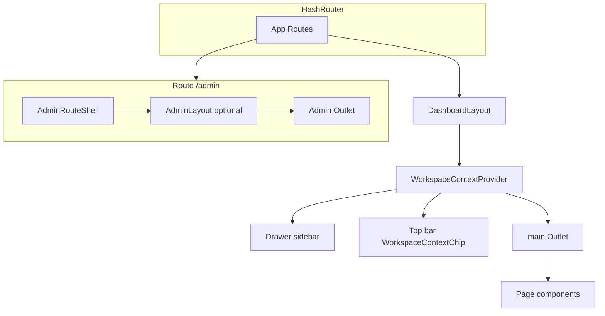
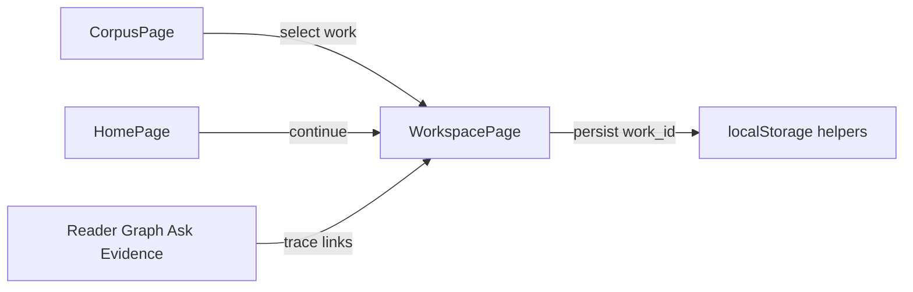

# Shell and layout (UI)

High-level composition of the research SPA. Implementation paths are under [`ui/src/`](../../ui/src/).

## Component tree

## Responsibilities

| Piece | Role |
|-------|------|
| [`DashboardLayout`](../../ui/src/components/layout/DashboardLayout/DashboardLayout.jsx) | Wraps research shell in [`WorkspaceContextProvider`](../../ui/src/components/layout/WorkspaceContext.jsx); top bar + sidebar + scrollable `Outlet`. |
| [`WorkspaceContextProvider`](../../ui/src/components/layout/WorkspaceContext.jsx) | Active `workspace_id` from URL (sync to `localStorage`) with lazy meta for chip. |
| [`WorkspaceContextChip`](../../ui/src/components/layout/WorkspaceContextChip.jsx) | Header chip: switch workspace, manage list, create. |
| [`Drawer`](../../ui/src/components/layout/DashboardLayout/Drawer.jsx) | Primary navigation: **Workspace** (last/active), **Graph / Ask / Evidence** append `workspace_id` when known; optional `aria-label` when collapsed. |
| [`PageHeader`](../../ui/src/components/layout/PageHeader.jsx) | Shared title / eyebrow / description / actions. |
| [`AdminLayout`](../../ui/src/components/layout/AdminLayout.jsx) | Nested admin chrome + outlet for benchmarks/settings/diagnostics. |
| [`WorkspacePage`](../../ui/src/pages/WorkspacePage/WorkspacePage.jsx) | URL-driven `work_id` + tab slug; coordinates work-scoped tabs. |

## Graph surface (planned evolution)

- Сейчас: вкладка **Graph** и [`GraphPage`](../../ui/src/pages/GraphPage.jsx) используют [`GraphWorkspacePanel`](../../ui/src/components/graph/GraphWorkspacePanel.jsx) (сетка узлов + detail panel).
- Целевое состояние, контракт данных и **подфазы 4.1–4.4**: [graph-ui-plan.md](./graph-ui-plan.md) и [Phase 4 в ui-ux-master-plan.md](./ui-ux-master-plan.md#phase-4-graph-ux-modernization).
- Референсная реализация (osint-gr): canvas + force layout — `GraphVisualization.jsx` и `graphVisualization/` под `osint-gr/frontend/src/components/features/`.

## Work context flow

`work_id` is carried in query params (`/workspace?work_id=…&tab=…`) and mirrored in local storage helpers under [`ui/src/pages/WorkspacePage/utils/workContext.js`](../../ui/src/pages/WorkspacePage/utils/workContext.js).

**Workspace context (Wave I):** `workspace_id` in the URL is the shareable source of truth; [`workspaceStore.js`](../../ui/src/utils/workspaceStore.js) persists `activeWorkspaceId` for drawer links and [`appendWorkspaceQuery`](../../ui/src/utils/workspaceStore.js) / [`getLastWorkspaceHref`](../../ui/src/utils/workspaceStore.js).

## Lazy-loaded chunks

Heavy routes (workspace, graph, benchmarks, settings, diagnostics) use `React.lazy` in [`App.jsx`](../../ui/src/App.jsx); vendor split is configured in [`ui/vite.config.js`](../../ui/vite.config.js).

For routes and legacy aliases, see [`route-map.md`](./route-map.md).
