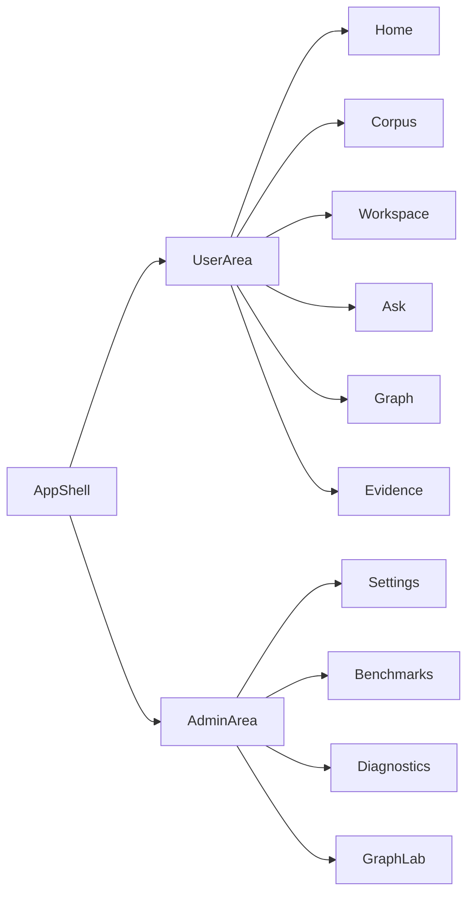

# UI/UX Master Plan For science-graphrag

Дата: `2026-04-07`

Статус: `draft / working plan`

## Цель

Подготовить для `science-graphrag` целостный UI/UX-план, который:

- переводит текущий MVP из набора технических экранов в продуктовую исследовательскую среду;
- заранее разделяет опыт `admin / operator` и обычного `user / researcher`;
- использует сильные паттерны соседнего проекта `osint-gr`, не копируя его домен;
- задает последовательные фазы внедрения, чтобы интерфейс можно было развивать без повторной переделки shell, навигации и основных экранов.

Этот документ не описывает только одну страницу. Он задает рамку для всего frontend-направления: shell, маршруты, роли, навигацию, страницы, правила UI/UX и этапы реализации.

## Контекст

Сейчас `science-graphrag` уже имеет базовые страницы:

- `ui/src/App.jsx`
- `ui/src/components/layout/DashboardLayout/DashboardLayout.jsx`
- `ui/src/components/layout/DashboardLayout/Drawer.jsx`
- `ui/src/pages/WorkspacePage.jsx`
- `ui/src/pages/ReaderPage.jsx`
- `ui/src/pages/GraphPage.jsx`
- `ui/src/pages/AskPage.jsx`
- `ui/src/pages/EvidencePage.jsx`
- `ui/src/pages/BenchmarkPage/BenchmarkPage.jsx`
- `ui/src/pages/SettingsPage.jsx`

Но по факту интерфейс пока ощущается как инженерная консоль:

- страницы в основном изолированы друг от друга;
- отсутствует единый пользовательский workflow вокруг выбранной работы;
- нет четкого разделения между исследовательским UX и операционным/admin UX;
- графовый экран пока не является полноценным рабочим пространством;
- entry points для admin-задач и benchmark-операций еще не организованы в удобную отдельную зону;
- shell и маршруты уже существуют, но пока не отражают продуктовую информационную архитектуру.

## Что взять из соседнего проекта

Соседний проект `osint-gr` полезен не тематикой, а зрелостью shell и interaction patterns.

Особенно важны следующие референсы:

### Shell, роутинг, admin/user разделение

- `../../../osint-gr/frontend/src/App.jsx`
- `../../../osint-gr/frontend/src/components/layout/DashboardLayout.jsx`

Что берем как идею:

- единый application shell;
- protected/admin-only маршруты;
- отдельный доступ к benchmark/settings только для admin;
- сворачиваемый sidebar как стабильный навигационный каркас.

### Workspace и URL-driven tabs

- `../../../osint-gr/frontend/src/pages/CaseWorkspacePage/CaseWorkspacePage.jsx`

Что берем как идею:

- рабочее пространство вокруг одного выбранного объекта;
- табы, синхронизированные с URL;
- восстановление последнего контекста;
- deep links вида "сразу открыть нужную вкладку / документ / узел графа".

### Graph engine и graph-first layout

- `../../../osint-gr/frontend/src/pages/KnowledgeGraphPage.jsx`
- `../../../osint-gr/frontend/src/components/features/GraphVisualization.jsx`

Что берем как идею:

- граф не как JSON preview, а как полноценный холст;
- отдельный layout для graph-heavy экранов;
- переиспользуемый графовый экран в standalone и embedded-режиме;
- управление зумом, центрированием, фокусом на узле и правой панелью деталей.

### Settings UX

- `../../../osint-gr/frontend/src/pages/SettingsPage/SettingsPage.jsx`

Что берем как идею:

- секционная навигация внутри настроек;
- четкое разделение списка секций и контента;
- готовность к росту настроек без смены всей страницы.

## Главный продуктовый тезис

`science-graphrag` должен стать не набором отдельных утилит, а двумя связанными поверхностями:

1. `Research surface` для обычного пользователя.
2. `Operations surface` для admin / evaluator / platform owner.

Обе поверхности живут в одном приложении, но не должны выглядеть как одинаково важные пункты одного плоского меню.

## Роли и сценарии

### 1. Research user

Основные задачи:

- найти работу или набор работ;
- открыть выбранную работу в workspace;
- читать документ и его структуру;
- смотреть графовые связи;
- задавать вопросы по работе;
- прослеживать evidence;
- переходить между summary, reader, graph и answer без потери контекста.

### 2. Admin / operator

Основные задачи:

- настраивать LLM / ingestion / runtime;
- запускать benchmark;
- анализировать runs и regression cases;
- проверять доступность интеграций;
- диагностировать качество данных и поведения pipeline.

## North Star UX

Пользователь не должен думать в терминах "на какую из пяти сырых страниц мне перейти", а должен думать в терминах:

- "я работаю с этой статьей";
- "я хочу спросить систему";
- "я хочу открыть граф";
- "я хочу посмотреть доказательства";
- "я как админ хочу открыть benchmark / settings / diagnostics".

## Целевая информационная архитектура

### Верхний уровень

Предлагаемый top-level shell:

- `Home`
- `Corpus`
- `Workspace`
- `Ask`
- `Graph`
- `Evidence`
- `Admin`

При этом для разных ролей видимость различается:

- обычный пользователь не видит `Admin` как основной рабочий раздел;
- admin видит отдельный компактный вход в admin-зону.

### Почему не оставлять всё плоским sidebar-списком

Текущий flat-menu в `ui/src/components/layout/DashboardLayout/Drawer.jsx` хорош для MVP, но плохо масштабируется:

- смешивает пользовательские и операционные сценарии;
- не показывает приоритеты;
- не создает ощущение "workspace around selected work".

## Предлагаемая модель shell

## Рекомендуемая навигация

### Основная левая навигация

Для user:

- `Corpus`
- `Workspace`
- `Ask`
- `Graph`
- `Evidence`

Для admin:

- те же user-пункты;
- отдельный блок `Admin tools` внизу:
  - `Benchmarks`
  - `Settings`
  - позже `Diagnostics`
  - позже `Graph Lab`

### Вторичная навигация

Внутри `Workspace`:

- `Overview`
- `Reader`
- `Graph`
- `Ask`
- `Evidence`
- позже `Compare`
- позже `Notes`

Это ключевая идея. Вместо отдельных равноправных top-level страниц `Reader / Graph / Evidence / Ask` нужно перейти к модели:

- эти экраны существуют как самостоятельные точки входа;
- но основное повседневное использование происходит через единый `Workspace` по выбранной работе.

## Предлагаемая структура маршрутов

### Public / research routes

- `/`
- `/corpus`
- `/workspace`
- `/workspace/:workId` или `/workspace?work_id=...`
- `/workspace?work_id=...&tab=reader`
- `/workspace?work_id=...&tab=graph`
- `/workspace?work_id=...&tab=evidence`
- `/ask`
- `/graph`
- `/evidence`

### Admin routes

- `/admin`
- `/admin/benchmarks`
- `/admin/settings`
- `/admin/diagnostics`
- позже `/admin/graph-lab`

### Принцип

`/graph`, `/ask`, `/evidence` остаются как самостоятельные прямые экраны, но:

- из `Corpus` и `Workspace` пользователь обычно попадает в них уже с выбранным `work_id`;
- приложение должно уметь удерживать и восстанавливать текущий контекст работы;
- ссылки между экранами должны всегда carry over `work_id`.

## Целевые entry points

### Для обычного пользователя

Пользовательский первый вход:

1. `Corpus`
2. выбор работы
3. переход в `Workspace`
4. внутри workspace:
   - читать;
   - смотреть граф;
   - задавать вопросы;
   - проверять evidence.

### Для admin

Admin должен иметь быстрые входы в:

- `Benchmarks`
- `Settings`
- `Diagnostics`

Но эти входы не должны доминировать над пользовательским UX.

Рекомендуемое решение:

- нижний блок `Admin tools` в sidebar;
- optional admin quick switch в шапке;
- homepage/dashboard с карточками быстрых действий для admin.

## Ключевые UX-проблемы, которые надо решить

### 1. Нет глобального выбранного work context

Сейчас `WorkspacePage.jsx`, `ReaderPage.jsx`, `GraphPage.jsx` и другие страницы используют `work_id` разрозненно.

Нужно:

- единое понятие `active work context`;
- восстановление последней открытой работы;
- единый способ deep-linking между экранами.

### 2. Нет центра тяжести интерфейса

Сейчас все страницы выглядят как отдельные utility views.

Нужно:

- сделать `Workspace` центром user-опыта;
- сделать `Admin` центром operator-опыта.

### 3. Graph screen пока не продуктовый

Сейчас `ui/src/pages/GraphPage.jsx` показывает API JSON.

Нужно:

- перейти к полноценному интерактивному graph canvas;
- добавить правую панель деталей;
- встроить graph в workspace и оставить standalone graph lab.

### 4. Benchmark и Settings уже появились, но не оформлены как admin-зона

Нужно:

- объединить их в общую admin IA;
- продумать путь входа и возвращения;
- заранее спроектировать дальнейшее расширение `Diagnostics / Data quality / Runtime state`.

## Целевая страница Home

### Для user

Карточки:

- `Continue last workspace`
- `Open corpus`
- `Recent works`
- `Recent asks`
- `Recently viewed evidence`

### Для admin

Дополнительно:

- `Open benchmarks`
- `Open settings`
- `System diagnostics`
- `Recent benchmark runs`
- `LLM config status`

## Целевая страница Corpus

Должна заменить текущий базовый `WorkspacePage.jsx` как список работ.

Включает:

- поиск;
- фильтры;
- список работ;
- metadata chips;
- быстрые действия:
  - `Open workspace`
  - `Reader`
  - `Graph`
  - `Ask`
  - `Evidence`

Нужно проектировать так, чтобы Corpus был:

- хорошей точкой входа для пользователя;
- хорошей точкой отбора work context;
- не только таблицей API-ответа.

## Целевой Workspace

Основной продуктовый экран.

Структура:

- верхняя шапка текущей работы;
- вторичная навигация по вкладкам;
- центральная область контента;
- optional правая панель контекста / summary / actions.

### Вкладки Workspace

- `Overview`
- `Reader`
- `Graph`
- `Ask`
- `Evidence`
- позже `Compare`
- позже `Notes`

### Что взять из `osint-gr`

В качестве паттерна:

- `../../../osint-gr/frontend/src/pages/CaseWorkspacePage/CaseWorkspacePage.jsx`

Применить к нашей доменной модели:

- selected `work_id` вместо `case_id`;
- URL-driven tabs;
- восстановление последнего контекста;
- открытие graph/evidence/reader в одном shell.

## Целевой Graph UX

### Два режима

1. `Workspace Graph`
   - граф выбранной работы;
   - встроен в `Workspace`.

2. `Graph Lab`
   - отдельный advanced/admin режим;
   - инструменты анализа и debug;
   - более широкий контроль над визуализацией и источниками данных.

### Что взять из `osint-gr`

Код-референсы:

- `../../../osint-gr/frontend/src/pages/KnowledgeGraphPage.jsx`
- `../../../osint-gr/frontend/src/components/features/GraphVisualization.jsx`

Берем паттерны:

- отдельная graph-first layout зона;
- reusable graph page in standalone/embed;
- focus on node through URL/query;
- controls: center, reset, zoom, counts;
- правая панель деталей.

## Целевой Ask UX

Сейчас `Ask` визуально выглядит как ранний debug panel.

Нужно перейти к двум режимам:

1. `Ask in workspace`
   - вопрос про текущую работу;
   - ответ, цитаты, graph context;
   - видимый active `work_id`.

2. `Global ask`
   - вопрос без work scope;
   - позже cross-work retrieval.

Нужно предусмотреть:

- history of questions;
- сохранение last query;
- прямые переходы из ответа в evidence / graph / reader.

## Целевой Evidence UX

Evidence не должен быть просто "страница с сырыми чанками".

Нужно:

- сделать evidence-panel частью общего workflow;
- показывать связь с answer, chunk, section, graph context;
- поддержать открытие из `Ask` и из `Workspace`.

## Целевая admin-зона

### Первая очередь

- `Benchmarks`
- `Settings`
- `Diagnostics`

### Вторая очередь

- `Prompt / extraction tuning`
- `Data quality`
- `Graph Lab`
- `Run history / system state`

### UX-принцип

Admin-инструменты должны быть:

- доступны быстро;
- визуально объединены;
- отделены от пользовательского повседневного потока.

## Предлагаемая целевая структура страниц

### Phase target

- `ui/src/pages/HomePage.jsx`
- `ui/src/pages/CorpusPage.jsx`
- `ui/src/pages/WorkspacePage/WorkspacePage.jsx`
- `ui/src/pages/WorkspacePage/tabs/OverviewTab.jsx`
- `ui/src/pages/WorkspacePage/tabs/ReaderTab.jsx`
- `ui/src/pages/WorkspacePage/tabs/GraphTab.jsx`
- `ui/src/pages/WorkspacePage/tabs/AskTab.jsx`
- `ui/src/pages/WorkspacePage/tabs/EvidenceTab.jsx`
- `ui/src/pages/AdminPage.jsx`
- `ui/src/pages/DiagnosticsPage.jsx`

Возможно:

- текущие `ReaderPage.jsx`, `GraphPage.jsx`, `AskPage.jsx`, `EvidencePage.jsx` остаются как direct-entry wrappers;
- но основная логика переезжает в reusable workspace tabs / shared panels.

## Фазы реализации

## Phase 0. Architecture alignment

Цель:

- зафиксировать целевую IA;
- определить роли;
- решить, как хранится `active work context`;
- определить стратегию migration без слома текущих маршрутов.

Работы:

- описать canonical route map;
- определить `user` vs `admin` navigation policy;
- согласовать модель `workspace-first`;
- определить shared layout-компоненты:
  - `AppShell`
  - `PageHeader`
  - `ContextHeader`
  - `AdminToolsGroup`
  - `WorkspaceTabs`

Deliverables:

- этот документ;
- route map;
- компонентная схема shell/layout.

## Phase 1. Shell and navigation refactor

Цель:

- превратить flat navigation в более продуктовую.

Работы:

- переработать `Drawer.jsx`;
- добавить нижний admin-блок;
- добавить `Home` / `Corpus` entry points;
- добавить consistent page header pattern;
- улучшить 404 / empty states / return paths.

Checklist:

- sidebar работает в expanded/collapsed режиме;
- admin routes логически сгруппированы;
- пользовательский top-level путь понятен без знания внутренней архитектуры.

## Phase 2. Work context and workspace foundation

Цель:

- сделать `Workspace` основным user-экраном.

Работы:

- ввести shared work context state;
- обеспечить перенос `work_id` между страницами;
- ввести `Workspace` с URL-driven tabs;
- сделать `Corpus -> Workspace` основным маршрутом.

Checklist:

- последняя открытая работа восстанавливается;
- deep links открывают нужную вкладку workspace;
- links из Corpus всегда открывают конкретный контекст.

## Phase 3. Corpus and entry experience

Цель:

- заменить текущий raw works list на полноценный corpus browser.

Работы:

- redesign текущего `WorkspacePage.jsx` в `CorpusPage`;
- карточки работ / таблица / быстрые действия;
- recent items и continue flow;
- продуманная пустая загрузка и loading states.

Checklist:

- новый пользователь понимает, с чего начать;
- переход от списка работ к работе с одной статьей занимает 1-2 клика;
- admin и user получают релевантные быстрые действия.

## Phase 4. Graph UX modernization

Цель:

- уйти от JSON graph preview к настоящему графовому экрану.

Работы:

- спроектировать graph data adapter для `science-graphrag`;
- реализовать reusable graph visualization;
- добавить graph details panel;
- встроить graph в workspace;
- подготовить отдельный `Graph Lab`.

Референсы:

- `../../../osint-gr/frontend/src/pages/KnowledgeGraphPage.jsx`
- `../../../osint-gr/frontend/src/components/features/GraphVisualization.jsx`

Checklist:

- граф usable и в standalone, и во workspace;
- можно фокусироваться на узле;
- есть понятные controls и detail panel.

## Phase 5. Ask and Evidence workflow

Цель:

- связать вопрос, answer, evidence и graph context в единый пользовательский поток.

Работы:

- сделать `Ask` частью workspace;
- добавить direct jumps в evidence;
- связать citations с reader sections;
- улучшить ответы и loading states;
- предусмотреть history / restore.

Checklist:

- вопрос можно задать не теряя контекст работы;
- evidence открывается из ответа без ручного поиска;
- user понимает, почему дан именно такой ответ.

## Phase 6. Admin surface consolidation

Цель:

- собрать benchmark/settings/diagnostics в цельную admin-зону.

Работы:

- добавить `AdminPage` как hub;
- объединить `Settings`, `Benchmarks`, `Diagnostics`;
- продумать роли/видимость;
- добавить системные статус-карточки;
- later: graph lab и quality tools.

Checklist:

- admin быстро попадает в benchmark и settings;
- системное состояние видно без лишних переходов;
- user не перегружен операционными инструментами.

## Phase 7. Polish and consistency pass

Цель:

- выровнять продукт после основных структурных изменений.

Работы:

- единые page headers;
- единые empty/loading/error states;
- единая терминология;
- синхронизация русского/английского UI copy;
- accessibility pass;
- keyboard/focus states;
- final responsive pass.

Checklist:

- все top-level страницы выглядят как части одного продукта;
- маршруты и ссылки предсказуемы;
- нет страниц, выглядящих как "временная debug view".

## Правила UI/UX

### 1. Workspace-first

Если экран относится к конкретной работе, он должен:

- принимать `work_id`;
- уметь открываться из workspace;
- сохранять связность с остальными исследовательскими экранами.

### 2. Admin tools are grouped

`Settings`, `Benchmarks`, `Diagnostics` и future ops-tools не должны быть разбросаны по main navigation как равноправные user pages.

### 3. URL is part of UX

Любой важный контекст должен восстанавливаться по URL:

- активная вкладка;
- `work_id`;
- выбранный run;
- выбранный case;
- selected node, если применимо.

### 4. Reuse pages in embedded and standalone modes

Как в `osint-gr` для graph:

- одна реализация;
- разные режимы;
- минимум дублирования.

### 5. Avoid raw JSON as final UX

JSON можно оставлять:

- как diagnostics/debug view;
- как secondary technical panel;
- но не как основное пользовательское представление данных.

### 6. Product copy must be consistent

Нельзя смешивать:

- инженерные термины;
- временные MVP-labels;
- разнородные RU/EN подписи.

Нужно выбрать целевую модель copy и дальше придерживаться ее последовательно.

## Чеклист перед началом каждой фазы

- Определен пользователь этой фазы: `user`, `admin`, `both`.
- Определен главный сценарий, который становится проще.
- Определены existing files для reuse.
- Определены route changes и migration path.
- Определено, какие старые экраны остаются wrappers, а какие становятся основными.
- Определено, как проверяется success.

## Чеклист готовности фазы

- IA не стала более запутанной.
- Визуальная консистентность не просела.
- URL / navigation остались понятными.
- Есть понятный entry point.
- Есть empty/loading/error states.
- Нет новых тупиков навигации.
- Тесты и lint обновлены там, где добавлялось поведение.

## Технические правила для реализации

- Сначала стабилизировать shell и IA, потом делать глубокую косметику.
- Не дублировать один и тот же экран под standalone и embedded без крайней необходимости.
- Выделять reusable layout-компоненты раньше, чем расползётся копипаста.
- Новые admin-экраны проектировать сразу как часть admin surface, а не как еще один одинокий route.
- Графовый движок проектировать как отдельный feature-layer, не смешивать canvas-логику со страницей.
- Для крупных UX-фаз предпочитать URL-synced state, а не только локальный component state.

## Что не делать

- Не продолжать плодить top-level routes для каждой новой технической функции.
- Не превращать sidebar в бесконечный список независимых страниц.
- Не оставлять граф в виде pretty-printed API JSON как "финальное решение".
- Не смешивать admin-потоки с пользовательскими без явной причины.
- Не делать страницу только ради наличия route, если у нее нет четкого сценария входа и возврата.

## Предлагаемый порядок реальной работы

1. Утвердить IA и route strategy.
2. Перестроить shell и sidebar.
3. Ввести `Corpus` и `Workspace` как центральные user entry points.
4. Перенести Reader/Graph/Ask/Evidence к reusable workspace tabs.
5. Собрать admin surface.
6. Заменить raw graph view на интерактивный graph engine.
7. Сделать финальный consistency pass.

## Критерии успеха

Через несколько итераций интерфейс должен отвечать на следующие вопросы:

- Новый пользователь понимает, куда нажать первым делом.
- Исследователь работает вокруг выбранной статьи, а не прыгает между несвязанными utility screens.
- Admin быстро попадает в настройки и benchmark-среду.
- Граф стал полноценным рабочим инструментом, а не debug output.
- Все основные экраны ощущаются частями одного продукта.

## Следующие документы, которые стоит сделать после этого master-plan

- `docs/specs/app-shell-route-map.md`
- `docs/specs/workspace-page-spec.md`
- `docs/specs/graph-lab-ui-plan.md`
- `docs/specs/admin-surface-plan.md`
- `docs/specs/corpus-browser-plan.md`

## Приложение: текущие опорные файлы

### science-graphrag

- `ui/src/App.jsx`
- `ui/src/components/layout/DashboardLayout/DashboardLayout.jsx`
- `ui/src/components/layout/DashboardLayout/Drawer.jsx`
- `ui/src/pages/WorkspacePage.jsx`
- `ui/src/pages/ReaderPage.jsx`
- `ui/src/pages/GraphPage.jsx`
- `ui/src/pages/AskPage.jsx`
- `ui/src/pages/EvidencePage.jsx`
- `ui/src/pages/BenchmarkPage/BenchmarkPage.jsx`
- `ui/src/pages/SettingsPage.jsx`

### osint-gr references

- `../../../osint-gr/frontend/src/App.jsx`
- `../../../osint-gr/frontend/src/components/layout/DashboardLayout.jsx`
- `../../../osint-gr/frontend/src/pages/CaseWorkspacePage/CaseWorkspacePage.jsx`
- `../../../osint-gr/frontend/src/pages/KnowledgeGraphPage.jsx`
- `../../../osint-gr/frontend/src/components/features/GraphVisualization.jsx`
- `../../../osint-gr/frontend/src/pages/SettingsPage/SettingsPage.jsx`
